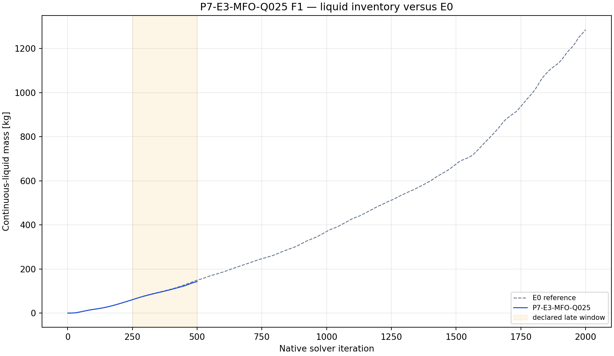
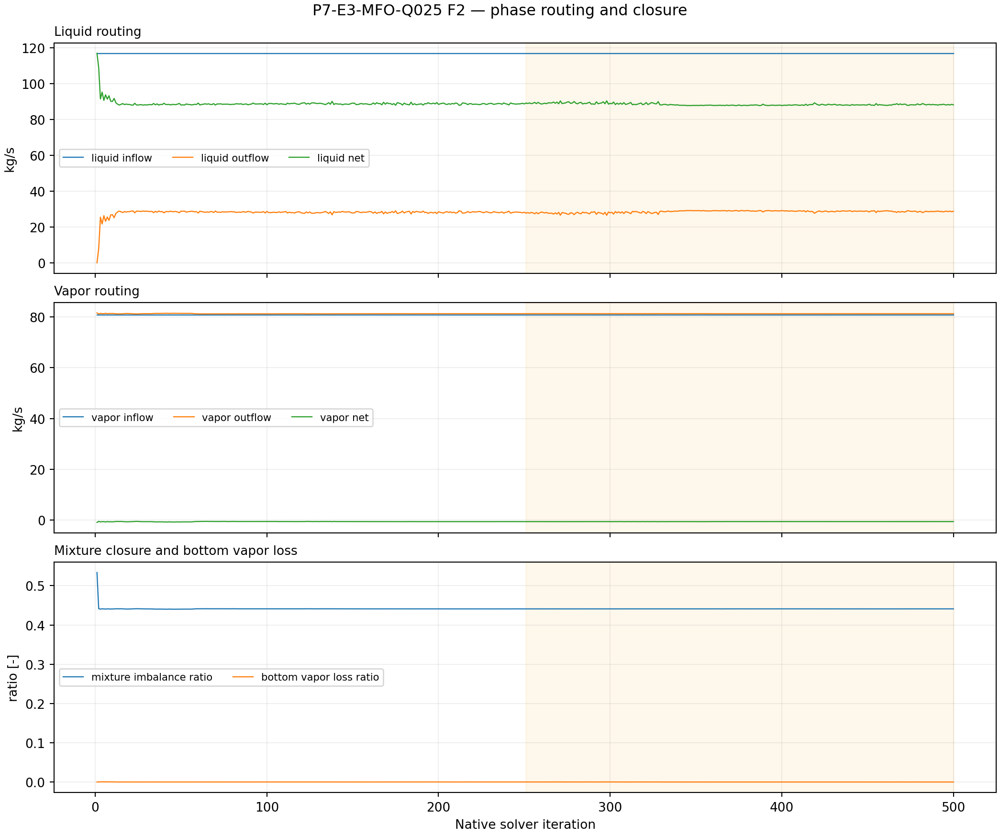
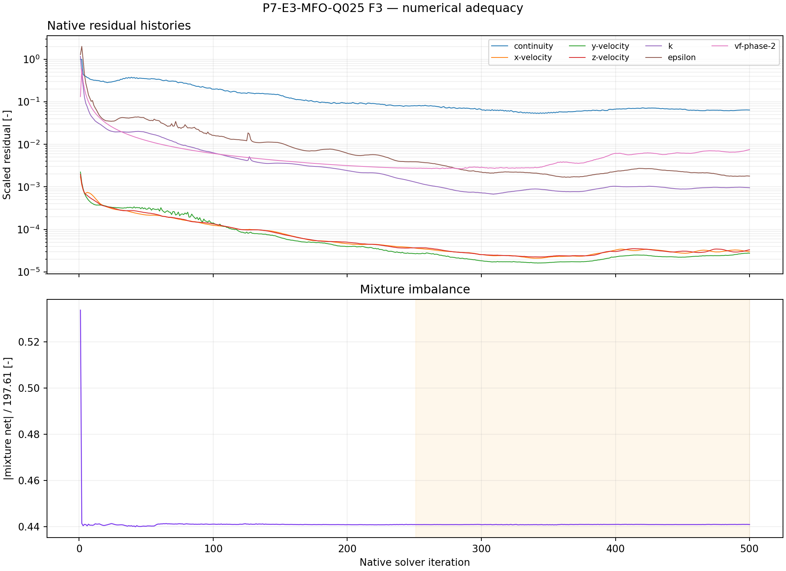

# P7-E3-MFO-Q025 results

## Answer at a glance

Observed: the live phase-specific mass-flow-outlet capability was proven after
save/reopen: phase-1 flow is 0 and phase-2 flow is 29.23 kg/s. The smoke,
checkpoint, and final artifacts passed; 14 report histories and seven
residual histories contain 500 native points each. The final liquid mass is
143.059 kg and the late-window slope is +0.314425 kg/iteration. The late mean
mixture imbalance ratio is 0.440995; mean bottom vapor-loss ratio is 0.0000572.

Inferred: Q025 preserves the intended zero-vapor command but does not stop
inventory growth over this screen and has poor mixture closure. It is not a
qualified drainage state.

Evidence status: execution and planned plot-led analysis complete; no G1
promotion.

## Core visual evidence

*F1 message:* the final inventory is slightly below matched E0 at the endpoint,
but the late slope remains positive. *Limitation:* endpoint comparison is not
a boundedness test.

*F2 message:* bottom vapor loss is nearly zero by the declared normalization,
while the mixture imbalance is large. *Limitation:* an imposed phase command
does not by itself prove total conservation.

*F3 message:* all required native histories are present. *Limitation:* 500
iterations are a survivability screen, not a convergence horizon.

## Numerical adequacy and interpretation

- Observed: phase-1=0 and phase-2=29.23 kg/s were read back after mutation
  and save/reopen.
- Observed: 14 reports and seven residual histories each contain 500 points;
  smoke, checkpoint, final pair, and readback passed.
- Observed: liquid inventory grows at +0.314425 kg/iteration in the late
  window and mixture imbalance is not small.
- Inferred: the phase-specific command is mechanically available, but Q025 is
  too weak to counter the diagnosed inventory drift in this finite horizon.
- Competing explanation: the apparent near-zero vapor loss may coexist with
  unresolved liquid storage and is not evidence that a real brine outlet has
  been represented.
- Claim boundary: no physical drainage, steady-state, or plant-control claim.

## Decision and checklist

| Phase Loop item | Status | Evidence |
| --- | --- | --- |
| Phase-specific capability and readback | PASS | manifest before/after reopen |
| Paired artifacts and 50/250/500 events | PASS | manifest |
| Reports and residual histories | PASS | 14 reports + 7 residuals x 500 |
| Planned analysis and core figures | PASS | F1–F3 above; analysis JSON |
| Scientific acceptance/promotion | BLOCKED | positive drift and mixture imbalance |

Queue state: COMPLETE_VERIFIED as an analyzed discovery packet; retain as a
low-withdrawal contrastive diagnostic only.

## Run and artifact details

- Manifest: PyAnsys/output/phase07_treatment_screen/P7-E3-MFO-Q025-server1-20260908T114000Z-manifest.json
- Report recovery: PyAnsys/output/phase07_treatment_screen/P7-E3-MFO-Q025-server1-20260908T114000Z-report-histories.json
- Analysis: PyAnsys/output/phase07_treatment_screen/P7-E3-MFO-Q025-server1-20260908T114000Z-analysis.json

