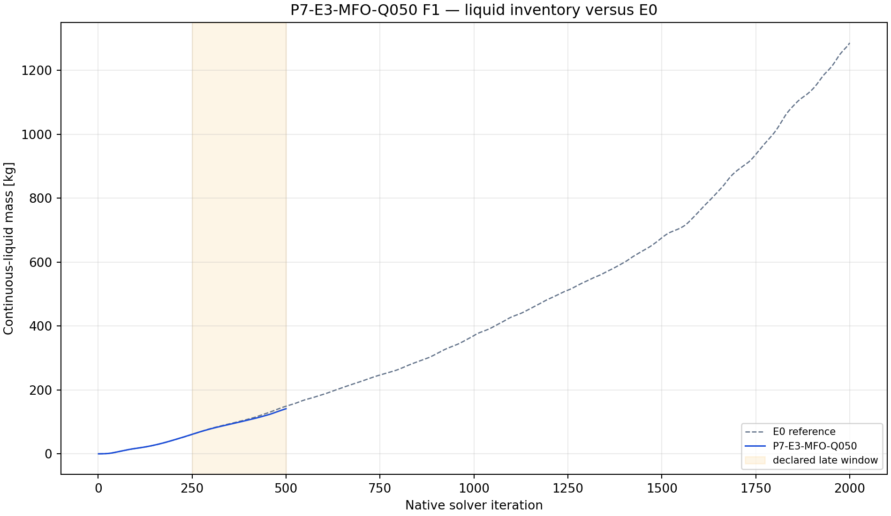
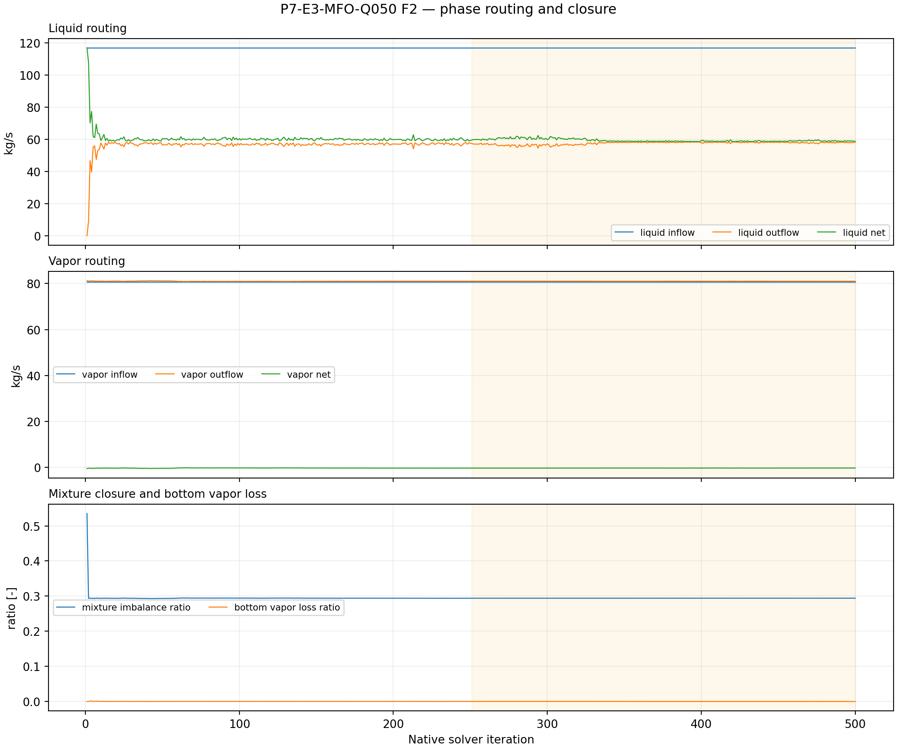
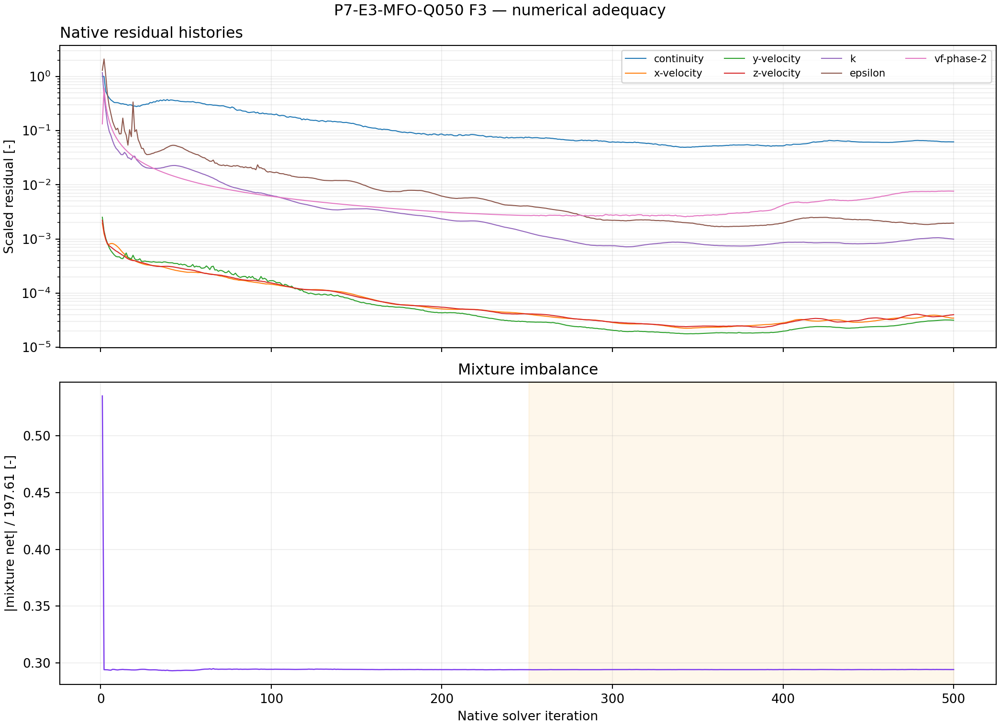

# P7-E3-MFO-Q050 results

## Answer at a glance

Observed: the live phase-specific mass-flow-outlet capability was proven after
save/reopen: phase-1 flow is 0 and phase-2 flow is 58.46 kg/s. The smoke,
checkpoint, and final artifacts passed; 14 report histories and seven
residual histories contain 500 native points each. The final liquid mass is
141.071 kg and the late-window slope is +0.301178 kg/iteration. The late mean
mixture imbalance ratio is 0.294049; mean bottom vapor-loss ratio is 0.0000740.

Inferred: Q050 reduces the late inventory slope slightly relative to Q025 while
preserving the zero-vapor command, but closure remains poor and inventory still
rises. No G1 promotion is supported.

Evidence status: execution and planned plot-led analysis complete; no
qualification claim.

## Core visual evidence

*F1 message:* Q050 ends below the matched E0 reference and has a slightly lower
late slope than Q025. *Limitation:* the screen remains finite and drifting.

*F2 message:* vapor loss remains near zero, but phase/mixture closure is not
small. *Limitation:* prescribed withdrawal can hide unresolved storage if the
balance is not closed.

*F3 message:* the full 500-point numerical evidence exists. *Limitation:* no
steady-state conclusion follows.

## Numerical adequacy and interpretation

- Observed: phase-1=0 and phase-2=58.46 kg/s were read back after mutation
  and save/reopen.
- Observed: all reports and residuals have 500 native points and the declared
  execution event sequence passed.
- Observed: late liquid slope remains positive at +0.301178 kg/iteration.
- Inferred: Q050 is directionally better than Q025 in this short screen but
  not materially close to a bounded state.
- Competing explanation: the small slope difference may be transient or
  coupled to the imposed outlet rate rather than a physical treatment effect.
- Claim boundary: no liquid-drainage or qualification claim.

## Decision and checklist

| Phase Loop item | Status | Evidence |
| --- | --- | --- |
| Phase-specific capability and readback | PASS | manifest before/after reopen |
| Paired artifacts and 50/250/500 events | PASS | manifest |
| Reports and residual histories | PASS | 14 reports + 7 residuals x 500 |
| Planned analysis and core figures | PASS | F1–F3 above; analysis JSON |
| Scientific acceptance/promotion | BLOCKED | positive drift and imbalance |

Queue state: COMPLETE_VERIFIED as an analyzed discovery packet. The
conditional E3 fourth-point branch remains reviewable because Q100 is the
upper tested setting and the inventory trend remains unresolved.

## Run and artifact details

- Manifest: PyAnsys/output/phase07_treatment_screen/P7-E3-MFO-Q050-server3-20260908T114000Z-manifest.json
- Report recovery: PyAnsys/output/phase07_treatment_screen/P7-E3-MFO-Q050-server3-20260908T114000Z-report-histories.json
- Analysis: PyAnsys/output/phase07_treatment_screen/P7-E3-MFO-Q050-server3-20260908T114000Z-analysis.json

