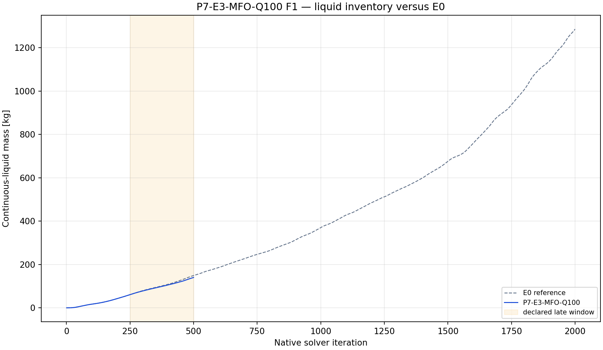
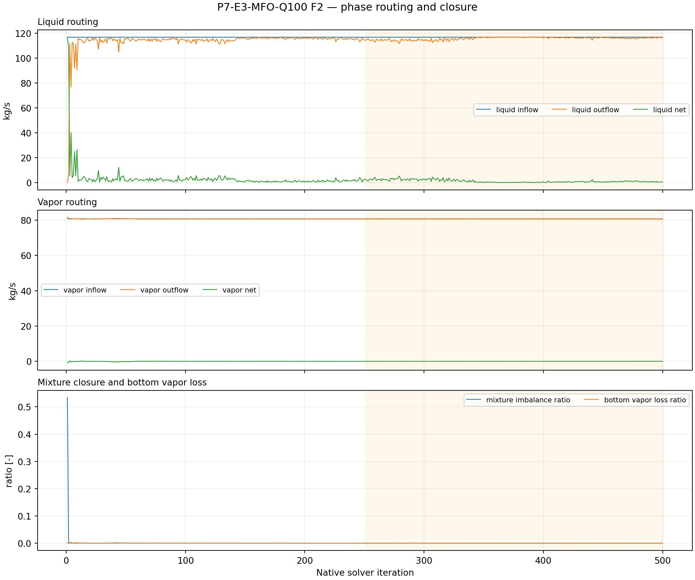
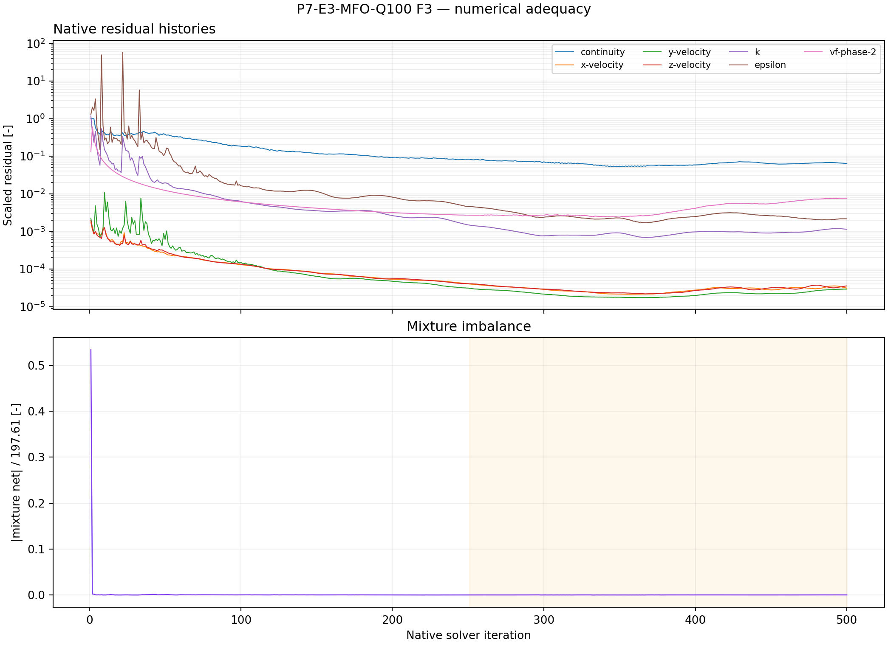

# P7-E3-MFO-Q100 results

## Answer at a glance

Observed: the live phase-specific mass-flow-outlet capability was proven after
save/reopen: phase-1 flow is 0 and phase-2 flow is 116.92 kg/s. The smoke,
checkpoint, and final artifacts passed; 14 report histories and seven
residual histories contain 500 native points each. The final liquid mass is
140.007 kg and the late-window slope is +0.300110 kg/iteration. The late mean
mixture imbalance ratio is 0.0001652; mean bottom vapor-loss ratio is 0.0000951.

Inferred: Q100 gives the lowest E3 endpoint inventory and nearly closes the
mixture balance while preserving zero vapor command, but the inventory still
rises substantially. This is the strongest finite-horizon E3 diagnostic, not a
qualified steady drainage state.

Evidence status: execution and planned plot-led analysis complete; no G1
promotion.

## Core visual evidence

*F1 message:* Q100 ends below Q025/Q050 and the matched E0 curve, but the late
slope remains positive. *Limitation:* a lower endpoint does not establish
boundedness.

*F2 message:* Q100 has near-zero mean mixture imbalance and near-zero bottom
vapor loss in this screen. *Limitation:* the phase-specific outlet rate is an
imposed diagnostic command, not proof of a resolved plant outlet.

*F3 message:* complete residual/routing histories support the short-screen
comparison. *Limitation:* the positive inventory slope prevents a qualification
claim.

## Numerical adequacy and interpretation

- Observed: phase-1=0 and phase-2=116.92 kg/s were read back after mutation
  and save/reopen.
- Observed: all required reports and residuals have 500 native points.
- Observed: Q100 has the smallest E3 endpoint inventory and the best closure,
  but liquid inventory still increases at +0.300110 kg/iteration.
- Inferred: Q100 is the strongest E3 member for a bounded continuation
  decision, subject to the project's rule that prescribed-rate closure is not
  physical proof.
- Competing explanation: the apparent closure is partly the identity imposed
  by the phase-specific outlet command; it may not survive a resolved drain.
- Claim boundary: no plant drainage, separator efficiency, or steady-state
  claim.

## Decision and checklist

| Phase Loop item | Status | Evidence |
| --- | --- | --- |
| Phase-specific capability and readback | PASS | manifest before/after reopen |
| Paired artifacts and 50/250/500 events | PASS | manifest |
| Reports and residual histories | PASS | 14 reports + 7 residuals x 500 |
| Planned analysis and core figures | PASS | F1–F3 above; analysis JSON |
| Scientific acceptance/promotion | BLOCKED | positive inventory trend |

Queue state: COMPLETE_VERIFIED as an analyzed discovery packet. It is the
strongest E3 finite-horizon contrast, but no 2,000-iteration continuation is
started from this screen without the next lifecycle gate.

## Run and artifact details

- Manifest: PyAnsys/output/phase07_treatment_screen/P7-E3-MFO-Q100-server1-20260908T123000Z-manifest.json
- Report recovery: PyAnsys/output/phase07_treatment_screen/P7-E3-MFO-Q100-server1-20260908T123000Z-report-histories.json
- Analysis: PyAnsys/output/phase07_treatment_screen/P7-E3-MFO-Q100-server1-20260908T123000Z-analysis.json

