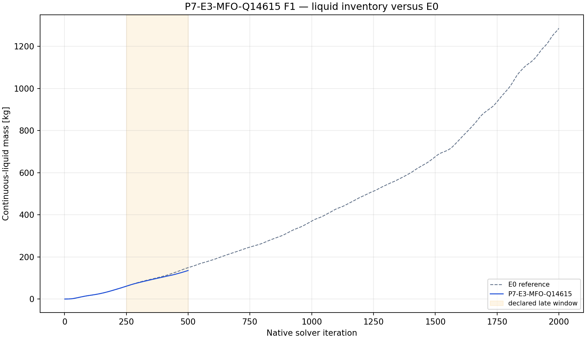
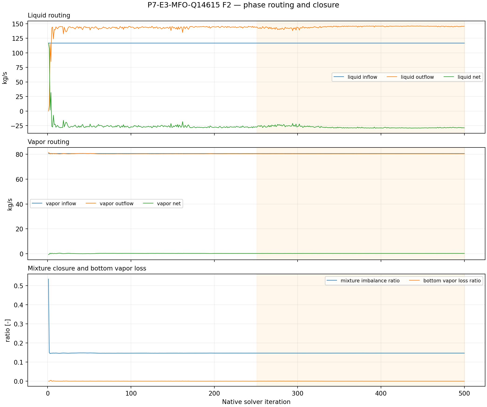
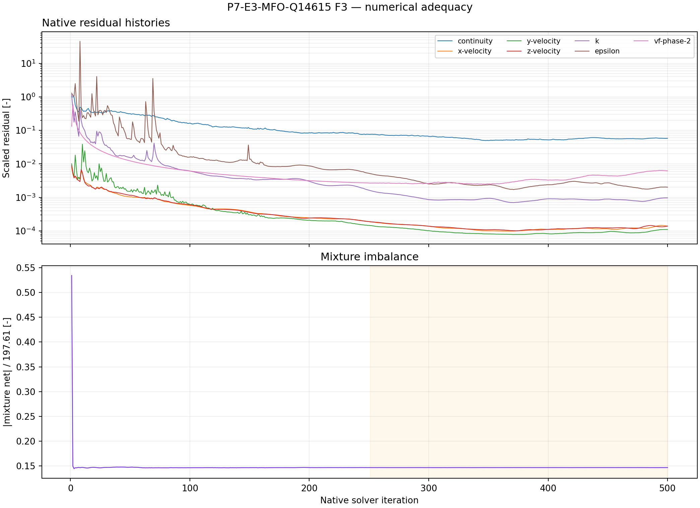

# P7-E3-MFO-Q14615 results

## Answer at a glance

Observed: the conditional fourth branch was executed on the only currently
reachable Fluent endpoint, `student`, from the exact E0 initialized case/data
pair. The phase-specific readback after mutation and save/reopen was phase-1 =
0 kg/s and phase-2 = 146.15 kg/s. The 50-iteration smoke, active-250
checkpoint, active-500 final pair, final reopen, 14 report histories, and
seven residual histories all completed with 500 native points.

Observed: final liquid mass was 135.464 kg. The late-window (active 251--500)
inventory slope was +0.280585 kg/iteration. Mean late liquid outflow was
144.684 kg/s versus 116.92 kg/s liquid inflow; mean late vapor outflow was
80.4722 kg/s. The mean mixture imbalance ratio was 0.146768, and the mean
bottom vapor-loss ratio was 0.0001196.

Inferred: Q14615 removes more liquid than the lower E3 commands within this
finite screen and finishes below the matched E0 reference endpoint, but the
inventory still rises and the mixture balance does not close. The result is a
valid upper-edge diagnostic of the prescribed-rate boundary condition, not
evidence of bounded physical drainage, a resolved plant outlet, or a steady
state.

Evidence status: execution, report recovery, residual extraction, and planned
plot-led analysis complete. Queue state: COMPLETE_VERIFIED as an analyzed
discovery packet; no promotion or long continuation is authorized by this
record.

## Core visual evidence

*F1 message:* Q14615 ends below the matched E0 reference and the lower-rate
E3 screens, but its late inventory slope remains positive. *Limitation:* the
lower endpoint does not establish long-horizon boundedness.

*F2 message:* the phase-1 command is zero and liquid outflow approaches the
146.15 kg/s command, while the mixture balance remains materially open.
*Limitation:* the prescribed phase-specific command is a diagnostic boundary
condition rather than physical outlet validation.

*F3 message:* all required native histories are complete over the 500-point
screen. *Limitation:* repeated reversed-flow and turbulent-viscosity-limit
messages were observed during the solve, so this is a finite discovery screen
with bounded numerical evidence rather than a qualification run.

## Numerical adequacy and interpretation

- Observed: the exact E0 initialized parent identity and all protected model,
  material, inlet, outlet, and mesh invariants passed readback.
- Observed: phase-1 = 0 kg/s and phase-2 = 146.15 kg/s were read back after
  mutation and after the prepared save/reopen.
- Observed: paired case/data artifacts passed at prepared, smoke, checkpoint,
  and final stages; the final case/data pair reopened successfully.
- Observed: 14 report histories and seven residual histories each contain 500
  native points with monotonic native coordinates.
- Observed: the Fluent transcript includes repeated reversed-flow and
  turbulent-viscosity-limit diagnostics; the required artifacts nevertheless
  completed and were recovered.
- Inferred: the upper command edge improves finite-horizon liquid removal
  relative to the matched E0 reference, but it does not resolve the positive
  inventory trend or the mixture closure issue.
- Claim boundary: no plant drainage, separator-efficiency, adaptive-control,
  qualification, convergence, or steady-state claim is supported.

## Decision and checklist

| Phase Loop item | Status | Evidence |
| --- | --- | --- |
| Conditional branch selection | PASS | CONTEXT.md trigger audit |
| Exact parent identity and protected invariants | PASS | runner manifest and final readback |
| Phase-specific capability and readback | PASS | manifest before/after reopen |
| Paired artifacts and 50/250/500 events | PASS | runner manifest |
| Reports and residual histories | PASS | 14 reports + 7 residuals × 500 |
| Planned analysis and core figures | PASS | F1–F3 above; analysis JSON |
| Scientific acceptance/promotion | BLOCKED | positive inventory slope and open mixture balance |

Queue state: COMPLETE_VERIFIED as an analyzed discovery packet. Any further
continuation requires a new lifecycle decision and must not treat the
prescribed-rate closure as physical proof.

## Run and artifact details

- Setup: `setup.md`
- Run paths: `run-paths.yaml`
- Manifest: `PyAnsys/output/phase07_treatment_screen/P7-E3-MFO-Q14615-student-20260910T000651Z-manifest.json`
- Report recovery: `PyAnsys/output/phase07_treatment_screen/P7-E3-MFO-Q14615-student-20260910T000651Z-report-histories.json`
- Residual history: `PyAnsys/output/phase07_treatment_screen/P7-E3-MFO-Q14615-student-20260910T000651Z-residuals.json`
- Analysis: `PyAnsys/output/phase07_treatment_screen/P7-E3-MFO-Q14615-student-20260910T000651Z-analysis.json`
