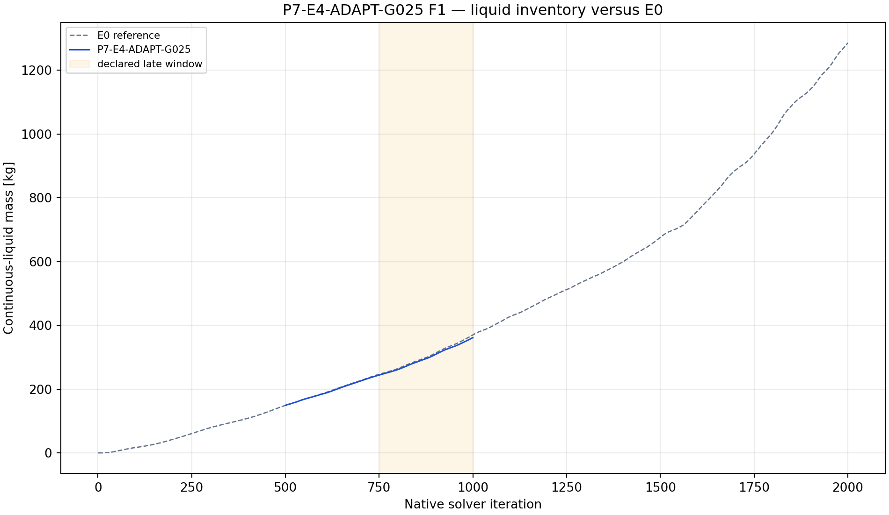
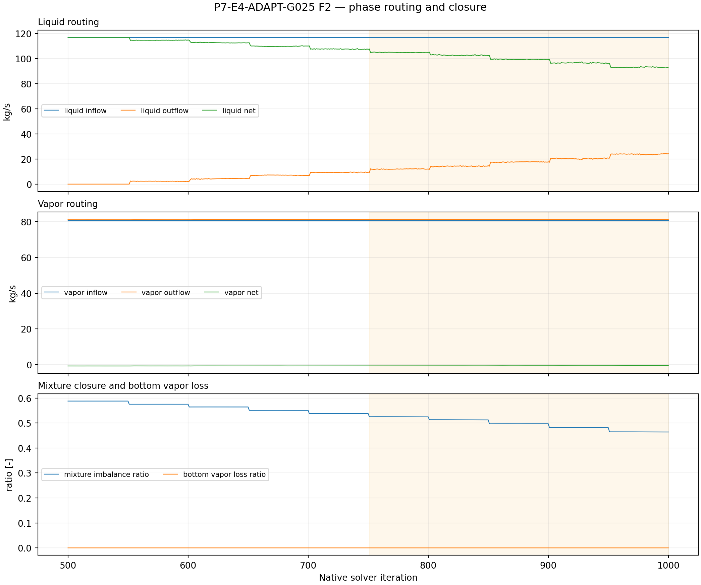
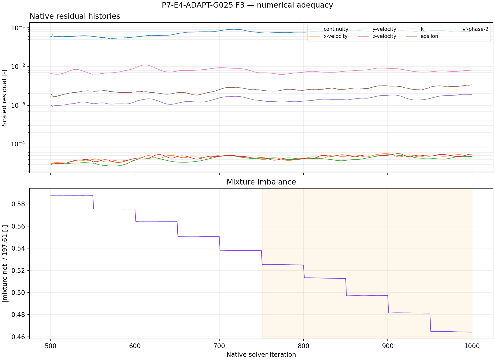
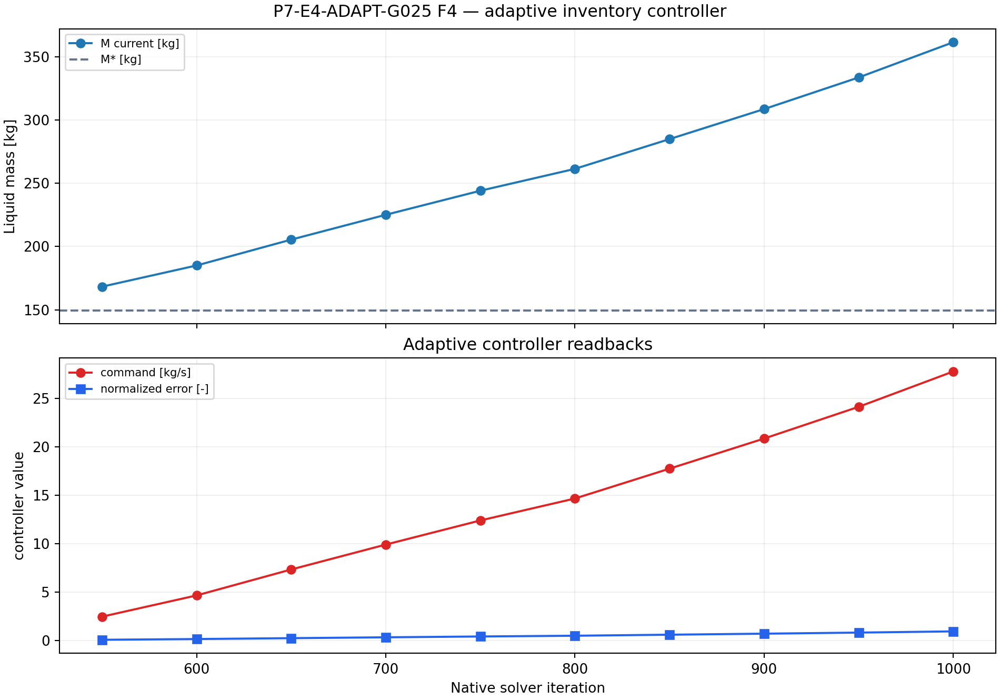

# P7-E4-ADAPT-G025 results

## Answer at a glance

Observed: the repaired adaptive child started from E0 iteration 500 with
M*=149.424869 kg and DeltaMref=223.250694 kg, completed ten 50-iteration
controller blocks through native iteration 1000, and read back phase-1 flow 0
at every update. The final command was 27.783739 kg/s. The final liquid mass is
361.629 kg and the late-window slope is +0.476020 kg/iteration over
iterations 751--1000. The late mean mixture imbalance ratio is 0.496258; mean
bottom vapor-loss ratio is 0.0000484. No controller update saturated.

Inferred: G025 is numerically executable and preserves the intended zero-vapor
phase command, but it does not hold the inventory near M* and has poor closure.
It is not a qualified adaptive treatment.

Evidence status: execution, controller evidence, and planned plot-led analysis
complete; no G1 promotion.

## Core visual evidence

*F1 message:* the adaptive inventory rises far above M* over the active horizon.
*Limitation:* the reference is a numerical target, not a physical water level.

*F2 message:* vapor loss is small by the chosen normalization, but mixture
imbalance is large. *Limitation:* controller readback does not guarantee total
mass closure.

*F3 message:* residual, inventory, and closure histories are available for the
500 active iterations. *Limitation:* no boundedness or long-horizon claim.

*F4 message:* ten controller updates and phase-specific command readbacks are
recorded; the command remains below the 146.15 kg/s cap. *Limitation:* the
controller responds to a drifting inventory rather than demonstrating
regulation around M*.

## Numerical adequacy and interpretation

- Observed: M* and positive DeltaMref were read from the declared E0
  normalization; all ten updates recorded error, command, saturation, and
  readback.
- Observed: smoke/checkpoint/final artifacts, 501-point report histories, and
  500-point residual histories passed.
- Observed: final inventory is 361.629 kg versus M*=149.425 kg, with a
  positive late slope and large imbalance.
- Inferred: the low gain is too weak to counter the diagnosed inventory drift
  over the short horizon.
- Competing explanation: controller lag, the imposed outlet abstraction, or
  the unstable E0-derived field may dominate the response.
- Claim boundary: no adaptive-control, brine-drainage, or plant-level claim.

## Decision and checklist

| Phase Loop item | Status | Evidence |
| --- | --- | --- |
| E0 checkpoint and normalization | PASS | manifest and analysis |
| Ten controller updates/readbacks | PASS | manifest; F4 |
| Paired artifacts and histories | PASS | 501 report points; 500 residual points |
| Planned analysis and core figures | PASS | F1–F4 above; analysis JSON |
| Scientific acceptance/promotion | BLOCKED | drift and imbalance |

Queue state: COMPLETE_VERIFIED as an analyzed discovery packet. The conditional
adaptive fourth point is not activated from G025 alone.

## Run and artifact details

- Manifest: PyAnsys/output/phase07_treatment_screen/P7-E4-ADAPT-G025-server3-20260908T124500Z-manifest.json
- Report recovery: PyAnsys/output/phase07_treatment_screen/P7-E4-ADAPT-G025-server3-20260908T124500Z-report-histories.json
- Analysis: PyAnsys/output/phase07_treatment_screen/P7-E4-ADAPT-G025-server3-20260908T124500Z-analysis.json

