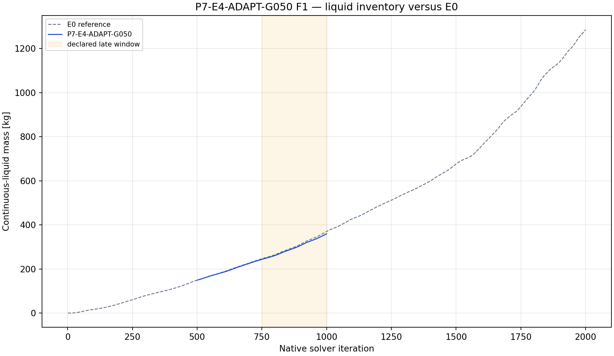
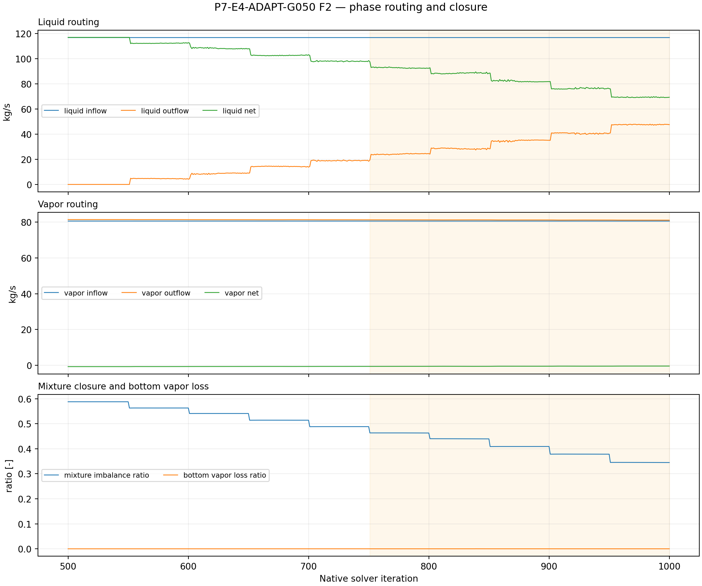
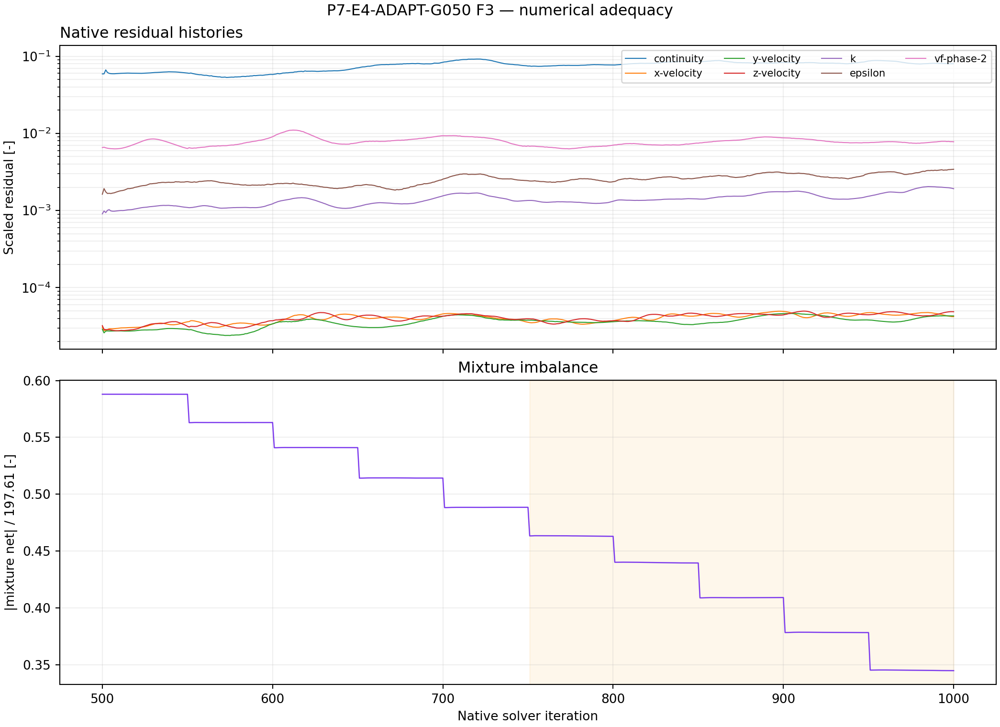
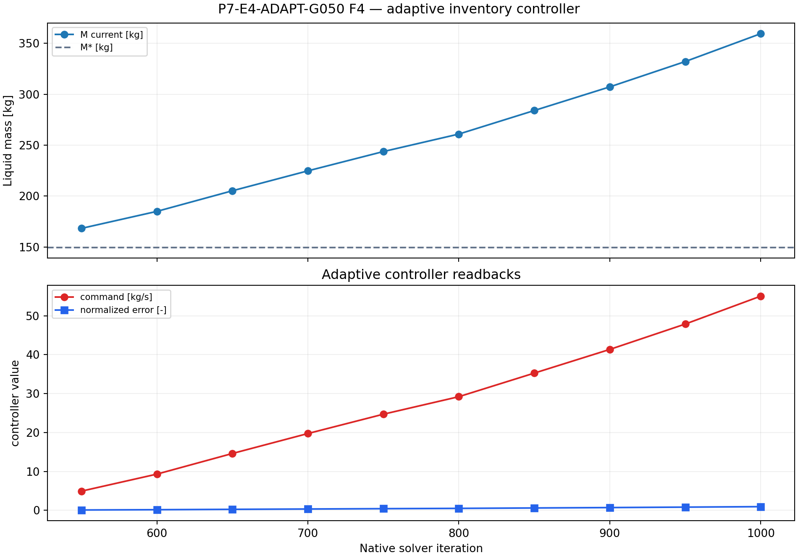

# P7-E4-ADAPT-G050 results

## Answer at a glance

Observed: the adaptive child started from E0 iteration 500 with M*=149.424869
kg and DeltaMref=223.250694 kg, completed ten 50-iteration controller blocks
through native iteration 1000, and read back phase-1 flow 0 at every update.
The final command was 55.033660 kg/s. The final liquid mass is 359.591 kg and
the late-window slope is +0.469124 kg/iteration. The late mean mixture
imbalance ratio is 0.407253; mean bottom vapor-loss ratio is 0.0000632. No
controller update saturated.

Inferred: G050 is slightly better than G025 in endpoint inventory and late
slope, but it still does not regulate around M* and closure is poor.

Evidence status: execution, controller evidence, and planned plot-led analysis
complete; no G1 promotion.

## Core visual evidence

*F1 message:* G050 ends below G025 but far above the E0 numerical target M*.
*Limitation:* a finite-horizon endpoint is not a bounded-state result.

*F2 message:* the phase-specific command preserves low vapor loss in this
screen, while mixture imbalance remains non-small. *Limitation:* low vapor
loss does not prove a physical drain.

*F3 message:* the native residual and routing histories are complete. *Limitation:*
they do not establish controller convergence.

*F4 message:* all ten controller commands were recorded and remained below the
cap. *Limitation:* the command rises with inventory error while the inventory
continues to drift.

## Numerical adequacy and interpretation

- Observed: ten controller updates, phase-1=0 readback, and the declared
  normalization passed.
- Observed: 501 report points and 500 residual points are available, with all
  paired artifact checkpoints.
- Observed: G050 has final mass 359.591 kg and a positive late slope of
  +0.469124 kg/iteration.
- Inferred: the medium gain remains too weak, or the controlled abstraction
  cannot counter the underlying field drift on this horizon.
- Competing explanation: the response may be limited by initialization and
  outlet routing rather than gain alone.
- Claim boundary: no adaptive control or plant-drainage claim.

## Decision and checklist

| Phase Loop item | Status | Evidence |
| --- | --- | --- |
| E0 checkpoint and normalization | PASS | manifest and analysis |
| Ten controller updates/readbacks | PASS | manifest; F4 |
| Paired artifacts and histories | PASS | 501 report points; 500 residual points |
| Planned analysis and core figures | PASS | F1–F4 above; analysis JSON |
| Scientific acceptance/promotion | BLOCKED | positive drift and imbalance |

Queue state: COMPLETE_VERIFIED as an analyzed discovery packet. The adaptive
fourth-point rule remains reviewable only if G100 is judged valid but too weak
without cap limitation.

## Run and artifact details

- Manifest: PyAnsys/output/phase07_treatment_screen/P7-E4-ADAPT-G050-server1-20260908T140000Z-manifest.json
- Report recovery: PyAnsys/output/phase07_treatment_screen/P7-E4-ADAPT-G050-server1-20260908T140000Z-report-histories.json
- Analysis: PyAnsys/output/phase07_treatment_screen/P7-E4-ADAPT-G050-server1-20260908T140000Z-analysis.json

