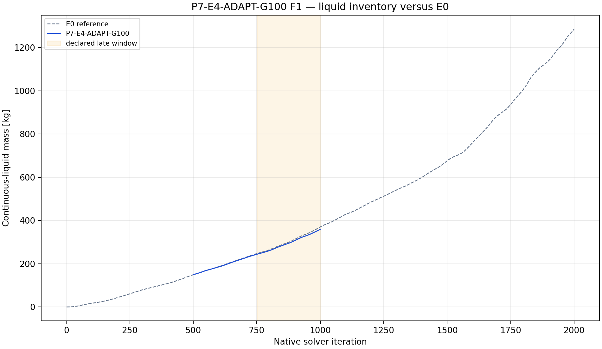
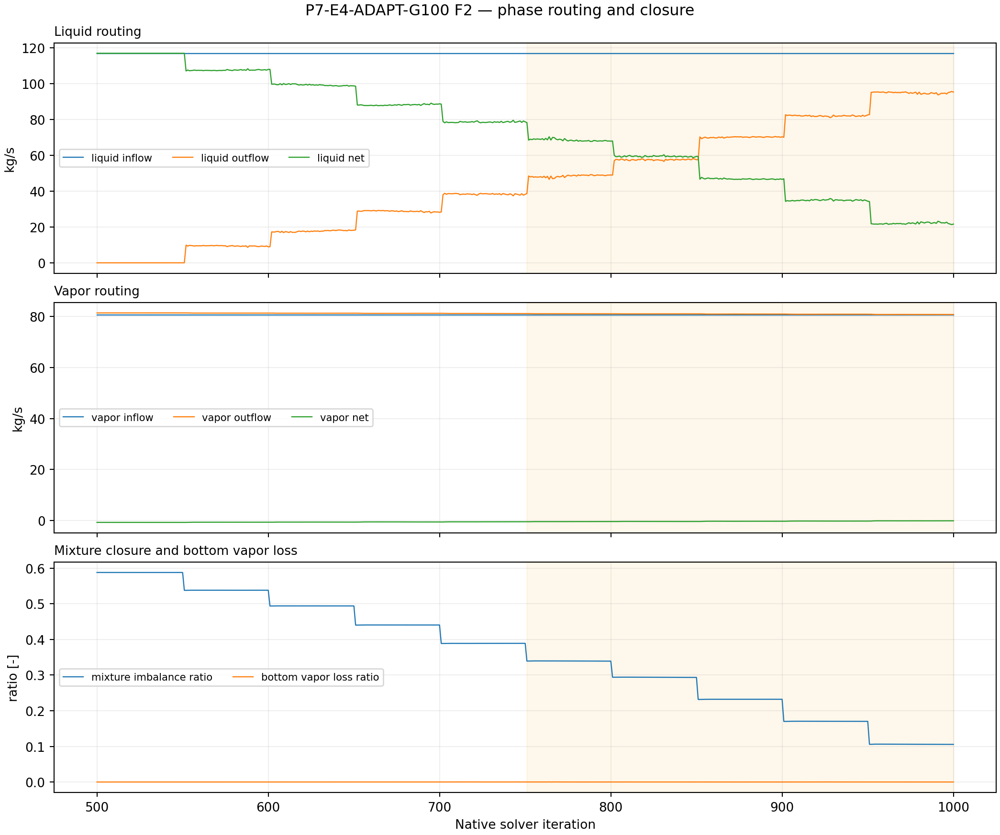
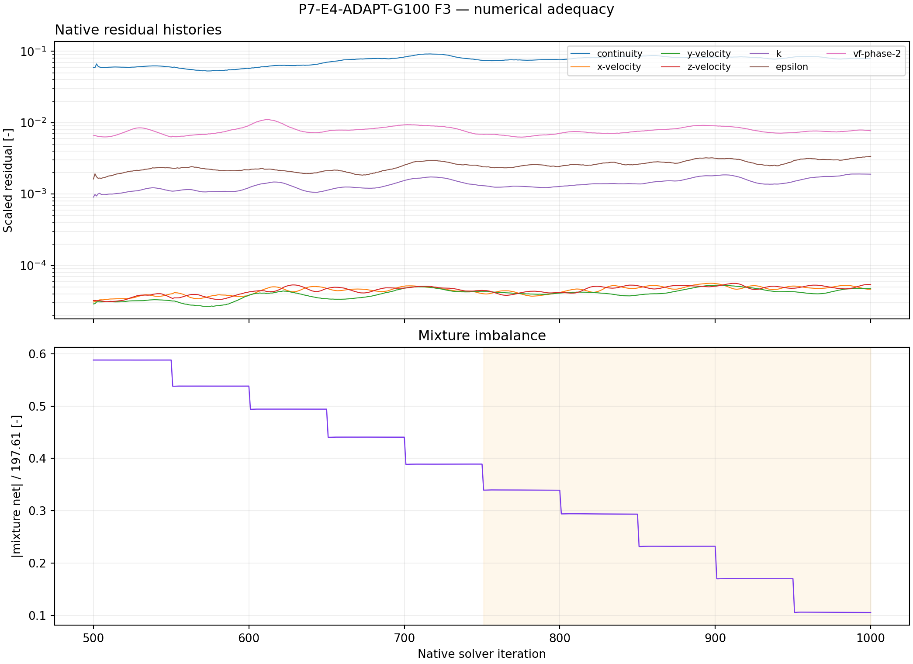
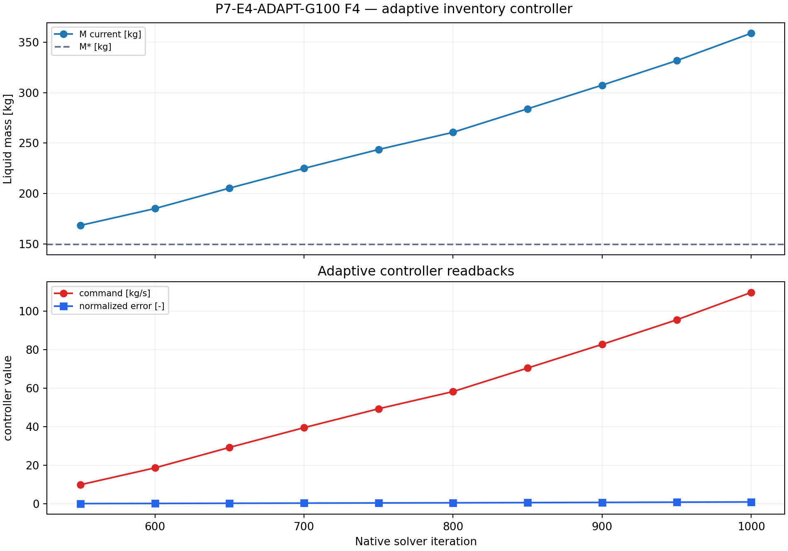

# P7-E4-ADAPT-G100 results

## Answer at a glance

Observed: the adaptive child started from E0 iteration 500 with M*=149.424869
kg and DeltaMref=223.250694 kg, completed ten 50-iteration controller blocks
through native iteration 1000, and read back phase-1 flow 0 at every update.
The final command was 109.722775 kg/s, below the 146.15 kg/s cap, and no update
saturated. The final liquid mass is 358.933 kg and the late-window slope is
+0.467816 kg/iteration. The late mean mixture imbalance ratio is 0.228363;
mean bottom vapor-loss ratio is 0.0000749.

Inferred: G100 is the strongest E4 member in this finite screen because it has
the lowest endpoint inventory, lowest late slope, and best closure of the three,
but it still drifts far above M*. It is not a qualification result.

Evidence status: execution, controller evidence, and planned plot-led analysis
complete; no G1 promotion.

## Core visual evidence

*F1 message:* G100 has the lowest E4 endpoint inventory, but the inventory
continues to rise and greatly exceeds M*. *Limitation:* this is a short
active horizon.

*F2 message:* G100 has the smallest E4 mixture imbalance in this screen and
small vapor loss. *Limitation:* the prescribed outlet command remains an
abstraction, not a resolved drain.

*F3 message:* full native residual/routing evidence supports the comparison.
*Limitation:* no controller convergence follows from 500 active iterations.

*F4 message:* all ten updates are read back, remain below the cap, and preserve
zero phase-1 command. *Limitation:* the inventory response does not settle
around M*.

## Numerical adequacy and interpretation

- Observed: ten controller updates, phase-specific readback, and the E0
  normalization passed.
- Observed: 501 report points and 500 residual points are complete.
- Observed: G100 is the best E4 finite-horizon member by endpoint inventory,
  late slope, and closure, but final mass is 358.933 kg versus M*=149.425 kg.
- Inferred: G100 is directionally strongest but still insufficient to claim
  bounded regulation.
- Competing explanation: apparent improvement may be an imposed phase-routing
  effect and transient from the E0 checkpoint.
- Claim boundary: no adaptive-control, separator-drainage, or steady-state
  claim.

## Decision and checklist

| Phase Loop item | Status | Evidence |
| --- | --- | --- |
| E0 checkpoint and normalization | PASS | manifest and analysis |
| Ten controller updates/readbacks | PASS | manifest; F4 |
| Paired artifacts and histories | PASS | 501 report points; 500 residual points |
| Planned analysis and core figures | PASS | F1–F4 above; analysis JSON |
| Scientific acceptance/promotion | BLOCKED | positive drift despite high gain |

Queue state: COMPLETE_VERIFIED as an analyzed discovery packet. G100 is the
strongest E4 finite-horizon contrast, but no 2,000-active-iteration
continuation is started before the next lifecycle gate.

## Run and artifact details

- Manifest: PyAnsys/output/phase07_treatment_screen/P7-E4-ADAPT-G100-server3-20260908T140000Z-manifest.json
- Report recovery: PyAnsys/output/phase07_treatment_screen/P7-E4-ADAPT-G100-server3-20260908T140000Z-report-histories.json
- Analysis: PyAnsys/output/phase07_treatment_screen/P7-E4-ADAPT-G100-server3-20260908T140000Z-analysis.json

