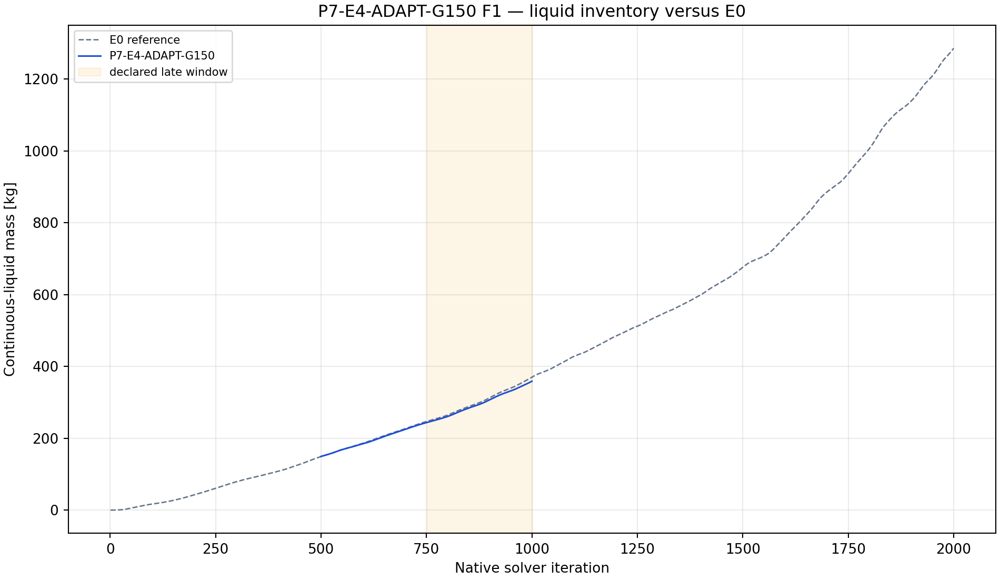
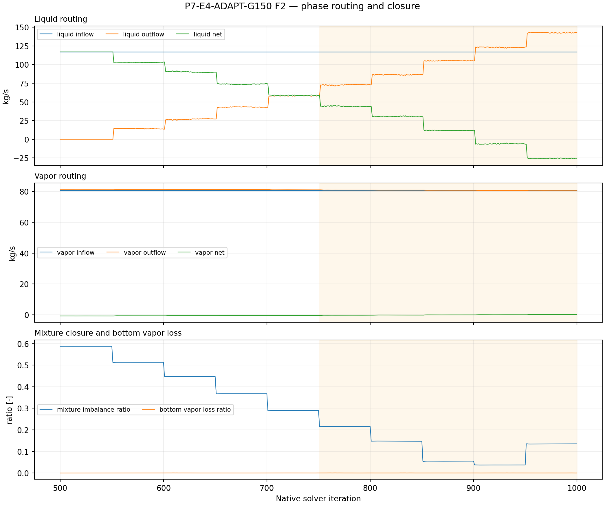
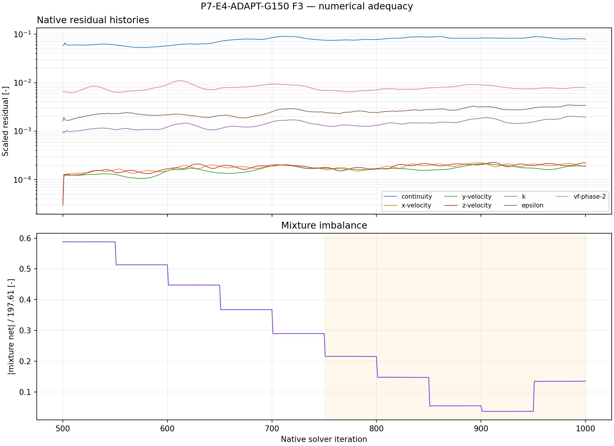
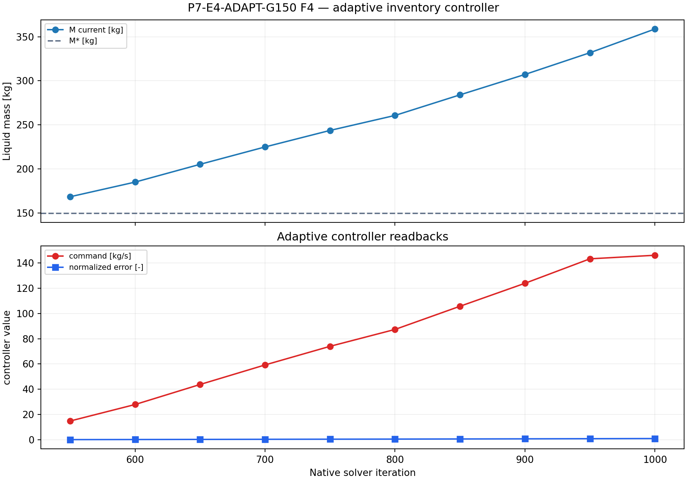

# P7-E4-ADAPT-G150 results

## Answer at a glance

Observed: the conditional fourth branch was executed on student from the
exact E0 iteration-500 checkpoint, with the approved normalization
M*=149.424869 kg and DeltaMref=223.250694 kg. The prepared save/reopen,
50-active-iteration smoke, active-250 checkpoint, active-500 final pair, final
reopen, 14 report histories, and seven residual histories completed. The
adaptive controller recorded ten 50-iteration updates, kept phase-1 at
0 kg/s, and increased the phase-2 command from 14.829 kg/s to the 146.15 kg/s
cap; only the final update was saturated.

Observed: liquid mass increased from 149.425 kg at the checkpoint to
358.819 kg at native iteration 1000. The full active-screen slope was
+0.409006 kg/iteration, and the late native-751--1000 slope was
+0.467689 kg/iteration. Late mean liquid outflow was 105.711 kg/s versus
116.92 kg/s liquid inflow. Late mean mixture imbalance ratio was 0.117793,
and late mean bottom vapor-loss ratio was 0.00008886.

Inferred: G150 did not hold the inventory near the target normalization. The
error grew to 0.937935 at the final controller update, the adaptive command
reached its cap, and the liquid inventory continued to rise. This is a
complete adaptive discovery screen that rejects the branch for promotion
within the declared rule; it is not evidence of a qualified controller or a
physical plant drain.

Evidence status: execution, controller readback, report recovery, residual
extraction, and planned plot-led analysis complete. Queue state:
COMPLETE_VERIFIED as an analyzed discovery packet, with scientific acceptance
blocked by saturation and positive inventory drift.

## Controller record

| Active update | Native iteration | Liquid mass (kg) | Requested/read-back phase-2 command (kg/s) | Saturated |
| ---: | ---: | ---: | ---: | :---: |
| 50 | 550 | 168.301 | 14.829 | No |
| 100 | 600 | 184.951 | 27.908 | No |
| 150 | 650 | 205.149 | 43.776 | No |
| 200 | 700 | 224.868 | 59.266 | No |
| 250 | 750 | 243.635 | 74.009 | No |
| 300 | 800 | 260.664 | 87.387 | No |
| 350 | 850 | 284.043 | 105.753 | No |
| 400 | 900 | 307.211 | 123.952 | No |
| 450 | 950 | 331.893 | 143.342 | No |
| 500 | 1000 | 358.819 | 146.150 | Yes |

## Core visual evidence

*F1 message:* G150 starts at the E0 checkpoint mass and rises well above the
matched E0 trajectory by the end of the active screen. *Limitation:* this is
finite-horizon evidence from a restarted checkpoint, not a long-horizon
qualification result.

*F2 message:* the controller increases the commanded liquid withdrawal and
the final command reaches the cap, while late liquid outflow remains below
the imposed command on average. *Limitation:* the adaptive command is a
diagnostic boundary condition and does not validate a physical outlet.

*F3 message:* the restarted 500-active-iteration screen contains complete
native routing and residual histories. *Limitation:* reversed-flow and
turbulent-viscosity-limit diagnostics persisted, and the inventory drift
precludes a qualification claim.

*F4 message:* controller error and command rise together until the final
update saturates at 146.15 kg/s; the target inventory is not recovered within
the screen. *Limitation:* one bounded fourth branch cannot establish
controller stability or a control-law generalization.

## Numerical adequacy and interpretation

- Observed: the exact E0 500-iteration checkpoint identity and all protected
  model, material, inlet, outlet, and mesh invariants passed readback.
- Observed: M*=149.424869 kg and DeltaMref=223.250694 kg were used exactly
  as declared in CONTEXT.md; ten controller updates were recorded.
- Observed: phase-1 command remained 0 kg/s at every controller update and
  phase-2 readback matched each requested command, including the final cap.
- Observed: paired case/data artifacts passed at prepared, smoke, checkpoint,
  and final stages; the final pair reopened successfully.
- Observed: report recovery returned 501 samples on native iterations 500--1000
  for each of 14 reports, and residual recovery returned the same native
  extent.
- Observed: the Fluent transcript includes reversed-flow and
  turbulent-viscosity-limit diagnostics; the required artifacts nevertheless
  completed and were recovered.
- Inferred: the G150 adaptive law responds in the declared direction but does
  not arrest inventory growth before command saturation.
- Claim boundary: no adaptive-control stability, plant drainage,
  separator-efficiency, qualification, convergence, or steady-state claim is
  supported.

## Decision and checklist

| Phase Loop item | Status | Evidence |
| --- | --- | --- |
| Conditional branch selection | PASS | CONTEXT.md trigger audit |
| Exact E0 checkpoint identity and protected invariants | PASS | runner manifest and final readback |
| Normalization and ten controller updates | PASS | manifest controller events |
| Paired artifacts and 50/250/500 events | PASS | runner manifest |
| Reports and residual histories | PASS | 14 reports + 7 residuals over native 500--1000 |
| Planned analysis and core figures | PASS | F1–F4 above; analysis JSON |
| Adaptive branch acceptance/promotion | BLOCKED | final command saturation and positive inventory slope |

Queue state: COMPLETE_VERIFIED as an analyzed discovery packet, with the
predeclared high-gain saturation rule rejecting promotion. Any continuation
requires a new lifecycle decision and must not be treated as controller proof.

## Run and artifact details

- Setup: setup.md
- Run paths: run-paths.yaml
- Manifest: PyAnsys/output/phase07_treatment_screen/P7-E4-ADAPT-G150-student-20260910T003002Z-manifest.json
- Report recovery: PyAnsys/output/phase07_treatment_screen/P7-E4-ADAPT-G150-student-20260910T003002Z-report-histories.json
- Residual history: PyAnsys/output/phase07_treatment_screen/P7-E4-ADAPT-G150-student-20260910T003002Z-residuals.json
- Analysis: PyAnsys/output/phase07_treatment_screen/P7-E4-ADAPT-G150-student-20260910T003002Z-analysis.json
