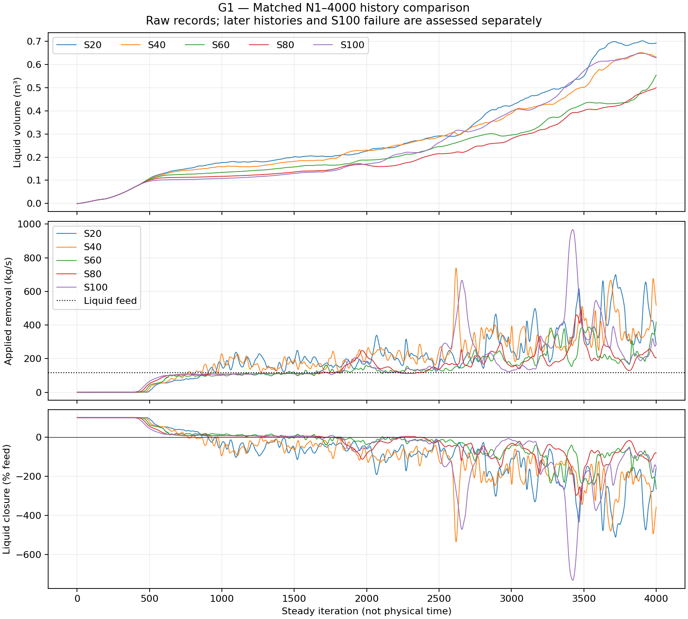
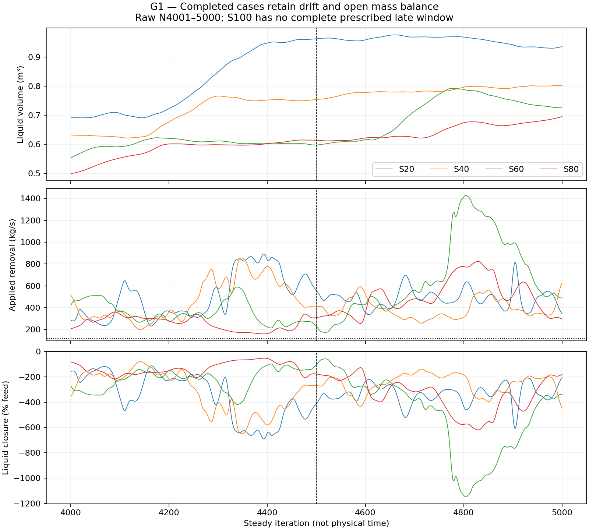
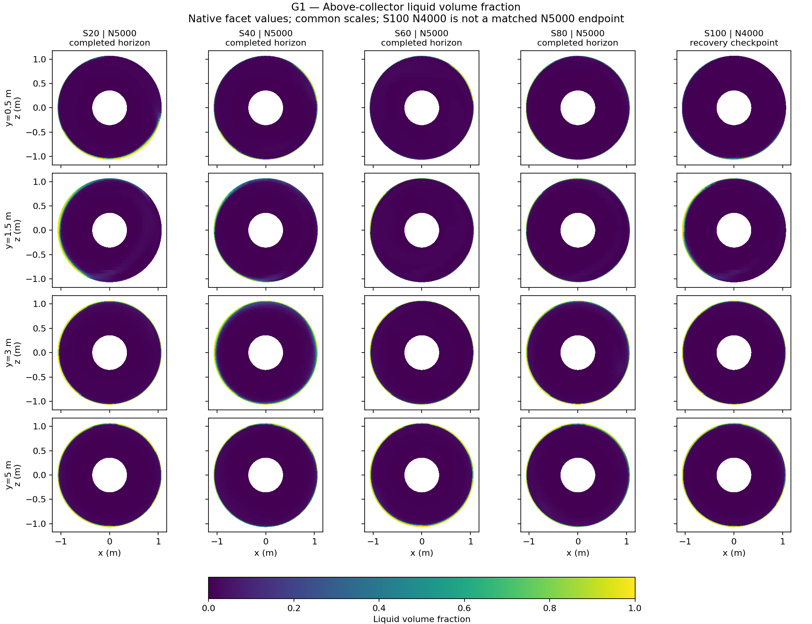

# Phase 7b — G1 five-case discovery review

**G1 evidence is complete. No tested collector thickness established a balanced,
stationary steady solution within the approved screen.** S20, S40, S60 and S80
completed 5,000 iterations; S100 suffered epsilon AMG divergence and floating-
point exceptions at attempted N4183. Its histories contain all 4,182 completed
indices, including the numerical runaway. No case is qualified or promoted.

This completes the authorized discovery comparison, not physical validation or
qualification of the collector idea. No further iterations or altered settings
were issued after the S100 failure. The session is preserved, idle at S100's
verified N4000 recovery checkpoint after field extraction. The failed N4183
state is saved separately and is not a valid restart parent.

## Controlled comparison and evidence

The [design](design.md) fixes the full 620,431-cell geometry, steady Mixture/RNG
closure, split equal-velocity full-feed inlets, Energy/DPM/EWF off, closed brine
outlet, fresh common initialization, and liquid-only finite sink with
`tau = 0.0024095893 s`. The sole intended scientific delta is the collector's
upper elevation: 20/40/60/80/100% of the lower-region extent, up to y=0.020 m.
Coupled momentum and turbulence sources follow the recorded setup. Collector
cell-zone partitioning preserves the underlying mesh.

The five case records provide exact parents, settings, source definitions,
mask/face proofs, checkpoints, original manifests and evidence hashes:
[S20](s020-collector/results.md), [S40](s040-collector/results.md),
[S60](s060-collector/results.md), [S80](s080-collector/results.md),
[S100](s100-collector/results.md). The
[machine comparison](../../../PyAnsys/output/phase07b-g1/comparison.json)
is generated by the
[comparison script](../../../PyAnsys/scripts/analysis/compare_phase07b_screen.py).
S60's interrupted run resumed at N2495 without reinitialization; its exact
history-prefix and field-provenance audit is retained in its case record.

All cases have every-completed-iteration native scalar reports, seven residual
histories and exact-face phase-liquid collector fluxes. These include liquid
volume/mass for the vessel, collector and region above it; native applied and
recomputed source; phase/mixture inlet/outlet flux and closure; pressure and
maximum mixture speed. Initial and final/recovery spatial exports contain ten
fields on each of four fixed planes. The paired artifacts are on the PC;
independent backup is not configured (LOCAL_ONLY). Recorder write completion
and sampled checkpoint readbacks are verified, not an independent reread of
every remote flux file.

## Observed inventory and mass balance

**Figure 1.** Raw N1–4000 histories compare all five cases on a common iteration
range. Lower inventory is not sufficient evidence of steady collection.
The liquid feed is 116.921 kg/s; vapor feed is 80.690 kg/s. S100's later
runaway is shown separately in its case record rather than omitted from the
evidence or folded into a misleading average.

**Figure 2.** The four completed cases retain liquid-inventory drift and
strongly varying removal over the prescribed late windows. The source-inclusive
liquid balance remains open. The vertical divider separates N4001–4500 and
N4501–5000; raw traces are unsmoothed. S100 completed neither window.

| Case | Terminal disposition | N5000 liquid mass, kg | N4501–5000 mean liquid volume, m³ | Mean applied removal, kg/s | Mean absolute liquid closure / feed | Mean absolute mixture closure / feed | Inventory window-mean change |
| --- | --- | ---: | ---: | ---: | ---: | ---: | ---: |
| S20 | N5000 complete; criteria failed | 825.222 | 0.957893 | 486.174 | 336.821% | 197.999% | +15.619% |
| S40 | N5000 complete; criteria failed | 707.330 | 0.785728 | 390.040 | 252.603% | 148.487% | +10.936% |
| S60 | N5000 complete; criteria failed | 639.912 | 0.705993 | 686.730 | 502.533% | 295.402% | +14.596% |
| S80 | N5000 complete; criteria failed | 613.309 | 0.646800 | 502.207 | 343.609% | 201.981% | +10.019% |
| S100 | Failed at attempted N4183 | — | — | — | — | — | — |

The closure convention is the signed sum of boundary fluxes plus the signed
native applied source exactly once. It does not add the recomputed source,
Fluent Net reports, or an inventory slope. Applied source at N matches the
recomputed source at N−1 at stored precision throughout the completed cases.
A steady-iteration slope is not a physical storage rate.

All four completed cases fail the 1% liquid, vapor and mixture balance
indicators. Vapor mean absolute closure is 3.153%, 2.380%, 4.737% and 3.245%
respectively. All fail the 1% inventory window-change convention. Continuity,
k, epsilon and liquid-fraction residuals fail the 1e−3 throughout-final-window
criterion in every completed case; only the three momentum equations pass.

At S100's **N4000 recovery checkpoint**, liquid volume is 0.628836 m³
(554.489 kg), applied removal 286.316 kg/s and liquid imbalance
−177.451 kg/s (151.770% of feed). These are single-checkpoint values, not
N5000 results or late-window averages. Severe epsilon growth appears at N4148;
by N4182 continuity is 9.9752e32 and epsilon 4.9975e41, followed by repeated
AMG divergence and host/node floating-point exceptions. Finite values during
that runaway are numerical failure evidence, not physically meaningful
predictions. One attempt establishes this failure, not repeatability or its
isolated cause.

## Collection, outlet routing and upper-vessel fields

| N4501–5000 mean | S20 | S40 | S60 | S80 |
| --- | ---: | ---: | ---: | ---: |
| Collector liquid volume, m³ | 0.001327 | 0.001067 | 0.001878 | 0.001372 |
| Gross liquid delivery to collector, kg/s | 569.657 | 424.642 | 772.290 | 562.700 |
| Gross liquid escape from collector, kg/s | 85.932 | 35.211 | 84.059 | 61.798 |
| Liquid net export at steam outlet / liquid feed | 21.008% | 19.012% | 15.188% | 14.083% |
| Vapor net export at steam outlet / vapor feed | 96.847% | 97.620% | 95.263% | 96.755% |
| Liquid inlet pressure drop, kPa | 32.382 | 31.931 | 36.754 | 33.324 |
| Mean domain maximum mixture speed, m/s | 80.705 | 91.601 | 100.462 | 88.114 |

Liquid reaches the collector and removal is active. The collector itself
contains little liquid while most inventory remains above it. Gross crossings
are internal flows and may include recirculation; they are not additional
feeds or capture efficiencies. The prescribed finite sink is not an
instantaneous perfect absorber: measurable escape remains.

Net outlet ratios are diagnostic signed flow ratios. With the large phase
balances and residual failures above, they cannot be promoted to validated
separator efficiencies. Domain speed excursions reach 614.192, 934.429 and
561.432 m/s in the late windows of S40, S60 and S80 respectively, despite less
extreme final snapshots. Per-case records retain the pressure extrema, full
speed histories and numerical-limiting observations.

**Figure 3.** Native, uninterpolated facet values on y=0.5, 1.5, 3 and 5 m,
all above the maximum collector top, share the same 0–1 scale. The first four
columns are N5000; S100 is explicitly a recovery snapshot at N4000. These are
unconverged spatial observations, not equal-age evidence that S100 outperforms
another thickness. The corresponding
[mixture speed](../../../PyAnsys/output/phase07b-g1/G1-spatial-velocity-magnitude.png)
and [liquid speed](../../../PyAnsys/output/phase07b-g1/G1-spatial-phase-2-velocity-magnitude.png)
comparisons use a common 0–80 m/s scale; per-case components use −80–80 m/s.

The completed cases retain liquid-rich outer regions. Upper-section changes
are not monotonic: at y=3 m, mean liquid fractions for S20/S40/S60/S80 are
0.04123/0.06620/0.02816/0.04266. Thus decreasing global inventory does not
establish uniform improvement of separation above the collector. Very small
or absent liquid can have zero reported liquid velocity; such patches are
not automatically evidence of stagnant liquid.

## Interpretation, alternatives and next decision

**Supported observation:** changing collector thickness changes finite-horizon
inventory and routing, and the implemented sink removes liquid. Increasing
coverage through S80 reduces final-window mean inventory, but mass closure
and residual quality do not improve monotonically. None demonstrates credible
steady conservative removal under this fixed treatment. S100 failed numerically; it is not a completed fifth 5,000-iteration run.

**Candidate explanation:** the fixed strong local removal and coupled equation
treatment may be difficult to reconcile with the flow/pressure/turbulence
iteration, so collector coverage alone does not resolve the numerical problem.
Large, variable applied removal relative to the feed and open balance support
investigating that coupling. They do not isolate it as the cause.

**Strongest alternatives:** the cases may be at different stages of a long
numerical evolution; turbulence/pressure coupling, outlet reverse flow or
local source stiffness may dominate the failure. Changing thickness also
changes the flow delivering liquid to the collector. This screen does not
separate those mechanisms, prove that the physical separator lacks a steady
state, or disprove function-based liquid removal.

**Proposed next decision, not executed:** approve a separate one-factor source-
strength diagnostic at a fixed collector geometry, retaining steady state and
the same evidence contract, to distinguish source stiffness from coverage.
S40 is a possible reference because it has the smallest late imbalance among
the completed cases, but its 253% liquid imbalance is still unacceptable; it
is not a selected or qualified operating model. Source-strength changes,
altered numerics and longer runs require a new scientific decision. A later
qualification would need bounded inventory over a declared longer horizon,
phase and total mass closure, all-equation residual adequacy, credible spatial
routing and robustness to the chosen numerical removal treatment.

The approved five-case queue is exhausted. G1 returns this evidence to Andy;
periodic run check-ins stop, with no further solve authorized.
