# Phase 8 results — reconstructing the model-development storyline

| Comparison | Bounded finding |
| --- | --- |
| Purpose | Reconstruct the model-development history on the common 60,964-cell simplified geometry. |
| Mixed → split inlet | Retained liquid changes; steam-outlet routing remains unresolved. |
| Coupled DPM | Diameter-dependent transport; most represented droplet feed remains unresolved. |
| Provisional EWF | Measurable film and a large bulk response; accounting does not establish liquid removal. |
| Numerical diagnostics | Mass imbalance and continuity limit interpretation; they are not completion gates. |
| Next scientific link | These results explain the later liquid-removal and wall-treatment work. |

## Current family organization and matched N16000 comparison

| Item | Current family organization and matched N16000 comparison |
| --- | --- |
| — | F0 owns the five-speed SIMPLE reconstruction formerly under F1; [F0 results](f0-simple/results.md) preserve its original artifact identifiers |
|  | F1 owns the mixed-inlet Coupled series |
| bounded Server 1 batch | is complete and verified: five F3 and five matching F4 endpoints at N16000 |
| Phase 8 | is paused at this requested boundary; there is no authorization to expand or prolong the matrix |
| Current represented core coverage | is 25/65 points, including the five F0 points |

Supporting detail — Current family organization and matched N16000 comparison

| Item | Current family organization and matched N16000 comparison |
| --- | --- |
| All ten final pairs | were saved, reopened and audited on Server 1 |
| Their synced case/data files match the | recorded SHA-256 hashes; their mesh datasets are identical |
| — | Each paired F3/F4 point has identical carrier methods, controls, phase-feed commands and DPM settings |
|  | F3 has EWF off; all five F4 cases share identical provisional E2.7 film parameters and wall settings |
| EWF | is active on `wall`, excludes `bottom`, and has wall Flow Momentum Coupling off |
| — | Both families retain the closed bottom and no absorber |
|  | Five existing F3 points and the existing 5% F4 point received 3000 iterations from N13000 |
|  | The four missing 2.5% F4 points received 6000 from their matching N10000 allocated-DPM parent, with only film initialized |
|  | Thus all ten have 6000 mechanism-active iterations |
|  | This batch added 42,000 iterations in total on Fluent 2025 R2 Server 1, with checkpoints every 1000 iterations on server-local disk and start/final sharing via the artifact folder |
| Source cadence | remains 100, held-source updates, node averaging off, source relaxation 0.5, and a 50,000-step DPM cap |
| Elapsed wall times below | include setup, file operations, solving and readback; they are not pure solver timings |
| paired comparison | uses N15500-16000, 51 native report samples at interval 10 |
| Bulk outlet percentages | are the mean of `-phase2_steamoutlet / (Eulerian_liquid_inlet + injected_DPM_feed)` at those coordinates |
| Inventories and film mass | are final N16000 values |
| — | The compact table provides the requested direct comparison; full raw histories remain linked in the per-point manifests rather than replaced by smoothed plots |

| Speed (m/s) | DPM share | F3 bulk outlet (% total water) | F4 bulk outlet (% total water) | F3 bulk inventory at N16000 (kg) | F4 bulk inventory at N16000 (kg) | F4 film mass at N16000 (kg) |
| --- | --- | --- | --- | --- | --- | --- |
| 20.11 | 2.5% | 98.72 | 12.34 | 1831.2 | 232.8 | 4.650 |
| 23.46 | 2.5% | 97.43 | 7.40 | 1771.4 | 196.1 | 5.292 |
| 26.81 | 2.5% | 96.92 | 39.47 | 1751.5 | 722.6 | 2.376 |
| 32.14 | 2.5% | 96.98 | 89.70 | 1864.2 | 1347.9 | 1.025 |
| 26.81 | 5.0% | 94.30 | 4.20 | 1711.1 | 158.8 | 6.007 |

| Item | Current family organization and matched N16000 comparison |
| --- | --- |
| Observation | enabling the provisional film package reduces bulk Eulerian liquid outlet flow at every selected point and changes bulk inventory substantially |
|  | The response depends strongly on speed: at 2.5% loading the outlet fraction is 7.40-12.34% at the two lower speeds, 39.47% at 26.81 m/s, and 89.70% at 32.14 m/s |
|  | At 26.81 m/s, 5% loading it is 4.20% |
|  | These are bulk-routing observations, not whole-system escape fractions or validated separation efficiencies |

| Family / speed / DPM share | Added iterations | Elapsed wall time (min) | Mean absolute Eulerian boundary gap (% Eulerian feed) | Bulk inventory slope (kg/iteration) | Maximum continuity residual |
| --- | --- | --- | --- | --- | --- |
| F3 / 20.11 / 2.5% | 3000 | 36.6 | 0.69 | -0.0316 | 0.02996 |
| F3 / 23.46 / 2.5% | 3000 | 29.7 | 0.17 | -0.0101 | 0.02354 |
| F3 / 26.81 / 2.5% | 3000 | 30.9 | 0.42 | +0.0003 | 0.02379 |
| F3 / 32.14 / 2.5% | 3000 | 31.7 | 0.39 | +0.0003 | 0.01898 |
| F3 / 26.81 / 5.0% | 3000 | 29.2 | 0.66 | -0.0019 | 0.03694 |
| F4 / 20.11 / 2.5% | 6000 | 45.5 | 51.25 | -0.0334 | 0.02146 |
| F4 / 23.46 / 2.5% | 6000 | 47.1 | 54.20 | -0.0022 | 0.04853 |
| F4 / 26.81 / 2.5% | 6000 | 48.8 | 34.97 | -0.3038 | 0.20103 |
| F4 / 32.14 / 2.5% | 6000 | 50.1 | 4.82 | -0.5016 | 0.14933 |
| F4 / 26.81 / 5.0% | 3000 | 26.2 | 55.48 | -0.0029 | 0.04405 |

| Item | Current family organization and matched N16000 comparison |
| --- | --- |
| — | Continuity maxima use all 500 native iterations N15501-16000 |
| boundary gap | is `mean(abs(mixture_inlet + mixture_outlet)) / Eulerian_feed`, with Fluent flux positive into the domain |
| DPM mass feedback | is zero in these windows; adding that recorded source does not close the F4 ledger |
| Film transfers and terminal DPM fates | are not included in this boundary-only diagnostic |
| Whole-system closure | is therefore not established |

Supporting detail — Current family organization and matched N16000 comparison

| Item | Current family organization and matched N16000 comparison |
| --- | --- |
| unavailable film DPM mass-source report | remains explicitly unavailable in every F4 manifest, not zero |
| Film inventory | is kg and inventory slopes are kg per steady iteration; neither supplies a physical storage rate |
| — | Four F3 points and all five F4 points exceed the inherited 0.02 maximum-continuity diagnostic; only the 32.14 m/s, 2.5% F3 point stays below it |
| F4 mean absolute Eulerian boundary gaps | are 4.82-55.48% of Eulerian feed, and several inventories still drift substantially |
| — | All bounded solves completed without detected fatal events, but reverse-flow and viscosity-limiting warnings remain |
|  | Completion supports storyline reconstruction, not a converged separator claim |
|  | Earlier pilot plots, recovery branches, and tracking-cap investigations below retain their original horizons and are excluded from this uniform comparison |
|  | [Verified analysis and all ten endpoint identities](../../../PyAnsys/output/phase8-server1-matched-20261003/matched-analysis.json), [comparison CSV](../../../PyAnsys/output/phase8-server1-matched-20261003/matched-comparison.csv), [exact parents and protocol](../../../PyAnsys/output/phase8-server1-matched-20261003/batch-spec.json), and [completed batch receipt](../../../PyAnsys/output/phase8-server1-matched-20261003/batch-manifest.json) |

## Scope and comparison basis

| Item | Scope and comparison basis |
| --- | --- |
| These | are new-mesh reconstructions, rather than the original historical simulation files or a quantitative replay of a published separator |
| — | F1/F2 revisit [Phases 1–2 inlet development](../phase-01-purnanto-baseline-and-inlet-exploration/interpretation.md); F3 revisits [Phase 3 droplet representation](../phase-03-dpm-carryover-and-coupling/interpretation.md); F4 revisits [Phase 4 film mechanisms](../phase-04-ewf-wall-film-mechanisms/interpretation.md) |
| five speed points | are the Phase 8 design, with 26.81 m/s as the reference |

| Comparison | What changes | Saved evidence used here |
| --- | --- | --- |
| F1 → F2 | Mixed feed on both inlet faces → pure-phase split feed | Five matched speeds; Coupled carriers at N10,000 and F0/F1 SIMPLE-Coupled comparison |
| F2 → F3 | Full Eulerian feed → allocated liquid DPM with feedback | Four 2.5% speed pilots and one 5% reference pilot at N11,000 |
| F3 → F4 | Coupled DPM → provisional E2.7-based EWF package | Matched 26.81 m/s, 5% pilots at N11,000 |

| Scope and comparison basis |
| --- |
| All five families retain a closed bottom and have no absorber |
| F1 applies the same mixed-phase condition to both original inlet faces |
| The F0 two-face SIMPLE series and F1 Coupled series have matched N10,000 endpoints and windows; a separate merged single-inlet SIMPLE pilot remains a different setup recreation |
| F3/F4 comparisons change liquid allocation as well as coupling or film treatment, so the stages cannot be ranked as isolated physical improvements |

## Finding 1 — the split inlet changes retention more than outlet routing

| Item | Finding 1 — the split inlet changes retention more than outlet routing |
| --- | --- |
| split inlet | was introduced to represent liquid and steam entering different parts of the opening |
| — | Figure 1 tests whether that representation changes the carrier response across the common speed sweep |

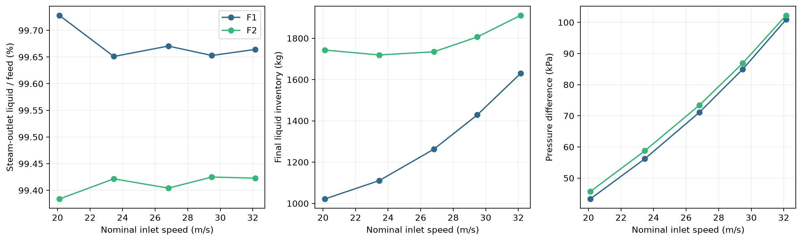

*Figure 1. F1 mixed-feed and F2 split-feed Coupled carriers at five nominal speeds, each independently initialized and run to N10,000. Routing and area-weighted steam-face-to-outlet pressure difference use the final-500 window; inventory is the final saved value. The narrow outlet-axis range highlights small differences: every point remains above 99%.*

| Item | Finding 1 — the split inlet changes retention more than outlet routing |
| --- | --- |
| — | F1's final inventory rises from 1,021.5 to 1,629.6 kg with speed, whereas F2 retains 1,719–1,911 kg and has a shallow minimum at 23.46 m/s |
| At 26.81 m/s, F2 | retains 1,734.5 kg compared with F1's 1,262.6 kg: about 472 kg, or 37%, more |
| pressure difference rises with speed in both families and | is slightly higher in F2 at every point |
| Yet the outlet fractions | remain 99.65–99.73% in F1 and 99.38–99.43% in F2 |
| clear representation effect | is on the internal state; neither carrier supplies an effective liquid-removal path in this geometry |

| F1-26.81-n10000 | F2-26.81-n10000 |
| --- | --- |
| 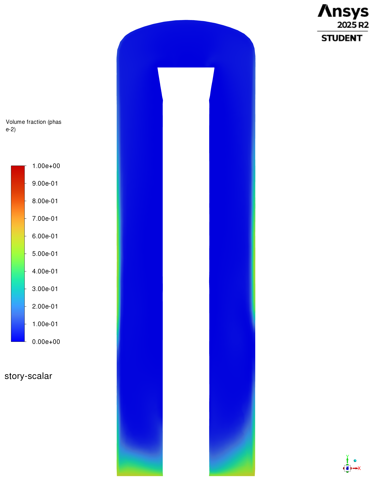 | 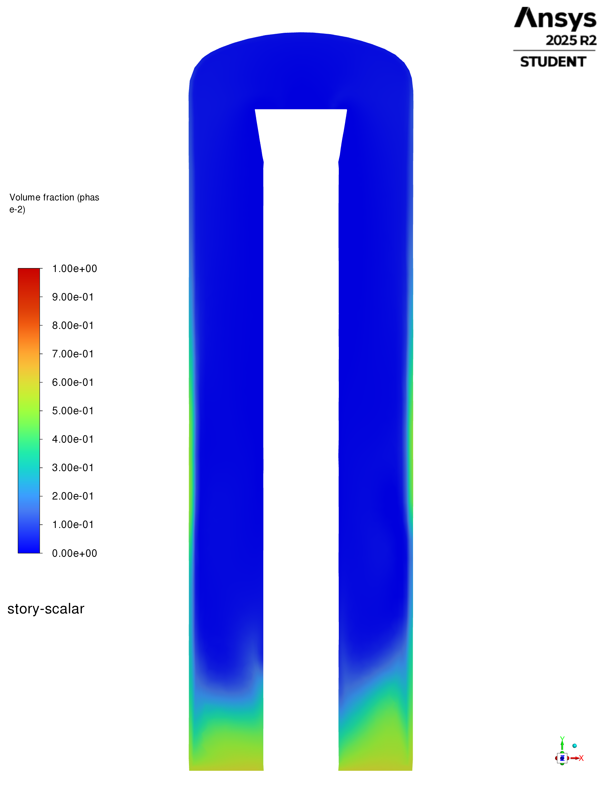 |

*Figure 2. Reference-speed vertical liquid-volume-fraction contours, N10,000, `z = 0`, common range 0–1. F2 has a deeper liquid-enriched lower region; both retain outer-wall enrichment and comparatively low liquid volume fraction in much of the central bulk.*

| Item | Finding 1 — the split inlet changes retention more than outlet routing |
| --- | --- |
| — | The contour difference supports the inventory measurement but does not quantify it: a plane samples only part of the volume |
| larger | retained mass is established by the domain report, rather than inferred from coloured area |
| — | Retained liquid also differs from removed liquid; the closed lower boundary limits what this redistribution can mean for separator performance |

| F1-26.81-n10000 | F2-26.81-n10000 |
| --- | --- |
| 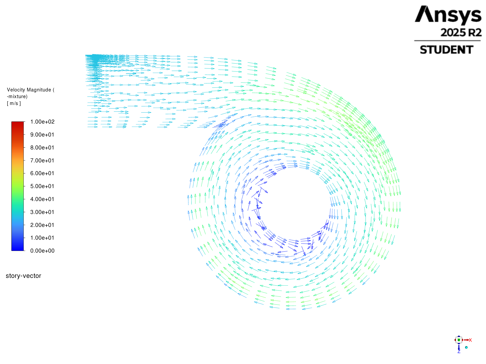 | 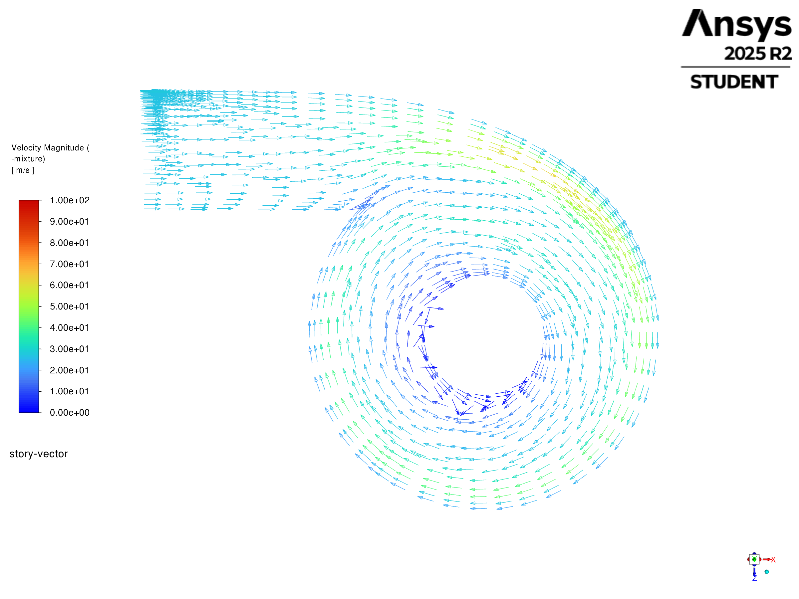 |

*Figure 3. Native mixture vectors through inlet height at the same two endpoints. In-plane arrows show circumferential circulation; colour is full mixture speed, shared range 0–100 m/s. Common fixed arrow length and scale permit a direction comparison.*

| Finding 1 — the split inlet changes retention more than outlet routing |
| --- |
| Both cases retain the same broad circulation direction |
| The inlet split therefore modifies liquid placement within a circulating carrier instead of introducing a visibly different overall flow topology |
| This establishes the carrier reference for the later droplet stage |

## Finding 1a — the F1 numerical package changes the matched carrier response

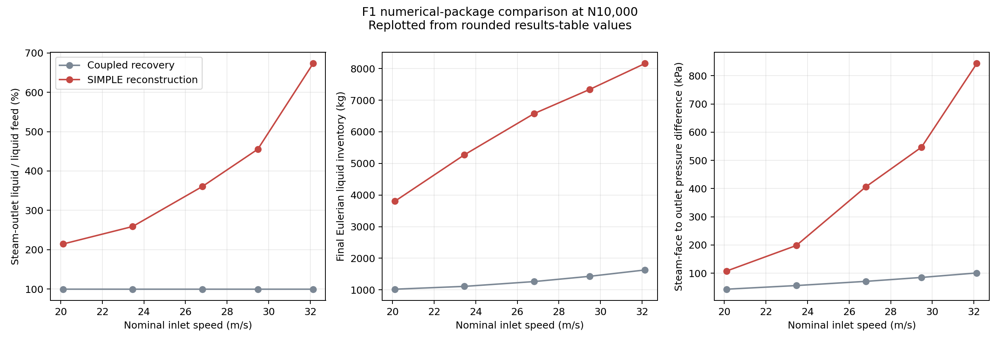

*Replotted from the rounded values in the table below; original machine-generated plot unavailable in this checkout.*

| Speed (m/s) | Steam-outlet liquid / feed, Coupled → SIMPLE (%) | Final liquid inventory, Coupled → SIMPLE (kg) | Pressure difference, Coupled → SIMPLE (kPa) |
| ---: | ---: | ---: | ---: |
| 20.11 | 99.728 → 214.437 | 1021.5 → 3802.5 | 43.29 → 107.80 |
| 23.46 | 99.651 → 258.911 | 1110.8 → 5274.2 | 56.18 → 198.18 |
| 26.81 | 99.671 → 360.424 | 1262.6 → 6576.7 | 71.09 → 406.52 |
| 29.48 | 99.653 → 455.273 | 1428.9 → 7339.8 | 84.97 → 546.56 |
| 32.14 | 99.664 → 673.023 | 1629.6 → 8160.3 | 100.88 → 843.23 |

| Finding 1a — the F1 numerical package changes the matched carrier response |
| --- |
| SIMPLE numerical diagnostics, measured over N9,500–10,000: |

| Speed (m/s) | SIMPLE mixture boundary gap (% feed) | SIMPLE inventory slope (kg/iteration) | SIMPLE max continuity residual | Reverse-flow messages | Viscosity-limit messages |
| ---: | ---: | ---: | ---: | ---: | ---: |
| 20.11 | 67.27 | 0.486 | 0.256 | 9998 | 9740 |
| 23.46 | 93.42 | 0.582 | 0.389 | 9998 | 9768 |
| 26.81 | 153.14 | 0.741 | 0.680 | 9998 | 9760 |
| 29.48 | 208.93 | 1.111 | 1.086 | 9998 | 9770 |
| 32.14 | 336.85 | 0.047 | 1.162 | 9998 | 9783 |

| Item | Finding 1a — the F1 numerical package changes the matched carrier response |
| --- | --- |
| F1 two-face feed, mesh and bounded horizon | are matched |
| SIMPLE | uses segregated pseudo-time off and second-order k; the Coupled recovery package uses Global Time Step and first-order k |
| — | Changes therefore belong to a package comparison and cannot be attributed to the pressure-coupling algorithm alone |
| diagnostic thresholds describe numerical limitations; they | are not Phase 8 progression gates |
| — | Reference-speed native liquid contours and inlet vectors at matched N10,000 endpoints: |

| SIMPLE package | Coupled recovery package |
| --- | --- |
| 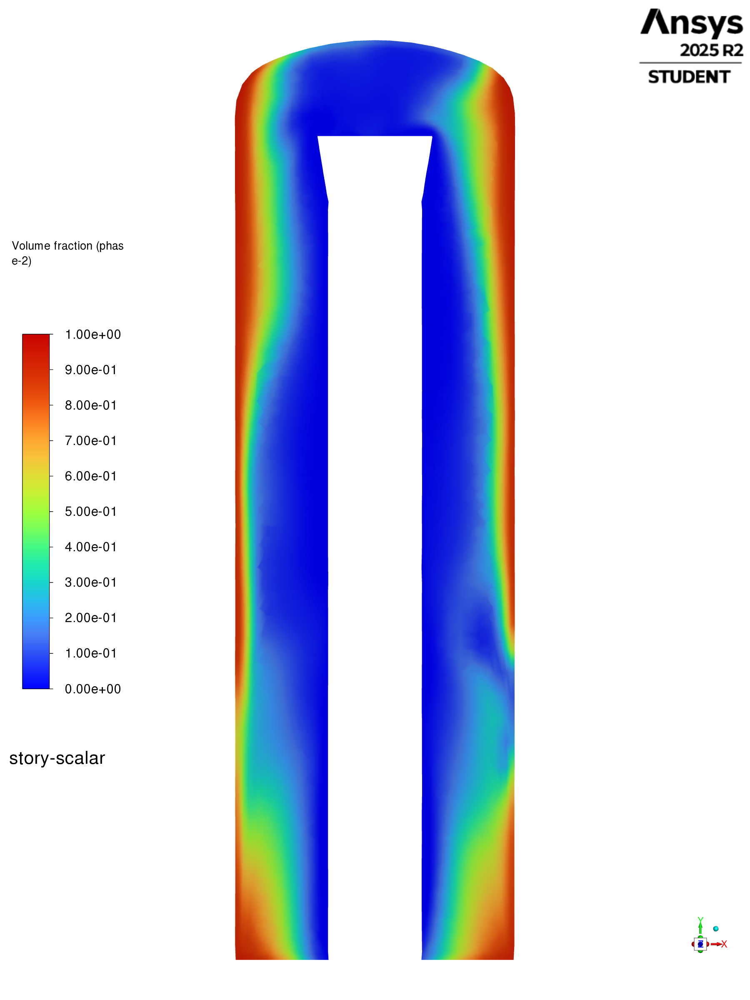      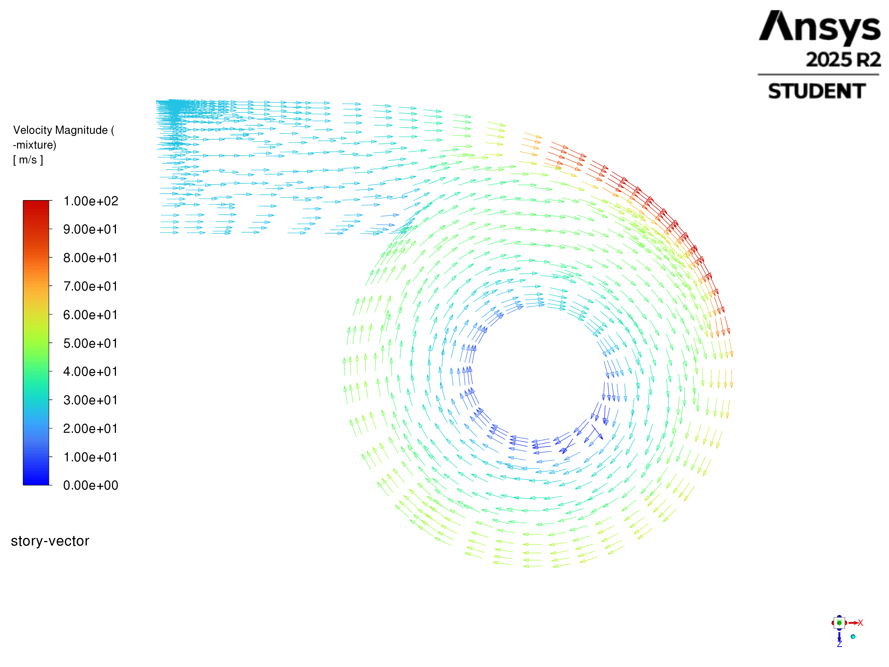 |        |

| Comparison item | Evidence and limit |
| --- | --- |
| Historical 08b | [Setup](../phase-02-parity-reset-and-pre-v2-qualification/purnanto-08b-parity-split-inlet/setup.md) and [results](../phase-02-parity-reset-and-pre-v2-qualification/purnanto-08b-parity-split-inlet/results.md) document split `liquidinlet`/`steaminlet` mass-flow boundaries on a 7,601,261-cell mesh, with a 58.73% whole-mixture imbalance ratio at N5,000. |
| Phase 8 F1 | Applies mixed feed to both inlet faces on the 60,964-cell Phase 8 mesh. |
| Comparability | F1 SIMPLE shares the audited 00a SIMPLE, second-order and QUICK method family, but it is not a topology- or mesh-identical 08b recreation. |

| SIMPLE package                                                                                         | Coupled recovery package                                                                 |
| ------------------------------------------------------------------------------------------------------ | ---------------------------------------------------------------------------------------- |
|                |                |
|  |  |

Historical [08b setup](../phase-02-parity-reset-and-pre-v2-qualification/purnanto-08b-parity-split-inlet/setup.md) and [results](../phase-02-parity-reset-and-pre-v2-qualification/purnanto-08b-parity-split-inlet/results.md) document split `liquidinlet`/`steaminlet` mass-flow boundaries on a 7,601,261-cell mesh and a 58.73% whole-mixture imbalance ratio at N5,000. F1 applies mixed feed to both inlet faces on the 60,964-cell Phase 8 mesh. Although F1 SIMPLE shares the audited 00a SIMPLE, second-order and QUICK method family, it is not a topology- or mesh-identical 08b recreation.

### One-way DPM diagnostics on the SIMPLE carriers

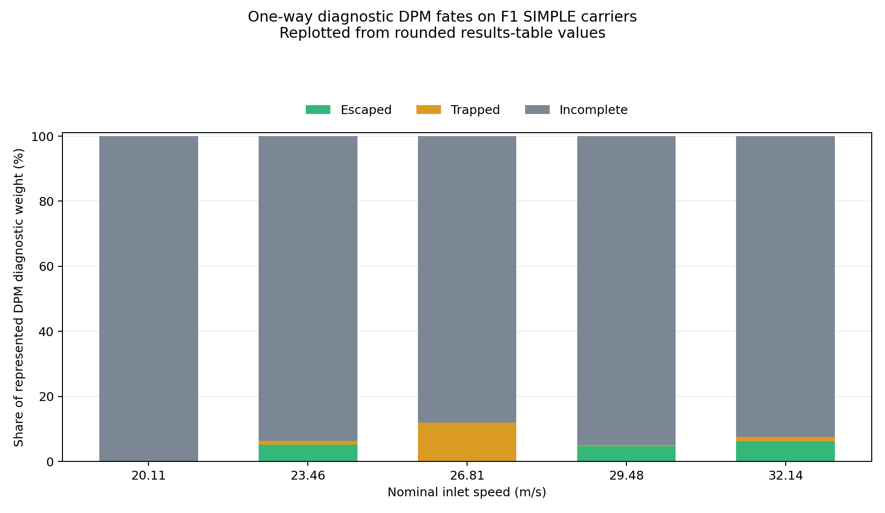

*Replotted from the rounded values in the table below; original machine-generated plot unavailable in this checkout.*

| Speed (m/s) | Escaped represented weight (%) | Trapped represented weight (%) | Incomplete represented weight (%) |
| ---: | ---: | ---: | ---: |
| 20.11 | 0.08 | 0.01 | 99.91 |
| 23.46 | 5.12 | 1.24 | 93.65 |
| 26.81 | 0.18 | 11.79 | 88.03 |
| 29.48 | 4.72 | 0.23 | 95.05 |
| 32.14 | 6.19 | 1.32 | 92.49 |

| Item | One-way DPM diagnostics on the SIMPLE carriers |
| --- | --- |
| — | These seven-bin cases use 5% inert, one-way DPM weight, a 50,000-step tracking cap, and the same full-feed Eulerian SIMPLE carriers |
| large incomplete share | is unresolved trajectory weight |
| fates | are diagnostic outcomes on numerically poor carriers, not separator efficiency or validated separation |

## Finding 2 — allocated DPM changes the carrier, while most droplet feed remains unresolved

| Item | Finding 2 — allocated DPM changes the carrier, while most droplet feed remains unresolved |
| --- | --- |
| — | F3 moves 2.5% or 5% of the total liquid feed into the common seven-bin fine-mist DPM distribution and enables feedback to the carrier |
| Total water feed | is unchanged |
| — | The reference loading comparison begins from the same-speed F2 N10,000 basis and records the next 1,000 iterations |

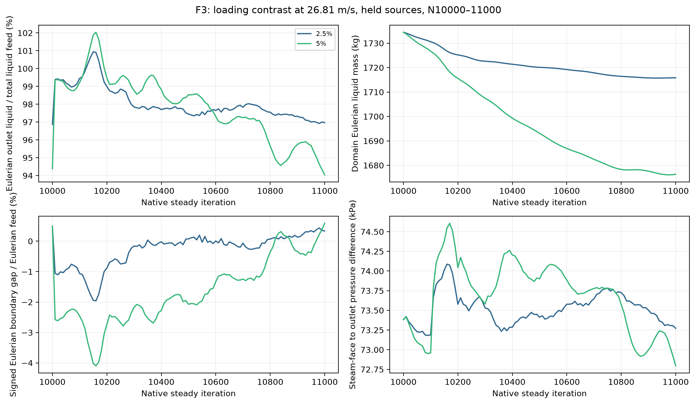

*Figure 4. Reference-speed 2.5% and 5% F3 pilots, N10,000–11,000, with 100-iteration retracking and held sources. The outlet numerator is Eulerian liquid only, divided by total liquid feed including allocated DPM. Inventory is also Eulerian liquid only; these are not total carryover percentages.*

| Item | Finding 2 — allocated DPM changes the carrier, while most droplet feed remains unresolved |
| --- | --- |
| — | The 5% pilot exhibits a larger decrease in Eulerian inventory and ends at 1,676.3 kg, compared with 1,715.8 kg at 2.5% |
| Terminal Eulerian outlet fractions | are 94.04% and 96.97%, respectively |
| — | Their histories contain overshoot and continued adjustment, so these endpoints describe the bounded pilot response |
|  | A lower bulk outlet percentage partly reflects moving liquid out of the Eulerian representation and cannot by itself demonstrate better separation |
| [F3 report](f3-coupled-dpm/results.md) also | shows that the broad lower-liquid and outer-wall structure persists in the native pilot contours |

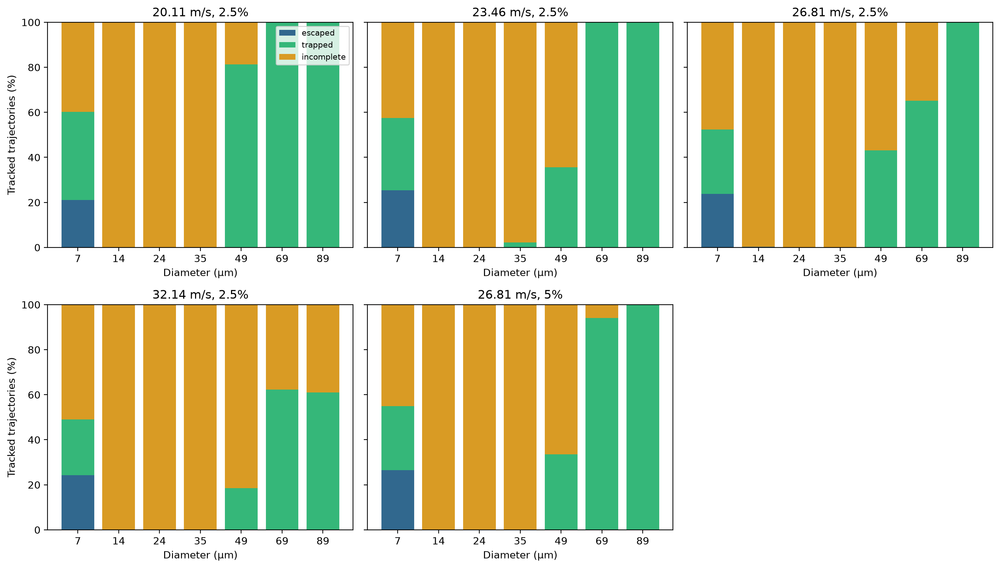

*Figure 5. Saved seven-bin trajectory-count fates for the four 2.5% speed pilots and the 5% reference pilot at N11,000. Green is trapped, blue escaped and orange incomplete. Per-bin trajectory fractions are distinct from the injection-weighted represented-feed fractions quoted below.*

| Item | Finding 2 — allocated DPM changes the carrier, while most droplet feed remains unresolved |
| --- | --- |
| 14, 24 and 35 µm bins | are almost entirely incomplete, while the smallest and largest bins have more completed fates |
| At the reference 2.5% pilot, the 89 µm trajectories | are trapped, but the smallest bin includes escape as well as trapping |
| This | is evidence of diameter-dependent transport, with a large missing middle of the distribution |
| injection-weighted unresolved fractions | are 79.31% at 2.5% and 78.98% at 5%; roughly 79% of represented DPM feed therefore remains unclassified at both reference pilots |
| — | Across the four 2.5% speed pilots, unresolved represented feed increases from 67.32% at 20.11 m/s to 86.16% at 32.14 m/s, while the trapped fraction falls from 31.18% to 12.11% |

Supporting detail — Finding 2 — allocated DPM changes the carrier, while most droplet feed remains unresolved

| Item | Finding 2 — allocated DPM changes the carrier, while most droplet feed remains unresolved |
| --- | --- |
| That trend describes the | recorded fate categories under the chosen controls |
| — | It does not establish that faster flow physically reduces capture, because unresolved mass dominates and may change the final allocation |
|  | Native trajectory examples in the family report illustrate circulation but do not substitute for these ensemble statistics |
|  | The earlier continuation campaign also exposed a tracking-limit effect |
|  | On fixed averaged-source carriers, increasing the cap from 50,000 to 200,000 steps reduced unresolved feed from 82.01% to 73.55% at 26.81 m/s and from 83.40% to 78.27% at 32.14 m/s |
| Their horizons differ, so they | are sensitivity probes rather than matched speed pilots |
| — | F3 consequently establishes explicit droplet transport and feedback in the storyline, with incomplete tracking retained as a finding rather than hidden inside an efficiency estimate |

## Finding 3 — EWF forms film and changes bulk routing, but does not explain liquid removal

| Item | Finding 3 — EWF forms film and changes bulk routing, but does not explain liquid removal |
| --- | --- |
| — | F4 adds the provisional E2.7-based film package on `wall` to the 26.81 m/s, 5% coupled-droplet setup |
| bottom | remains excluded and the absorber remains off |
| — | Figure 6 compares the same N10,000–11,000 pilot interval with F3 |

*Figure 6. Reference-speed 5% F3 and provisional F4 pilot histories. F4 shows much lower Eulerian outlet flow and inventory, accompanied by a large open Eulerian boundary gap. This is a film-package response, with incomplete transfer accounting.*

| Item | Finding 3 — EWF forms film and changes bulk routing, but does not explain liquid removal |
| --- | --- |
| — | F4 ends with 25.541 kg/s Eulerian liquid through the steam outlet, equivalent to 21.84% of total liquid feed, and 771.42 kg bulk inventory |
|  | The final-500 Eulerian boundary gap averages 80.761 kg/s |
| magnitude of the outlet change | is clear, but its interpretation depends on the destinations and transfers of the liquid |
| — | A low bulk outlet flux alone cannot establish capture or drainage |

| F3-26.81-5-n11000 | F4-26.81-5-n11000 |
| --- | --- |
| 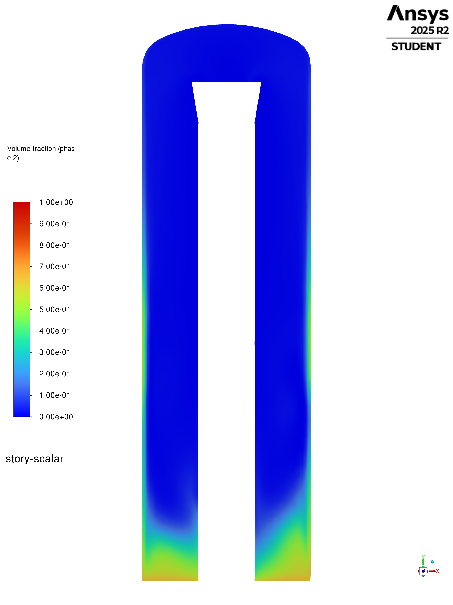 |  |

*Figure 7. Matched 5% F3/F4 vertical bulk-liquid contours at N11,000, common range 0–1. F4 retains a liquid-enriched lower region but has a weaker wall-adjacent band above it. This spatial change agrees with the lower reported bulk inventory.*

*Figure 8. Native F4 film inventory, maximum thickness, cumulative stripped mass and cumulative film outflow over N10,000–11,000. Film inventory continues to rise to 1.321 kg; maximum thickness reaches approximately 0.165 mm. Cumulative quantities are masses, not rates.*

| Item | Finding 3 — EWF forms film and changes bulk routing, but does not explain liquid removal |
| --- | --- |
| film | is measurable, but it has not reached a stationary inventory at the saved endpoint |
| Cumulative stripping | is 0.1876 kg and film outflow is 0.00546 kg |
| — | Those inventories and accumulated masses cannot close a missing mass-flow ledger without compatible transfer-rate accounting |
| native film DPM mass-source report | was unavailable, and F4 lacks a directly comparable complete particle fate ledger |

| Wall-film thickness | Wall-film velocity |
| --- | --- |
| 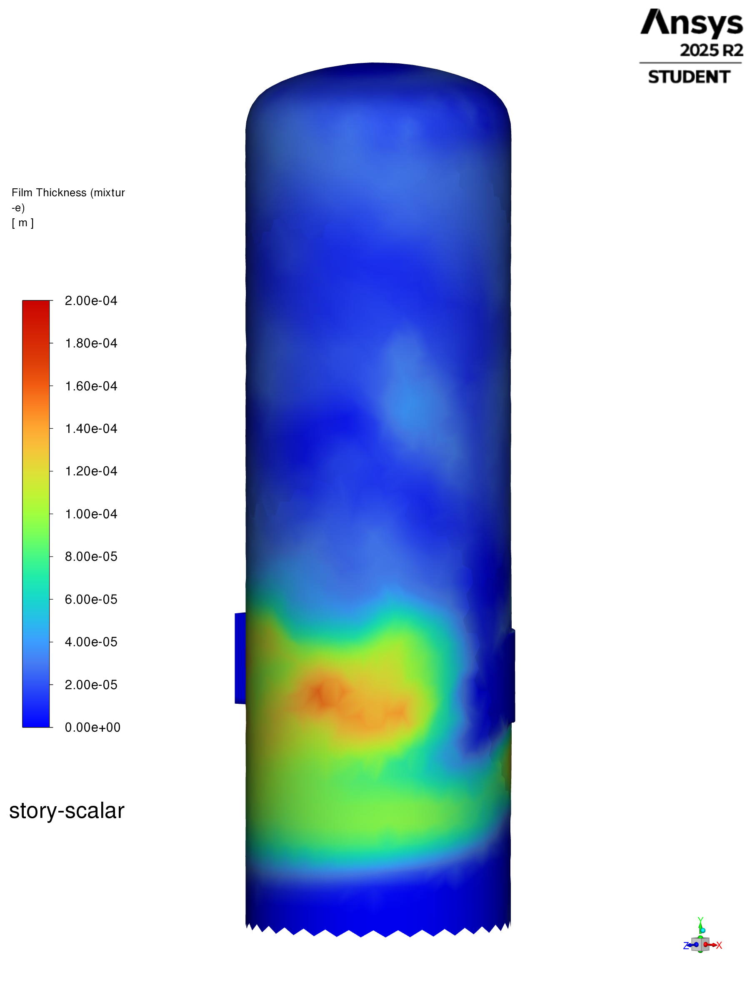 | 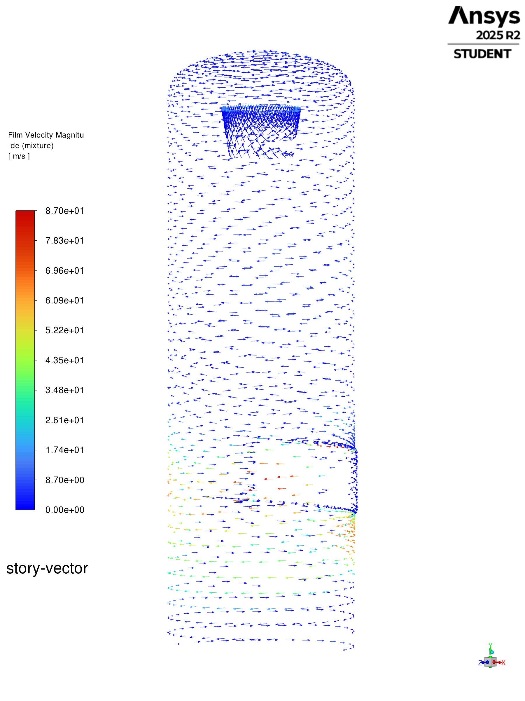 |

*Figure 9. F4 N11,000 native 3D wall-film views. Thickness uses 0–0.2 mm; film-speed colour uses 0–87 m/s, with vectors assembled from all three recorded film-velocity components. Film concentrates near inlet height and substantial circumferential motion remains visible.*

| Item | Finding 3 — EWF forms film and changes bulk routing, but does not explain liquid removal |
| --- | --- |
| — | These fields show film formation and wall transport, without establishing downward drainage |
| supported result | is that the provisional film treatment changes the represented liquid state strongly |
| Its accounting limits | remain part of the reconstruction and prevent translating the bulk-outlet reduction into a separation-efficiency improvement |

## How these findings lead toward the current model

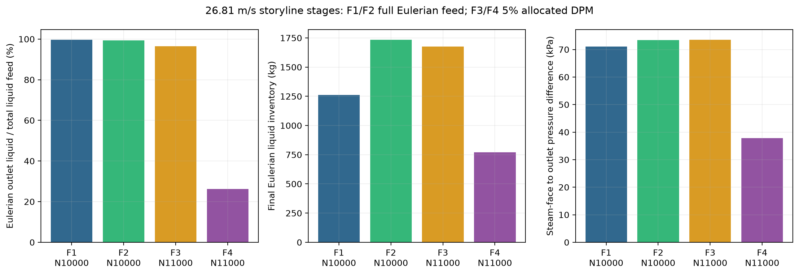

*Figure 10. Reference-speed stage summary: full-Eulerian F1/F2 at N10,000 and 5%-allocated F3/F4 at N11,000. Outlet and pressure bars use the final-500 mean; inventories use the endpoint. In particular, the F4 mean outlet bar differs from its 21.84% terminal value. This is a modelling-stage comparison with changing representation and horizon.*

| How these findings lead toward the current model |
| --- |
| The reconstructed sequence makes the reasons for the model changes visible |
| Inlet representation changes liquid distribution and retention, yet leaves high bulk outlet routing |
| DPM adds a separate diameter-dependent transport question and carrier feedback, while exposing unresolved particle fates |
| EWF adds measurable wall film but raises an unresolved liquid-accounting question |
| None of these stages provides a demonstrated lower liquid-removal path in the common closed-bottom geometry |
| The original [full-geometry brine-outlet investigation](../phase-05-full-geometry-v2/interpretation.md) and [pool-control work](../phase-06-full-geometry-with-brine-pool/interpretation.md) then supply historical context for the return to a simplified removal architecture; they cannot be recreated on this truncated geometry |
| The later [Phase 7.1A virtual outlet](../phase-07-1a-absorber-convergence/interpretation.md) and [Phase 7.2A wall-treatment investigation](../phase-07-2a-wall-liquid-routing/interpretation.md) own the evidence for those developments |
| Phase 8 explains this progression without claiming that an absorber-equipped comparison has already been run |

## Coverage and limits of the report

| Item | Coverage and limits of the report |
| --- | --- |
| — | After the F0 split, saved evidence covers 21 of the intended 65 core points: five F0, five F1, five F2, five F3 and one provisional F4 |
|  | Additional SIMPLE, numerical-continuation and tracking-probe snapshots preserve parts of the investigation without increasing core-matrix coverage |
| Most F3/F4 loading combinations | remain absent |
| — | The report therefore supports the demonstrated stage contrasts, rather than a complete response surface or an optimum setup |
|  | Steady native iterations do not define physical elapsed time; inventory slopes are not physical storage rates |
|  | The common closed-bottom geometry, assumed fine-mist distribution, incomplete DPM fates and provisional film basis bound the conclusions |
| Mass balance and continuity histories | remain in the family reports to make those limits inspectable |
| — | They do not determine whether an unresolved stage belongs in the history |

## Audited direct Fluent continuations - 2026-10-02

| Item | Audited direct Fluent continuations - 2026-10-02 |
| --- | --- |
| — | The four named continuations ran in Fluent 2025 R2 Student Edition on HOME-DESKTOP-SH through the supported direct Fluent route, preserving their audited settings and source pairs |
| Provenance hashes | were rechecked before loading |
| Each final pair | was saved, reopened and read back; checkpoint, report-history and transcript evidence is recorded in the linked manifests |
| three F3 pilot continuations | retained unaveraged DPM sources (node-based source averaging disabled) |
| F4 | remains explicitly provisional E2.7 EWF |
| — | A later follow-up separately authorized one supplementary F1 single-face SIMPLE continuation from its untouched N2,000 source |

| Setting                                        |   Native source → endpoint |                       Exact-setting total interval | Outcome                                  |
| ---------------------------------------------- | -------------------------: | -------------------------------------------------: | ---------------------------------------- |
| F3 20.11 m/s, 2.5%, unaveraged DPM             |          N11,000 → N13,000 |                            N10,000–N13,000 = 3,000 | Minimum reached                          |
| F3 23.46 m/s, 2.5%, unaveraged DPM             |          N11,000 → N13,000 |                            N10,000–N13,000 = 3,000 | Minimum reached                          |
| F3 32.14 m/s, 2.5%, unaveraged DPM             |          N11,000 → N13,000 |                            N10,000–N13,000 = 3,000 | Minimum reached                          |
| F4 26.81 m/s, 5%, provisional E2.7 EWF         |          N11,000 → N13,000 |                            N10,000–N13,000 = 3,000 | Minimum reached; provisional             |
| Supplementary F1 single-face SIMPLE, 26.81 m/s |            N2,000 → N3,000 | 3,000 (source manifest 2,000 + continuation 1,000) | Minimum reached; not a core-matrix point |
| F3 26.81 m/s, 2.5%                             | Existing N10,000 → N15,000 |                                              5,000 | Existing evidence retained               |
| F3 26.81 m/s, 5%                               | Existing N10,000 → N20,000 |                                             10,000 | Existing evidence retained               |

| Item | Audited direct Fluent continuations - 2026-10-02 |
| --- | --- |
| inherited N10,000 parent for the four named pilots | is excluded as requested; each source manifest contributes 1,000 exact-setting iterations, and each direct continuation added 2,000 |
| — | This extends four existing core points and does not change the Phase 8 core-matrix count of 16/60 |
| separately authorized F1 single-face SIMPLE snapshot | is supplementary, not a core point |
| No other matrix point or Phase 7b run | was continued |

### Late-window behavior and claim limits

| Item | Late-window behavior and claim limits |
| --- | --- |
| comparison | uses the source-to-continuation joined monitor histories |
| For F3, the early comparison | is N11,000–N11,500 and the late window is N12,500–N13,000 |
| These | are solver-iteration histories, not physical-time rates |
| F3 20.11 m/s | The previously recorded review found inventory still changing over N10,000–N13,000, with narrow late-window behavior but residual and DPM-update excursions |
|  | At the final DPM pass, 112 parcels escaped, 1,379 trapped and 2,800 remained incomplete |

Supporting detail — Late-window behavior and claim limits

| Item | Late-window behavior and claim limits |
| --- | --- |
| F3 20.11 m/s | The setting meets the iteration-coverage minimum; settling and physical validity are not established |
| F3 23.46 m/s | Phase-2 liquid inventory mean increased from 1,718.2 kg in the early window to 1,758.0 kg late; the late window rose from 1,751.2 to 1,763.2 kg |
|  | Mean monitored mixture outlet magnitude was 169.0 then 168.3 kg/s, versus 170.388 kg/s combined monitored inlet flow late (about 2.05 kg/s difference) |
|  | Continuity mean eased from 1.59e-2 to 1.51e-2, while periodic excursions remained |
|  | The last DPM pass recorded 168 escaped, 1,680 trapped and 2,443 incomplete parcels |
|  | Inventory drift and unresolved parcel weight remain material |
| F3 32.14 m/s | Phase-2 liquid inventory mean was 1,862.3 kg early and 1,860.7 kg late; late values spanned 1,860.3–1,861.3 kg |
|  | The late combined monitored inlet flow was 233.429 kg/s against 232.493 kg/s mixture outlet magnitude |
|  | Continuity mean was 1.48e-2 early and 1.50e-2 late |
|  | The last DPM pass recorded 139 escaped, 1,085 trapped and 3,067 incomplete parcels |
|  | Bulk inventory changed little in the late window, but residuals, reverse flow on about 250–260 outlet faces, a turbulent-viscosity cap in about 5,800 cells and 71% incomplete parcel count show unresolved numerical and routing behavior; this is not proof of a steady solution |
| F4 provisional E2.7 EWF | Between N11,000–N11,500 and N12,500–N13,000, phase-2 bulk liquid inventory mean fell from 709.4 to 323.5 kg (late range 265.4–390.4 kg) |
|  | Meanwhile monitored film mass mean rose from 1.60 to 3.28 kg; maximum thickness from 0.213 to 0.413 mm; area-weighted thickness from 0.034 to 0.070 mm; and area-weighted film speed from 10.37 to 23.32 m/s |
|  | Cumulative EWF outflow rose from 0.0063 to 0.0113 kg between window means, and stripped mass from 0.206 to 0.318 kg |
|  | Continuity averaged about 2.19e-2 early and 2.21e-2 late, with spikes to 5.72e-2 early and 3.71e-2 late; turbulence and volume-fraction residuals continued to drift |
|  | The final DPM pass had 43 escaped, 4 trapped and 113 incomplete parcels |
|  | Film growth and bulk-routing change are evident, but the film and outlet monitors do not account for the bulk-inventory change |
|  | This provisional case is still drifting and does not demonstrate steady state or physical validity |
| Supplementary F1 single-face SIMPLE | For N2,000–N2,500 versus N2,500–N3,000, phase-2 liquid inventory mean rose from 931.6 to 1,159.0 kg; the late window increased from 1,061.1 to 1,259.5 kg |
|  | Mean mixture inlet stayed at 197.64 kg/s while mean outlet magnitude shifted from 127.09 to 151.76 kg/s (late monitored difference about 45.89 kg/s) |
|  | Phase-2 liquid inlet/outlet magnitudes late were 116.94/70.78 kg/s |
|  | Continuity mean eased from 1.15e-1 to 1.05e-1 but remained high; late reverse-flow messages covered roughly 220-244 outlet faces, and the turbulent-viscosity cap affected around 4,800-5,100 cells |
|  | Bulk inventory, routing and residuals still drift |
|  | This separately modeled one-face setup is supplementary and is not evidence about the two-inlet core F1 matrix |
|  | The monitored inlet/outlet comparisons above are limited to the named report boundaries |
|  | They are not a full domain mass closure |
|  | Residuals and mass-balance differences were recorded as evidence, not used as progression gates |
|  | Three thousand iterations establishes coverage only |

### Run evidence

| Item | Run evidence |
| --- | --- |
| F3 20.11 | [continuation manifest](../../../PyAnsys/output/phase8-carrier/F3-20p11-2p5pct-coupled-upd100-unaveraged-resume-from12000-to13000-direct-20261002T130010Z/manifest.json); [saved run directory](<C:/Users/Shuhei Yokkaichi/Documents/FluentRuns/Phase8/PurnantoParity/Runs/F3-20p11-2p5pct-coupled-upd100-unaveraged-resume-from12000-to13000-direct-20261002T130010Z>) |
| F3 23.46 | [continuation manifest](../../../PyAnsys/output/phase8-carrier/F3-23p46-2p5pct-coupled-upd100-unaveraged-continuation-to13000-direct-20261002T140847755129Z/manifest.json); [saved run directory](<C:/Users/Shuhei Yokkaichi/Documents/FluentRuns/Phase8/PurnantoParity/Runs/F3-23p46-2p5pct-coupled-upd100-unaveraged-continuation-to13000-direct-20261002T140847755129Z>) |
| F3 32.14 | [continuation manifest](../../../PyAnsys/output/phase8-carrier/F3-32p14-2p5pct-coupled-upd100-unaveraged-continuation-to13000-direct-20261002T145119875177Z/manifest.json); [saved run directory](<C:/Users/Shuhei Yokkaichi/Documents/FluentRuns/Phase8/PurnantoParity/Runs/F3-32p14-2p5pct-coupled-upd100-unaveraged-continuation-to13000-direct-20261002T145119875177Z>) |
| F4 provisional | [continuation manifest](../../../PyAnsys/output/phase8-ewf/F4-26p81-5pct-E27-provisional-continuation-to13000-direct-20261002T154016584743Z/manifest.json); [saved run directory](<C:/Users/Shuhei Yokkaichi/Documents/FluentRuns/Phase8/PurnantoParity/Runs/F4-26p81-5pct-E27-provisional-continuation-to13000-direct-20261002T154016584743Z>) |
| Supplementary F1 single-face SIMPLE | [continuation manifest](../../../PyAnsys/output/phase8-single-face/F1-single-face-SIMPLE-26p81-continuation-to3000-direct-20261002T162342433271Z/manifest.json); [saved run directory](<C:/Users/Shuhei Yokkaichi/Documents/FluentRuns/Phase8/PurnantoParity/Runs/F1-single-face-SIMPLE-26p81-continuation-to3000-direct-20261002T162342433271Z>) |

### Out-of-scope interruption record

| Item | Out-of-scope interruption record |
| --- | --- |
| — | The temporary controller list accidentally included a separate F1 single-face SIMPLE continuation, outside the four named cases |
|  | After loading its N2,000 source it issued one `iterate(iter_count=1000)` request |
|  | The direct interrupt stopped that attempt at the transcript's last native row, N2,060: 60 iterations occurred, but no checkpoint or final case/data pair was saved |
| original F1 source case/data and histories | remain untouched |
| Those unsaved iterations | are excluded from coverage and were not resumed |

Supporting detail — Out-of-scope interruption record

| Item | Out-of-scope interruption record |
| --- | --- |
| — | A later follow-up separately authorized the supplementary run above, which started cleanly from the untouched N2,000 source and saved its own N3,000 pair |
| earlier attempt's transcript and interrupted manifest | are preserved at [the run record](<C:/Users/Shuhei Yokkaichi/Documents/FluentRuns/Phase8/PurnantoParity/Runs/F1-single-face-SIMPLE-26p81-continuation-to3000-direct-20261002T160016202335Z>) and [the machine manifest](../../../PyAnsys/output/phase8-single-face/F1-single-face-SIMPLE-26p81-continuation-to3000-direct-20261002T160016202335Z/manifest.json) |
| original N13,000 batch controller | is limited to its four named cases; the later supplementary F1 run used a separate controller |
| — | The four N13,000 continuations and the later-authorized supplementary F1 continuation are complete; the Phase 8 loop remains paused at that requested scope |
| No files | were pushed or published |

## Supporting family reports and provenance

| Item | Supporting family reports and provenance |
| --- | --- |
| [F1 mixed-feed results](f1-one-inlet/results.md) | speed response, liquid distribution, diagnostic droplets and separate SIMPLE snapshots |
| [F2 split-feed results](f2-split-inlet/results.md) | matched speed response, retention and diagnostic droplet evidence |
| [F3 coupled-droplet results](f3-coupled-dpm/results.md) | speed/loading pilots, diameter-resolved fates and numerical/tracking sensitivity |
| [F4 wall-film results](f4-coupled-dpm-ewf/results.md) | matched bulk response, film formation and open accounting |
| Spatial images | are native Fluent 2025 R2 exports from verified case/data pairs |

Supporting detail — Supporting family reports and provenance

| Item | Supporting family reports and provenance |
| --- | --- |
| vertical cut | is `z = 0`; the horizontal cut is `y = 2.065999985 m`, the midpoint of the measured steam-inlet elevation bounds |
| Vertical axis | is `y` |
| Liquid volume fraction | uses `0–1`; mixture velocity colours use `0–100 m/s` |
| Bulk slice vectors | are in-plane, fixed-length, use shared scale `0.1`, and show every available vector (`skip = 0`) |
| — | They show projected direction; colour represents full mixture speed |
|  | Pressure contours use a shared gauge-pressure range `1110–1220 kPa` |
| Machine evidence | [hash-verified case catalog](../../../PyAnsys/output/phase8-storyline-20260930/catalog.json), [native export receipt](../../../PyAnsys/output/phase8-storyline-20260930/export-receipt.json), [surface/range receipt](../../../PyAnsys/output/phase8-storyline-20260930/range-receipt.json) and [plot summary](../../../PyAnsys/output/phase8-storyline-20260930/summary.json) |
| — | The family reports retain complete spatial atlases and earlier execution receipts in supporting sections |
|  | All figures derive from preserved saved evidence, with verified source hashes |
|  | The four authorized 2026-10-02 continuations extend existing points without changing the 16/60 core-matrix count |
| A separate out-of-scope F1 attempt | was interrupted at N2,060 and is documented above; original cases and histories remain untouched |
| direct Fluent continuation work | is complete and the Phase 8 loop remains paused at the requested scope |

