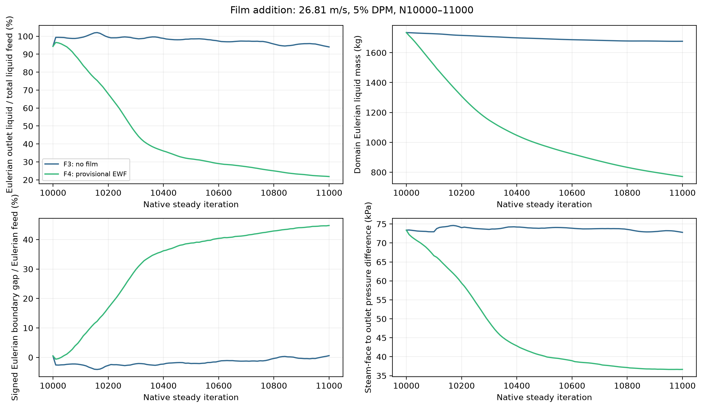
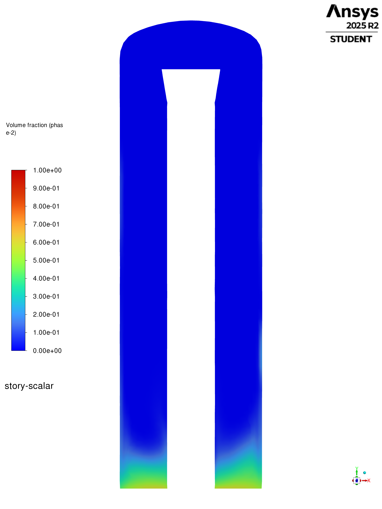
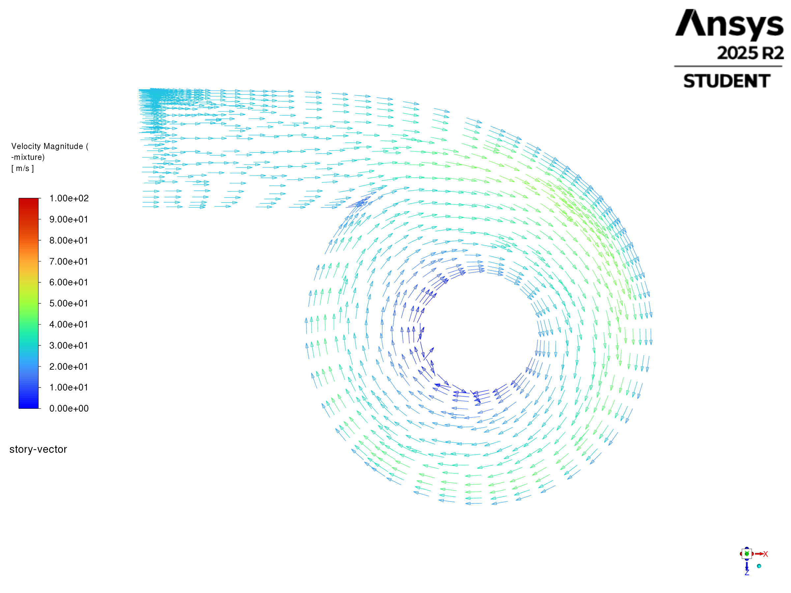
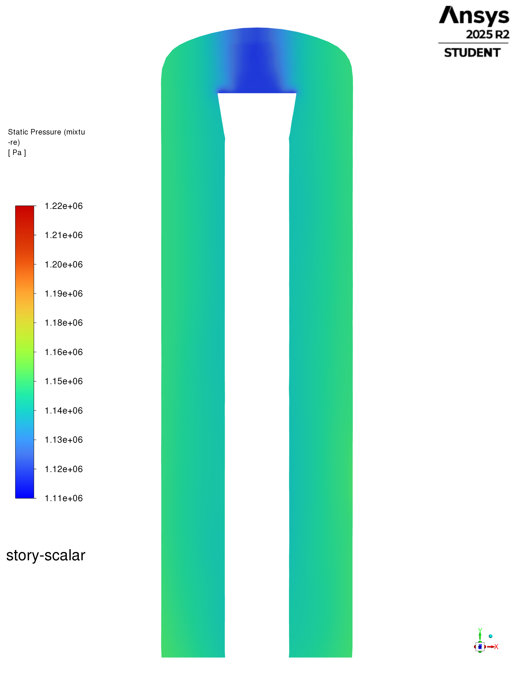
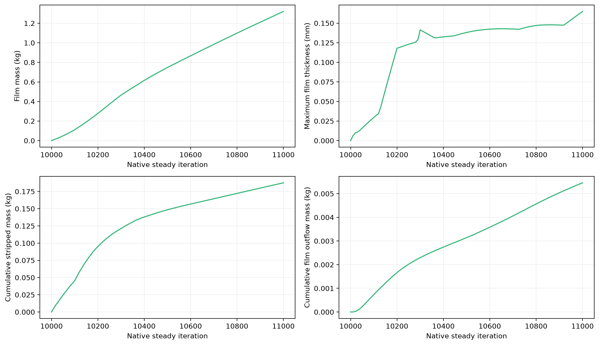
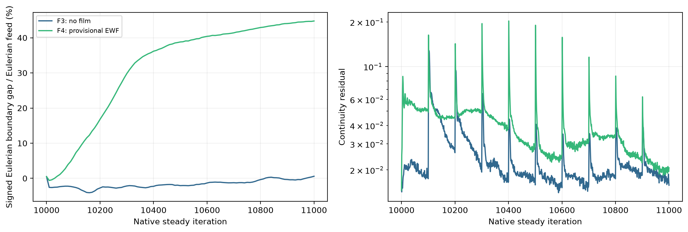
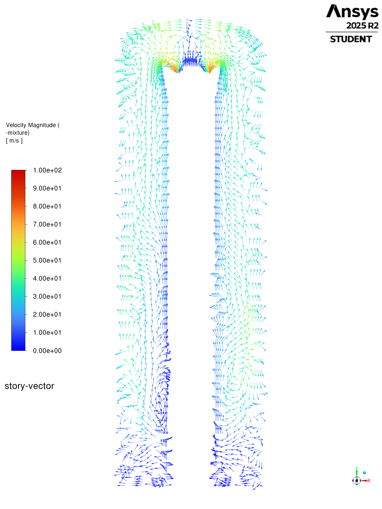

# Phase 8 F4 — provisional wall-film addition

## Current matched N16000 endpoints

| Item | Current matched N16000 endpoints |
| --- | --- |
| — | The authorized Server 1 batch completed all five selected points at N16000, with 6000 mechanism-active iterations |
| Final pairs | were saved/reopened and their synced hashes verified |
| [uniform N15500-16000 comparison](../results.md#current-family-organization-and-matched-n16000-comparison) | is the current comparison; the pilot figures below retain their earlier horizons |
| phase | is paused |
| — | The provisional EWF pilot introduced measurable wall film and a strong reduction in bulk Eulerian liquid reaching the steam outlet |
|  | Bulk liquid inventory also fell substantially and the Eulerian accounting remained open |
| supported storyline observation | is a change in liquid/film behaviour, not a measured separation-efficiency gain |

## The film package produces a large bulk-routing change

| Item | The film package produces a large bulk-routing change |
| --- | --- |
| — | F3 and F4 use 26.81 m/s, 5% allocated DPM, the same F2 carrier basis, and N10,000–11,000 pilots |
|  | F4 adds the provisional E2.7-based film package on `wall` only; the bottom remains excluded and the absorber remains off |
| Its cap and film numerical controls | are recorded adaptations, not finalized Phase 7.2A settings |

| Item | The film package produces a large bulk-routing change |
| --- | --- |
| — | F4 ends with 25.541 kg/s Eulerian liquid through the steam outlet (21.84% of total liquid feed) and 771.42 kg bulk liquid inventory |
|  | The final-500 Eulerian boundary gap averages 80.761 kg/s |
| Film inventory | is only 1.321 kg, so it cannot by itself explain the bulk accounting difference |

## Bulk liquid and flow views

| Reference snapshot | Vertical liquid distribution | Inlet-plane circulation |
| --- | --- | --- |
| F4-26.81-5-n11000 |  |  |

| Bulk liquid and flow views |
| --- |
| Reference-speed pressure: |

## Film forms locally, but drainage is not established

| Item | Film forms locally, but drainage is not established |
| --- | --- |
| — | Maximum thickness reaches about 0.165 mm, well below the 0.3 m exploratory cap |
|  | Cumulative stripped mass reaches 0.1876 kg and cumulative film outflow reaches 0.00546 kg |
| These | are masses in kg, not rates inferred from carrier iteration |

*Figure F4.3. F4 N11,000 wall-film thickness on the 3D wall, shared range 0–0.2 mm. Film concentrates near inlet height, rather than covering the wall uniformly.*

*Figure F4.4. F4 N11,000 native film-velocity vectors on the 3D wall, speed range 0–87 m/s. Circumferential transport is visible; arrows alone do not establish downward liquid removal.*

| Item | Film forms locally, but drainage is not established |
| --- | --- |
| — | Film arrows use a temporary Fluent vector assembled from the recorded film-x/y/z-velocity components and use the separate film-speed range recorded in the export receipt |
|  | The bulk and wall views must be interpreted together |
|  | The F4 bulk centre cut still has a liquid-enriched bottom region, but the wall-adjacent band above it is weaker than in the matched F3 pilot |
| wall-film thickness | is concentrated in a band around the inlet-height region rather than uniformly covering the vessel |
| — | The strongest film-speed colours occupy that band; the arrows show substantial circumferential motion, so film formation alone does not demonstrate downward drainage |
| Film vectors use all three | recorded components on the 3D wall; the common in-plane policy below applies to the bulk slice vectors |

## Interpretation limits

| Item | Interpretation limits |
| --- | --- |
| Phase accretion, DPM collection, wall/global splash and stripping | were enabled; wall Flow Momentum Coupling and film surface tension were off |
| — | A stored surface-tension coefficient does not imply an active force |
| native film DPM mass-source report | was unavailable, and Fluent reused an existing inlet injection as the stripping template |
| — | F4 therefore has no directly comparable complete DPM fate ledger; it is excluded from the DPM fate-percentage comparison rather than assigned zero unresolved mass |
| Final F3/F4 performance comparison | remains provisional pending the declared EWF basis |

## Numerical context

| Numerical context |
| --- |
| The sharp bulk-routing change coincides with a large open Eulerian boundary gap |
| That limits physical claims while remaining part of the reconstructed history |

## What this stage establishes

| What this stage establishes |
| --- |
| F4 recreates a film-forming wall treatment and a strong change in the represented bulk liquid state |
| The film/outflow reports and incomplete transfer accounting do not establish where the missing bulk throughput went |
| This stage therefore explains why later liquid-removal architecture and wall-treatment investigations were necessary, without claiming that the provisional film package solves separation |

## Supporting spatial atlas

All saved case contours and vectors

| Saved snapshot | Liquid, vertical cut | Liquid, inlet slice | Vertical vectors | Inlet vectors |
| --- | --- | --- | --- | --- |
| F4 26.81 m/s 5% provisional EWF N11000 |  |  |  |  |

| Item | Supporting spatial atlas |
| --- | --- |
| — | Columns show separate native liquid contours and mixture-vector views |
| Shared planes, scales and source identities | are specified below |
| SIMPLE and continuation snapshots have their own horizons and | are not substitutes for matched pilot controls |

## Figure provenance and claim limits

| Item | Figure provenance and claim limits |
| --- | --- |
| Spatial images | are native Fluent 2025 R2 exports from verified case/data pairs |
| vertical cut | is `z = 0`; the horizontal cut is `y = 2.065999985 m`, the midpoint of the measured steam-inlet elevation bounds |
| Vertical axis | is `y` |
| Liquid volume fraction | uses `0–1`; mixture velocity colours use `0–100 m/s` |
| Bulk slice vectors | are in-plane, fixed-length, use shared scale `0.1`, and show every available vector (`skip = 0`) |

Supporting detail — Figure provenance and claim limits

| Item | Figure provenance and claim limits |
| --- | --- |
| — | They show projected direction; colour represents full mixture speed |
|  | Pressure contours use a shared gauge-pressure range `1110–1220 kPa` |
| Evidence | [hash-verified case catalog](../../../../../PyAnsys/output/phase8-storyline-20260930/catalog.json), [native export receipt](../../../../../PyAnsys/output/phase8-storyline-20260930/export-receipt.json), [surface/range receipt](../../../../../PyAnsys/output/phase8-storyline-20260930/range-receipt.json) and [plot summary](../../../../../PyAnsys/output/phase8-storyline-20260930/summary.json) |
| — | Phase 8 reconstructs the simulation storyline |
| Numerical shortcomings | are observations and interpretation limits, not progression gates |
| Steady native iterations | are not physical time; inventory slopes must not be called physical storage rates |
| No new flow solves | were performed for these results |

## Retained detailed execution evidence

Earlier receipts, numerical assessments and setup detail

| Item | Retained detailed execution evidence |
| --- | --- |
| Earlier pass/fail terminology below | records the previous numerical screening rule |
| It | is superseded as a Phase 8 progression/completion requirement by the [2026-09-30 clarification](../CONTEXT.md) |

# F4 provisional E2.7 wall-film pilot

| Item | F4 provisional E2.7 wall-film pilot |
| --- | --- |
| — | The [verified 26.81 m/s, 5% child](../../../../../PyAnsys/output/phase8-ewf/F4-26p81-5pct-E27-provisional-20260928T163502Z/build.json) combines the same allocated seven-bin, two-way DPM feed as the F3 pilot with the directly recorded Phase 7.2A E2.7 film controls |
|  | The 60,964-cell mesh, closed bottom, inactive absorber, and parent carrier field were retained |
| film | is enabled only on `wall`, with Flow Momentum Coupling off, fixed `1e-5 s` film step, 10 film subiterations, a `0.3 m` exploratory maximum thickness, EWF Coupled Solution on, phase accretion on, DPM collection on, global and wall splash on, and stripping on |
| Film surface tension | is off; `0.07194 N/m` is a stored value only |
| main wall | retains DPM `reflect` because Fluent 2025 R2 disallows the Lagrangian `wall-film` BC when EWF is active |

Supporting detail — F4 provisional E2.7 wall-film pilot

| Item | F4 provisional E2.7 wall-film pilot |
| --- | --- |
| — | The live readback has Stanton–Rutland impingement and four splashed particles |
|  | Fluent selected the existing 89 µm inlet injection as a stripping template; no separate named injection appeared, limiting injection-based fate accounting |
|  | The [N=11,000 provisional pilot](../../../../../PyAnsys/output/phase8-ewf/F4-26p81-5pct-E27-provisional-20260928T163918Z/manifest.json) installed the common phase-flux and inventory reports plus film mass, thickness, velocity, Courant, phase-2 mass, outflow mass, and stripped mass reports |
| film DPM mass-source surface field | was unavailable to the native report API and is recorded as such |
| — | The run saved and reopened its final pair, with no fatal solver event |
|  | Its [last-500 assessment](../../../../../PyAnsys/output/phase8-analysis/26p81-f4-5pct-e27-provisional-n11000/assessment.json) fails the carrier gate: mean absolute Eulerian boundary gap `80.761 kg/s` (`42.1%` of Eulerian feed), phase-2 inventory `976.892 → 771.422 kg` (`-0.4105 kg/steady iteration`), and continuity `0.01833–0.19036` |
| terminal phase-2 steam-outlet flow | was `25.541 kg/s`; this apparently lower carryover cannot be credited to separation while the mass balance is open |
| — | Film mass rose `0.748 → 1.321 kg` over N10,500–11,000; maximum thickness stayed between `0.000138` and `0.000165 m`, far below the exploratory cap |
|  | Fluent's cumulative stripped-mass report rose `0.1485 → 0.1876 kg`, and cumulative film outflow mass rose `0.00314 → 0.00546 kg` |
|  | These film quantities do not close the large bulk boundary gap |
| saved F3 5% N11,000 point | is the matched technical parent, but it also failed its carrier gate |
| F4 | remains an exploratory setup/transfer observation, not a qualified F3/F4 performance comparison or a final Phase 7.2A treatment |

