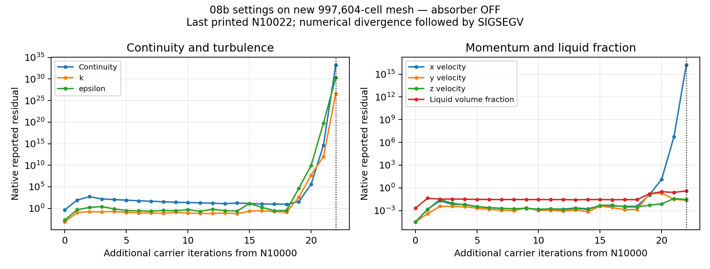

# Stage 2 — 08b settings on new 997k, OFF continuation

| Item | Result |
| --- | --- |
| Status | Numerical divergence followed by solver SIGSEGV and server shutdown |
| Mesh | New 997,604-cell mesh; original 7,601,261-cell mesh replaced |
| Settings | Original 08b models/numerics/inlet rates verified before solve; SIMPLE; first-order k |
| Absorber | OFF; no lower partition; all phase/mixture cell-source flags OFF |
| Start | Verified transferred N10000 data; no initialization |
| Requested run | 2,000 additional carrier updates, N10000→N12000 |
| Last printed coordinate | N10022; 22 additional updates observed; exact crash coordinate unavailable |
| Target reached | No |
| Failure signal | SIGSEGV reported on solver nodes 8 and 9; Fluent process ended abnormally; server shutdown |
| Solver response | Large continuity and turbulence residual growth preceded the crash |
| Last usable checkpoint | Prepared N10000 case/data pair, save/reopen verified |
| Scheduled in-run autosave | First at N10100 not reached; recovered autosave directory verified empty |
| Failed-state save | No failed-state pair; crash ended the solver before preservation |
| Host terminal evidence | Recovered controller/job manifests, complete native transcript and all17 report files after user restart |
| Scope limit | Failure of this mesh/settings/transferred-start route; no universal numerical-impossibility claim |

Recovered complete native transcript, N10000–N10022; 23 raw rows. No smoothing.

| Native iteration | Additional updates | Continuity residual | k residual | Epsilon residual |
| --- | ---: | ---: | ---: | ---: |
| N10019 | 19 | 3.5472e1 | 3.3163e2 | 4.4509e4 |
| N10020 | 20 | 3.7701e5 | 5.1822e7 | 8.6412e9 |
| N10021 | 21 | 4.3944e14 | 1.0117e12 | 5.6686e19 |
| N10022 | 22 | 1.9227e33 | 3.9481e26 | 2.1428e30 |

| Interpretation / next action | Limit or action |
| --- | --- |
| Numerical adequacy | Failed; the final state cannot support separator flow/separation claims |
| Crash classification | Numerical divergence precedes a solver-process crash; the precise SIGSEGV cause is not established |
| Source of instability | Not isolated; mesh replacement, interpolated fields and original08b physics/numerics remain possible contributors |
| Comparison | This is a developed-field continuation; prior Stage2 trials started fresh; no isolated absorber/numerical-setting contrast |
| Recovery | N10000 start restored on restartedServer2; absorberOFF and fixedsettings verified; no new solves |
| Further solves | None issued; no restart, repeat or changed numerical trial selected |
| Monitor | Owned Mac monitor stopped after active-chat reconciliation; no Fluent or Windows controller process terminated |

| Evidence | Location |
| --- | --- |
| Run contract | [Setup](setup.md) |
| Prepared pair/settings | [Build](../../../../../../PyAnsys/output/phase8-stage2/20261007/08b-native997k/run2000-off/build.json) |
| Captured native stream | [Complete recovered transcript](../../../../../../PyAnsys/output/phase8-stage2/20261007/08b-native997k/run2000-off/raw/recovered-host-native-transcript.txt) |
| Terminal reconstruction | [Failure receipt](../../../../../../PyAnsys/output/phase8-stage2/20261007/08b-native997k/run2000-off/observed-failure-receipt.json) |
| Captured residual data | [CSV](../../../../../../PyAnsys/output/phase8-stage2/20261007/08b-native997k/run2000-off/captured-residuals.csv) |
| Original transfer | [Transfer result](../results.md) |

| Restart recovery | Verified result |
| --- | --- |
| Session | User restarted Server2; attach to empty session; verified start pair restored |
| Current loaded state | 08b settings on new997604 mesh atN10000; all cell sourcesOFF |
| Report files | All17 recovered; samples N10000,N10010,N10020 |
| Maximum speed atN10010 | 424.7916 m/s |
| Maximum speed atN10020 | 2.0099978e11 m/s; unusable numerical state |
| Liquid mass | 325.83015 kg atstart; 320.65234 kg atN10010; 320.63907 kg atN10020; no steady/storage-rate claim |
| Next diagnostic | Fresh initialization proposed to isolate transferred-start contribution; user choice pending |
| Recovery proof | [Receipt](../../../../../../PyAnsys/output/phase8-stage2/20261007/08b-native997k/run2000-off/restart-recovery-receipt.json) |
| Recovered histories | [Native histories](../../../../../../PyAnsys/output/phase8-stage2/20261007/08b-native997k/run2000-off/recovered-report-histories.json) |
| Autosave inventory | [Recovered directory check](../../../../../../PyAnsys/output/phase8-stage2/20261007/08b-native997k/run2000-off/recovered-autosave-inventory.json) |
