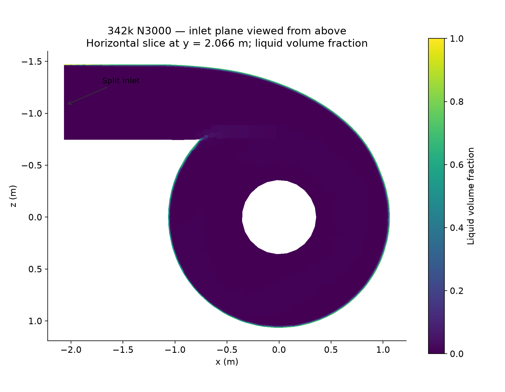
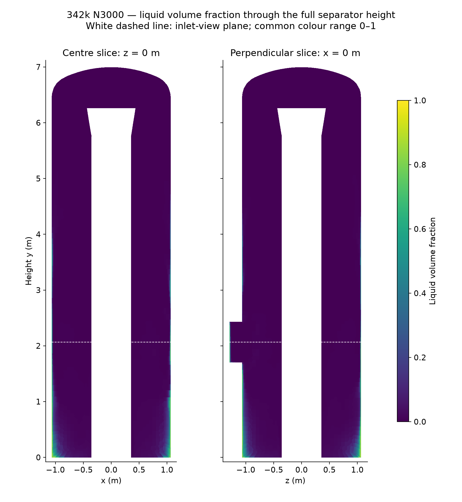
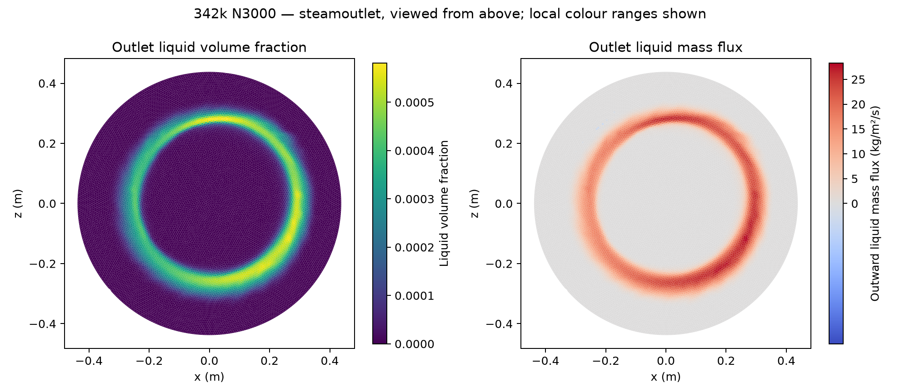
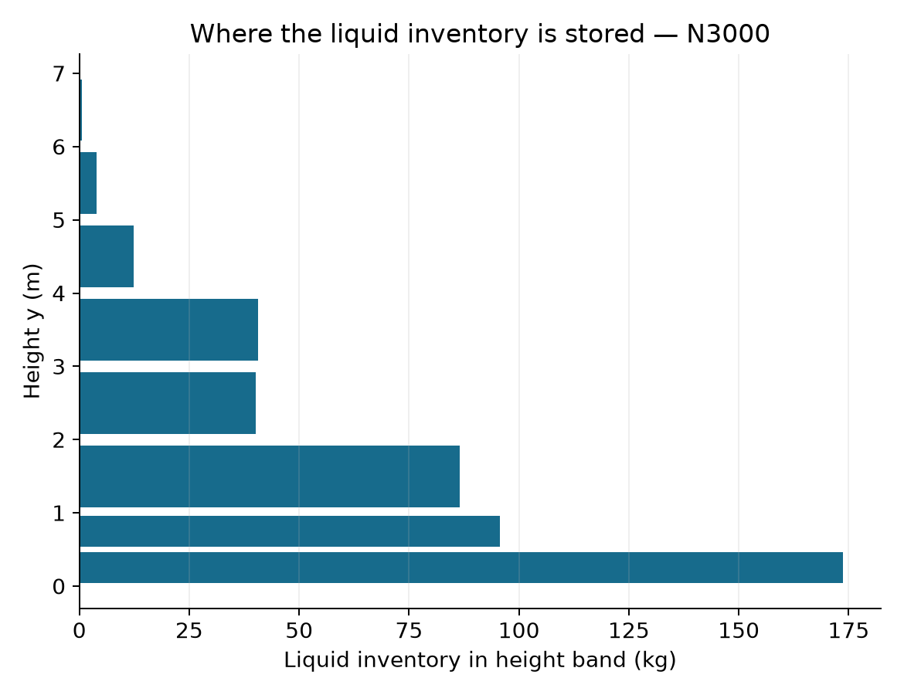
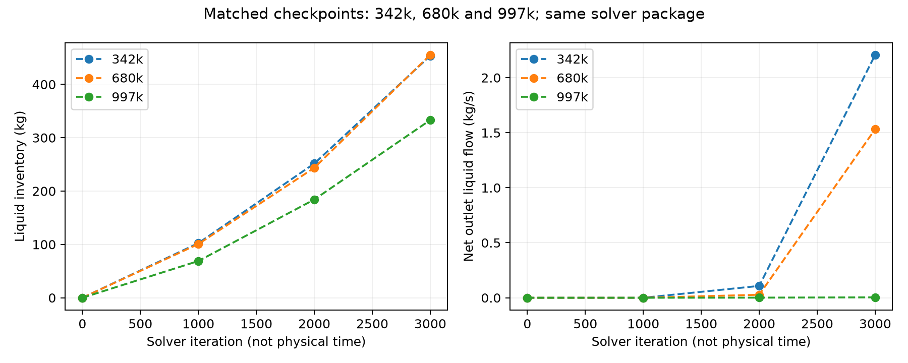
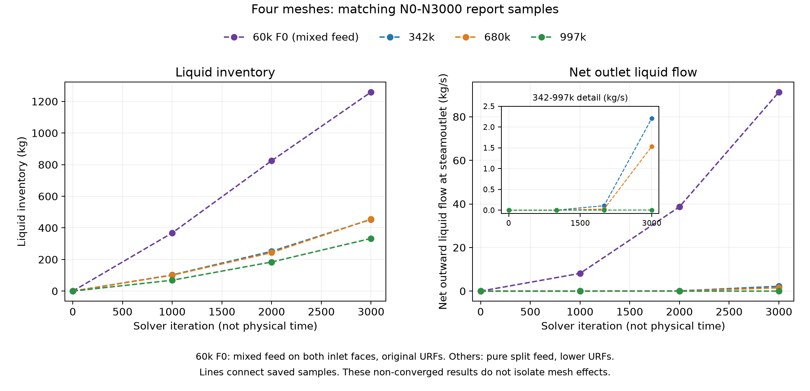
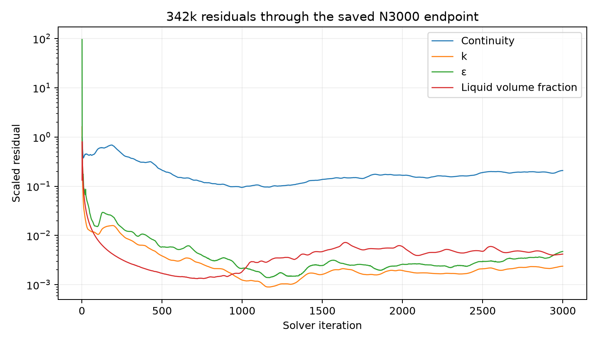

# Phase 8 Stage 2 - 342k separator at N3000

| Item | Result / limit |
| --- | --- |
| Mesh | 342,609 cells |
| Run | 3000 native iterations; paired N1000/N2000/N3000 checkpoints; final pair reopened; no recorded fatal/numerical errors |
| Setup | F0 60,964-cell settings parent; native mesh replacement; fresh Hybrid N0; full pure split feed; same methods and controls as 680k; no absorber; closed bottom |
| Convergence | Not established: inventory keeps increasing, liquid balance error remains large and continuity residual is 0.20837. |
| Final verification | Figures checked; local and shared final-pair hashes match; owned Fluent/controller closed; watcher paused; no further iterations selected. |

## Endpoint measures

| Quantity | N3000 |
| --- | ---: |
| Liquid inventory | 453.612255 kg |
| Liquid volume | 0.514760 m³ |
| Fluid volume | 22.773255 m³ |
| Mean liquid fraction | 0.02260371 (2.2604%) |
| Native phase-2 steamoutlet report | -2.207997150 kg/s |
| Net outward liquid flow | 2.207997150 kg/s |
| Liquid inlet minus net outlet | 114.712003 kg/s |
| Mixture inlet minus net outlet | 113.967031 kg/s |
| Reverse mixture-flow outlet area | 38.06% |
| Liquid inventory below y = 1 m | 269.425266 kg (59.40%) |
| Continuity residual | 0.20837 |
| k / epsilon / liquid fraction residuals | 0.0023712 / 0.0047275 / 0.0041812 |

Native outlet reports are negative for outflow; outward values reverse that sign. Inventory uses liquid density 881.210876 kg/m³. Steady iterations are not seconds.

## Spatial views and comparison

*Horizontal liquid-fraction slice at y = 2.066 m, viewed from above; white regions lie outside the fluid slice.*

*Two perpendicular full-height liquid-fraction slices, with a common 0-1 range and a separate colour scale.*

*Outlet liquid fraction and outward mass-flux density; local colour ranges differ from the whole-height range.*

*Inventory in height bands, from native cumulative volume integrals.*

*Matching saved iterations across three meshes; numerical state differences alone do not establish mesh independence.*

| Measure at N3000 | 342k | 680k | 997k |
| --- | ---: | ---: | ---: |
| Liquid inventory (kg) | 453.612255 | 455.408865 | 333.141900 |
| Net liquid outlet flow (kg/s) | 2.207997 | 1.532131 | 0.003622881 |

The 342k and 680k inventories differ by 0.39%, while their liquid outlet flows differ by 44.1% relative to 680k. Their similar inventory alone does not establish a mesh-independent solution.

*Matching N0, N1000, N2000 and N3000 samples, with an inset for the newer meshes' outlet flow. The 60k F0 history uses mixed-phase feed on both faces and original URFs, while the newer runs use pure split feed and lower URFs; this comparison does not isolate mesh effects.*

| N3000 measure | 60k F0 | 342k | 680k | 997k |
| --- | ---: | ---: | ---: | ---: |
| Liquid inventory (kg) | 1259.338591 | 453.612255 | 455.408865 | 333.141900 |
| Net outward liquid flow at steamoutlet (kg/s) | 91.348905 | 2.207997 | 1.532131 | 0.003622881 |

[Four-mesh samples and source hashes](../../../../../../PyAnsys/output/phase8-stage2/direct-student-20261008/four-mesh-comparison/provenance.json). The 60k values come from the local historical F0 monitor files, retained under their original F1 artifact names.

*Native scaled residuals through the saved N3000 endpoint.*

## Claim limits and evidence

| Item | Limit / reference |
| --- | --- |
| Model interpretation | No validated drainage, separation-efficiency or physical-accuracy claim. No liquid bottom outlet is present. |
| Mesh comparison | Same iteration count is not a converged comparison. Discretized geometry and local mesh quality may also differ. |
| Evidence | [Manifest](../../../../../../PyAnsys/output/phase8-stage2/direct-student-20261008/342-n3000/manifest.json); native reports, hashes, scripts and transcript retained under raw/ |
| Further solves | None selected beyond N3000. |
