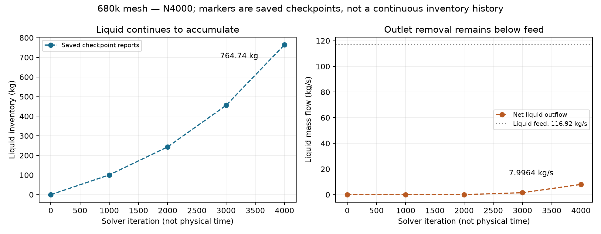
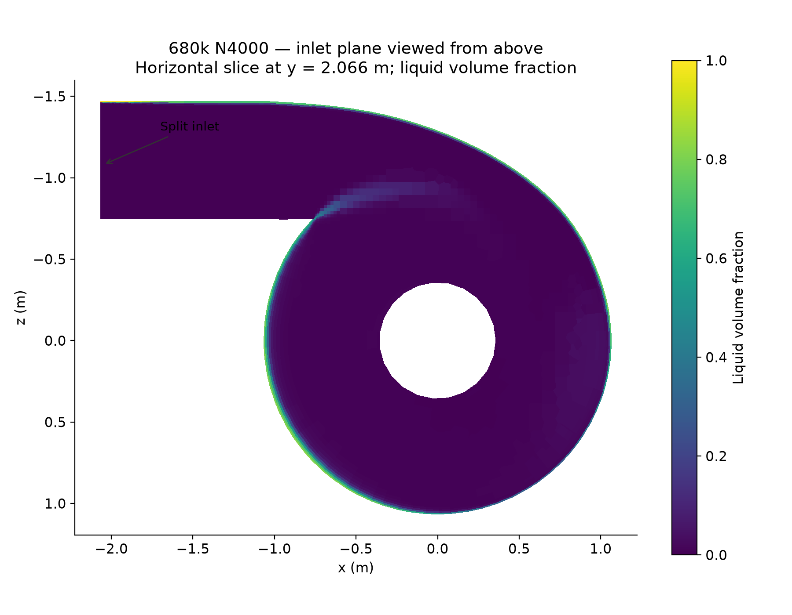
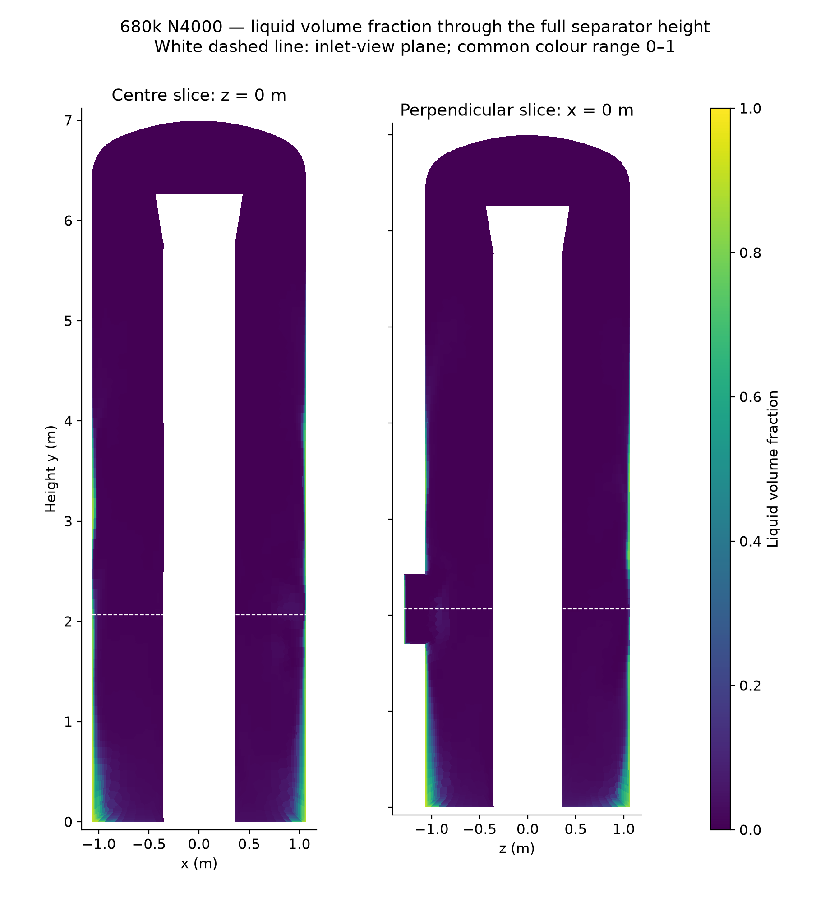
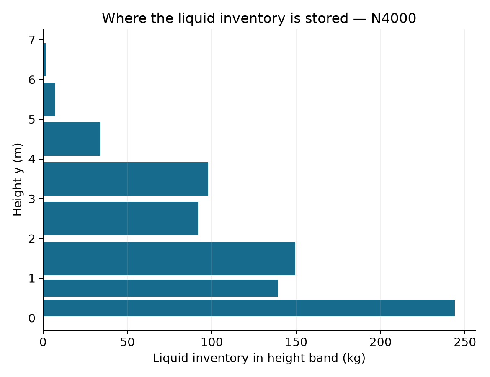
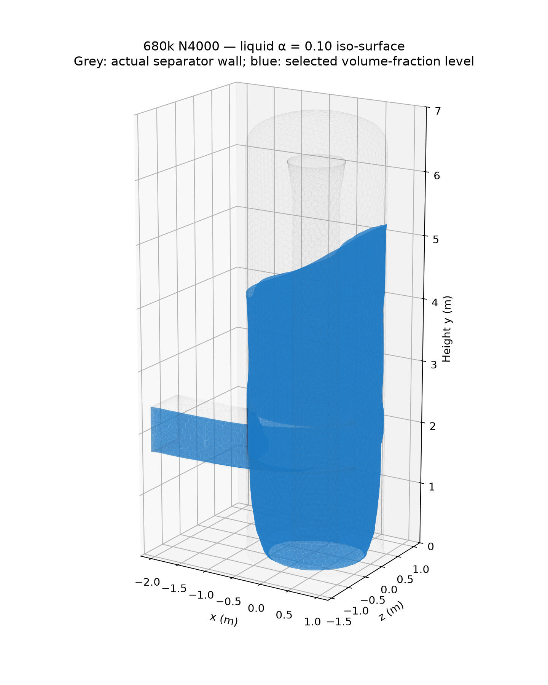
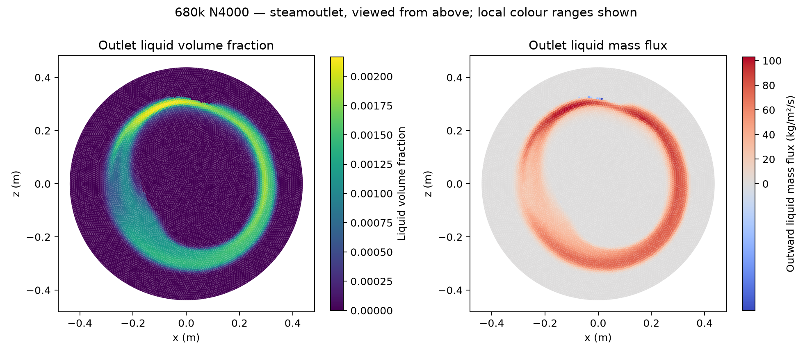
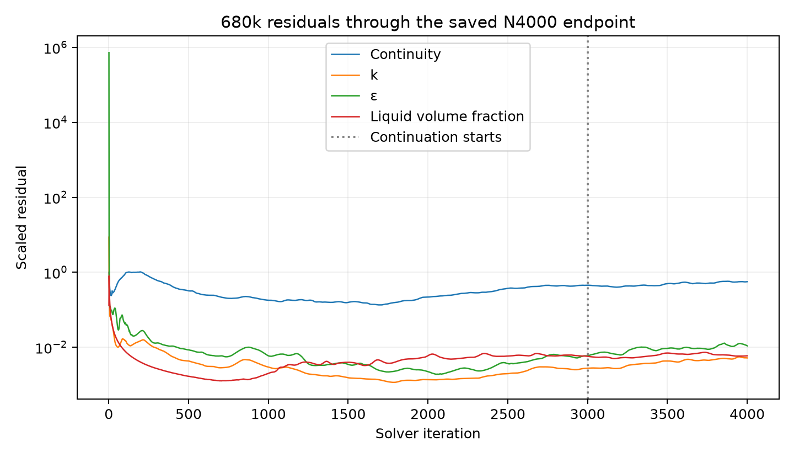

# Phase 8 Stage 2 — 680k separator at N4000

## Result and status

| Question | Result / limit |
| --- | --- |
| What does N4000 show? | Liquid accumulates near the outer wall and lower separator. Inventory and steam-outlet liquid flow increase across the saved checkpoints. |
| Is this converged? | No. Inventory change, mass-balance error and residuals remain large. This is a numerical diagnostic snapshot. |
| Was N4000 verified? | The 679,970-cell case/data pair was saved, reopened and checked. Analysis reports match the checkpoint; source hashes are unchanged. |
| What happened later? | The original continuation failed with AMG divergence and a floating-point exception after the last printed iteration N4211. No N5000 checkpoint was obtained. |
| Current status | The unchanged restart was stopped by Shuhei. The watcher is paused; all owned Fluent processes are closed. N6000 was not reached. |
| Analysis integrity | No initialization or solve was issued during postprocessing. |

## Case and numerical controls

| Item | N4000 setup |
| --- | --- |
| Lineage | Archived F0 settings parent, with historical F1-labelled artifacts; native mesh replacement, fresh Hybrid initialization and full feed from N0 |
| Mesh / execution | New split-inlet mesh, 679,970 cells; local HOME-DESKTOP-SH, Fluent 2025 R2 Student, double precision, four threads |
| Models | Steady pressure-based Mixture; phase 1 steam, phase 2 liquid; RNG k–epsilon, standard wall functions; energy off |
| Feed | Pure liquid at liquidinlet: 116.92 kg/s; pure steam at steaminlet: 80.69 kg/s; cross-phase inlet feeds zero |
| Coupling | SIMPLE; pseudo time off |
| Spatial schemes | Green–Gauss node-based gradients; PRESTO pressure; second-order momentum, k and epsilon; QUICK volume fraction |
| Under-relaxation | Pressure 0.2; momentum 0.4; k and epsilon 0.5; volume fraction 0.2; drift velocity 0.1 |
| Other controls | Warped-face correction on; bulk surface tension and turbulence compressibility correction off; Schiller–Naumann drag, Manninen slip; liquid diameter 10 µm |
| Removal / walls | No absorber or source removal; EWF off; DPM feedback off and no injections; smooth no-slip walls and closed bottom |
| Continuation | N3000 to N4000 without initialization or changes to scientific settings |

This F0-derived package is not an exact repeat of archived 08b. Historical comparisons must retain the differences in parent, inlet topology, mesh and controls.

## Liquid inventory and flow

| Quantity | N4000 |
| --- | ---: |
| Liquid inventory, ∫ ρₗαₗ dV | 764.744 kg |
| Increase from N3000 | 309.335 kg |
| Liquid volume, ∫ αₗ dV | 0.867833 m³ |
| Fluid-domain volume | 22.776175 m³ |
| Volume-averaged liquid fraction | 0.038103 (3.8103%) |
| Native phase-2 steamoutlet mass-flow report | −7.996405 kg/s |
| Net outward liquid flow | 7.996405 kg/s (6.84% of liquid feed) |
| Gross outward / inward liquid flow | 7.997438 / 0.001033 kg/s |
| Liquid inlet minus net outlet | 108.923595 kg/s |
| Net outward steam flow | 81.396239 kg/s |
| Net outward mixture flow | 89.396513 kg/s |
| Mixture inlet minus net outlet | 108.213487 kg/s |

Native outlet reports use negative values for outflow. Here, outward flow is positive; inventory uses liquid density 881.210876 kg/m³. The imbalance is a steady-solver diagnostic, not a physical accumulation rate derived from iteration count.

*Figure 1. Native reports at five saved checkpoints from N0 to N4000; dashed lines connect checkpoints only. Neither inventory nor liquid outlet flow has reached a stable endpoint.*

## Liquid distribution

*Figure 2. N4000 horizontal slice at y = 2.066 m, viewed from above. Liquid enters through a narrow inlet region and forms a liquid-rich band near the outer wall; white regions lie outside the fluid slice.*

*Figure 3. N4000 full-height slices at z = 0 and x = 0, with a common 0–1 range and a separate colour scale. Liquid-rich regions occur near the wall and base; these two slices do not sample every cell.*

| Height region from y = 0 | Cumulative liquid mass | Share of total |
| --- | ---: | ---: |
| Below 0.5 m | 243.902 kg | 31.89% |
| Below 1 m | 382.845 kg | 50.06% |
| Below 2 m | 532.382 kg | 69.62% |
| Below 4 m | 722.046 kg | 94.42% |

*Figure 4. Height-band inventories from differences between native cumulative volume-integral reports. Most inventory lies below the inlet-view plane.*

*Figure 5. Native αₗ = 0.10 isosurface with separator wall geometry. Blue marks a concentration level; it does not define a filled pool, free surface or wall-film model.*

## Steam outlet and reverse flow

| Outlet diagnostic | N4000 |
| --- | ---: |
| Area-averaged liquid fraction | 0.00030456 (0.03046%) |
| Maximum sampled liquid fraction | 0.00216517 (0.21652%) |
| Outlet area | 0.602572 m² |
| Faces with reverse mixture flow | 4,178 of 11,025 |
| Area with reverse mixture flow | 36.31% |

*Figure 6. N4000 outlet polygons coloured by liquid fraction and outward liquid mass-flux density. The local fraction scale differs from Figures 2–3; dilute outlet liquid can still carry a measurable mass flow.*

Reverse mixture flow covers a substantial outlet area. This differs from the much smaller gross inward **liquid** flow. Exported face fluxes reproduce the native net liquid report; HDF5 phase-3 maps to Fluent phase-2 liquid, verified from density and flux.

## Numerical behaviour and claim limits

*Figure 7. Native residual history through N4000; the guide marks the N3000 continuation boundary. The later failed continuation is excluded.*

| Scaled residual | N4000 |
| --- | ---: |
| Continuity | 0.56232 |
| x / y / z velocity | 0.00031774 / 0.00025615 / 0.00032067 |
| k / epsilon | 0.0051983 / 0.010924 |
| Volume fraction | 0.0059126 |

| Evidence / uncertainty | Interpretation limit |
| --- | --- |
| Finite, reopened field | Supports checkpoint inventory, flux and spatial descriptions; does not establish convergence. |
| Large imbalance and increasing inventory | Preclude steady efficiency or drainage claims. The closed bottom has no liquid removal path in this setup. |
| Steady iteration history | Iterations are not seconds; inventory changes cannot be converted into physical storage rates. |
| Later AMG divergence and floating-point failure | Establish a failed continuation; do not isolate the root cause or prove all absorber-off setups must fail. |
| Slices and isosurfaces | Show selected spatial features. Whole-domain inventory and mean fraction come from volume integrals. |
| Historical case differences | No isolated mesh-error, mesh-independence or physical-validation claim is supported. |

## Evidence and disposition

| Evidence | Reference |
| --- | --- |
| Source pair identity, SHA-256 and archived file hashes | [Manifest](../../../../../../PyAnsys/output/phase8-stage2/direct-student-20261008/680-n4000/manifest.json) |
| Reopened reports, volume integrals, surfaces and integrity | [Verified analysis](../../../../../../PyAnsys/output/phase8-stage2/direct-student-20261008/680-n4000/raw/analysis.json) |
| Checkpoints, outlet face fluxes and numerical diagnostics | [Offline analysis](../../../../../../PyAnsys/output/phase8-stage2/direct-student-20261008/680-n4000/raw/offline-analysis.json) |
| Failed original continuation | [Run record](../../../../../../PyAnsys/output/phase8-stage2/direct-student-20261008/680-n4000/raw/failed-original-run.json), [native transcript](../../../../../../PyAnsys/output/phase8-stage2/direct-student-20261008/680-n4000/raw/N3000-N4211-native.trn) |
| User stop and owned-process closure | [Stop record](../../../../../../PyAnsys/output/phase8-stage2/direct-student-20261008/680-n4000/raw/user-stop-owned-processes.json) |
| Corrected full-height figure | [Renderer](../../../../../../PyAnsys/output/phase8-stage2/direct-student-20261008/680-n4000/render_full_height_v2.py); saved native surfaces unchanged |

The preserved endpoint is `680-continuation-N4000.cas.h5` / `680-continuation-N4000.dat.h5` in `C:\Users\Shuhei Yokkaichi\Documents\CFD\FluentDirectUse\680-extend-20261008`. Matplotlib figures use native Fluent surfaces, scalar fields and reports.

| Next action | Status |
| --- | --- |
| Further iterations or retries | Stopped by Shuhei; do not resume automatically. |
| Report use | Evidence of liquid accumulation and numerical imbalance at N4000, subject to the limits above. |
