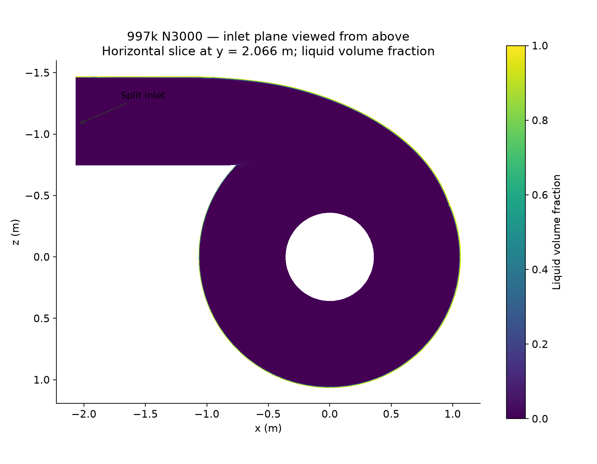
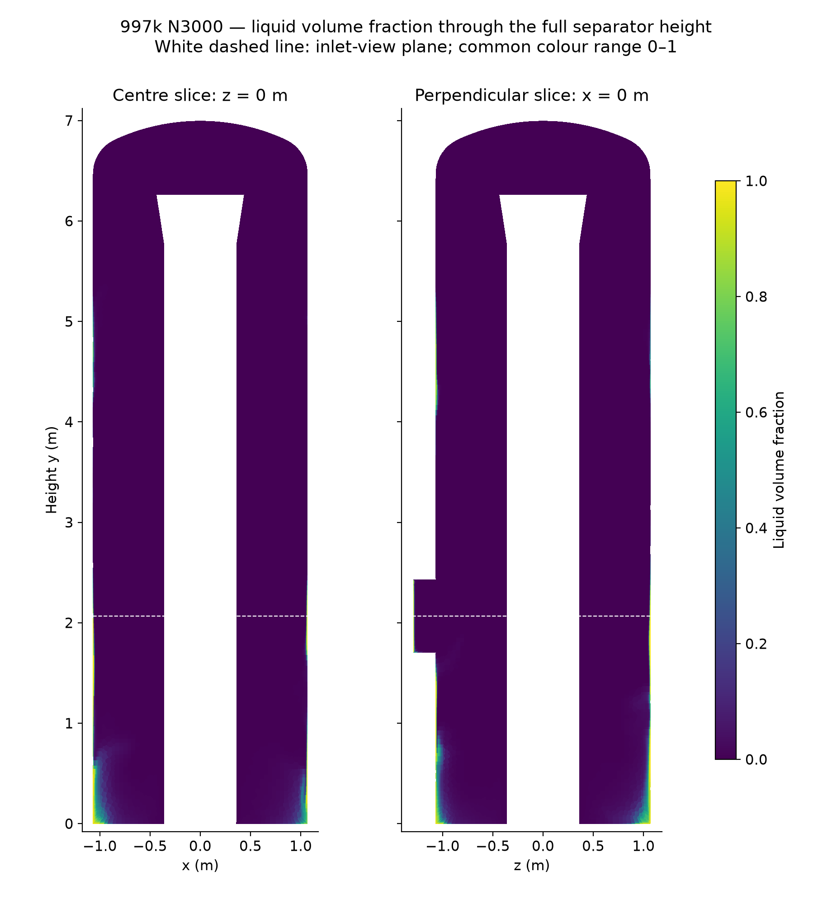
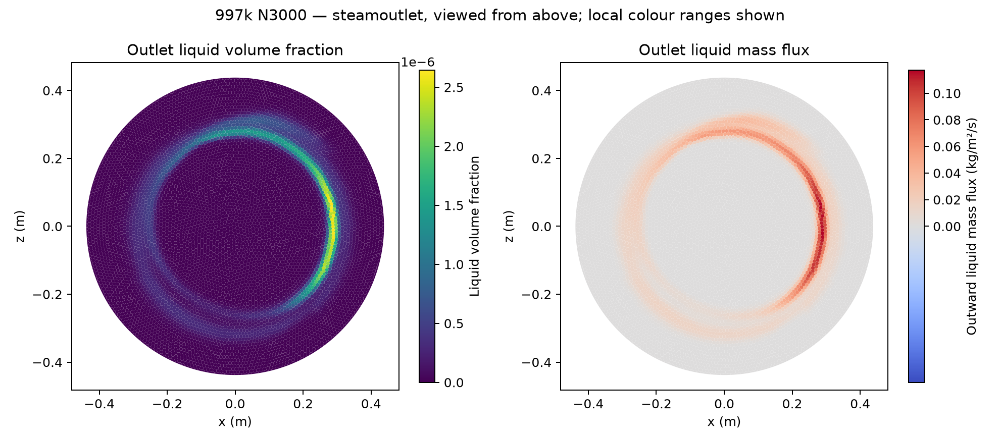
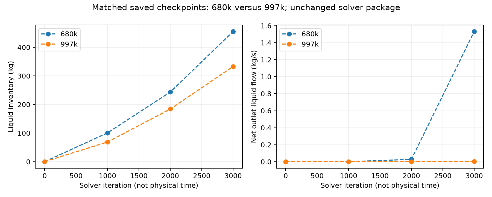
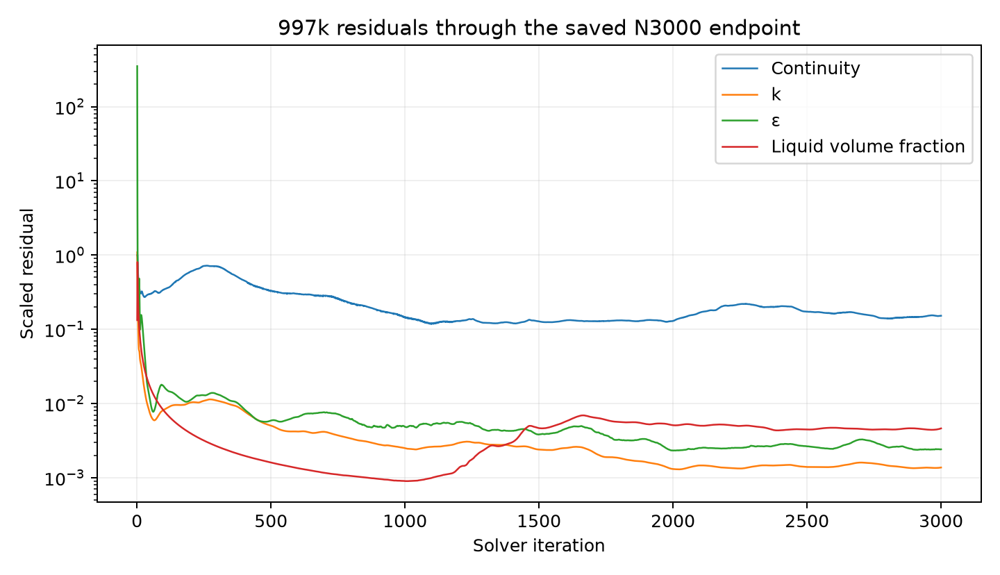

# Phase 8 Stage 2 — 997k separator at N3000

| Question | Result / limit |
| --- | --- |
| Saved endpoint | 997,604 cells at N3000; successful repeat saved and reopened, with all 3,000 native iteration rows and no recorded numerical/fatal errors |
| Liquid behaviour | Inventory continues to rise. Liquid-rich regions occur near the outer wall and lower separator; steam-outlet liquid flow remains very small. |
| Convergence | Not established. Large liquid balance error and changing inventory remain despite completion of N3000. |
| Analysis | Hash-verified original case/data reopened locally; native reports match the checkpoint. No solve or initialization issued; analysis session closed. |
| Setup | Same lower-URF SIMPLE package as 680k: PRESTO pressure, second-order momentum/k/epsilon, QUICK volume fraction, pseudo time off; full pure split feed from fresh Hybrid N0; no absorber, closed bottom |

## Inventory, volume fraction and flux

| Quantity | 997k N3000 |
| --- | ---: |
| Liquid inventory | 333.141900 kg |
| Inventory increase from N2000 | 148.984225 kg |
| Liquid volume | 0.378050 m³ |
| Fluid volume | 22.793406 m³ |
| Volume-averaged liquid fraction | 0.01658594 (1.6586%) |
| Native phase-2 steamoutlet mass-flow report | −0.003622881 kg/s |
| Net outward liquid flow | 0.003622881 kg/s (0.00310% of liquid feed) |
| Liquid inlet minus net outlet | 116.916377 kg/s |
| Steam outlet, net outward | 81.450333 kg/s |
| Mixture inlet minus net outlet | 116.156043 kg/s |
| Outlet area with reverse mixture flow | 33.67% |
| Maximum / area-average outlet liquid fraction | 2.64312 × 10⁻⁶ / 1.36449 × 10⁻⁷ |
| Liquid mass below y = 1 m | 230.395879 kg (69.16%) |
| Liquid mass below y = 2 m | 289.031772 kg (86.76%) |

Inventory is ∫ρₗαₗdV, with ρₗ = 881.210876 kg/m³. Native outlet reports are negative for outflow; the net outward values above reverse that sign. Exported outlet face fluxes reproduce the native net report.

*Figure 1. Native N3000 plane at y = 2.066 m, rendered with Matplotlib. The liquid-rich band follows the inlet edge and outer wall; white regions lie outside the fluid slice.*

*Figure 2. Two perpendicular full-height slices, using the same 0–1 scale as the 680k report. Most fluid away from the wall is dilute; these slices do not represent every cell.*

*Figure 3. Outlet liquid is dilute and its outward flux follows an annular region. The local fraction range is much smaller than the full-height range.*

## Matched comparison with 680k

| Quantity at N3000 | 680k | 997k |
| --- | ---: | ---: |
| Liquid inventory | 455.408865 kg | 333.141900 kg |
| Net steam-outlet liquid flow | 1.532131 kg/s | 0.003622881 kg/s |
| Liquid feed | 116.92 kg/s | 116.92 kg/s |

*Figure 4. Matching saved iterations and solver package. The 997k endpoint holds 26.8% less liquid, but its outlet liquid flow is about 423 times smaller; both inventories are still increasing.*

| Comparison limit | Meaning |
| --- | --- |
| Both endpoints remain non-converged | The differences do not establish mesh independence or a more accurate separation result. |
| Equal iterations are not equal physical time | These are steady-solver histories, not transient residence-time comparisons. |
| Different discretized fluid volumes | 680k: 22.776175 m³; 997k: 22.793406 m³. Exact geometric parity has not been proved. |
| Very low liquid outlet flow with no bottom drain | Do not treat low carryover alone as validated separator efficiency; liquid inventory is growing and balance closure fails. |

## Residuals and disposition

*Figure 5. Native successful-repeat history, N1–N3000. Continuity remains high and the liquid-fraction residual does not continue its early decrease.*

| Scaled residual at N3000 | Value |
| --- | ---: |
| Continuity | 0.15208 |
| x / y / z velocity | 0.00011423 / 0.00011212 / 0.00010973 |
| k / epsilon | 0.0013713 / 0.0024111 |
| Liquid volume fraction | 0.0046136 |

| Evidence / next action | Reference / status |
| --- | --- |
| Source hashes, copied figures and raw evidence | [Manifest](../../../../../../PyAnsys/output/phase8-stage2/direct-student-20261008/997-n3000/manifest.json) |
| Reopened native reports and volume integrals | [Analysis](../../../../../../PyAnsys/output/phase8-stage2/direct-student-20261008/997-n3000/raw/analysis.json) |
| Outlet faces, checkpoints and residual values | [Offline analysis](../../../../../../PyAnsys/output/phase8-stage2/direct-student-20261008/997-n3000/raw/offline-analysis.json) |
| Run completion and settings | [Successful repeat](../../../../../../PyAnsys/output/phase8-stage2/direct-student-20261008/997-n3000/raw/997-success.json) |
| 680k later endpoint | [N4000 report](../../direct-student-680k/n4000/results.md); excluded from the matched N3000 table |
| Further solves | None issued or selected; runs remain stopped. |

The source pair is `997-exact-repeat02-N3000.cas.h5` / `997-exact-repeat02-N3000.dat.h5` in the existing OneDrive `P4P-Fluent-Artifacts/Phase8/DirectStudent-FineMesh-20261007` folder. The first attempt's disk-space failure is separate from this completed repeat.
