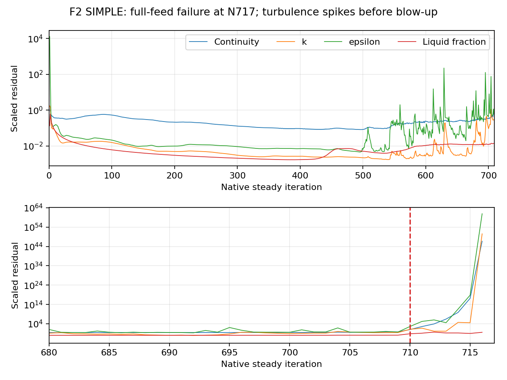
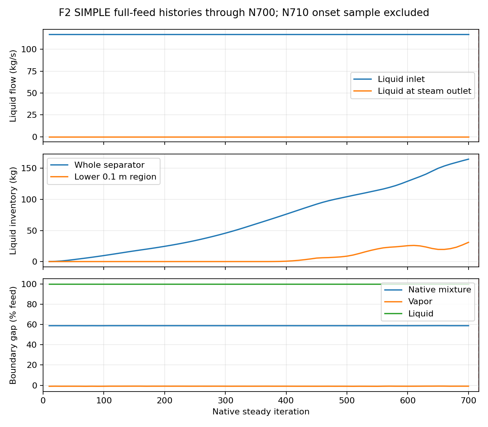

# Phase 8 Stage 2 — fresh full-feed failure

| Item | Verified evidence |
| --- | --- |
| Trial | Fresh Hybrid at full feed; F2 SIMPLE; 997,604 cells; Server 2 |
| Requested horizon | 3000 new-trial updates |
| Outcome | Floating-point exception at native N717; first 1000-iteration block incomplete |
| Feed throughout | Liquid 116.93872650 kg/s; vapor 80.70292372 kg/s; nominal 26.81 m/s label |
| Saved pre-failure fields | Fresh N0 only; failure occurred before planned N1000 checkpoint |
| Failed field | N717 diagnostic-only case/data saved locally; both hashes independently verified |
| Live state | Failed N717 retained; no further solve, initialization or case replacement during diagnosis |
| Histories | All 17 reports through N710; residual rows through N716; failed native counter N717 |
| Earlier ramp trial | [Failed at N1422; usable pre-ramp N1000 checkpoint](../results.md) |
| Evidence | [Failure analysis](../../../../../PyAnsys/output/phase8-stage2/20261007/full-feed3000/failure-analysis.json), [preservation verification](../../../../../PyAnsys/output/phase8-stage2/20261007/full-feed3000/failure-preservation-verification.json), [host run manifest](../../../../../PyAnsys/output/phase8-stage2/20261007/full-feed3000/host-run-manifest.json) |

| Quantity | N600 | N700 |
| --- | ---: | ---: |
| Whole-separator liquid inventory, kg | 129.306 | 164.730 |
| Lower 0.1 m liquid inventory, kg | 25.549 | 30.953 |
| Liquid steam-outlet flow, kg/s | 1.45147e-06 | 3.33572e-06 |
| Signed liquid boundary gap, % feed | 99.999999 | 99.999997 |
| Scaled continuity residual | 0.24060 | 0.36435 |
| Scaled epsilon residual | 0.061052 | 0.42342 |

Epsilon becomes erratic after approximately N500. Its sampled residual is 5.8546 at N630, 12.093 at N680, and 126.89 at N695. At N710 continuity reaches 10.636 and epsilon reaches 414.87. Continuity, turbulence and momentum then diverge by many orders of magnitude. The exception at N717 is a solver failure; the controller stopped and preserved its evidence.

Liquid inventory continues to increase. At N700 the liquid steam-outlet flow is only 3.3357e-6 kg/s against 116.9387 kg/s feed. The near-100% liquid boundary gap and increasing inventory do not support a stationary separation claim. Steady iteration is not physical time, so the inventory history cannot be used as a physical transient mass ledger.

| Comparison | Ramp trial | Fresh full-feed trial |
| --- | --- | --- |
| Failure counter | N1422 | N717 |
| Feed at failure | 62.5% | 100% throughout |
| Turbulence warning signature | Epsilon spikes before final ramp step | Epsilon spikes despite no ramp |
| Latest saved finite developed field | N1000 at 25% feed; unconverged | None after fresh N0 |
| Shared observation | Increasing liquid inventory and numerical divergence | Increasing liquid inventory and numerical divergence |
| Supported inference | A ramp is not required for failure; changing inlet startup alone did not produce a usable endpoint | Same |

| Remaining uncertainty / next diagnostic | Constraint |
| --- | --- |
| Exact onset cell and local fields | No pre-failure developed field in this trial; failed N717 field is diagnostic only |
| Numerical-control, mesh and flow-field contribution | Histories do not isolate a root cause or reject SIMPLE as an algorithm |
| Any next diagnostic trial | Use closer native autosaves within large solve batches; preserve current evidence and define the controlled numerical change first |
| Current action | Diagnosis complete; no new trial or continuation launched |
| Scientific limits | No N3000 result, convergence, mesh independence, physical validation or separation efficiency |
