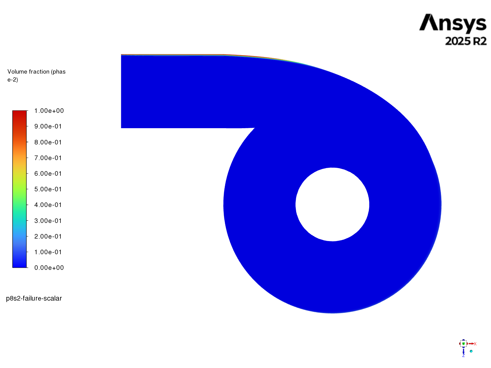
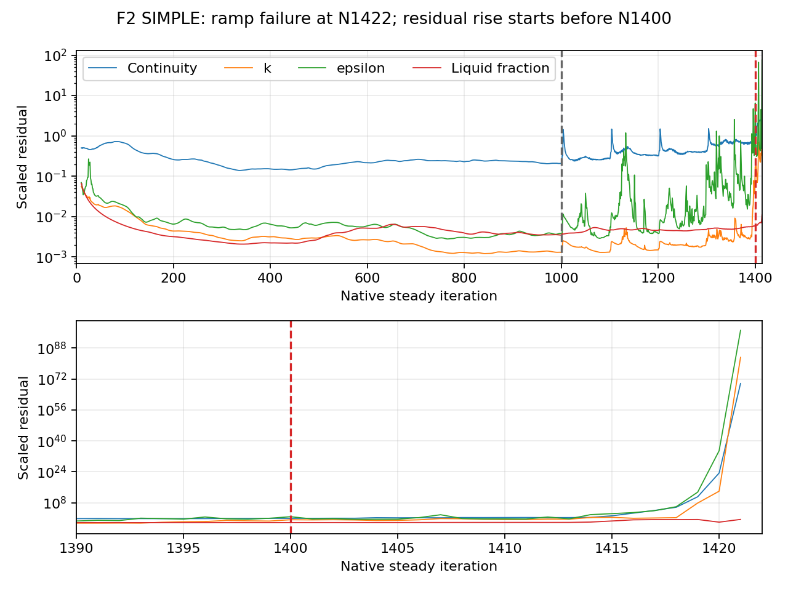
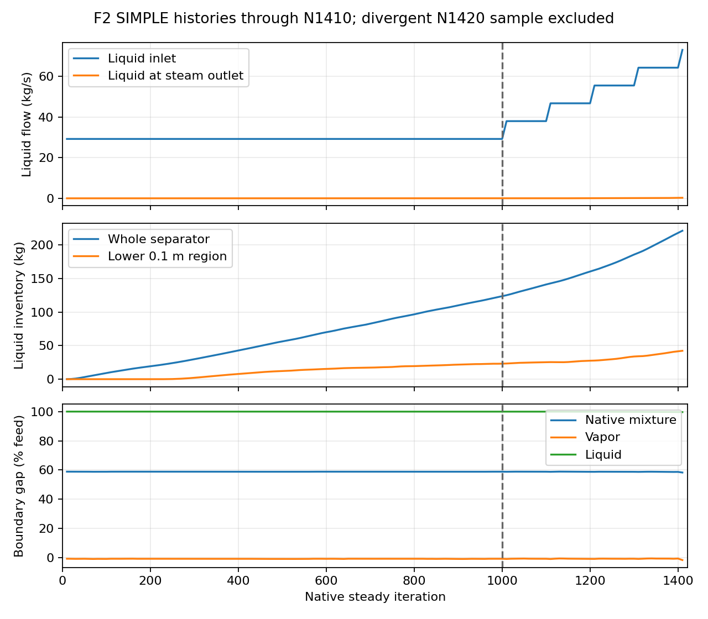

# Phase 8 Stage 2 — F2 SIMPLE ramp failure

This trial is retained as failed-run evidence. The active trial is [fresh full feed for 3000 iterations](full-feed3000/setup.md).

| Item | Verified evidence |
| --- | --- |
| Run | F2–SIMPLE; 997,604 cells; nominal full-feed label 26.81 m/s |
| Outcome | Floating-point exception at native N1422; full-feed hold and N5000 not reached |
| Failure interval | N1400–N1500 commanded at 62.5% feed; nominal speed label 16.75625 m/s |
| Completed blocks | Low-feed hold to N1000; ramp blocks to N1400 at 55% feed |
| Latest saved pre-failure field | N1000 case/data; both hashes match run receipt; reopened counter = 1000 |
| Failed field | N1422 preserved separately as diagnostic-only case/data; cannot support physical claims |
| Server 2 at inspection | N1000 loaded; no additional inspection solves issued; active work now follows the full-feed trial |
| Evidence | [Inspection receipt](../../../../PyAnsys/output/phase8-stage2/20261007/failure-inspection.json), [analysis](../../../../PyAnsys/output/phase8-stage2/20261007/failure-analysis.json), [native figure provenance](../../../../PyAnsys/output/phase8-stage2/20261007/failure-native-figures.json) |
| Source histories | All 17 report histories retained through N1420; native residual transcript through N1421; failed counter N1422 |
| Evidence gap | No saved N1100–N1400 field; N1000 cannot locate the exact instability-onset cells |
| F0 | Deferred for supplied single-inlet mesh |

| Quantity | N1000, 25% feed | N1400, 55% feed |
| --- | ---: | ---: |
| Liquid inlet, kg/s | 29.2347 | 64.3163 |
| Liquid at steam outlet, kg/s | 0.000982 | 0.21652 |
| Liquid at steam outlet, % feed | 0.00336 | 0.33665 |
| Whole-separator liquid inventory, kg | 123.732 | 218.043 |
| Lower 0.1 m liquid inventory, kg | 23.135 | 41.578 |
| Signed liquid boundary gap, % feed | 99.9966 | 99.6633 |
| Signed native mixture boundary gap, % feed | 58.7995 | 58.6596 |
| Scaled continuity residual | 0.20757 | 0.91263 |
| Scaled epsilon residual | 0.0038146 | 6.4924 |

The low-feed field is finite but unconverged. Liquid inventory is still increasing; its N900–N1000 slope is 0.13586 kg per steady iteration. Near-zero liquid outlet flux does not establish successful separation. The closed bottom has no liquid-removal path. Iteration-based inventory growth is not a physical transient mass ledger.

| Native N1000 view | Observation and limit |
| --- | --- |
| [Centre-plane liquid fraction](figures/N1000-liquid-vertical.png) | Most of the centre cut is dilute; liquid concentration is visible near the bottom. Fixed fraction range 0–1; a single plane does not show all wall liquid. |
| [Inlet-height liquid fraction](figures/N1000-liquid-inlet.png) | A thin liquid-rich band follows the outer inlet side and part of the outer vessel boundary. Plane Y=2.066 m; same 0–1 range. |
| [Centre-plane mixture speed](figures/N1000-velocity-vertical.png) | Acceleration near the upper inner-tube lip; speed magnitude does not prove velocity direction. |
| [Inlet-height mixture speed](figures/N1000-velocity-inlet.png) | Faster outer annular region and slower inner region; supports inspection of the inlet flow field. |

The epsilon residual rises above 1 at N1393, before the feed changes to 62.5% after N1400. It reaches 6.4924 at N1400. Continuity, turbulence and momentum then grow rapidly from approximately N1414–N1415. The log reports divergence in pressure correction, k, epsilon and the liquid-fraction equation, followed by a floating-point exception at N1422. This is a numerical divergence during the ramp; the histories do not establish the root cause or the onset cell.

| Next diagnostic use | Constraint |
| --- | --- |
| Inspect N1000 in Fluent | Saved source preserved; derived postprocessing objects only |
| Design a numerical recovery | Retain failed attempt and count its 1422 attempted updates; no continuation launched during this inspection |
| Interpret Stage 2 | No full-speed result, mesh independence, stationary pool, successful separation or physical-validation claim |
