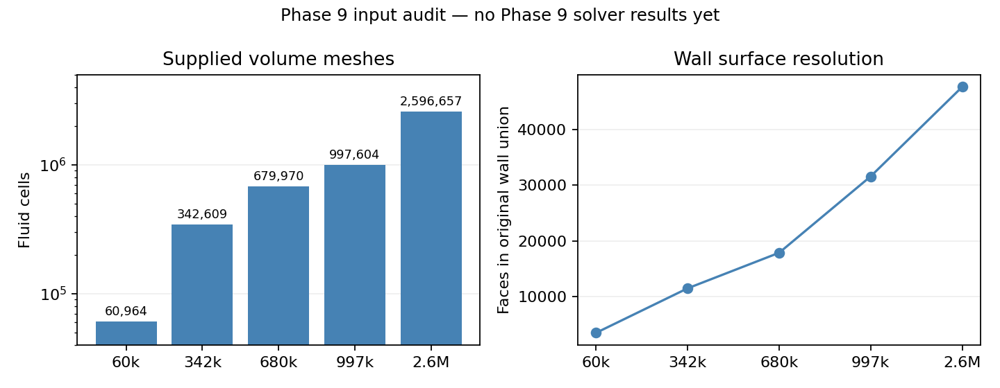

# Phase 9 — Current evidence

| Question | Current result |
| --- | --- |
| Phase started | Human envelope recorded; input audit complete |
| Meshes solved under Phase 9 | 60k prepared; selected final N8080. 342k preparation passed at N8580. 680k restored at verified N7080 after laptop pause; full-feed holds continue. 997k follows on Server 3; 2.6M belongs to Server 4. |
| Common template | Provisional Stage 4 settings; low-feed A bulk fields unchanged; dry film; save/reopen passed |
| 342k collector mapping | Native cell split and entry/wall topology verified; legacy replacement input saved |
| Transfer failure | Native Replace Mesh crashed Fluent with SIGSEGV; scientific experiment untested |
| Server 3 connection | User restarted Fluent; new configured endpoint connected to Fluent 2025 R2 |
| Retry status | Original E2.7 parent replacement passed; six DPM injections restored; provisional Stage 4 settings applied; save/reopen and native 342,609-cell verification passed |
| Previous Server 3 state | N5180 case/data preserved locally with hashes |
| Mesh files | All five readable; exact counts and hashes recorded |
| Coordinate scale | 342k file uses metre-sized coordinates; other four use millimetre-sized coordinates |
| Wall identity | Fine meshes split original wall into vessel/inlet components; physical mapping required |
| Native mesh scale/quality | 342k: metre extents and native mesh check passed; other meshes pending |
| Current action | Continue 680k full-feed holds from N7080, then prepare/run 997k. Server 3 excludes the 2.6M mesh. |
| Approved retained controls | Two smoothing passes, current reference values and current DPM tracking controls; no separate tracking pass |
| Bulk correction proof | Corrected common source and 342k saved/reopened with surface tension ON at exact 08b coefficient, compressibility flag ON and drag-modification flag ON |
| Legacy interaction | Human approved stored `none` as an inactive Mixture legacy exception |
| Session interruption | Temporary no-solve model-switch probe stopped Fluent; paired endpoints preserved; no exit command sent |
| Claim limit | Input audit is not solver verification or mesh convergence |

| Controller order review | Verification / result |
| --- | --- |
| Before a case load | Reject busy solver; check both case/data files before replacing the case |
| Pair load sequence | Case → UDF library → data → native iteration check |
| Run recovery | Reject pending `RUNNING` manifest before entering mesh preparation |
| Native batch transcript | One start/stop pair around solve; preserve original solver error if cleanup fails |
| Batch acceptance | Validate complete film rows, finite values, consecutive clock, fixed step, Courant and native error text before advancing verified endpoint |
| Paired checkpoint | Save locally → reopen → compare fields, setup, methods, bulk contract and film clock → promote endpoint |
| Temporary setup captures | Add/remove only their own stream callback; keep campaign live stream active across mesh changes |
| Final feed | Read and verify inlet values; no setter after final checkpoint save |
| File / controller collision | Unique batch and checkpoint paths; exclusive desktop controller lock before attach |
| Local verification | Python compilation and 12 tests passed; tests issue no Fluent calls |
| Resumed native batch | N3800→N3810 passed; accepted film clock 0.000222→0.000223 s; peak Courant 5.177948e-6. First transcript closed and second batch N3810→N3820 opened without the stop-transcript error. |
| Server 3 resume proof | Empty/idle server; N3800 case/data hashes match; restored fields/setup/methods/bulk contract/0.000222 s film clock match pause proof |
| Authority and limits | Reviewed Python campaign resumed by human instruction; Server 3 only; all bulk equations active; provisional EWF; native journal handover cancelled |
| Evidence | [Call-order review](../../../PyAnsys/output/phase9-mesh-convergence/20261007/call-order-review.json); [controller](../../../PyAnsys/scripts/setup/run_phase9_mesh_startup.py); [local tests](../../../PyAnsys/tests/test_phase9_call_order.py) |

| Mesh label | Actual fluid cells | File nodes | Low-feed hold updates | Ramp updates | Minimum full-feed hold updates |
| --- | ---: | ---: | ---: | ---: | ---: |
| 60k | 60,964 | 233,698 | 500 | 2000 | 1000 |
| 342k | 342,609 | 1,077,053 | 1000 | 2000 | 2000 |
| 680k | 679,970 | 1,764,797 | 1500 | 2000 | 3000 |
| 997k | 997,604 | 3,177,646 | 1500 | 2000 | 3000 |
| 2_6M | 2,596,657 | 6,195,886 | 2000 | 2000 | 4000 |

| Evidence | Location |
| --- | --- |
| Mesh identities | [input audit](../../../PyAnsys/output/phase9-mesh-convergence/20261007/mesh-input-audit.json) |
| Parent topology | [parent audit](../../../PyAnsys/output/phase9-mesh-convergence/20261007/parent-mesh-audit.json) |
| Preservation | [Server 3 pair](../../../PyAnsys/output/phase9-mesh-convergence/20261007/server3-preservation.json) |

*Source: supplied CFF mesh files. Wall counts use the union of the original wall and newly named vessel/inlet wall zones. Input audit only.*

| Execution evidence | Location |
| --- | --- |
| Source template | [Verified low-feed template](../../../PyAnsys/output/phase9-mesh-convergence/20261007/source-template.json) |
| Failure and recovery state | [Campaign manifest](../../../PyAnsys/output/phase9-mesh-convergence/20261007/campaign-manifest.json) |
| Immutable native crash | [Transfer transcript](../../../PyAnsys/output/phase9-mesh-convergence/20261007/raw/native-replace-crash-342k/342k-transfer.txt) |

| Verification | Outcome |
| --- | --- |
| Python source compilation | Passed |
| Full-feed stability logic | Human revised limits: pressure-drop range <= 5%, bulk liquid-mass range <= 10%, steamoutlet liquid-flow range <= 5% of full inlet. Two consecutive 1000-update windows required; inclusive limits and rejection above each limit verified. This is a preparation screen. |
| Revised screen proof | [Current human limits and validation](../../../PyAnsys/output/phase9-mesh-convergence/20261007/hold-limits-current-human-change.json) |
| Later 60k numerical failure | N9080 to N10080 continuation stopped at N9519. Native transcript shows infinite film Courant, large film residuals, turbulence AMG divergence and floating-point exception. Failure case/data preserved. |
| 60k recovery basis | Restore verified N9080 pair; preserved completed windows pass the current human 5% / 10% / 5% preparation screen. Later divergence prevents any claim of sustained film stability. [Recovery evidence](../../../PyAnsys/output/phase9-mesh-convergence/20261007/60k-N9519-failure-recovery.json) |
| Accepted 60k preparation endpoint | Human selected the existing verified N8080 pair; 4000 full-feed updates. All 34 final report histories cover N1581–N8080; all four bulk equations active. Two completed windows pass the current 5% / 10% / 5% screen. N9080 and the failed continuation remain preserved. [Endpoint selection](../../../PyAnsys/output/phase9-mesh-convergence/20261007/60k-final-selection-N8080.json) |
| 342k smoke recovery | N1580–N1600 completed; the previous native transcript prevented creation of the requested transcript. Client stream proves 20 accepted film updates, paired N1600 reopen and all 34 report histories passed. Resume at N1600; no repeated solve. [Proof](../../../PyAnsys/output/phase9-mesh-convergence/20261007/342k-smoke-transcript-recovery.json) |
| Transcript sequence correction | Human requested immediate controller reload. New paired N2860 checkpoint passed save/reopen and field/settings/film-clock checks. Corrected controller completed N2860–N2870 and started the next batch with no transcript errors. Fluent stayed open; no rollback or repeated solve. [Live proof](../../../PyAnsys/output/phase9-mesh-convergence/20261007/transcript-sequence-live-verification.json) |
| Native common source | Save/reopen and low-feed bulk-field invariants passed |
| Native 342k geometry/topology | Metre scale, mesh check, collector adjacency and equivalent entry conditions passed |
| Native 342k transfer | Revised ordering passed replacement and injection recovery; child pair and full invariant receipt passed |
| Verification receipt | [Validation](../../../PyAnsys/output/phase9-mesh-convergence/20261007/validation.json) |

| Low-feed smoke check | Verified evidence |
| --- | --- |
| Native horizon | N1580 to N1600; 20 updates completed |
| Accepted film time | 2.0 microseconds; all steps 0.1 microsecond; saved/reopened time agrees |
| Peak film Courant | 9.406721e-8 during the short check |
| Reports | All 34 report histories cover N1581 through N1600 |
| Readback correction | Live Cortex archive held pre-solve clock; controller now uses accepted native transcript time between checkpoints and verifies the clock after paired reopen |
| Proof | [Smoke verification](../../../PyAnsys/output/phase9-mesh-convergence/20261007/60k-smoke-verification.json) |
| Limit | Short implementation check; no steady-film or mesh-convergence claim |

| Local controller | Current proof |
| --- | --- |
| Deployment | 367 files; verified extracted job; [deployment receipt](../../../PyAnsys/output/phase9-mesh-convergence/20261007/host-deployment.json) |
| Disk | 662 GiB free before launch |
| Launch | Prior host worker ended while connecting to old endpoint, before full-run solves; no active host worker remains |
| Desktop recovery route | Desktop controller launched through the working connection; checkpoints and native transcripts stay on Server 3 local disk; desktop must remain running |
| Recovery proof | [N1600 paired reopen](../../../PyAnsys/output/phase9-mesh-convergence/20261007/restart-N1600-reopen.json), [desktop controller](../../../PyAnsys/output/phase9-mesh-convergence/20261007/desktop-controller.json) |
| Session control | No Fluent exit or restart commands; one desktop campaign controller |

| Active campaign | Verified state |
| --- | --- |
| Controller | One desktop process; live native solve progress observed beyond N1600 |
| Active stage | 60k ramp; recovered N2580 pair verified; full feed begins at N4080 |
| Subsequent stages | 2000-update ramp, full-feed hold; then remaining four meshes |
| Controller dependency | Keep the desktop running; idle-sleep guard is active for the controller lifetime |
| Claim limit | Campaign started; five full-feed endpoints are not yet complete |

| N2580 recovery | Evidence / result |
| --- | --- |
| Stop cause | Exact setup comparison rejected native inlet-flow decimal rounding; vapor flow 34.999287499999994 → 34.99928749999999 kg/s |
| No-solve reproduction | Same change after paired save/reopen; every other setup value exact; methods, fields, bulk contract and film clock passed |
| Narrow repair | Tolerance 1e-12 relative/absolute for the two scheduled inlet-flow values only; other setup values remain exact |
| Guard validation | Rounding accepted; 1e-6 kg/s inlet change and energy-model change rejected |
| Preserved progress | N2580; all 34 histories cover N1581–N2580; no repeated updates |
| Recovery proof | [Paired readback](../../../PyAnsys/output/phase9-mesh-convergence/20261007/60k-N2580-rounding-recovery.json), [promotion](../../../PyAnsys/output/phase9-mesh-convergence/20261007/60k-rounding-recovery-promotion.json) |
| Future checkpoint evidence | Before/after setup snapshots and paired identities retained at each checkpoint; controller receipt records terminal status |

| Controller connection recovery | Result |
| --- | --- |
| Stalled client | Initial `(cx-version)` RPC waited without a deadline; bounded native/SDK queries returned immediately |
| Scoped repair | Five-second deadline only during initial version query; verified Fluent 2025 R2; no model changes |
| Native progress | Ramp resumed beyond N2580; live transcript and run manifest confirm completed new updates |
| Session control | Only stalled owned desktop Python clients replaced; no Fluent process exited or restarted |

| Laptop-pause recovery | Verified outcome |
| --- | --- |
| Submitted horizon | 680k N6080→N7080 completed; no repeated iterations |
| Old controller | Keepalive timeout after laptop pause; preserved paired N7080 endpoint before ending |
| Recovery checks | 1000 complete finite film rows, fixed step and clock, Courant/error checks, pair hashes, fields/setup/methods/bulk contract and saved/reopened film clock passed |
| Recovered screen | N6081–N7080: pressure range 10.77045% (fail), bulk mass range 6.90075% (pass), liquid-flux range/full feed 0.012364% (pass) |
| Fleet allocation | Fresh Server 3 controller reads authoritative allocation: 60k, 342k, 680k, 997k. Separate chat owns 2.6M on Server 4. |
| Evidence | [N7080 recovery](../../../PyAnsys/output/phase9-mesh-convergence/20261007/resume-recovery-20261008.json); [Server 3 scope](../../../PyAnsys/output/phase9-mesh-convergence/20261007/server3-scope-applied.json) |
