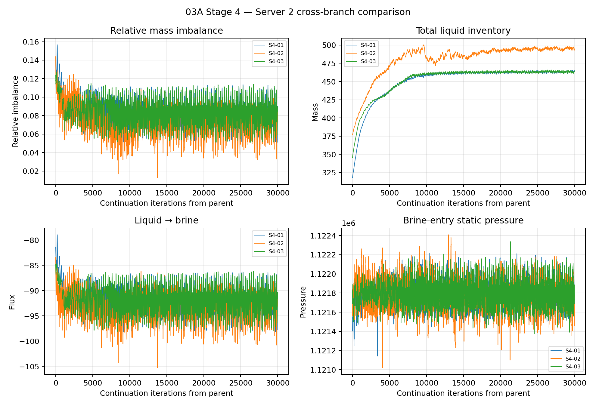
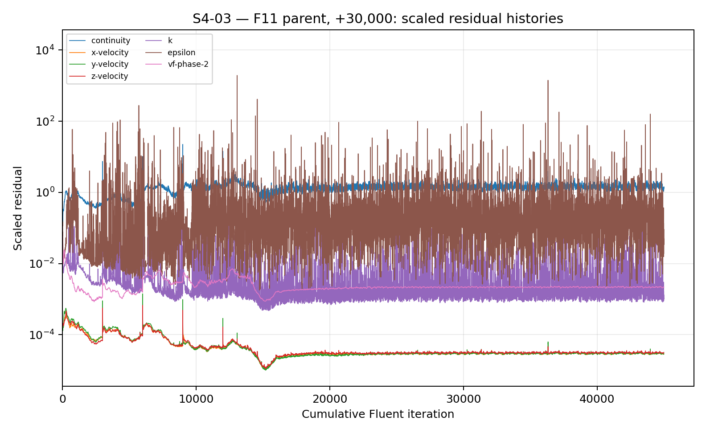
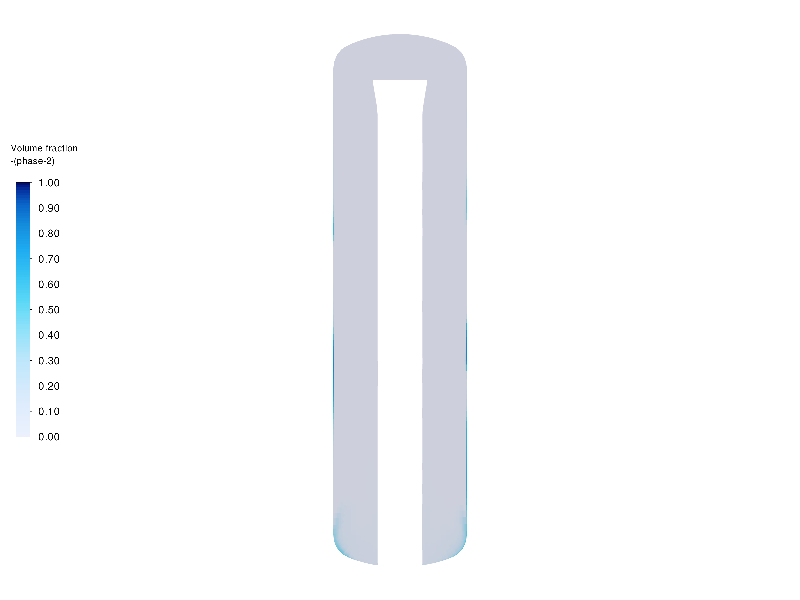
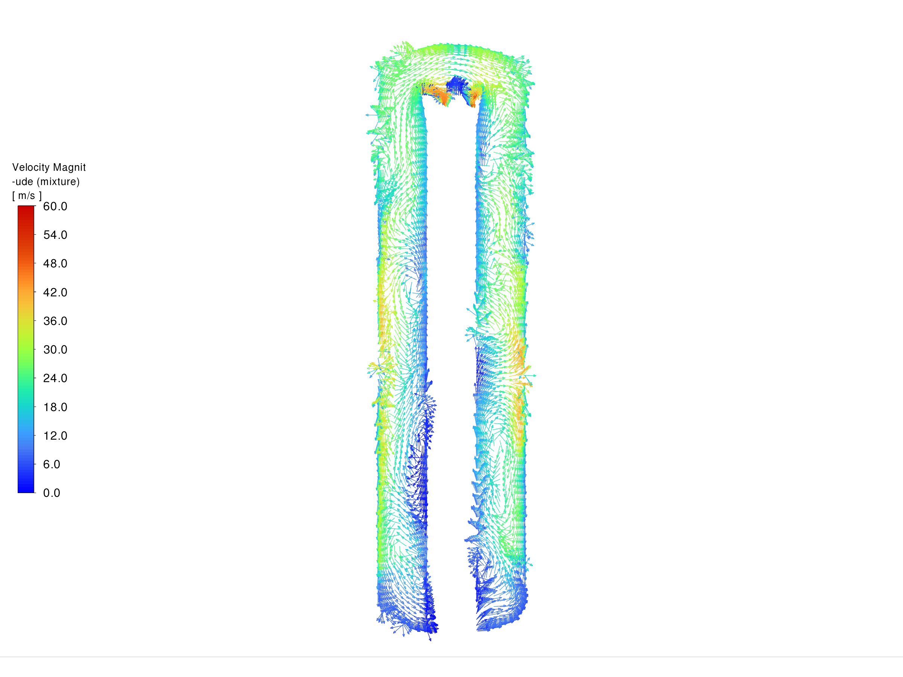
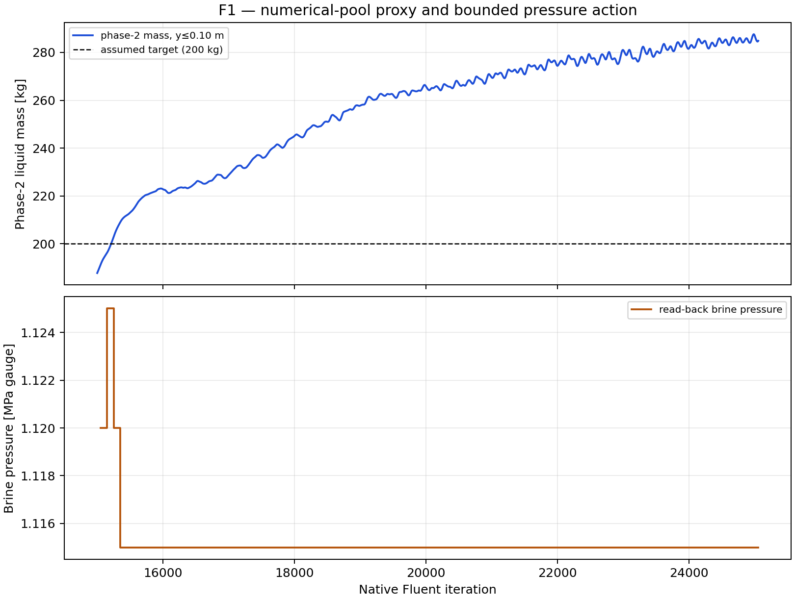
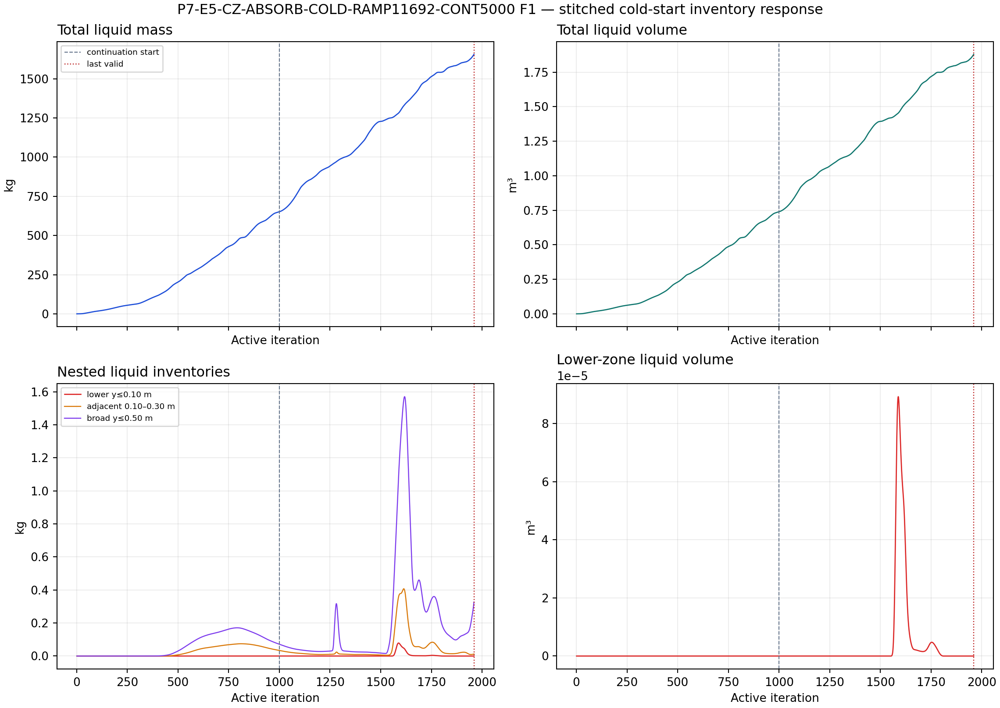
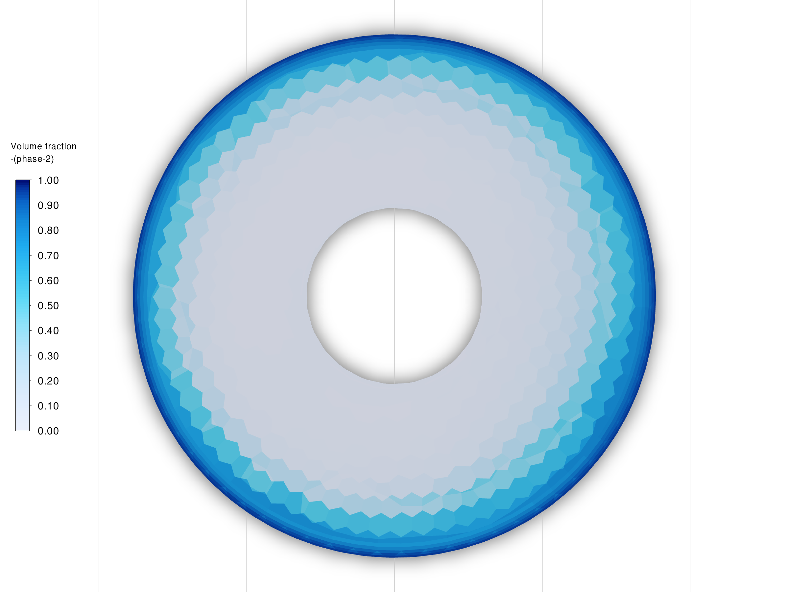
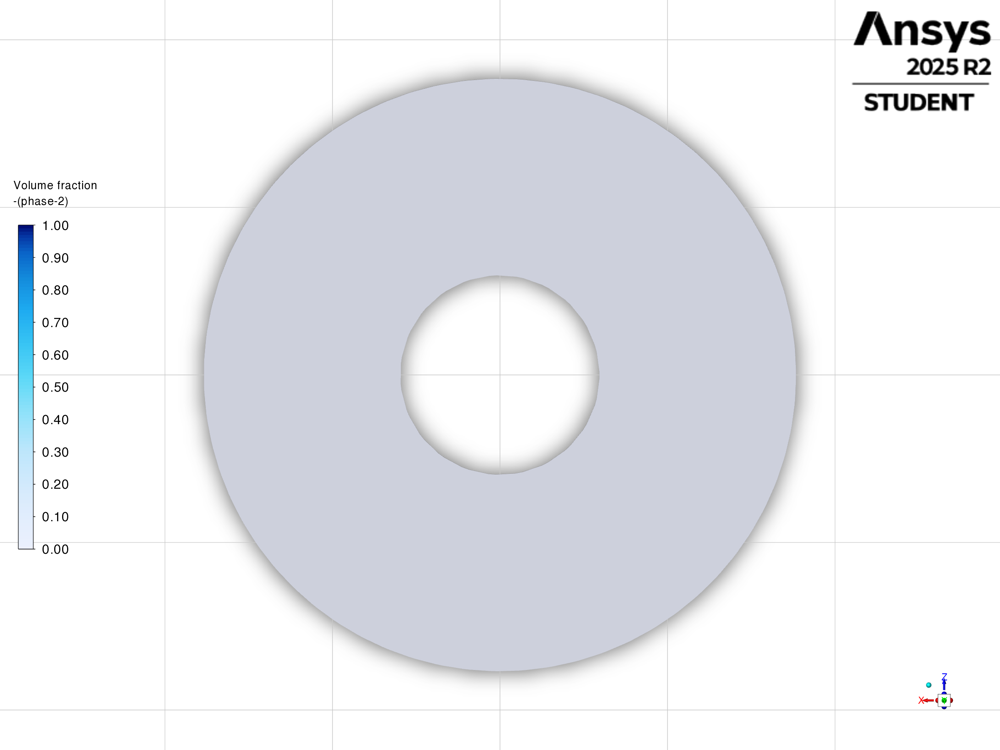
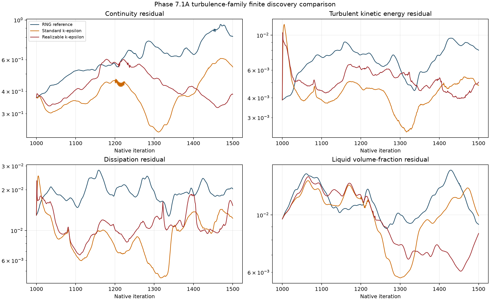
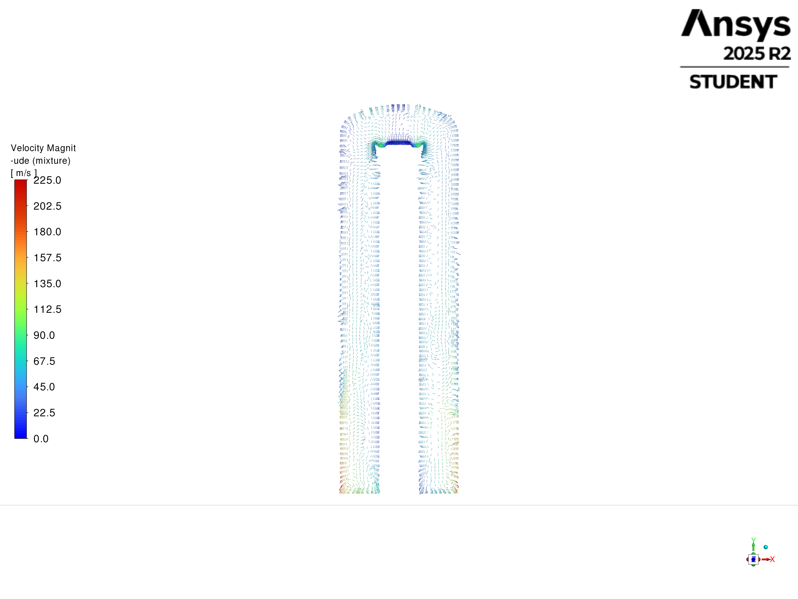

# Supervisors' Meeting Report — 14 September 2026

**Status:** Draft for the meeting on 15 September 2026  
**Scope:** Phase 05, Phase 06, Phase 07A, and Phase 07.1A  
**Purpose:** A short visual summary of what I tried, what I saw, what it means, and what I will do next.

This report is for discussion. It gives the main story only. Detailed setup, run history, and evidence records remain in the Project folder.

## The story in one minute

I first tested the full separator geometry. It gave me useful flow information, but it did not give me a stable numerical baseline.

I then tested a lower-pool control method. The liquid amount continued to rise, even when the pressure action reached its lower limit.

I moved to a simpler separator geometry. This made the liquid-removal question easier to isolate. I found that a lower absorber can be set up correctly, but the tested field did not deliver enough liquid to that region.

I am now testing numerical choices one at a time. The current results show different residual behaviour, but no stable coupled solution yet.

The main conclusion is about the tested simulation setups. It is not a conclusion that the physical separator cannot work.

## Current position

| Phase | Question | What I saw | Current decision |
|---|---|---|---|
| 05 | Can the full geometry provide a stable baseline? | I saw unsettled liquid inventory and mass balance. The flow field showed outer-region accumulation and recirculation. | I use this work as diagnostic evidence, not as a performance claim. |
| 06 | Can lower-pool control keep the liquid amount near a target? | I saw the liquid proxy rise to about 285 kg against a 200 kg numerical target. Pressure action reached its lower limit of 1.115 MPa gauge. | I am setting aside this full-geometry control route for now. |
| 07A | Can a lower absorber remove liquid in the simpler geometry? | I confirmed that the absorber source was set correctly, but almost no phase-2 liquid reached the sampled lower region. | I am keeping the mechanism as a working path, but treating liquid access as the open problem. |
| 07.1A | Can numerical changes make the absorber case stable? | I saw different residual paths for the tested turbulence choices. None gave stable coupled behaviour. | I will continue with one controlled change at a time. |

## Geometry and figure convention

The coordinate origin is at the bottom centre of the separator. **Y** is vertical. **X** and **Z** are the two horizontal directions.

The centre cuts use the X–Y or Y–Z plane at the origin. The top view at the inlet uses an X–Z plane at the inlet height. A second X–Z plane at the steam-outlet height can show the outlet flow.

Contours show where phase 2 is present. Vector-only views show flow direction and relative speed. Contours and vectors are kept separate so that each image answers one question.

## Phase 05 — full separator geometry

<strong>Why:</strong> I wanted to know whether the full separator geometry could provide a stable baseline for later physical interpretation. <strong>Did:</strong> I compared several full-geometry numerical setups and followed liquid inventory, phase routing, mass balance, pressure, and residual behaviour.

Show experiments I actually ran in Phase 05

I have grouped related cases into experiment families. Setup-only branches and variants that were never launched are not included.

<table>
<thead>
<tr><th>Experiment family and settings</th><th>Why I ran it</th><th>What I saw</th></tr>
</thead>
<tbody>
<tr>
<td><strong>Steady outlet-formulation screen</strong> 12 pilot cases from the same lower-liquid initial state: pressure outlet: <code>1.160</code>, <code>1.200</code>, <code>1.240 MPa</code> gauge; outlet vent: <code>K=0</code>, <code>K=10</code>, <code>K=100</code>; mass-flow outlet: <code>58.4235</code>, <code>116.847</code>, <code>233.694 kg/s</code> liquid; exhaust fan: <code>−50</code>, <code>0</code>, <code>+50 kPa</code>.</td>
<td>I wanted to compare built-in outlet treatments while keeping the mesh, Mixture model, inlets, steam outlet, and initial liquid inventory fixed.</td>
<td>Four of 12 cases reached 500 iterations; eight ended with floating-point exceptions. The finite cases showed very strong measured liquid depletion, so they were over-draining reference cases rather than a stable operating point.</td>
</tr>
<tr>
<td><strong>Targeted outlet refinement</strong> Two pressure-outlet probes at <code>1.175</code> and <code>1.190 MPa</code> gauge; two outlet-vent probes at <code>K=3</code> and <code>K=7</code>.</td>
<td>I narrowed the second screen around the pressure and resistance settings that had survived longest in the first screen, rather than jumping to a wider parameter sweep.</td>
<td>The two pressure probes failed at iterations <code>453</code> and <code>415</code>. Both outlet-vent probes reached 500, but their reported liquid balances remained strongly negative: about <code>−545.7</code> and <code>−481.0 kg/s</code>. They were more numerically survivable, not physically validated.</td>
</tr>
<tr>
<td><strong>Transient liquid-outlet campaign</strong> Three unpatched pressure-start cases at <code>1.136</code>, <code>1.1375</code>, and <code>1.139 MPa</code> gauge, followed by two nine-point transient pressure sweeps from <code>1.120</code> to <code>1.200 MPa</code> in <code>0.010 MPa</code> steps; timestep <code>2.5×10−4 s</code>; <code>200</code> requested steps per pressure.</td>
<td>I wanted to test whether time-dependent treatment or a different initialisation path could recover a usable drainage branch when the steady outlet tests were unstable.</td>
<td>The three unpatched start cases reached 1,000 steady iterations, but all 18 later transient pressure cases developed reversed flow, turbulent-viscosity limiting, residual growth, AMG divergence, and floating-point failure before the requested horizon.</td>
</tr>
<tr>
<td><strong>Full-geometry parity and loading-path continuations</strong> Independent carrier-first, full-Mixture, and staged liquid-loading paths using <code>10%</code>, <code>20%</code>, <code>40%</code>, <code>80%</code>, and <code>100%</code> loading; branch horizons from <code>3,000</code> to <code>18,000</code> iterations, followed by long continuations to approximately <code>33,000</code>, <code>36,000</code>, and <code>45,000</code> cumulative iterations.</td>
<td>I wanted to see whether more iterations, a carrier-first initialisation, or gentler loading could settle the liquid inventory and mass balance without changing the full geometry.</td>
<td>Some branches reached long horizons, but the residuals, mass balance, and liquid inventory remained unsettled. The long continuation used for the residual figure still showed high and repeatedly spiking residuals, so no stable full-geometry baseline was established.</td>
</tr>
</tbody>
</table>

<strong>Saw:</strong> The liquid inventory and mass balance did not settle. Higher fixed brine pressure did not improve the result. The spatial views show liquid near the outer walls and a complex recirculating flow field. <strong>Meaning:</strong> The tested full-geometry setup is useful for diagnosis, but it is not ready for a reliable separator-performance claim. This result does not show that the physical separator is impossible to control.

<strong>Figures:</strong> These two histories are shown side by side so I can compare the physical bookkeeping with the numerical behaviour: the mass-balance/liquid-inventory plot shows the outcome, while the residual plot shows why the outcome is not a settled solution.

<figure>

<figcaption>Full-geometry comparison of mass balance, liquid inventory, liquid-to-brine flux, and pressure.</figcaption>
</figure>
<figure>

<figcaption>Scaled residual histories during a long continuation. Repeated spikes and high late residual levels support an unstable, unsettled numerical state rather than a converged solution.</figcaption>
</figure>

<figure>

<figcaption>Phase 05: phase-2 distribution in a later full-geometry diagnostic state. The colour range is fixed from 0 to 1.</figcaption>
</figure>
<figure>

<figcaption>Phase 05: velocity field in the same state. All vectors are shown and coloured by velocity magnitude.</figcaption>
</figure>

<strong>Conclusion &amp; transition:</strong> The full geometry is useful for diagnosing the flow, but it is not a stable baseline. I therefore moved to testing whether lower-pool control could bound the liquid amount.

## Phase 06 — lower-pool control in the full geometry

<strong>Why:</strong> I wanted to know whether bounded pressure action could keep the lower liquid amount near a chosen numerical target. <strong>Did:</strong> I measured liquid in the lower region and changed the pressure in steps over a long continuation.

Show experiments I actually ran in Phase 06

The target of <code>200 kg</code> was a deliberately numerical lower-region proxy, not a measured plant level. The pressure bounds of <code>1.115–1.1375 MPa</code> gauge were also a numerical screening bracket, not a plant operating range.

<table>
<thead>
<tr><th>Experiment family and settings</th><th>Why I ran it</th><th>What I saw</th></tr>
</thead>
<tbody>
<tr>
<td><strong>Fixed-pressure reference</strong> Steady full-geometry Mixture/RNG case with the retained <code>1.120 MPa</code> gauge brine-outlet pressure; <code>500</code> discovery iterations after the smoke block.</td>
<td>I established a matched reference so I could measure lower-region liquid response and phase routing before adding a control action.</td>
<td>Lower-region and total liquid inventories increased. The late derived net liquid accumulation was about <code>+21.42 kg/s</code>, so the reference did not reach a controlled state.</td>
</tr>
<tr>
<td><strong>Outlet-vent resistance comparison</strong> Same geometry and ambient pressure, but with an outlet-vent boundary and <code>K=10</code>.</td>
<td>I wanted to test whether a pressure-loss relation could represent outlet response more usefully than another fixed-pressure point.</td>
<td>Liquid-to-brine drainage decreased, liquid carryover to the steam outlet increased, and the late relative imbalance worsened from about <code>0.1079</code> to <code>0.2249</code>.</td>
</tr>
<tr>
<td><strong>Short pressure-feedback surrogate</strong> Proxy: phase-2 liquid mass below <code>y=0.10 m</code>; target <code>200 kg</code>; pressure bounds <code>1.115–1.1375 MPa</code> gauge; gain <code>500 Pa/kg</code>; maximum pressure step <code>2 kPa</code>; five <code>100</code>-iteration chunks.</td>
<td>I changed brine pressure from the lower-region liquid proxy to test whether feedback could hold that proxy near a target.</td>
<td>The controller changed direction correctly, but the proxy increased by <code>26.70 kg</code>. Its late slope was <code>+0.0337 kg/iteration</code>, so it did not create a controlled state.</td>
</tr>
<tr>
<td><strong>Stronger pressure-feedback surrogate</strong> Same target and pressure bounds; gain <code>2,000 Pa/kg</code>; maximum pressure step <code>5 kPa</code>; ten <code>100</code>-iteration chunks.</td>
<td>I wanted to test whether the short-screen drift was simply too slow to arrest with the initial gain and horizon.</td>
<td>The late drift was reduced to <code>+0.00620 kg/iteration</code>, but the pressure reached its lower bound of <code>1.115 MPa</code> gauge. The proxy remained at about <code>225.74 kg</code>, above the <code>200 kg</code> target.</td>
</tr>
<tr>
<td><strong>Six-case steady discovery screen</strong> Two fixed-pressure cases at <code>1.115</code> and <code>1.1375 MPa</code>; outlet vent <code>K=1</code>; feedback with gain <code>500 Pa/kg</code> and <code>2 kPa</code> maximum step; feedback with gain <code>2 kPa/kg</code> and <code>5 kPa</code> maximum step; and an open-loop pressure path <code>1.115 → 1.120 → 1.125 → 1.13125 → 1.1375 MPa</code>. Each used a <code>500</code>-iteration screen.</td>
<td>I compared the main surviving numerical substitutes using the same parent, report package, and steady model to see whether any deserved a longer qualification test.</td>
<td>All six cases completed their execution screens and the residuals remained noisy. The key pool-inventory and phase-balance figures were not retained in the usable package, so no candidate advanced.</td>
</tr>
<tr>
<td><strong>Long-horizon pressure-feedback surrogate</strong> Starting pressure <code>1.120 MPa</code> gauge; target <code>200 kg</code>; gain <code>2,000 Pa/kg</code>; maximum step <code>5 kPa</code>; bounds <code>1.115–1.1375 MPa</code>; <code>100 × 100</code> steady iterations, or <code>10,000</code> incremental iterations.</td>
<td>I extended the stronger feedback test to determine whether the apparent drift would eventually settle after the actuator saturated.</td>
<td>The proxy ended at <code>284.83 kg</code> with a late positive slope of <code>+0.00249 kg/iteration</code>. Pressure stayed at its lower bound for <code>98/100</code> control endpoints, so the proxy was not bounded.</td>
</tr>
</tbody>
</table>

<strong>Saw:</strong> The liquid proxy rose above the 200 kg target and reached about 285 kg. The pressure action reached its lower bound of 1.115 MPa gauge. The control action therefore did not stop the rise. <strong>Meaning:</strong> This control route did not bound the tested liquid inventory. The result is a numerical setup result. It is not a statement about the physical separator or a plant controller.

<strong>Figures:</strong> The history below shows the lower-region proxy and the bounded pressure action. The exact late spatial case/data pair remains unavailable, so I have kept the spatial placeholder.

<strong>Spatial view not available yet</strong>

The exact late Phase 06 case/data pair is on an offline computer. No substitute field is shown here because it would not support the Phase 06 conclusion.

<strong>Conclusion &amp; transition:</strong> The pressure-feedback route did not bound the lower-region liquid proxy; the pressure action saturated at its lower limit. I therefore moved to a simpler geometry to isolate the liquid-removal question.

## Phase 07A — simpler geometry and lower absorber

<strong>Why:</strong> I wanted to know whether a lower, phase-2-only absorber could provide a practical way to remove liquid from the simpler separator geometry. <strong>Did:</strong> I first checked a corrected reference state. I then checked whether the lower absorber source was present and selective, and followed liquid inventory and lower-region liquid access.

Show experiments I actually ran in Phase 07A

I have grouped the finite screens by mechanism. The original single-zone phase-selective sink probes were blocked before solving because the required region-specific source binding was unavailable, so they are not presented as results.

<table>
<thead>
<tr><th>Experiment family and settings</th><th>Why I ran it</th><th>What I saw</th></tr>
</thead>
<tbody>
<tr>
<td><strong>Corrected simplified-geometry reference</strong> Corrected fixed-mesh reference; <code>2,000</code> native iterations, with the same lower-cut geometry used for the later mechanism tests.</td>
<td>I established a valid common reference before comparing liquid-removal mechanisms.</td>
<td>The corrected run reached <code>2,000</code> iterations, but liquid inventory continued to accelerate and the residuals remained active. Earlier reference attempts included a solver-failure case; I use the completed run as a comparison reference, not as a converged result.</td>
</tr>
<tr>
<td><strong>Fixed pressure-outlet family</strong> Brine-outlet pressure values of <code>1.120</code>, <code>1.160</code>, and <code>1.200 MPa</code> gauge; <code>500</code>-iteration finite screens where the smoke test passed.</td>
<td>I changed only the brine-outlet pressure to test whether a conventional pressure boundary could remove liquid in the simpler geometry.</td>
<td>The low-pressure case completed its finite screen, while the higher-pressure cases failed during smoke. This did not produce a usable bounded branch.</td>
</tr>
<tr>
<td><strong>Outlet-vent family</strong> Resistance values <code>K=0</code>, <code>K=3</code>, <code>K=7</code>, and a conditional <code>K=10</code> probe; <code>500</code>-iteration screens.</td>
<td>I varied the outlet resistance to test a pressure-loss representation without changing the geometry.</td>
<td>The first three resistance cases completed finite screens; the higher-resistance probe was blocked during smoke. The completed cases retained positive liquid-inventory drift and did not establish a successful drainage path.</td>
</tr>
<tr>
<td><strong>Prescribed liquid-withdrawal family</strong> Phase-specific bottom withdrawal rates of <code>29.23</code>, <code>58.46</code>, <code>116.92</code>, and <code>146.15 kg/s</code>, corresponding to approximately <code>25%</code>, <code>50%</code>, <code>100%</code>, and the screening cap relative to the <code>116.92 kg/s</code> liquid inlet.</td>
<td>I imposed several liquid-withdrawal rates to test whether direct local removal could counter the incoming liquid.</td>
<td>The tested rates completed finite screens with phase-specific readback, including the inlet-matched rate. The mixture balance remained open and total liquid inventory continued to drift, so no rate was promoted.</td>
</tr>
<tr>
<td><strong>Adaptive withdrawal family</strong> Gain values <code>G=0.25</code>, <code>0.50</code>, <code>1.00</code>, and <code>1.50</code>; command law <code>clamp(G × 116.92 kg/s × e, 0, 146.15 kg/s)</code>, updated every <code>50</code> iterations from a normalized inventory error <code>e</code>.</td>
<td>I made the withdrawal rate respond to liquid inventory to test whether feedback could outperform a fixed removal rate.</td>
<td>All tested gains completed finite screens. The strongest gain reached its command cap while inventory still rose; the middle gain was provisionally least poor, but no gain produced a bounded state.</td>
</tr>
<tr>
<td><strong>Cell-zone source-binding family</strong> A genuine lower fluid zone was created from the parent mesh and tested with gains <code>G=0.25</code>, <code>0.50</code>, and <code>1.00</code>; source cap <code>146.15 kg/s</code>; phase-2-only lower-zone source; <code>500</code>-iteration screens.</td>
<td>I replaced the conventional outlet idea with a lower fluid zone and a phase-2-only source so that liquid could be removed locally without directly removing vapour.</td>
<td>The native lower-zone source architecture worked and the source readback was auditable. The completed screens still showed positive global inventory drift and open boundary-only closure; the middle gain was only a provisional ranking.</td>
</tr>
<tr>
<td><strong>Lower-zone absorber-cap family</strong> Fixed gain <code>G=2.00</code>; source caps of <code>146.15</code>, <code>292.30</code>, and <code>584.60 kg/s</code>; <code>500</code> active iterations from the same accumulated parent.</td>
<td>I kept the local absorber mechanism fixed and varied its source cap to see whether stronger removal would improve the response.</td>
<td>The lowest cap completed, while the two higher caps diverged during the block ending at active <code>450</code>. The completed case still oscillated above its lower-zone target, so no cap was selected.</td>
</tr>
<tr>
<td><strong>Cold-start fixed-rate absorber test</strong> Starting from the corrected reference state; absorber ramped to the inlet-matched <code>116.92 kg/s</code> by active <code>100</code>, then held through a declared <code>1,000</code>-iteration screen; a continuation was attempted toward <code>5,000</code>.</td>
<td>I wanted to separate accumulated-parent difficulty from source realisation and liquid-access effects.</td>
<td>The cold start reached its <code>1,000</code>-iteration horizon. The continuation reached a valid active-<code>1,960</code> history before divergence. Almost no phase-2 liquid reached the lower zone while total liquid inventory rose, pointing to liquid access as the unresolved issue.</td>
</tr>
</tbody>
</table>

<strong>Saw:</strong> The absorber source was set correctly, but the lower sampled plane contained almost no phase-2 liquid. The absorber can therefore be present without receiving enough liquid to remove. The inventory history also continued to rise during the tested continuation. <strong>Meaning:</strong> The simpler geometry has isolated the next question: how can liquid reach the lower absorber region? The absorber mechanism is not yet a physical or performance result.

<strong>Figures:</strong> The history and matched contour views show the inventory response and lower-region liquid access.

<figure>

<figcaption>Phase 07A: lower-region phase-2 distribution in the reference state.</figcaption>
</figure>
<figure>

<figcaption>Phase 07A: lower-region phase-2 distribution in the absorber state. This is the native Fluent contour-only export from the active-1900 absorber state, using the same lower plane and 0–1 phase-2 range as the reference view.</figcaption>
</figure>

<strong>Conclusion &amp; transition:</strong> The absorber was correctly configured, but the tested field did not deliver enough liquid to it. I therefore moved to testing whether numerical changes could stabilise the absorber case while keeping the mechanism fixed.

## Phase 07.1A — numerical stability of the absorber case

<strong>Why:</strong> I wanted to know whether a controlled change to the turbulence treatment could make the absorber case numerically stable while keeping the absorber mechanism fixed. <strong>Did:</strong> I compared three turbulence choices at the same finite checkpoint. I kept the geometry and absorber concept fixed so that the residual change could be linked to the model choice.

Show experiments I actually ran in Phase 07.1A

I changed one turbulence treatment at a time from the same active-1,000 absorber parent. The remaining queued turbulence, wall-function, discretisation, and multiphase-dispersion variants had not been run and are not included.

<table>
<thead>
<tr><th>Experiment family and settings</th><th>Why I ran it</th><th>What I saw</th></tr>
</thead>
<tbody>
<tr>
<td><strong>RNG turbulence reference</strong> Unchanged RNG <em>k–epsilon</em> closure; <code>500</code> active iterations after the smoke block.</td>
<td>I ran the unchanged turbulence treatment first so the two closure changes had a common finite reference.</td>
<td>Total liquid mass rose from about <code>943</code> to <code>1,228 kg</code>. Continuity remained around <code>0.65–0.95</code>, with reverse flow and turbulent-viscosity limiting throughout.</td>
</tr>
<tr>
<td><strong>Standard <em>k–epsilon</em> closure</strong> Only the turbulence closure changed from RNG to standard <em>k–epsilon</em>; all other absorber, geometry, boundary, and numerical settings were held fixed; <code>500</code> active iterations.</td>
<td>I wanted to test whether the residual and absorber behaviour depended on the RNG closure form.</td>
<td>Continuity was lower over part of the screen and ended near <code>0.547</code>, but liquid mass still rose from about <code>983</code> to <code>1,164 kg</code>. The tail remained non-stationary and the same broad limiting behaviour persisted.</td>
</tr>
<tr>
<td><strong>Realizable <em>k–epsilon</em> closure</strong> Only the turbulence closure changed from RNG to realizable <em>k–epsilon</em>; same parent and <code>500</code>-iteration horizon.</td>
<td>I wanted to compare the other closely related <em>k–epsilon</em> alternative without mixing in a coupling, source, or mesh change.</td>
<td>Continuity ended near <code>0.385</code>, but liquid mass still rose from about <code>1,010</code> to <code>1,158 kg</code>. Reverse flow, viscosity limiting, and a non-stationary residual tail remained.</td>
</tr>
<tr>
<td><strong>RNG production-limiter test</strong> RNG reference with only the production limiter changed from off to on; Fluent applied its default <code>clip factor=10.0</code>; <code>500</code> active iterations requested.</td>
<td>I wanted to test whether a turbulence-specific limiter could prevent the observed residual blow-up without changing the absorber or the rest of the numerical setup.</td>
<td>The smoke block and active-<code>250</code> checkpoint completed, but the next block produced AMG divergence and floating-point exceptions. The required 500-iteration comparison was not proven.</td>
</tr>
</tbody>
</table>

<strong>Saw:</strong> The residual paths were different, but they did not settle into stable coupled behaviour. Continuity, turbulence, and phase-fraction residuals remained active, and the wider numerical problems were not removed. <strong>Meaning:</strong> No turbulence choice has been promoted. The next tests must change one numerical treatment at a time and must check both residuals and liquid behaviour.

<strong>Figures:</strong> The residual comparison and matched native Fluent vector views show how the turbulence choices changed the numerical path without producing a credible steady solution. The native Fluent spatial views use the same centre plane, show all vectors, and share one 0–225 m/s velocity-magnitude range.

<figure>

<figcaption>RNG reference, active 500. Native Fluent vector-only view on the centre plane.</figcaption>
</figure>
<figure>

<figcaption>Standard <em>k–epsilon</em>, active 500. Same plane, camera, vector policy, and colour range.</figcaption>
</figure>
<figure>

<figcaption>Realizable <em>k–epsilon</em>, active 500. Same plane, camera, vector policy, and colour range.</figcaption>
</figure>

<strong>Conclusion &amp; transition:</strong> The turbulence choices changed the residual path, but none produced a credible steady solution. I therefore continue with one numerical treatment change at a time, checking residuals and liquid behaviour together.

## Overall conclusion

1. I found that the full geometry gave useful diagnostic information, but it did not give me a stable baseline.
2. I found that the lower-pool control route did not stop the liquid proxy from rising.
3. I used the simpler geometry to isolate the liquid-removal question.
4. I found that the lower absorber can be set up, but the tested field does not deliver enough liquid to it.
5. I will present the current work as a numerical-stability screen, not yet as a plant-performance result.

## Next steps

- I will recover the exact late Phase 06 case/data pair and create the missing native Fluent spatial view.
- I will use the matched Phase 07A contour pair and the three Phase 07.1A vector views alongside the existing histories.
- I will continue with one numerical change at a time.
- I will link every spatial claim to liquid inventory, phase routing, and mass-balance evidence before making a physical claim.

## Evidence links

- [Project index](../../index.md)
- [Phase 05 current record](../../experiments/phase-05-full-geometry-v2/full-geometry-03a-mixture-08b-parity-baseline/index.md)
- [Phase 06 conclusion](../../experiments/phase-06-full-geometry-with-brine-pool/conclusion.md)
- [Phase 06 long-horizon results](../../experiments/phase-06-full-geometry-with-brine-pool/stage-06-long-horizon-surrogate-hypothesis/results.md)
- [Phase 07A current record](../../experiments/phase-07a-simplified-purnanto-liquid-removal/index.md)
- [Phase 07A absorber results](../../experiments/phase-07a-simplified-purnanto-liquid-removal/cell-zone-absorber-control-family/p7-e5-cz-absorb-cold-ramp11692-cont5000/results.md)
- [Phase 07.1A current record](../../experiments/phase-07-1a-absorber-convergence/index.md)
- [Phase 07.1A turbulence results](../../experiments/phase-07-1a-absorber-convergence/turbulence-family/README.md)
