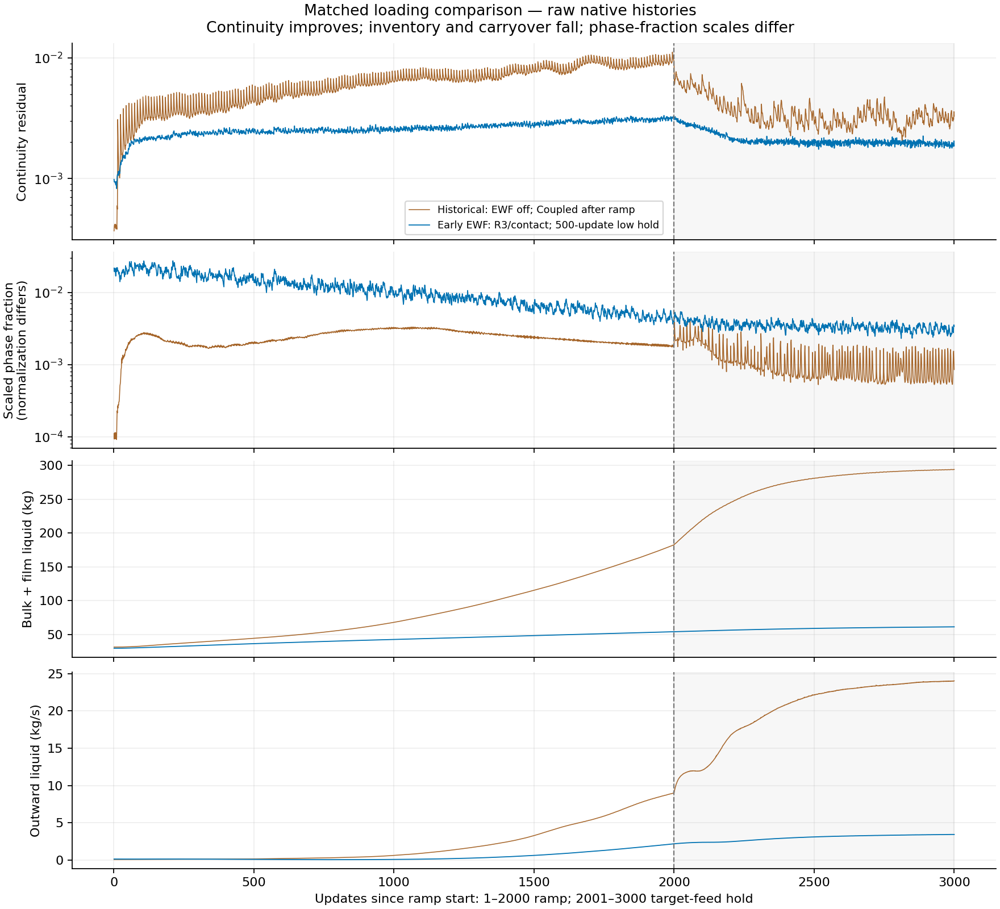
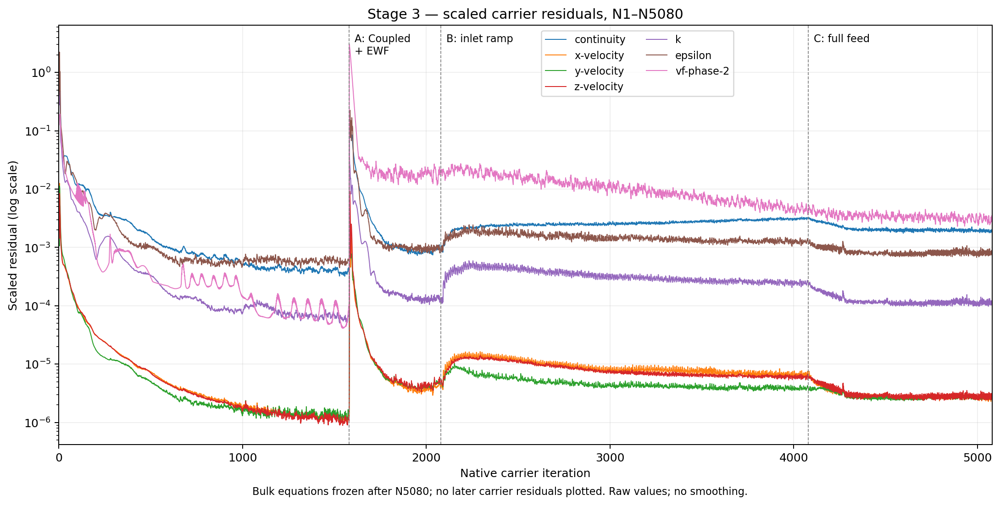
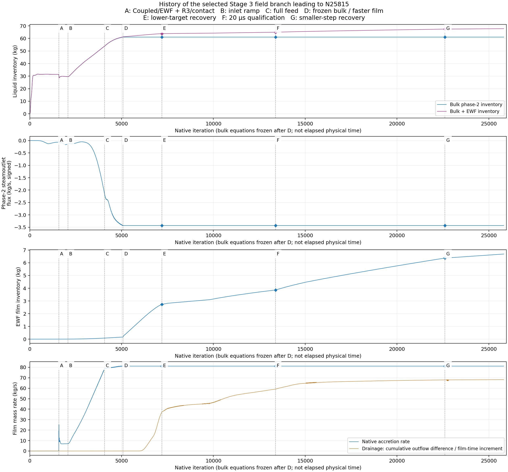
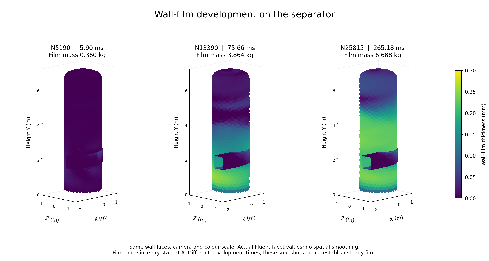

# Meeting report — Wall-liquid response and film development

6 October 2026 · Phase 7.2A

## 1. Case development to N45606

*Figure 1. Early history of the selected N45606 branch. A: inlet ramp; B: Coupled solver; C: wall-film accretion enabled. Iterations are not elapsed physical time.*

During the 25% inlet hold, scaled continuity reached **3.21 × 10⁻⁴**. At full feed, the developed control reached about **2.07 × 10⁻³**, with **2.78 × 10⁻³** at N5586. This numerical progress supported further tests on the same case to improve liquid routing; low residuals alone did not establish a steady separator solution.

*Figure 2. Complete selected history, N1–N45606. Negative steam-outlet flux means liquid leaves. C: accretion enabled; E: 0.5 mm roughness, corrected contact absorber and smaller film step; G: adaptive film stepping.*

| Panel | Main observation |
| --- | --- |
| Liquid inventory | Bulk liquid falls from 295.85 kg in the control to about 63 kg and then stabilises. At N45606, bulk liquid is 62.90 kg; bulk plus film is 69.26 kg. |
| Liquid through the steam outlet | Accretion reduces escape to about 1.73 kg/s. After the combined roughness/contact restart, it settles near 3.67 kg/s. This is much lower than the control, but remains above the desired level. |
| Wall-film inventory | Film growth slows after the corrected restart: 5.84 → 6.36 kg. The curve approaches a flatter trend, but mass still accumulates. |
| Accretion and drainage | In the final 1000 updates, drainage reaches 73.96 kg/s against 82.15 kg/s accretion. The gap narrows, but drainage remains 9.98% below input; more film development is needed. |

Repeated inner-film residual bursts remain a numerical limit. The smooth inventory curves do not establish steady film.

## 2. Roughness and wall-film accretion

*Figure 3. Roughness comparison from the same N5586 parent; 3000 updates per case. The shaded region is the final 500 updates.*

Roughness has a partial, nonlinear relation with apparent liquid-removal efficiency. Small roughness increases can raise liquid escape, while larger settings generally reduce it; the strongest height setting lowers the outlet magnitude by about **44%**. Roughness is therefore a significant factor when representing realistic separator flow, although inventory loss in several cases prevents a confirmed separation-efficiency claim.

*Figure 4. Wall-film comparison, N5586–N8586. The red curve is the accretion-enabled configuration with coupled film equations and film-to-flow momentum feedback off; the blue curve is the no-film baseline. Original figure labels are retained.*

The accretion-enabled configuration behaves very differently from the baseline. Mean liquid escape falls from **24.37 to 1.74 kg/s**, a reduction of about **93%**. Basic wall-film activation without accretion leaves the response close to the baseline. Transfer of bulk liquid into the wall film is thus another significant model factor; the outlet reduction still needs inventory and mass-balance context.

**Wall-liquid response is important for this model.** Both wall-film accretion and roughness were applied in the N45606 case above, using 0.5 mm roughness and a roughness constant of 0.5. Its combined restart also changed the contact absorber and film step, so it does not isolate either wall effect.

## 3. Stage 3 — Improved loading and faster film development

The aim was to reach a developed film sooner and reduce inlet-loading excursions. From the same low-feed bulk fields, we enabled Coupled flow, dry wall film with accretion, roughness and the corrected contact absorber **before** the ramp. We held 25% feed for 500 updates, retained the 2000-update ramp, then held full feed for 1000 updates.

*Figure 5. Matched inlet-loading comparison. The shaded region is the full-feed hold. Continuity uses the same normalization; phase-fraction normalization differs.*

| Peak during the ramp | Historical startup | Revised startup | Reduction |
| --- | ---: | ---: | ---: |
| Scaled continuity | 0.01117 | 0.003334 | 70.15% |
| Bulk plus film liquid | 182.52 kg | 53.97 kg | 70.43% |
| Liquid escape through steam outlet | 9.00 kg/s | 2.18 kg/s | 75.78% |

*Figure 6. All seven scaled carrier residuals, N1–N5080. A: combined model activation; B: ramp start; C: full feed.*

The revised recipe reduces the ramp continuity peak, but still produces a large activation spike before the ramp. Final continuity is **1.86 × 10⁻³**; the changes act together, so the improvement cannot be assigned to early film activation alone.

For subsequent film development, we froze bulk advancement and tested an alternative implicit film solver with larger, checked film steps. A 20 µs step passed a local comparison against 2.5 µs at equal film time. One continuation advanced film time **2.62 times faster per wall-clock minute** than an earlier window; these windows had different film states, so this is an observed operational gain. The final steady state has not yet been reached.

*Figure 7. Selected Stage 3 history to N25815, at 265.18 ms film time. Bulk equations are frozen after D, N5080. Rejected continuation branches are excluded.*

| Panel | Main observation |
| --- | --- |
| Liquid inventory | Bulk liquid reaches 61.05 kg at N5080. Its later flat curve results from frozen bulk equations; total bulk plus film still rises to 67.74 kg. |
| Liquid through the steam outlet | Escape reaches 3.43 kg/s at N5080, then stays fixed with the bulk fields. This does not show further outlet convergence. |
| Wall-film inventory | Film grows from 0.165 to 6.688 kg. Growth slows, but the film is still filling. |
| Accretion and drainage | Latest-window drainage is 68.18 kg/s against 81.12 kg/s accretion. The 15.96% deficit leaves about 12.95 kg/s in storage; more development is needed. |

*Figure 8. Native wall-face thickness at 5.90, 75.66 and 265.18 ms, with the same camera and 0–0.30 mm colour scale.*

Film spreads and thickens over the lower and middle wall; the upper wall remains thinner. Wall area above 0.1 mm grows from **0.80% to 61.98%**, while the final maximum thickness is **0.291 mm**. These snapshots show film development. Steady-film confirmation requires further timestep checks and sustained inventory/rate checks with all bulk equations restored.
