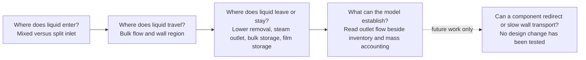
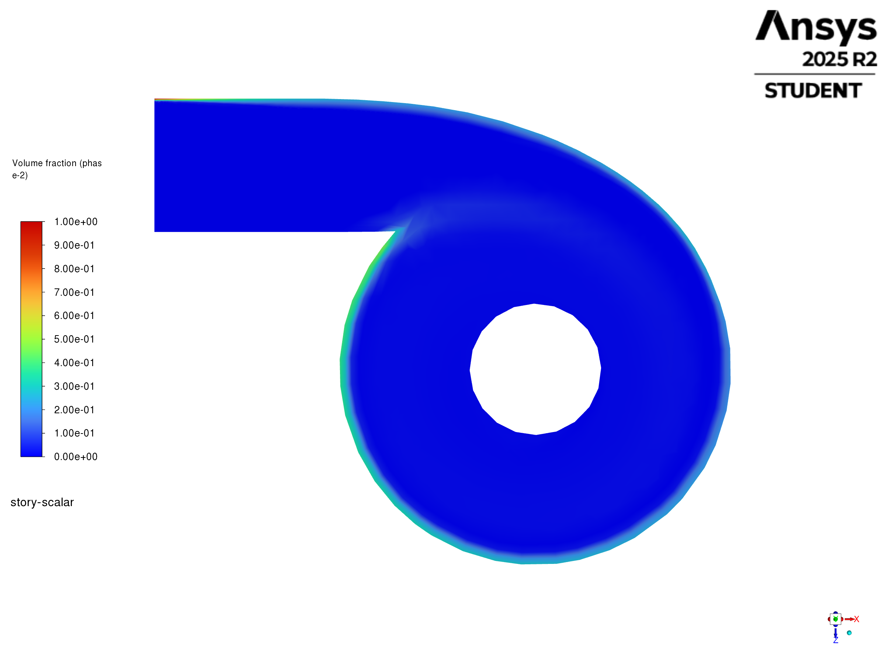

# BOC separator poster — findings and figure plan

**Working discussion draft — 5 October 2026. Poster size: A1, confirmed by Shuhei.** This document develops the poster argument. The linked experiment records own the results. It does not select new simulations or a separator design.

**Direction confirmed in discussion:** explain the previous limits, what we changed to better understand fluid behaviour, what we learned, and what limits remain. Separator design changes have not been made and are outside the present results.

**Original mesh:** Shuhei has the original mesh but does not yet have a suitable figure. Use a labelled placeholder for that panel; do not substitute a different mesh or an illustrative mesh rendering.

**Further decisions — 5 October:** use the newer contact-removal model as the poster's lower-removal method. Shuhei judges it closer to the intended behaviour of liquid entering the omitted brine region. The inlet split was first recommended by the supervisor. The wiki/primary-source review below supports a physically motivated pre-segregated-inlet test, not a validated sharp phase profile. Shuhei proposes showing roughness/EWF outlet reductions with a contour above them. These results establish a wall-model response; upward transport is a possible explanation to illustrate with direction evidence, not a causal conclusion from the outlet reduction alone. Film stripping and other escape routes are not measured well enough to rank their contributions.

The linked chat, “Focus poster on key results”, could not be read because this session has no `read_thread` tool. This draft uses Shuhei's current request, the saved [poster design](P4P_POSTER_DESIGN.md), the [poster figure provenance](poster-assets/figure-provenance.json), and current Project records. Exact claims about Purnanto's published model still need the original source.

## 1. What Shuhei wants to communicate

| Development | Intended message | Preferred visual |
| --- | --- | --- |
| Two-phase inlet | Represent steam and liquid entering different parts of the inlet, rather than distributing both uniformly. Explain why the change is more useful for the incoming flow structure. | Mixed and split inlet views side by side. |
| Mesh | Replace the earlier tetrahedral approach with a mesh that represents the wall region more deliberately. Show the wall-layer cells and their relation to the flow direction. | Old/new mesh close-ups with the same location and scale. |
| Lower contact-removal model | Remove liquid when it enters the lower collector, as a numerical representation of entry into the omitted brine region. Avoid imposing one shared inlet-throughput removal budget. | Contact-removal map, lower-region liquid-fraction detail, collector inventory/removal and film ledger. |
| Wall interaction: roughness and EWF | Show how wall treatment changes liquid inventory and liquid flow through the steam outlet. Use contours to show liquid placement and signed velocity to test the upward-transport explanation; leave stripping and route contributions unresolved. | Contours above paired inventory/outlet histories; signed vertical liquid velocity near the wall and/or signed film velocity with film thickness. |
| Later design idea | Use the wall-transport findings to propose components that reduce or redirect film momentum, then test whether less liquid reaches the steam outlet. | Future candidate sketch only; a design result is outside this draft. |

**Recommended central statement:** “We examined limits in the inlet, mesh, liquid-removal and wall representations to better understand liquid distribution, storage and transport in the BOC separator. The results also identify what the model cannot yet predict reliably.”

This gives the changes a scientific purpose: each exposes a different part of the liquid path. Mesh supports the representation. The strongest findings concern liquid distribution, removal, storage and transport.

## 2. The argument the figures should carry

**Previous limitation → change to the CFD model → new understanding of fluid behaviour → current limit.** A later separator design could use that understanding, but no tested design change belongs in this poster yet.

Use “previous model” carefully: some limits below belong to our reconstructed or truncated cases. They must not all be attributed to Purnanto's published model without checking the original source.

| Previous limitation or unresolved question | What we changed or examined | What we now understand better | Current limit |
| --- | --- | --- | --- |
| A homogeneous inlet does not explicitly represent liquid concentrated toward the outer side. | Compare mixed and pure-phase split feed on a common mesh. | Inlet placement changes wall enrichment and retained liquid even when the broad circulation and high outlet routing remain similar. | The split distribution is still assumed; plant inlet behaviour is not validated. |
| We want more deliberate representation of the wall region than the earlier tetrahedral approach. | Introduce a different mesh strategy; identify the actual wall-layer structure in the result mesh. | This can make the intended wall resolution visible and support later wall studies. A quantified transport benefit is not established yet. | Old/new wall images and a controlled numerical comparison are missing. |
| The truncated closed-bottom model has no lower liquid-removal route. Initialising a pool does not supply one; a throughput budget also differs from local contact capture. | Use the newer contact-removal model for bulk liquid, native film-edge discharge and collector DPM escape. | Liquid reaching the lower collector can be removed through explicitly defined routes, with little retained collector liquid. | This idealises entry into an omitted brine region; whole-system closure and the physical pool response remain unresolved. |
| Bulk flow alone does not resolve film storage and wall transport. | Compare roughness response and add EWF as a separate liquid representation. | Wall treatment changes modeled outlet flow and the retained state. Outlet flow and bulk inventory can also conceal depletion or growing film storage. | Outlet reduction alone does not identify upward transport; stripping and the relative contributions of escape routes remain unmeasured. |

The first and fourth rows carry the strongest present fluid-behaviour findings. The mesh row is a method improvement to document; the absorber row explains why the lower boundary representation needed development. Give current limits short, visible captions rather than making solver detail the main poster story.

*Argument map, not a CFD result. The solid arrows connect questions; they do not assert measured causal links.*

| Poster finding | What the current evidence adds to understanding | Short figure-led wording |
| --- | --- | --- |
| Inlet distribution matters | The same nominal speed with different inlet phase placement changes retained liquid and the wall-adjacent distribution. The overall circulation remains similar. | **“Inlet phase placement changes liquid retention.”** |
| A lower contact-removal model is needed in the truncated geometry | An initial pool does not define an operating liquid state. The contact model gives liquid entering the collector an explicit numerical exit, independent of an inlet-throughput removal command. | **“Liquid entering the lower collector is removed locally.”** |
| Roughness response is not monotonic | Small roughness settings increase modeled liquid outlet flow. Larger settings lower it while domain liquid also depletes. | **“Outlet reduction must be read with inventory.”** |
| Film adds a separate storage and transport mode | Bulk inventory and bulk outlet flow can look nearly level while film mass and film speed continue to increase. | **“Stable bulk signals can hide a developing wall film.”** |
| Wall transport is a meaningful pathway to investigate | Roughness/EWF responses motivate a contour-and-velocity comparison. Distinguish wall-adjacent bulk liquid from EWF film in the selected field. | **“Wall treatment changes liquid routing; the escape mechanisms remain unresolved.”** |
| These findings guide a design question | Wall transport is a mechanism worth investigating, but present evidence does not prove that slowing it improves separation. | **“Test whether redirecting wall transport reduces liquid escape.”** |

## 3. What each comparison can support

### Inlet: a clear representation effect

| Item | Evidence and interpretation |
| --- | --- |
| Owning result | [Phase 8 mixed/split inlet comparison](../experiments/phase-08-storyline-reconstruction/results.md#finding-1--the-split-inlet-changes-retention-more-than-outlet-routing). |
| Matched basis | F1 and F2 Coupled carriers; common 60,964-cell simplified geometry; five speeds; independently initialized; N10,000 endpoints; no absorber or EWF. F1 uses mixed feed on both original inlet faces. It is not literally a merged single inlet. |
| Direct result at 26.81 m/s | Final bulk liquid inventory: F1 **1,262.6 kg**, F2 **1,734.5 kg**; about **37% more** in F2. |
| Outlet result | Across the speed series, bulk liquid outlet/feed remains **99.65–99.73%** for F1 and **99.38–99.43%** for F2. The closed bottom supplies no lower removal path. |
| Why this matters | Inlet phase placement changes the internal liquid state even when the outlet response changes little. A uniform inlet can therefore hide a useful distribution effect. |
| Limit | The split inlet is a physically motivated assumption. These runs do not validate the incoming phase distribution or demonstrate improved separator efficiency. |
| Poster choice | Use inlet-height contours to show placement, with one inventory callout. Avoid giving the small outlet difference a large visual emphasis through a narrow axis. |

### Literature basis for the inlet — what is supported and what remains imposed

The supervisor's recommendation is the origin of the project choice. The evidence below provides a plausible physical rationale, but cannot recover the supervisor's exact reasoning. Two distinct ideas matter: liquid films can exist upstream, and rotation through the entry/vessel can move denser liquid outward. Neither proves complete segregation at our imposed inlet plane.

| Status | Relevant point | Source inspected | What it supports for this poster |
| --- | --- | --- | --- |
| **Reported** | Annular pipeline flow has a central gas region and liquid film at the pipe wall. Mist flow instead carries most liquid as entrained spray. Several inlet regimes are possible. | [Zarrouk and Purnanto 2014, original PDF](../../CFD_wiki/raw/Zarrouk%20and%20Purnanto%202014.pdf), printed **p.242, §5**; **Fig.7, p.243**. [Wiki source](../../CFD_wiki/wiki/sources/zarrouk-purnanto-2014-geothermal-separator-design-overview.md). | A uniform mist representation is not the only physically possible incoming state. Annular flow does not put all liquid on just one side of the pipe. |
| **Reported** | Cyclone rotation drives denser liquid outward/downward and vapour inward/upward. Spiral entry gives a smoother transition and changes incoming angular momentum. | Same original PDF, **p.238, §2; pp.247–248, §5.4; p.249, §6.1/Fig.14c**. [Wiki physics](../../CFD_wiki/wiki/physics-basis/separator-flow-physics.md). | Wall-side liquid/core-side steam is consistent with a separation mechanism. The reviewed fields mostly describe segregation developing through the entry and vessel, not a measured inlet profile. |
| **Reported** | Upstream liquid films can produce droplets by gas shear. Droplets can also deposit into films after centrifugal migration inside the vessel. | [Pointon et al. 2009, original PDF](../../CFD_wiki/raw/1028587.pdf), **p.945**, “Droplet Separation Process”. [Wiki source](../../CFD_wiki/wiki/sources/pointon-2009-geothermal-separator-sizing-cfd-validation.md). | Incoming film and dispersed liquid can coexist. A pure-liquid strip is an idealisation, not proof of a droplet-free inlet. |
| **Reported** | Scrolled entry changes tangential velocity and fine-droplet escape compared with simple tangential entry. | Same Pointon PDF, **pp.946–947**, “Study of Inlet Type”, **Figs.5–7**. | Entry geometry matters to transport. The illustrated droplet study uses a uniform injection distribution and does not validate our split. |
| **Reported** | Purnanto's original CFD assumes inlet mist and omits pipeline pre-separation; rotation develops outward liquid migration through the separator. | [Purnanto et al. 2013, author-uploaded primary paper](https://www.researchgate.net/publication/269519626_CFD_MODELLING_OF_TWO-PHASE_FLOW_INSIDE_GEOTHERMAL_STEAM-WATER_SEPARATORS), **p.5, §3.1(c–d); p.6, §4.1; p.7, Fig.11; p.8, §4.3**. [Wiki source](../../CFD_wiki/wiki/sources/purnanto-2013-cfd-geothermal-separator.md). | Our split tests an alternative inlet representation. It is not a reproduction of a Purnanto-reported segregated profile. |
| **Assumed / calculated** | Pure liquid on the wall side, pure steam on the inner side, and equal phase velocities produce a narrow liquid strip based on phase volumetric flows. | [Wiki two-zone split setup](../../CFD_wiki/wiki/setups/geothermal-boc-separator-two-zone-split-inlet.md), “Reported vs Inferred vs Assumed”, “Equal-Velocity Pure-Phase Area Rule”, “Assumptions” and “Missing Info”. | The strip width follows a mass/volume construction under imposed velocities. It is not a measured wall-film thickness. |

**Recommended inlet caption:** “We test an idealised pre-segregated inlet, with liquid near the outer wall and steam toward the core. Upstream films and centrifugal liquid migration motivate this arrangement; the sharp pure-phase split is imposed.”

**Current limit:** we do not have the actual upstream regime, phase profile, liquid film thickness, droplet share or phase slip at the CFD boundary. If the boundary precedes the modelled scroll, segregation later in the scroll cannot establish that it has already occurred upstream. The 2014 review also reports regime-dependent behaviour; annular flow is not universally better for separation. “Physically motivated alternative” is supported; “validated more realistic inlet” is not.

The original 2014 review and Pointon PDFs are present and were inspected in this lookup, despite the wiki index's older source-availability note. The expected local Purnanto PDF is absent; its author-uploaded primary text was inspected online. No raw source was modified.

### Mesh: show the structure before claiming a numerical benefit

| Item | Evidence and interpretation |
| --- | --- |
| Verified current identity | [Phase 7.1A baseline build](../experiments/phase-07-1a-absorber-convergence/baseline-v2-virtual-liquid-outlet/results.md) confirms **60,964 cells**, including a 715-cell virtual-outlet zone. |
| Separate earlier mesh | The [342,609-cell supplied-mesh inspection](../experiments/phase-07a-simplified-purnanto-liquid-removal/mesh-inspection.md) identifies hexahedral/polyhedral cells in that mesh. It is a different artifact from the active 60k mesh. |
| Shuhei's intended improvement | Deliberate wall-layer cells that follow the wall and the relevant liquid flow, instead of an undirected tetrahedral field. |
| What is missing | Verified old/new mesh images; current near-wall topology/layer dimensions; the exact original mesh file identity. Shuhei confirms the original mesh is available, but a good figure has not been made. No suitable dedicated mesh comparison image was found in the searched Project and output records. |
| Recommendation | Make this a small methods inset. Show the same wall patch in both meshes, an enlarged near-wall cut, and local flow direction from the corresponding solution. |
| Claim limit | Wall-following cells do not by themselves establish alignment with a helical flow. Do not claim reduced error, mesh independence, or that tetrahedra caused pooling without a controlled numerical comparison. |

| Original mesh — figure placeholder | Current result mesh — figure placeholder |
| --- | --- |
| **PLACEHOLDER: original mesh near-wall close-up.** Source mesh exists with Shuhei. Export the selected wall patch and record its identity. | **PLACEHOLDER: corresponding current-mesh near-wall close-up.** Show the same patch, scale and section; label the wall-layer structure after verification. |

*Placeholders for real mesh exports. No mesh image or numerical improvement is implied by these panels.*

### Contact removal: represent liquid entering the omitted brine region

| Item | Evidence and interpretation |
| --- | --- |
| Physical intent and selected method | **Newer contact-removal model**, selected by Shuhei because it better matches the intended response when liquid enters the imaginary brine region. This is a judgement about the model's intended behaviour, not external validation of a real pool. |
| Owning result | [All-liquid contact absorber trial](../experiments/phase-07-2a-wall-liquid-routing/stage-02-combined-ewf-roughness/results.md#all-liquid-contact-absorber-trial) and its separately identified continuations. |
| Bulk liquid removal | A local liquid-only sink, `S_l = -rho_l * alpha_l / tau`, with matching momentum removal using liquid velocity. The selected `tau` is **10 microseconds**. No inlet-throughput cap, direct vapour mass source or imposed zero-liquid overwrite. Finite `tau` leaves a small collector inventory under continuing inflow. |
| Film removal | EWF ends at the upper/lower wall edge. Film reaching that edge leaves through native outflow; the lower wall is outside EWF. This is transport-driven discharge, not stripping into droplets. |
| Droplet removal | Native DPM escape on collector-entry faces and lower walls represents removal from the computational domain. Frozen-field fixture tests establish that boundary behaviour; they are not measured separator capture efficiency. |
| Direct collector result | Corrected contact trial at N14686: collector bulk liquid inventory **0.656 g**; maximum collector liquid fraction **0.02265%**; evaluated bulk removal **65.632 kg/s**, varying **51.729–82.691 kg/s** over the final 200 iterations. The near-dry collector supports local removal, not a steady throughput claim. |
| Independent film result | In that trial's **0.001 s** film interval, collector-adjacent edge outflow is **0.0273531 kg**. Other film outflow is **0.0360434 kg at steaminlet** and **0.00000220 kg at steamoutlet**. Retain these destinations separately; all-edge outflow is not all brine collection. Film storage plus all edge outflow closes against accretion within **0.007505%**. |
| What we understand better | Bulk liquid, film and droplets need explicit and separately accounted lower-exit rules. A local removal rule reflects collector contact more directly than matching a total removal command to inlet flow. |
| Current limits | Ideal removal into an omitted region; stepped collector interface; finite removal time; film inventory still develops; bulk/joint steady convergence and whole-separator conservation remain unqualified. There is no resolved brine pool, level-control response or measured removal efficiency. |
| Poster wording | “Liquid entering the lower collector is removed locally, representing entry into the omitted brine region. Bulk, film and droplet exits are accounted separately.” |
| Missing decisive comparison | Matched old/contact-removal or off/on evidence with the same mesh, feed, numerics, wall model and compatible horizons. Do not attribute lower film thickness solely to contact removal: the selected EWF timestep also changed. |

The [Phase 7.1A throughput-controlled outlet](../experiments/phase-07-1a-absorber-convergence/interpretation.md) remains historical development context, not the selected poster method. Its N5586 command tracking and roughly 20.8% liquid / 12.1% native-mixture balance errors do not describe the newer contact model. Preserve those values only if a clearly labelled development comparison is needed.

The saved poster's `boundary-imbalance.svg` compares a Phase 8 SIMPLE/recovery numerical package. It does **not** demonstrate an absorber benefit. Its inventory SVG instead uses Phase 7.1A R0. These figures need separate explanations if retained.

### Wall treatment: the strongest scientific findings

| Comparison | Direct observation | What it teaches us | Claim limit |
| --- | --- | --- | --- |
| Roughness-only R0–R11 | Matched final-500 outlet magnitudes: R0 **24.3715 kg/s**; R1 **29.5412**; R3 **24.6518**; R5 **19.3568**; R7 **13.6253**. | The response is not a simple “rougher wall means less escape” trend. | [Family R](../experiments/phase-07-2a-wall-liquid-routing/roughness-family/results.md) has a non-closing source-inclusive ledger. |
| Roughness plus inventory | R5 and R7 lose about **161.7 kg** and **187.1 kg** over their child runs from a common **295.9 kg** starting inventory. | A lower liquid outlet rate can coexist with large inventory depletion. Both plots are needed. | Depletion is consistent with part of the response; causation is not established. |
| E2.7 continuation, N8586–13586 | Bulk mass stays near **63 kg**, bulk liquid steam-outlet flow near **1.734 kg/s**; film mass rises **3.111 → 5.842 kg** and area-weighted film speed **46.34 → 82.41 m/s**. | Nearly level bulk signals can hide continued film development. This is a strong paired-plot finding. | [Family E](../experiments/phase-07-2a-wall-liquid-routing/ewf-family/results.md#e27-continuation--another-5000-iterations-on-server-1--2026-09-23): Flow Momentum Coupling is off; stationary drainage and whole-system conservation are unproved. |
| Matched Phase 8 F3/F4, N16000 | At 26.81 m/s and 5% DPM allocation, mean bulk liquid outlet/total-water feed changes **94.30% → 4.20%** with the provisional EWF package. Film mass is **6.007 kg** at the F4 endpoint. | Wall-film representation strongly changes the bulk response. | [Current matched summary](../experiments/phase-08-storyline-reconstruction/results.md#current-family-organization-and-matched-n16000-comparison): F4 boundary gap is **55.48% of Eulerian feed**; the outlet ratio excludes other liquid routes. This is not capture efficiency. The linked N16000 machine bundle is absent locally. |
| Historical combined EWF/roughness screen | R3/R4/R5 children hit the **0.3 m** film-thickness cap and report extreme film values. | Combining mechanisms can expose a numerical failure rather than a physical benefit. | [Stage 2](../experiments/phase-07-2a-wall-liquid-routing/stage-02-combined-ewf-roughness/results.md): exclude these film values from physical conclusions and design justification. |
| Later corrected contact-absorber film work | The recorded local N17586–33586 window has film mass **5.9150 → 6.1502 kg**, maximum thickness near **0.30 mm**, and a film-only ledger error **0.00808%**. | A nearly flat maximum thickness can coexist with continued film storage. | The run covers only **16 ms** of added film time; bulk/joint steadiness remains unqualified. Its linked image and native bundle are absent in this checkout. |
| New adaptive-film evidence added during this review | The current Stage 2 record reports N33586–34606: film mass **6.150172 → 6.170980 kg** over **1.761 ms**, with drainage **14.38% below accretion** over the last 1,000 updates. The film-only ledger error is **0.002171%**. | Film accumulation can be quantified from compatible film-clock accounting, rather than inferred from thickness alone. | The [adaptive film figure](../../PyAnsys/output/phase72a-adaptive-server1/20261005/adaptive-film-histories.png), [reports](../../PyAnsys/output/phase72a-adaptive-server1/20261005/report-histories.json) and [manifest](../../PyAnsys/output/phase72a-adaptive-server1/20261005/run-manifest.json) are present. This short window does not establish steady film or whole-separator closure. Later selected continuation is ongoing and is not a completed result here. |

Use **bulk liquid**, **droplets**, and **wall film** as separate terms. A bulk phase-2 contour is not a film-thickness contour. The roughness-only wall-surface velocity report is zero at the no-slip wall, so it cannot show that roughness slowed near-wall liquid. Film-speed magnitude also cannot establish upward/downward motion or transport toward the steam outlet.

**Wall-transport interpretation:** Shuhei proposes roughness/EWF outlet-response plots with a contour above them. Use the measured response as the main result: wall treatment changes liquid inventory and outlet flow. To demonstrate upward motion, add a signed vertical-velocity field in liquid-rich wall-adjacent cells, or the corresponding EWF velocity field. If it is bulk liquid, call it wall-adjacent liquid transport; if it is EWF, call it wall-film transport. Outlet reduction and phase-fraction colour alone do not establish direction or identify the main cause of carryover. Stripping, droplet transport and their relative outlet contributions remain unresolved.

### Recommended wall figure: contour above the response plots

| Position | Content | What the reader learns |
| --- | --- | --- |
| Top | A baseline/treated pair of vertical bulk-liquid contours, identical plane, view and range; add liquid-velocity direction where possible. For a film-specific claim, use film thickness and signed film velocity from the same case instead. | Where liquid is concentrated, how that distribution changes, and whether local motion is upward or downward. |
| Middle | Bulk liquid steam-outlet flow for the **same pair** and comparison window. | The size and development of the modeled outlet response. |
| Bottom | Bulk inventory for both cases and film inventory when EWF is active. | Whether the lower outlet flow accompanies redistribution, depletion or continued film storage. |
| Caption | One observation, one interpretation and one present limit. | Wall interaction matters, while steady capture and causal shares remain unproved. |

**Space choice:** make EWF the main wall comparison because it adds a visible film state. Use roughness as a smaller outlet/inventory sensitivity inset if it fits. Do not put an EWF contour above roughness plots as if it came from those cases.

The existing [E0 vertical contour](../experiments/phase-07-2a-wall-liquid-routing/ewf-family/figures/E0-phase2-vof-xy-z0-final8586.png) and [E2.7 vertical contour](../experiments/phase-07-2a-wall-liquid-routing/ewf-family/figures/E2.7-phase2-vof-xy-z0-final8586.png) are at N8586 and share the 0–1 liquid fraction range. They show a stronger bulk-liquid wall band in E0 and a much weaker band in E2.7, but contain no velocity arrows. They can illustrate the historical EWF-package response; they are not current contact-model endpoints or proof that upward motion was reduced. A fixed, shared detail range may be needed to resolve the small E2.7 fractions. Its bulk contour must remain distinct from film thickness.

## 4. Smallest useful poster figure set

Use three figure groups. Put mesh beside the inlet comparison as a small inset. Give most result space to wall transport. A fourth group is justified only if space permits a separate roughness comparison.

| Group | Panels | Question answered | Approximate share of the main figure area |
| --- | --- | --- | ---: |
| A — Representation | Mixed/split inlet-height contours; small inlet-boundary sketch; old/new wall-mesh close-up when available. | What changed in the incoming liquid representation and wall discretisation? | 25% |
| B — Lower contact removal | Separator cutaway with collector band and three exit routes; detail of lower bulk liquid fraction; one collector-inventory/removal or film-ledger panel. | How does the contact model represent liquid entering the omitted brine region? | 25% |
| C — Wall transport and storage | Signed vertical wall-adjacent liquid and/or film velocity with phase fraction/thickness; aligned bulk outlet, bulk inventory and film-inventory histories; compact roughness comparison if space allows. | What shows upward transport, and how do storage and unresolved stripping limit interpretation? | 50% |

These shares are a working allocation for **A1**. Orientation and audience remain open. The saved design's A0 landscape and type sizes are earlier assumptions; reflow the content for A1 rather than shrinking that layout. Keep three main figure groups, with mesh as a small inset and roughly 250–350 words of main narrative and captions as a working content budget. Future design work needs only one small text callout at this stage.

| Visual rule | Reason |
| --- | --- |
| One bold finding above each group; one short caption below it. | Figures still need words that state the observation and its meaning. |
| Show outlet and inventory for the same cases on aligned plots. | Prevent an outlet reduction from concealing depletion or storage. |
| Keep only 3–4 selected roughness cases on the poster. | Twelve traces and their legend consume space. Retain the full series in supporting records. Suggested subset: R0, R1, R5, R7. |
| Use common cut, camera, field range and units for paired contours. | Make the comparison interpretable. A 0–1 bulk fraction scale is unsuitable for resolving very small fractions unless a second, labelled detail view is added. |
| Label solver iteration and film time correctly. | Bulk steady iterations are not physical time. Do not turn kg/iteration into kg/s. |
| Use outlet liquid kg/s unless a ratio materially helps. | Avoid changing denominators across families or presenting an apparent outlet ratio as efficiency. |

## 5. Located figures and their readiness

“Present” means the linked file exists in this checkout. It does not mean the case is physically validated. Inspected figures still require checks at the final poster size.

| ID | Located asset | Basis and role | Ready for poster? |
| --- | --- | --- | --- |
| M1/M2 | Original/current near-wall mesh panels: **labelled placeholders above**. | Original mesh is available with Shuhei; good original and matched current figures are still needed. | Placeholders only; no invented images. |
| I1/I2 | [F1 inlet-height liquid](../experiments/phase-08-storyline-reconstruction/f1-one-inlet/figures/F1-26.81-n10000-inlet-liquid.png) / [F2 inlet-height liquid](../experiments/phase-08-storyline-reconstruction/f2-split-inlet/figures/F2-26.81-n10000-inlet-liquid.png) | Matched 26.81 m/s, N10000; common inlet-height plane and 0–1 bulk liquid fraction. Shows stronger outer-wall liquid placement in F2. | Present and visually inspected. Enlarge the inlet strip and explain the boundary conditions. |
| I3/I4 | [F1 vertical liquid](../experiments/phase-08-storyline-reconstruction/f1-one-inlet/figures/F1-26.81-n10000-liquid.png) / [F2 vertical liquid](../experiments/phase-08-storyline-reconstruction/f2-split-inlet/figures/F2-26.81-n10000-liquid.png) | Same endpoints; z=0, common 0–1 range. Supports the retention/distribution comparison. | Present; optional if I1/I2 already carry the message. |
| I5 | [Mixed/split speed response](../experiments/phase-08-storyline-reconstruction/figures/f1-f2-speed-comparison.png) | Inventory, outlet fraction and pressure difference for five matched speeds. | Present and visually inspected. Inventory panel is the strongest poster element; outlet panel has a narrow axis. |
| A1 | [Geometry and absorber map](2026-09-14/figures/P07A-geometry-absorber-map-2400x1600.png) | Schematic of lower 0–0.10 m region and cut planes. | Present and visually inspected. Redraw as a compact concept map; it is not a CFD field or exact pool model. |
| A2 | [R0 liquid inventory](../experiments/phase-07-1a-absorber-convergence/roughness-family/r0-smooth-control/control-07-liquid-inventory-dedicated.png) | Phase 7.1A development, native coordinates near N3580–5586. | Present and visually inspected; historical context only. It does not show the selected contact model. |
| A3 | [R0 source-inclusive diagnostic](../experiments/phase-07-1a-absorber-convergence/roughness-family/r0-smooth-control/control-05-source-inclusive-closure.png) | Historical source-inclusive accounting diagnostic. | Present; historical context only. Audit the native-mixture formula before using; retain the known non-closure. |
| A4/A5 | Corrected contact collector contour and collector/removal histories: **figure recovery needed**. | The selected method; named N14686 and original-E2.7 N17586 results are in the Stage 2 record. Their linked contact bundles are absent locally. | Use labelled placeholders until those original figures are recovered. A2/A3 are historical throughput-model context, not substitutes. |
| R1 | [R0–R11 outlet histories](../../PyAnsys/output/phase72a_family_r/analysis-20260923T054600Z-cs-sensitivity-v2/01-phase2-steamoutlet-carryover.png) | Common parent, N5586–8586; final-500 window marked. | Present and visually inspected. Replot a small selected subset with positive outflow magnitude and a stated sign conversion. |
| R2 | [R0–R11 inventory histories](../../PyAnsys/output/phase72a_family_r/analysis-20260923T054600Z-cs-sensitivity-v2/02-liquid-inventories.png) | Same cases/window as R1. Shows large liquid depletion. | Present and visually inspected. Use with R1, not alone. |
| E1 | [E-family outlet histories](../experiments/phase-07-2a-wall-liquid-routing/ewf-family/figures/e-family-phase2-steamoutlet-flux.png) | Historical E0/E1/E3/E2.7 response through N8586. | Present and visually inspected. Replace “Successful” in a new export title with “EWF model response”; completed execution is not validated performance. |
| E2 | [E2.7 bulk and film histories](../experiments/phase-07-2a-wall-liquid-routing/ewf-family/figures/E2.7-CONT5000-requested-histories.png) | N8586–13586; bulk mass/outlet, film mass/speed/thickness. [CSV](../experiments/phase-07-2a-wall-liquid-routing/ewf-family/figures/E2.7-CONT5000-requested-histories.csv) and [figure manifest](../experiments/phase-07-2a-wall-liquid-routing/ewf-family/figures/E2.7-CONT5000-requested-histories-manifest.json) are present. | Present and visually inspected. Strongest existing result source. Reduce six panels to outlet, bulk mass, film mass and possibly film speed. |
| E3/E4 | [Phase 8 film thickness](../experiments/phase-08-storyline-reconstruction/f4-coupled-dpm-ewf/figures/F4-26.81-5-n11000-film-thickness.png) / [film vectors](../experiments/phase-08-storyline-reconstruction/f4-coupled-dpm-ewf/figures/F4-26.81-5-n11000-film-vectors.png) | F4, 26.81 m/s, 5%, N11000; provisional EWF, closed bottom, no absorber. Thickness 0–0.2 mm; film speed 0–87 m/s. | Present; vector view visually inspected. Useful wall-transport illustration, but a different family from E2.7. Label it separately. |
| E5 | [Old/new absorber histories](../experiments/phase-07-2a-wall-liquid-routing/stage-02-combined-ewf-roughness/ewf-absorber/figures/R3-E27-old-new-absorber-histories.png) | Historical R3/E2.7 absorber extension. | Present. Both inherit numerical issues; do not use as proof of successful drainage. |
| E6 | [Current adaptive film inventory, thickness and transfer](../../PyAnsys/output/phase72a-adaptive-server1/20261005/adaptive-film-histories.png) | Corrected contact-absorber R3 continuation, N33586–34606; measured film time, accretion and all-edge drainage. | Present and visually inspected. A useful alternative for the film-storage message with a more complete film-only ledger; bulk/joint closure and long-time steadiness remain unresolved. |

### Inlet candidate: side-by-side phase placement

| Mixed feed, F1 | Split feed, F2 |
| --- | --- |
|  |  |

*Native Fluent fields, 26.81 m/s, N10000; shared 0–1 bulk liquid fraction. The split-feed case has stronger wall-adjacent liquid enrichment. Neither image proves the real inlet phase distribution.*

### Wall candidate: bulk behaviour beside film development

*Bulk inventory and bulk outlet flow change little across this continuation while film inventory and speed increase. The whole system has not reached a demonstrated steady liquid state.*

### Roughness candidate: outlet response requires an inventory comparison

| Liquid outlet flow | Bulk liquid inventory |
| --- | --- |
|  |  |

*Common parent and 3,000-iteration child windows. Larger roughness settings can lower bulk outlet flow while liquid inventory falls strongly. These plots support a model response, not a separation-efficiency improvement.*

## 6. Missing figures and evidence — in priority order

| Priority | Missing item | Smallest useful deliverable | What can be said until it exists |
| --- | --- | --- | --- |
| 1 | Old/new mesh pair | Keep a placeholder for the available original mesh until a good export exists. Use the same wall/inlet patch and scale, visible layers, exact mesh IDs, current mesh quality and wall-resolution information. Add corresponding local flow vectors if claiming alignment. | A changed mesh strategy is intended; its numerical benefit is unproved. |
| 1 | Explicit inlet-boundary comparison | Small mixed versus split inlet face sketch, with liquid side, steam side, area/feed basis and equal or unequal phase speed clearly labelled. | Current flow contours show a representation effect but leave the imposed inlet conditions implicit. |
| 1 | Compact paired wall-result figure | Replot selected R0/R1/R5/R7 histories from the existing source data, with outlet magnitude above bulk inventory; preserve all samples and label windows. | Existing twelve-case figures contain the result but are too dense for the preferred space. |
| 1 | Film/bulk comparison for one clearly selected case | Compact E2.7 outlet, bulk mass and film mass histories from the existing CSV; retain film speed only if it supports the chosen message. | Bulk and film behaviour can be distinguished using present evidence. |
| 2 | A mechanism view from the selected absorber-equipped EWF case | Wall-film thickness plus signed vertical and circumferential film velocity at a documented endpoint; mark inlet, outlet and collector. | The Phase 8 F4 native film view illustrates motion, but is not the E2.7 absorber-equipped endpoint. |
| 1 | Selected contact-removal figure | Recover the corrected collector liquid-fraction detail and collector inventory/removal histories. Show bulk removal, film discharge and droplet exit as separate lower-region routes. | Near-dry collector and film-only accounting are reported; a real brine pool and full system closure are not validated. |
| 2 | Quantified contact-removal contribution | Matched old/new or off/on records, with actual source removal and compatible film/bulk horizons. | Local contact behaviour is supported; isolated whole-system benefit and full closure remain unresolved. |
| 2 | Earlier contact-film and N16000 assets | Recover the linked N33586 contact-film histories/image and Phase 8 matched N16000 machine bundle. These paths are absent locally. The newer N34606 adaptive-film bundle is present and can support its own short-window figure. | Use each record with its own endpoint and provenance limits; do not label older plots as later endpoints. |
| 3 | Proof of wall-film route to escaped liquid | Film flow across named edges, deposition/accretion, stripping and droplets reaching the steam outlet; separate upward/downward film transport and inventory. | Film motion motivates a design question, but its contribution to outlet escape is unresolved. |
| 3 | Original Purnanto comparison source | Exact paper/model figure and setup reference, plus current reconstruction label. | Attribute the starting lineage and compare current controlled cases; do not present a reconstruction as the published simulation. |

No new solver run is required to make the first compact inlet/wall figures. Missing causal or controlled-comparison evidence should remain a visible limitation unless separately selected within the scientific envelope.

## 7. Questions to develop the scientific message

| Question for Shuhei | Recommendation | Why the answer changes the poster |
| --- | --- | --- |
| Confirmed direction: previous limits, work to improve fluid understanding, findings and current limits. Which previous limit should lead the poster? | Lead with the unresolved liquid path: incoming distribution, wall transport, lower removal and steam-outlet escape. Use the four model changes as support. | Determines the title and the largest figure. |
| **Resolved rationale:** upstream film and centrifugal migration support testing a pre-segregated inlet; the supervisor originally selected it. What remains unknown? | State that the sharp profile, slip and phase shares at the boundary are imposed or unmeasured. Explain the controlled response rather than claim a validated inlet improvement. | Separates the literature mechanism from the exact boundary assumption. |
| Which exact old/new meshes should appear: historical Purnanto and 60k, or an intermediate mesh? | Use the mesh of the results actually shown; put any intermediate 342k mesh in supporting material. | Avoids assigning one mesh's structure to another mesh's results. |
| **Resolved: use the newer contact-removal model.** | Explain contact behaviour through separate bulk, film and droplet lower-exit rules. Show a nearly dry collector as the local result; retain whole-system limits. | Prevents historical throughput-model evidence being presented as the current contact result. |
| **Figure proposal resolved: show roughness/EWF response with a contour above.** What can that pair establish? | Lead with the measured wall-model response. Add signed vertical velocity to support a directional statement; keep stripping and escape-route shares unresolved. | Connects liquid location to outlet/inventory response without deriving a direction from lower outlet flow alone. |
| Can “lower outlet flow plus changed inventory” be a main result even when it prevents a positive efficiency claim? | Yes. It demonstrates why liquid destinations and storage must be tracked. Keep the limitation beside the result. | Converts a qualified response into a useful scientific finding. |
| Is the proposed component intended to reduce circumferential film momentum, block upward travel, or direct film downward? | Specify one intended action before drawing it. Later judge outlet liquid, collector delivery, film storage and pressure drop together. | “Slow the film” is too broad to define a useful design test. |
| What independent measurement can anchor the poster: pressure drop, inlet regime, brine flow, carryover or film observations? | Use only available evidence; without it, present model development and mechanism sensitivity with clear validation limits. | Sets the boundary between improved representation and improved prediction. |
| A1 is confirmed. What orientation, audience and mandatory poster elements apply? | Confirm these before rebuilding the poster. Keep three figure groups as the A1 content budget. | Determines whether a separate roughness group or extra contour is practical. |

## 8. Provisional poster wording

| Location | Suggested wording |
| --- | --- |
| Research question | **What do changes to the inlet, lower liquid-removal and wall models reveal about liquid behaviour and the limits of BOC separator CFD?** |
| Inlet result | **The split inlet increased retained liquid by about 37% at the reference speed; high bulk outlet routing remained.** |
| Contact-removal result | **A local lower collector removes arriving liquid, with separate bulk, film and droplet exits. The brine pool itself is not resolved.** |
| Roughness result | **Reduced liquid outlet flow coincided with inventory depletion at larger roughness settings.** |
| Film result | **Bulk signals became nearly level while wall-film mass and speed continued to grow.** |
| Wall-transport interpretation | **Wall treatment changes liquid retention and steam-outlet flow. Upward transport and film stripping require separate evidence to explain the escape pathway.** |
| Main interpretation | **Liquid outlet flow, bulk storage and film storage must be read together to judge separator behaviour.** |
| Future question | **Can a component redirect wall-film transport and reduce liquid escape? The design has not been tested.** |

The design question remains outside the current results. Do not claim that a component will improve removal efficiency, or that the current wall-film evidence has already identified the dominant escape pathway. Pair the upward-transport statement with the exact field evidence once its source is identified.

## 9. Independent HTML section drafts

Open the [section draft index](poster-sections/index.html) to refine one section at a time. These are working sections for A1; their final placement and physical print sizes remain open. Each page uses original figure files and visible placeholders for missing figures. Source notes and export requests sit outside the proposed poster content.

| Draft | Present evidence | Main figure gap |
| --- | --- | --- |
| [Inlet](poster-sections/01-inlet.html) | Matched F1/F2 inlet-height contours; supporting speed response. | Actual inlet-boundary close-up. |
| [Mesh](poster-sections/02-mesh.html) | Two labelled placeholders. | Original/current near-wall mesh exports. |
| [Contact removal](poster-sections/03-contact-removal.html) | Existing lower-region context map; supporting corrected-contact film history. | Corrected collector contour and local inventory/removal history. |
| [Roughness](poster-sections/04-roughness.html) | Existing outlet and inventory histories. | Matched smooth/rough liquid fields. |
| [Wall film](poster-sections/05-ewf.html) | Existing E0/E2.7 bulk contours, outlet response and film-development histories. | Thickness and signed vertical film velocity for the selected case. |

The [figure register](poster-sections/figure-register.json) records thirteen existing figure uses and eight missing-figure slots. No new scientific figures were made for these drafts. Historical families, the contact model and separate optional Phase 8 film views retain their own labels and comparison bases.
