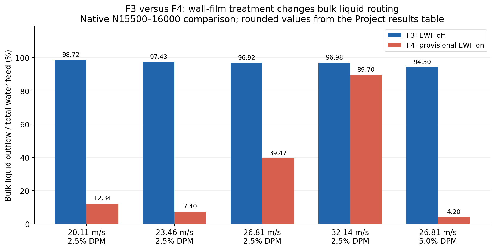

# Wall-liquid interaction: three existing comparisons

| Question | Bounded answer |
| --- | --- |
| Does wall treatment materially affect this model? | Yes. Roughness and explicit wall-film treatment change predicted bulk liquid flow through `steamoutlet`. |
| What can these figures establish? | Strong sensitivity of the represented liquid state to wall treatment. |
| What remains unproven? | Successful physical drainage, complete liquid accounting, converged separation efficiency, and agreement with plant measurements. |
| Suggested report statement | Wall-liquid treatment is a key modelling choice: changing wall roughness or adding an explicit film produces large changes in predicted steam-outlet liquid flow. |

## 1. Roughness and steam-outlet liquid flow


*Figure 1. R0–R11, common native-5586 parent; EWF off. Means use native 8087–8586. Outflow is plotted as positive: minus the stored Fluent phase-2 outlet flux. Lines connect tested settings; they are not fitted response models.*

| Evidence | Meaning / limit |
| --- | --- |
| R0–R7 height sweep | Small roughness initially increases outlet liquid flow; larger diagnostic heights reduce it. The response is not monotonic across the full range. |
| R0 → R7 | Mean outflow 24.37 → 13.63 kg/s; 44.09% decrease. |
| Fixed-height constant sweep | Increasing `C_s` decreases mean outlet flow at both tested heights. |
| Alternative explanation | R5–R7 lose about 162–187 kg of domain liquid during the child runs; reduced liquid availability can lower outlet flow. |
| Numerical limit | Source-inclusive balances remain open; R4/R9 oscillate. No-slip wall-surface velocity reports do not measure adjacent-fluid transport. |
| Owning result | [Family R results](../experiments/phase-07-2a-wall-liquid-routing/roughness-family/results.md). |

## 2. EWF-off baseline versus E2.7


*Figure 2. All 3,001 saved native report points, 5586–8586, without smoothing. Shading marks the final 500 iterations, 8087–8586. Both cases start from the same developed parent and retain smooth walls.*

| Evidence | Meaning / limit |
| --- | --- |
| Baseline | E0: EWF off. |
| Film treatment | E2.7: phase accretion and EWF Coupled Solution on; wall Flow Momentum Coupling off; fixed 10 µs film step and exploratory 0.3 m thickness cap. |
| Final-500 mean outflow | E0 24.369 kg/s; E2.7 1.735 kg/s; 92.88% decrease. |
| Interpretation | The phase-accretion film package strongly changes predicted bulk-liquid routing. This is a package comparison, not an isolated test of one film setting. |
| Accounting limit | Bulk liquid inventory also falls from about 296 to 63 kg. Film forms, but complete bulk/film/source/drain accounting and steady drainage remain unproven. |
| Coordinate limit | Native iteration is a solver coordinate, not physical carrier-flow time. |
| Owning result | [Family E results](../experiments/phase-07-2a-wall-liquid-routing/ewf-family/results.md). |

## 3. F3 versus F4 at the latest recorded endpoints



*Figure 3. Recorded N15500–16000 comparison; values are taken directly from the rounded Phase 8 results table. Each F3/F4 pair retains matched carrier controls, feed and DPM settings. The plotted numerator is Eulerian bulk-liquid steam-outlet flow; total water feed includes the allocated DPM feed.*

| Evidence | Meaning / limit |
| --- | --- |
| F3 / F4 delta | EWF off / provisional E2.7-based film package on. No absorber in either family. |
| Response | F4 has lower bulk-liquid outlet fractions at all five selected points; the size of the change depends strongly on speed and DPM share. |
| Comparison boundary | Compare bars within a pair. Do not combine these fractions with the absorber-equipped Phase 7.2A fluxes as one efficiency ranking. |
| Conservation limit | Recorded F4 mean absolute Eulerian boundary gaps are 4.82–55.48% of Eulerian feed. Film-transfer accounting and terminal DPM fates are incomplete. |
| Source availability | The current Project summary is present. Its linked N16000 raw batch/analysis files are absent from this checkout; this figure is a summary-table replot, not a fresh raw-run audit. |
| Owning result | [Phase 8 matched comparison](../experiments/phase-08-storyline-reconstruction/results.md#current-family-organization-and-matched-n16000-comparison). |

## Reproduction and source identity

| Artifact | Location |
| --- | --- |
| Plotting script | [plot_wall_liquid_interaction_comparisons.py](../../PyAnsys/scripts/analysis/plot_wall_liquid_interaction_comparisons.py) |
| Metrics, source hashes and table extraction | [plot-summary.json](../../PyAnsys/output/wall-liquid-interaction-comparison/plot-summary.json) |
| E0/E2.7 plotted values | [e0-e27-outflow.csv](../../PyAnsys/output/wall-liquid-interaction-comparison/e0-e27-outflow.csv) |
| Roughness input | [Recorded R0–R11 tail summary](../../PyAnsys/output/phase72a_family_r/analysis-20260923T054600Z-cs-sensitivity-v2/tail-summary.csv) |
| E0 input | [Saved report histories](../../PyAnsys/output/phase72a_ewf_family_e_student_20260922T115500Z/E0/report-histories.json) |
| E2.7 input | [Saved report histories](../../PyAnsys/output/phase72a_ewf_student_e27_run_20260923T071523Z/E2.7/report-histories.json) |
| Verification | Source parsing and native-coordinate completeness checks passed; all three exported images were visually inspected. No simulation was run. |

Reproduce from the repository root:

```sh
PyAnsys/.venv/bin/python PyAnsys/scripts/analysis/plot_wall_liquid_interaction_comparisons.py
```
