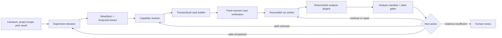

# Autonomous Fluent Loop Plan

## Status

- Date: `2026-07-24`
- State: Phase 1 lifecycle validated on Windows 11 with Fluent 2025 R2 and PyFluent 0.40.2; filesystem-backed `health_check` job protocol implemented for the next live test
- Primary implementation boundary: `PyAnsys/`
- First delivery target: one recoverable, verified vertical slice on one Fluent version and one accepted parent case

Initial Phase 1 files:

- `src/pyansys_fluent/host_worker.py`
- `src/pyansys_fluent/job_protocol.py`
- `scripts/orchestration/fluent_host_worker.py`
- `scripts/orchestration/submit_fluent_job.py`
- `tests/test_host_worker.py`
- `tests/test_job_protocol.py`
- `docs/FLUENT_HOST_WORKER.md`

## Repository Boundary Decision

Keep the automation system in `PyAnsys/`. It is the correct owner for executable orchestration, live Fluent discovery, machine-readable contracts, checkpoints, analysis artifacts, and claim-gate outputs.

The other repository systems remain inputs or human-facing records:

| System | Owns | Does not own |
|---|---|---|
| `PyAnsys/` | setup/run/analysis contracts, capability discovery, Fluent-host worker, staged execution, recovery, manifests, machine claim gates | literature interpretation and final project sign-off |
| `CFD_wiki/` | reusable physics, literature evidence, modelling guidance | job state or Fluent process control |
| `ResearchProject_wiki/` | project decisions, acceptance criteria, V&V interpretation, human sign-off | executable orchestration |
| `Setups/` | accepted case identity, setup lineage, report-facing setup snapshots | transient worker state or capability caches |

Only short links or summaries should cross those boundaries. A runtime job must not write a new `Setups/` branch merely because a probe or failed experiment ran.

## Core Design Rule

The agent chooses scientific intent and the next controlled change. A deterministic worker discovers, compiles, executes, verifies, recovers, and produces structured evidence.



The system must not ask a planning agent to interpret a run until the analysis manifest says the required evidence is complete. It must also be allowed to return `CONTINUE_ITERATIONS`, `REPAIR_SETUP`, `CAPABILITY_RESEARCH_REQUIRED`, or `HUMAN_REVIEW_REQUIRED` instead of always creating another setup.

## Constraints To Preserve

1. Setup construction and simulation running stay separate.
   - A setup build ends with a verified `.cas.h5`.
   - The autonomous runner starts from that verified case and owns paired case/data checkpoints.
   - The focused `scripts/setup/save_data_after_iterations.py` remains available for short supervised runs.
2. Fluent is treated as a dependency-ordered state machine.
3. Every mutation has preconditions, live inspection, readback, and a receipt.
4. Capabilities are keyed to the exact Fluent/PyFluent and case-state fingerprint; no deep path is assumed universal.
5. An unknown mutation is not retried repeatedly in a possibly damaged session.
6. The process that can restart Fluent runs on the Fluent Windows host.
7. Analysis requirements and required time histories are declared before solving.
8. Case persistence is proved by reopening the saved case in a fresh session.

## Proposed Contracts

Start with versioned JSON Schema plus Python dataclasses. YAML can be accepted as author input, but each job should store a normalized JSON copy.

### `SetupSpec`

Declares:

- experiment and parent setup identity;
- exact parent case artifact;
- controlled changes;
- values that must remain unchanged;
- required Fluent/case fingerprint;
- ordered setup stages;
- run policy;
- analysis contract reference;
- acceptance gates.

### `CapabilityFingerprint`

At minimum:

- full Fluent build/service pack and PyFluent version;
- solver mode, dimension, and precision;
- Settings API exposure level;
- active model families;
- phase count and materials;
- boundary names and types;
- relevant named objects such as DPM injections;
- source case hash or stable artifact identity.

### `CapabilityRecipe`

Records:

- semantic setting ID;
- required parent state;
- Settings API strategy;
- optional version-pinned TUI strategy;
- reacquire points;
- readback method and normalized comparison;
- evidence source;
- verification fingerprint and date;
- invalidation reason when a previously working recipe fails.

### `BuildReceipt`

Records each step's preconditions, strategy, requested value, observed value, failure class, checkpoint, duration, and artifact identity.

### `RunPolicy` And `RunState`

Declare chunk size, checkpoint interval, total budget, heartbeat/timeout policy, resume behavior, and initialization rule. A resumed job must never silently reinitialize.

### `AnalysisContract` And `AnalysisManifest`

Declare required, optional, and not-applicable analyses before the run. The manifest records artifact completion, blocking reasons, applicability, and `safe_for_interpretation`.

### `DecisionRecord`

Uses a bounded action vocabulary:

- `NEXT_EXPERIMENT`
- `CONTINUE_ITERATIONS`
- `RERUN_FROM_CHECKPOINT`
- `REPAIR_SETUP`
- `INCREASE_ANALYSIS_BUDGET`
- `CAPABILITY_RESEARCH_REQUIRED`
- `HUMAN_REVIEW_REQUIRED`
- `STOP_PROJECT_BRANCH`

## Proposed PyAnsys Layout

This is a target layout, not a request to move current modules immediately.

```text
PyAnsys/
├── contracts/
│   ├── schemas/
│   └── examples/
├── knowledge/fluent-settings/
│   ├── capabilities/
│   └── fingerprints/
├── src/pyansys_fluent/autonomy/
│   ├── contracts.py
│   ├── capability_resolver.py
│   ├── transactional_build.py
│   ├── host_protocol.py
│   ├── run_worker.py
│   ├── analysis_dispatch.py
│   ├── decision_gate.py
│   └── state_store.py
├── scripts/orchestration/
│   ├── submit_job.py
│   ├── fluent_host_worker.py
│   ├── probe_capability.py
│   ├── build_from_spec.py
│   ├── run_case_resumable.py
│   └── analyze_from_contract.py
└── tests/autonomy/
    ├── fixtures/
    └── ...
```

Runtime queues, heartbeats, transcripts, and generated manifests belong under a configured output/spool directory and must not become authoritative source files.

## Reuse Before New Code

The first implementation should adapt these existing components:

| Existing component | Intended reuse |
|---|---|
| `src/pyansys_fluent/connection.py` | connection bootstrap; split process ownership from client connection |
| `src/pyansys_fluent/dependency_workflow.py` | base for transactional steps and failure classification |
| `src/pyansys_fluent/settings_tree_mapper.py` | live capability snapshots and fingerprint inputs |
| `scripts/inspection/map_settings_tree.py` | initial capability-probe CLI |
| `src/pyansys_fluent/run_persistence.py` | checkpoint naming and resume concepts |
| `src/pyansys_fluent/setup_run.py` | chunked iteration mechanics |
| `src/pyansys_fluent/dpm_transcript.py` | command-specific completion predicates |
| `src/pyansys_fluent/postprocess_live.py` | carrier/DPM analysis plugin seed |
| `src/pyansys_fluent/ewf_*.py` | EWF applicability, audit, report, and bookkeeping plugin seeds |
| `scripts/inspection/compare_case_setup.py` | reopened-case semantic verification seed |

Known migration issues to resolve rather than copy:

- the worktree `.venv` reports `ansys-fluent-core 0.40.2`, while the shared repository interpreter currently reports `0.39.0` and the requirements file is unpinned; the Windows host must report its actual version before this branch selects a tested lock against the full Fluent build/service pack;
- `dependency_workflow.py` currently has one strategy per step, sequential execution only, and classifies a readback mismatch as manual cleanup too early;
- `connection.py` currently ties locally launched Fluent processes to Python `atexit`, which is not suitable for a persistent host supervisor;
- `run_persistence.py` mixes Fluent-visible Windows artifact paths with client-local `Path` discovery and does not yet guarantee atomic state writes;
- current run paths are split between reusable Settings API helpers and a focused TUI-only runner, so their contracts must be reconciled without merging setup construction into running;
- analysis tools emit useful JSON, but there is no shared applicability/completeness manifest across carrier, DPM, and EWF analyses.

## Delivery Phases

### Phase 0 — Contracts And Offline Test Harness

Deliver:

- versioned schemas and Python models;
- normalized JSON serialization;
- atomic job-state writes;
- fake Fluent session fixtures;
- state-transition tests;
- one example `SetupSpec` and `AnalysisContract`.

Exit gate:

- invalid specs fail before Fluent is contacted;
- interrupted state writes cannot leave a valid-looking partial manifest;
- all job transitions are replayable from receipts.

### Phase 1 — Fluent-Host Ownership And Recovery

Deliver:

- a persistent Windows host worker;
- job spool/queue protocol;
- process launch and PID ownership;
- server-info lifecycle;
- health and heartbeat checks;
- stage subprocess isolation;
- restart from the last verified checkpoint.

Start with a filesystem spool on the Fluent host unless deployment constraints require an HTTP service. Run it through Task Scheduler first; consider a Windows service only after the worker contract is stable.

Exit gate:

1. submit a short run;
2. terminate Fluent deliberately mid-run;
3. detect failure;
4. launch a new Fluent process;
5. reopen the latest verified checkpoint;
6. finish without physical intervention.

### Phase 2 — Versioned Capability Probe

Deliver:

- structured active children, commands, object names, active/read-only state, allowed values, and compact state;
- active queries and Settings API exposure level;
- case/model fingerprinting;
- minimal targeted probes;
- verified capability recipe cache;
- capability invalidation when readback or live shape changes;
- Python-journal-assisted discovery workflow for difficult GUI actions.

Exit gate:

- a clean session can prove how to read and write one selected setting;
- a fresh session can replay it and verify readback;
- a mismatched fingerprint refuses unsafe reuse.

The probe should prefer `get_active_child_names()`, `get_active_command_names()`, and `get_active_query_names()` over `dir()`. Production recipes should default to stable exposure; any alpha/beta discovery must be isolated and labelled unsupported until deliberately accepted.

### Phase 3 — Transactional Setup Compiler

Deliver:

- `SetupSpec` compilation into the existing global stage order;
- preconditions and idempotency checks;
- ordered Settings API/TUI strategies;
- per-step receipts;
- stage checkpoints;
- final fresh-session reopen and semantic diff.

Exit gate:

- one child case changes exactly one controlled inlet-setting family;
- preserved fields match the parent;
- saved state survives reopen;
- a failed step does not corrupt the accepted parent artifact.

### Phase 4 — Autonomous Resumable Runner

Deliver:

- a new `run_case_resumable.py`; do not overload the focused runner;
- explicit initialize-versus-resume behavior;
- chunked solve, heartbeat, checkpoint, timeout, and recovery;
- final case/data visibility and reopen checks;
- atomic run-state manifest.

Exit gate:

- forced client and Fluent failures resume from the highest verified pair;
- completed-iteration accounting is monotonic;
- a resumed case is never initialized again.

A checkpoint is committed only after both artifacts exist, their sizes stabilize, and a fresh session can reopen the pair and confirm identity/iteration metadata. Prefer Fluent's paired case/data write when the target version and path contract support it.

### Phase 5 — Analysis Contracts And Plugins

Deliver:

- applicability and completion interfaces;
- carrier, residual, DPM, and EWF plugins built from current tools;
- monitor/report-definition installation before solving;
- one `analysis_manifest.json`;
- deterministic block on incomplete required evidence.

Exit gate:

- carrier-only jobs mark DPM/EWF as not applicable;
- DPM jobs require all selected live injections and complete transcript predicates;
- EWF claims are blocked when required time histories were not configured;
- the agent receives structured evidence only after `safe_for_interpretation=true`.

### Phase 6 — Evidence-Gated Planning Loop

Deliver:

- result-to-decision mapping;
- project claim-gate integration;
- next-`SetupSpec` proposal with controlled-change diff;
- approval policy that can be tightened gradually.

Exit gate:

- a dry-run loop chooses correctly among new experiment, continue, repair, capability research, and human review;
- no setup is launched when its evidence or capability prerequisites are open.

## First Vertical Slice

Use the existing setup `08b` parity parent to compile one setup `08c` carrier-only loading endpoint on one exact Fluent build. The recommended first slice is:

```text
verified parity-parent .cas.h5
→ one controlled split-inlet loading/velocity change
→ readback receipt
→ child .cas.h5
→ fresh-session reopen and parent/child diff
→ initialization
→ recoverable short run
→ residual + carrier-flux analysis
→ structured decision
```

This should precede autonomous DPM/EWF mutation. It exercises every infrastructure boundary while avoiding the currently unresolved DPM incomplete-track and EWF inventory/closure problems. The second slice can add one-way DPM analysis on a stable carrier parent; EWF should follow only after time-history requirements and film-inventory gates are explicit.

Because setup `08b` is not yet a numerically accepted baseline, this first slice proves automation and reproducibility only. A correct outcome may be `REPAIR_SETUP` with a `Debug only` claim ceiling; it must not manufacture an inlet-velocity performance claim.

Before implementation, select and record:

- the exact parent case/data artifact;
- Fluent and PyFluent versions;
- the one semantic inlet setting to vary;
- preserved-field diff scope;
- iteration and checkpoint budget;
- carrier acceptance thresholds.

## First Implementation Pull Request

Keep the first code change offline and reversible:

1. add contract schemas and examples;
2. add contract parsing/validation;
3. add atomic state storage and state-machine tests;
4. adapt `WorkflowStepResult` into a serializable receipt without changing live behavior;
5. record the full Fluent build and pin/lock the PyFluent version proven against it;
6. document the Windows worker deployment decision;
7. add no automatic next-experiment execution yet.

The next pull request can add host ownership and the forced-crash recovery test.

## Deferred Decisions

- exact queue transport after the filesystem-spool prototype;
- Task Scheduler versus Windows service for long-term deployment;
- whether capability recipes are hand-reviewed before first reuse;
- exact scheduler that wakes the planning agent;
- retention policy for large case/data checkpoints and transcripts;
- when human approval can be removed from setup execution.

## Program-Level Definition Of Done

The loop is autonomous only when it can:

1. prove the requested setting strategy against the live case state;
2. build and reopen a child case with a controlled diff;
3. recover from a killed Fluent process without physical access;
4. resume without reinitializing or losing completed work;
5. produce a complete, applicable analysis manifest;
6. select a bounded next action using evidence gates;
7. preserve setup lineage and project sign-off outside the runtime system.

Until all seven are demonstrated, describe the system as partially automated rather than unattended.

## Official API Anchors

- [PyFluent solver settings and active-state inspection](https://fluent.docs.pyansys.com/version/stable/user_guide/solver_settings/solver_settings_contents.html)
- [PyFluent journaling](https://fluent.docs.pyansys.com/version/stable/user_guide/journal.html)
- [PyFluent TUI commands](https://fluent.docs.pyansys.com/version/stable/user_guide/legacy/tui.html)
- [Launching and connecting to Fluent](https://fluent.docs.pyansys.com/version/stable/user_guide/session/launching_ansys_fluent.html)
- [PyFluent event streaming](https://fluent.docs.pyansys.com/version/stable/api/streaming_services/events_streaming.html)
- [Fluent case/data write API](https://fluent.docs.pyansys.com/version/stable/api/solver/_autosummary/settings/write_case_data.html)

These pages establish available primitives, not end-to-end crash recovery. Process restart, checkpoint commitment, and job recovery remain responsibilities of the proposed host worker.
