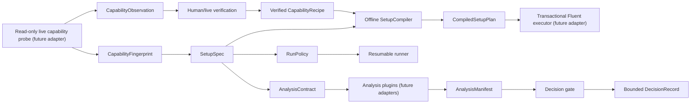

# Autonomy Phases 2–6 Scaffold

## Purpose

This package establishes offline contracts and safety gates for the work after
Fluent-host recovery. It does not connect to Fluent, mutate a case, run a
simulation, invoke analysis tools, or schedule another experiment.

The active live interruption/resume test remains anchored to commit `e9c5b2a`.
The scaffold is additive and does not change the version-3 host job protocol.

## Data Flow

## Implemented Offline Components

| Phase | Scaffold | Current boundary |
|---|---|---|
| 2 | `CapabilityFingerprint`, `CapabilityObservation`, fingerprint-pinned `CapabilityRecipe`, safe registry resolution and invalidation | no live tree traversal or recipe verification |
| 3 | `SetupSpec`, `ControlledChange`, deterministic stage ordering, verified-recipe resolution, compiled readback-required steps | no Fluent mutation or checkpoint writing |
| 4 | explicit `RunPolicy` with initialize/resume and checkpoint-reopen intent | live `resumable_run` exists separately; fresh-session checkpoint reopen is still missing |
| 5 | `AnalysisContract`, applicability, completion predicates, normalized `AnalysisManifest`, deterministic interpretation block | existing carrier/DPM/EWF tools are not registered as plugins yet |
| 6 | bounded `DecisionContext` and `DecisionRecord` with deterministic priority ordering | no scheduler, no automatic setup proposal, and `NEXT_EXPERIMENT` always requires approval |

Source:

- `src/pyansys_fluent/autonomy/common.py`
- `src/pyansys_fluent/autonomy/capability.py`
- `src/pyansys_fluent/autonomy/setup.py`
- `src/pyansys_fluent/autonomy/analysis.py`
- `src/pyansys_fluent/autonomy/decision.py`

Tests:

- `tests/test_autonomy_scaffold.py`

Example:

- `contracts/examples/08c-carrier-autonomy-scaffold.json`

## Safety Invariants

1. Unknown contract fields and unsupported schema versions fail validation.
2. A capability recipe is unusable unless `verified=true`.
3. A verified recipe is usable only with its exact fingerprint digest.
4. Invalidated recipes cannot be resolved.
5. A semantic setting cannot be both controlled and preserved.
6. The compiler emits ordered instructions only; it has no Fluent connection.
7. Every compiled mutation step requires readback.
8. The compiled plan requires fresh-session reopen verification.
9. Required analyses must declare explicit completion predicates.
10. Missing required results or predicates set
    `safe_for_interpretation=false`.
11. Undeclared analysis outputs are rejected.
12. The decision gate can return only the bounded project action vocabulary.
13. `NEXT_EXPERIMENT` is a proposal requiring approval, not an execution
    command.

## Bounded Decision Priority

The current dry-run gate evaluates in this order:

1. explicit project stop;
2. explicit human-review blocker;
3. missing or mismatched capability;
4. unverified setup;
5. failed/interrupted run;
6. non-converged run;
7. incomplete required analysis;
8. inadequate evidence;
9. next-experiment proposal.

This ordering prevents an incomplete run or analysis from being hidden by a
scientifically plausible next experiment.

## Example Status

`08c-carrier-autonomy-scaffold.json` is intentionally non-executable:

- the parent path and hashes are placeholders;
- its setting target is `UNVERIFIED_LIVE_PATH_REQUIRED`;
- its capability recipe has `verified=false`;
- DPM and EWF are explicitly not applicable to the carrier-only first slice;
- no automatic executor consumes this file.

The example proves serialization and cross-contract identity only.

## Next Implementation Order

After the live forced-interruption test passes:

1. Build the Phase 2 read-only adapter around
   `settings_tree_mapper.py`.
2. Save one real Fluent 2025 R2 fingerprint and targeted setting observation.
3. Verify one setting recipe through live readback and a fresh disposable
   session.
4. Replace the example's unverified target with that evidence-backed recipe.
5. Compile one `08b` to `08c` controlled-change plan without executing it.
6. Add a dry-run executor that records preconditions and intended readbacks.
7. Only then add one live controlled mutation and fresh-session semantic diff.
8. Register carrier/residual analysis plugins before introducing DPM or EWF.

Do not connect this scaffold to the host job dispatcher until the Phase 2
fingerprint and recipe-invalidation behavior have passed live tests.
