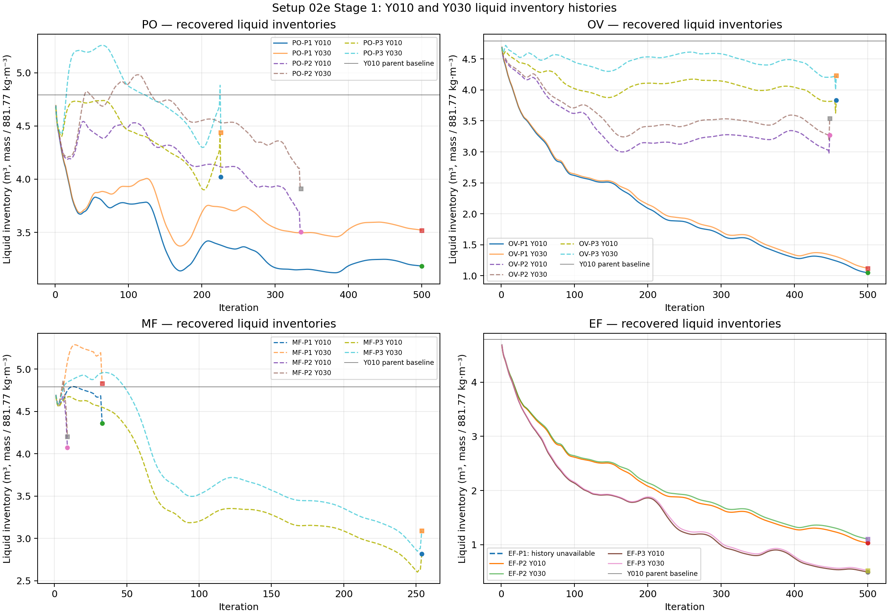
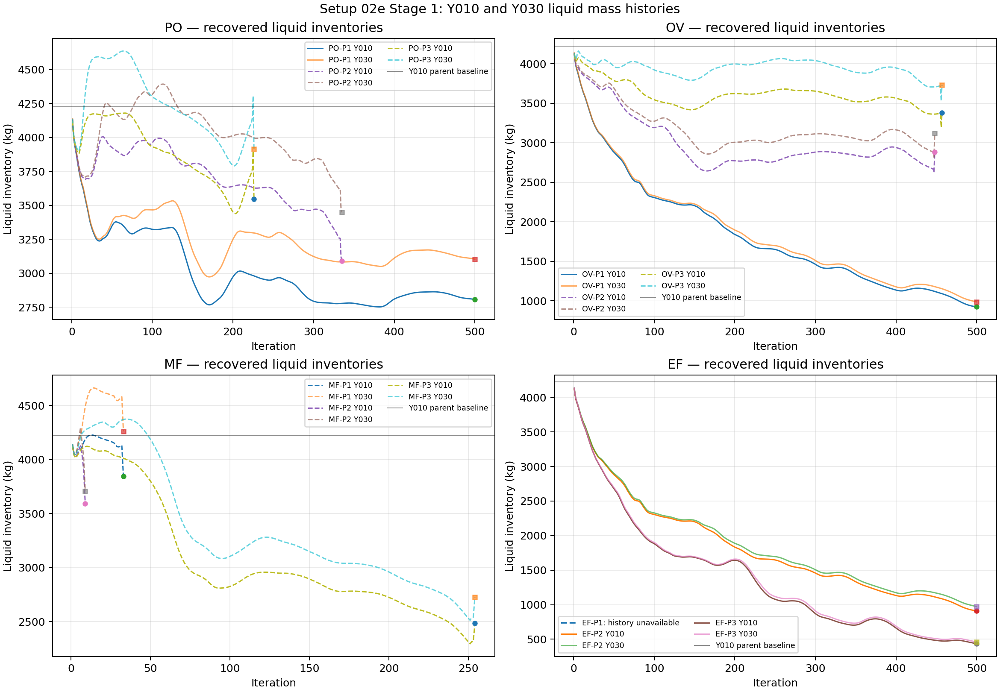
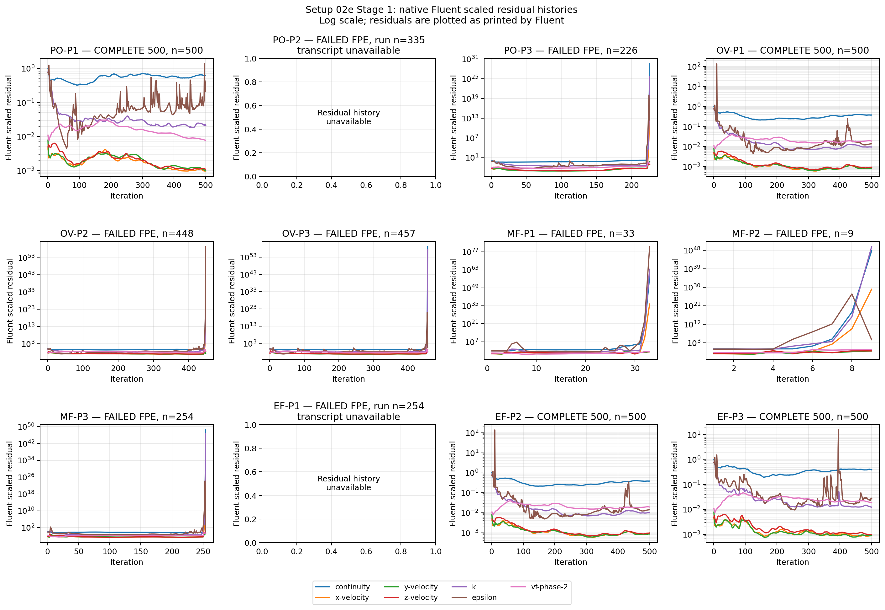

# Setup 02e Stage-1 results — 2026-08-16

Status: **Stage 1 complete; the original automatic Stage 2 was not generated. A targeted four-case Stage 2 has now been selected from the Stage-1 evidence and has not yet been run.**

Interpretation status: **execution and evidence-quality results are recorded; user interpretation has selected Pressure Outlet (`PO`) and Outlet Vent (`OV`) for targeted follow-up.**

This report covers the original `Full-geomV2-231kcells.msh.h5` campaign. The four-case 275k-mesh retry remains a separate recovery note and is not mixed into the original 12-case comparison.

---

## Executive Stage-1 outcome

Twelve Stage-1 pilot calculations were attempted from independently built children of the common Y010 initialization. Four reached the planned 500 iterations and eight terminated with floating-point exceptions. The recovered native report histories also establish `MF-P3` as failing at iteration 254 rather than completing 500.

No outlet family produced three complete pilot histories, so the original automatic three-point Stage-2 rule correctly returned:

```text
STAGE2_NOT_GENERATED
reason = incomplete three-point pilot set
```

That formal result is retained. It is not being retroactively reclassified as a successful three-point response study.

Stage 1 nevertheless gives enough coarse evidence to narrow the next experiment manually. The two families selected for targeted follow-up are:

- **Pressure Outlet (`PO`)** — stable anchor at `1.160 MPa`, with failure beginning by `1.200 MPa`;
- **Outlet Vent (`OV`)** — stable anchor at `K=0`, with a late failure at `K=10`.

Mass-Flow Outlet (`MF`) and Exhaust Fan (`EF`) are not allocated additional Stage-2 cases in the current plan.

The central Stage-1 physical/numerical observation is that every completed finite case had a strongly negative measured liquid balance and a declining lower-region liquid inventory. The stable anchors therefore behave as **over-draining reference cases**, not as established operating points.

---

## 1. Purpose and original Stage-1 matrix

Setup 02e compared four built-in brine-outlet formulations while holding the Mixture model, inlet conditions, steam outlet, numerical settings, mesh, and initialized lower-liquid state fixed.

| Family | Stage-1 pilot controls |
|---|---|
| Pressure Outlet (`PO`) | `1.160`, `1.200`, `1.240 MPa` gauge |
| Outlet Vent (`OV`) | `K=0`, `K=10`, `K=100` |
| Mass-Flow Outlet (`MF`) | `58.4235`, `116.847`, `233.694 kg/s` liquid; vapour target `0 kg/s` |
| Exhaust Fan (`EF`) | `-50`, `0`, `+50 kPa` pressure jump |

Each child was intended to receive one Fluent-native 500-iteration solve. Failed cases were preserved as failed numerical experiments rather than rescued by case-specific solver tuning.

---

## 2. Common initialized state

All original children were built independently from the same saved Y010 parent.

| Quantity | Measured value |
|---|---:|
| Mesh cells | `231,376` |
| Y010 selected cells | `33,315` |
| Y010 geometric selected-cell volume | `4.829410214 m³` |
| Initial Y010 liquid volume, `V_l,Y010(0)` | `4.790652590 m³` |
| Initial Y010 liquid mass | `4224.253734 kg` |

The official initialization reference is:

\[
V_{l,Y010}(0)=4.790652590\ \mathrm{m^3}.
\]

The recovered history files contain Y010/Y030 liquid mass and phase-separated outlet fluxes. The Stage-1 monitor package did **not** preserve a total-domain liquid report, so Stage 1 cannot distinguish all lower-region redistribution from true total-domain depletion using inventory alone.

Interpret the inventories separately:

```text
Y010 change → movement out of the originally patched lower region
Y030 change → movement out of the broader y ≤ 0.30 m lower region
total-domain liquid → unavailable in Stage 1
phase outlet fluxes → measured phase routing through boundaries
```

---

## 3. Execution outcome

| Case | Control | Run status | Iterations reached |
|---|---:|---|---:|
| `PO-P1` | `1.160 MPa` | `COMPLETE_500` | 500 |
| `PO-P2` | `1.200 MPa` | `FAILED_FPE` | 335 |
| `PO-P3` | `1.240 MPa` | `FAILED_FPE` | 226 |
| `OV-P1` | `K=0` | `COMPLETE_500` | 500 |
| `OV-P2` | `K=10` | `FAILED_FPE` | 448 |
| `OV-P3` | `K=100` | `FAILED_FPE` | 457 |
| `MF-P1` | `58.4235 kg/s` | `FAILED_FPE` | 33 |
| `MF-P2` | `116.847 kg/s` | `FAILED_FPE` | 9 |
| `MF-P3` | `233.694 kg/s` | `FAILED_FPE` | 254 |
| `EF-P1` | `-50 kPa` | `FAILED_FPE` | 254 |
| `EF-P2` | `0 kPa` | `COMPLETE_500` | 500 |
| `EF-P3` | `+50 kPa` | `COMPLETE_500` | 500 |

Overall: **4/12 completed 500 iterations; 8/12 terminated with FPEs.**

The recovered native report histories provide Y010/Y030 and phase-flux histories for 11 original cases. The original `EF-P1` report history was not preserved.

---

## 4. Liquid inventory results

Liquid volumes below are derived from recovered liquid mass using the frozen liquid density `881.77 kg/m³`. Complete-run statistics use iterations `401–500`. Failed cases show last-valid/pre-FPE evidence and are **not equivalent endpoints**.

| Case | Basis | Y010 last m³ | ΔY010 | Y030 last m³ | ΔY030 | Final-window observation |
|---|---|---:|---:|---:|---:|---|
| `PO-P1` | 401–500 | 3.184082 | −33.54% | 3.519948 | −26.52% | both lower-region inventories still declining slightly |
| `PO-P2` | last 20, 316–335 | 3.504458 | −26.85% | 3.910319 | −18.38% | declining before FPE |
| `PO-P3` | last 20, 207–226 | 4.021516 | −16.05% | 4.439510 | −7.33% | increasing immediately before FPE |
| `OV-P1` | 401–500 | 1.048469 | −78.11% | 1.120053 | −76.62% | still decreasing |
| `OV-P2` | last 20, 429–448 | 3.268832 | −31.77% | 3.540378 | −26.10% | decreasing before FPE |
| `OV-P3` | last 20, 438–457 | 3.836424 | −19.92% | 4.234491 | −11.61% | bounded/oscillatory before FPE |
| `MF-P1` | last 20, 14–33 | 4.359627 | −9.00% | 4.831079 | +0.84% | failed too early for endpoint comparison |
| `MF-P2` | last 9, 1–9 | 4.072051 | −15.00% | 4.203286 | −12.26% | failed almost immediately |
| `MF-P3` | last 20, 235–254 | 2.815726 | −41.22% | 3.093426 | −35.43% | bounded/oscillatory before FPE |
| `EF-P1` | unavailable | unavailable | unavailable | unavailable | unavailable | history not preserved |
| `EF-P2` | 401–500 | 1.032552 | −78.45% | 1.103924 | −76.96% | still decreasing |
| `EF-P3` | 401–500 | 0.492739 | −89.71% | 0.521181 | −89.12% | still decreasing |

The recovered inventory histories are shown below in both derived liquid
volume and liquid mass form. Solid lines are complete 500-iteration cases;
dashed lines are pre-FPE histories. Circle and square markers identify the
last Y010 and Y030 values, respectively. The horizontal line is the common
Y010 parent baseline.





Native Fluent scaled residual histories are also included as one panel per
case. Each panel uses its own logarithmic y-scale so that the complete cases
remain readable while the many-orders-of-magnitude residual blow-up before
several FPEs remains visible. The plotted values are the scaled residuals as
printed by Fluent; no additional normalization has been applied. Residual
transcripts were available for 10 of 12 cases. `PO-P2` and `EF-P1` are marked
unavailable because their original transcripts were not preserved in the
recovered local bundle.



The failed-case inventories are useful only as pre-FPE context because each
case stops at a different iteration. They must not be interpreted as
comparable steady or converged states.

---

## 5. Phase-flux and liquid-balance results

For complete cases, values below are means over iterations `401–500`. For failed cases, last-valid values are retained only as failure diagnostics where reported. Fluent-native outlet signs were converted to the outward-positive convention.

Define:

\[
L=\bar{\dot m}_{l,in}-\bar{\dot m}_{l,brine}-\bar{\dot m}_{l,steam}.
\]

| Case | Basis | Liquid in kg/s | Liquid → brine kg/s | Liquid → steam kg/s | `L` kg/s | Vapour → brine kg/s | Vapour → steam kg/s | Interpretation |
|---|---|---:|---:|---:|---:|---:|---:|---|
| `PO-P1` | 401–500 | 116.921 | 2063.635 | 271.604 | −2218.318 | 8.027 | 57.922 | finite complete run; very strong measured liquid depletion |
| `PO-P2` | last valid, 335 | 116.921 | corrupted | corrupted | corrupted | corrupted | corrupted | numerical blow-up before FPE |
| `PO-P3` | last valid, 226 | 116.921 | corrupted | corrupted | corrupted | corrupted | corrupted | numerical blow-up before FPE |
| `OV-P1` | 401–500 | 116.921 | 696.923 | 1.024 | −581.026 | 12.446 | 64.315 | finite complete run; strong measured liquid depletion |
| `OV-P2` | last valid, 448 | 116.921 | corrupted | corrupted | corrupted | corrupted | corrupted | numerical blow-up before FPE |
| `OV-P3` | last valid, 457 | 116.921 | corrupted | corrupted | corrupted | corrupted | corrupted | numerical blow-up before FPE |
| `MF-P1` | last valid, 33 | 116.921 | corrupted | corrupted | corrupted | corrupted | corrupted | numerical blow-up before FPE |
| `MF-P2` | last valid, 9 | 116.921 | corrupted | corrupted | corrupted | corrupted | corrupted | numerical blow-up before FPE |
| `MF-P3` | last valid, 254 | 116.921 | 155.640 | 0 | −38.719 | 0.507 | corrupted | liquid fluxes finite but vapour field already corrupted |
| `EF-P1` | unavailable | unavailable | unavailable | unavailable | unavailable | unavailable | unavailable | report history unavailable |
| `EF-P2` | 401–500 | 116.921 | 694.980 | 1.082 | −579.141 | 12.427 | 64.343 | finite complete run; strong measured liquid depletion |
| `EF-P3` | 401–500 | 116.921 | 683.589 | 1.195 | −567.863 | 30.353 | 46.665 | liquid drainage remains high; vapour leakage increases |

The complete finite cases are internally consistent: negative measured `L` occurs together with declining lower-region inventory. In a steady iterative calculation this should be read as a **directional numerical/flow-balance observation**, not as literal kilograms of inventory lost per physical second of iteration.

Two comparisons are particularly useful:

1. `OV-P1 (K=0)` and `EF-P2 (0 kPa)` give nearly identical complete-run liquid and vapour routing, providing a useful internal consistency check on the recovered measurements.
2. Moving from `EF-P2` to `EF-P3 (+50 kPa)` only modestly reduces liquid-to-brine flow (`694.980 → 683.589 kg/s`) while vapour-to-brine flow increases substantially (`12.427 → 30.353 kg/s`). This does not make EF attractive for the next limited run budget.

---

## 6. Failure diagnostics and evidence limitations

The FPEs are a material Stage-1 result. Preserved evidence includes floating-point exceptions and, where available, reversed-flow and turbulent-viscosity-limiting warnings before terminal failure.

Supported numerical statements include:

- higher-pressure PO pilots failed while `PO-P1` completed;
- `OV-P1` completed while `K=10` and `K=100` failed late;
- all three MF pilots failed;
- `EF-P1` failed while `EF-P2` and `EF-P3` completed; and
- eight cases failed before the requested 500-iteration endpoint.

Major evidence limitations are:

- no total-domain liquid history was configured in Stage 1;
- `EF-P1` original inventory/flux history was not preserved;
- failed cases do not provide valid final-100 endpoints; and
- pre-FPE inventories from different stopping iterations cannot be treated as directly comparable final states.

---

## 7. Original automatic Stage-2 gate

The original setup required three complete finite pilot histories in a family before automatic Stage-2 generation.

| Family | P1 complete? | P2 complete? | P3 complete? | Original automatic result |
|---|---|---|---|---|
| `PO` | Yes | No | No | `STAGE2_NOT_GENERATED` |
| `OV` | Yes | No | No | `STAGE2_NOT_GENERATED` |
| `MF` | No | No | No | `STAGE2_NOT_GENERATED` |
| `EF` | No | Yes | Yes | `STAGE2_NOT_GENERATED` |

Therefore:

\[
\boxed{\text{No family satisfied the original automatic Stage-2 gate.}}
\]

That decision remains correct for the original algorithm.

---

## 8. User interpretation and revised Stage-2 direction

The next stage is no longer an automatically generated four-case extension per family. Instead, Stage 1 is treated as a coarse screening experiment and the available run budget is concentrated on the two most useful stable-to-failure transition intervals.

### 8.1 Pressure Outlet selected interval

`PO-P1 = 1.160 MPa` is the stable Stage-1 anchor. It completed 500 iterations but removed liquid far more aggressively than the inlet supply and still showed declining Y010/Y030 inventory.

`PO-P2 = 1.200 MPa` failed at iteration 335. Therefore the interval between `1.160` and `1.200 MPa` is selected for targeted probing rather than jumping to the old high-side extension bank.

Selected cases:

| Case | Brine pressure | Purpose |
|---|---:|---|
| `02e-PO-S2-A` | `1.175 MPa` gauge | moderate increase above the stable anchor |
| `02e-PO-S2-B` | `1.190 MPa` gauge | probe closer to the Stage-1 failure boundary |

Question:

> Does moderate additional brine backpressure reduce excessive liquid drainage and improve lower-region retention before the numerical instability observed at `1.200 MPa` is reached?

### 8.2 Outlet Vent selected interval

`OV-P1 = K=0` is the stable Stage-1 anchor. It completed 500 iterations and had low liquid carryover to the steam outlet, but brine liquid outflow remained roughly six times the liquid inlet rate and Y010/Y030 inventory fell strongly.

`OV-P2 = K=10` failed relatively late at iteration 448. Therefore the interval between `K=0` and `K=10` is selected for targeted probing.

Selected cases:

| Case | `K` | Purpose |
|---|---:|---|
| `02e-OV-S2-A` | `3` | modest added outlet resistance |
| `02e-OV-S2-B` | `7` | stronger resistance below the Stage-1 failure point |

Question:

> Does moderate outlet resistance reduce excessive liquid drainage and improve retained liquid inventory without reproducing the late numerical failure observed at `K=10`?

### 8.3 Families not continued

**Mass-Flow Outlet (`MF`)** is not continued because all three Stage-1 cases failed and two failed almost immediately.

**Exhaust Fan (`EF`)** is not continued because it is a diagnostic pressure-jump formulation rather than the preferred physical abstraction, and the completed `+50 kPa` case did not improve the liquid-routing problem enough to justify prioritising it over PO/OV. Vapour leakage to the brine outlet also increased materially relative to `EF-P2`.

---

## 9. Required Stage-2 evidence

All four Stage-2 children must start independently from the unchanged saved Y010 parent and attempt the same 500 steady iterations.

Retain:

- Y010 liquid inventory history;
- Y030 liquid inventory history;
- liquid inlet / brine outlet / steam outlet phase flows;
- vapour inlet / brine outlet / steam outlet phase flows; and
- residual histories.

Stage 2 must additionally add the missing total-domain liquid monitor:

\[
\boxed{V_{l,total}=\int_V\alpha_l\,dV}
\]

so that lower-region redistribution can be separated from total-domain liquid depletion or accumulation.

Where reproducible, also record:

- brine-pipe-entry average/min/max static pressure;
- brine-outlet area-averaged normal velocity;
- mixture density at the brine outlet;
- reverse-flow area fraction; and
- total brine mass flow.

For complete runs, report final-100-iteration means. For failed runs, preserve last-valid histories but do not treat them as equivalent completed endpoints.

There is **no automatic success threshold and no automatic winner**. The Stage-2 purpose is to determine whether either PO or OV provides a numerically survivable region with less aggressive liquid removal and more useful liquid-retention behaviour.

---

## 10. Brief 275k-mesh retry note

Four selected failed cases—`PO-P2`, `OV-P2`, `MF-P2`, and `EF-P1`—were retried on `brine-outlet-275kcells.msh.h5` with 275,448 cells. All four again terminated with native floating-point exceptions and produced no usable complete endpoint.

The retry therefore did not establish improved endpoint robustness and does not alter the original 231k Stage-1 evidence or the selected four-case follow-up.

The separate 275k recovery record is not present in this repository; the retained machine-readable and native execution evidence is linked below.

---

## 11. Evidence and lineage

- Governing setup: [`02e-mixture-y010-brine-outlet-boundary-characterization.md`](../../../../../full-geometry/mixture/steady-liquid-outlet/02e-mixture-y010-brine-outlet-boundary-characterization.md)
- Initialized parent: [`02e_y010_parent_20260816T063000Z.json`](../../../../../../PyAnsys/output/02e_y010_parent_20260816T063000Z.json)
- Complete child-build snapshot: [`02e_stage1_all_build_20260816T064500Z.json`](../../../../../../PyAnsys/output/02e_stage1_all_build_20260816T064500Z.json)
- Stage-1 monitor snapshot: [`02e_stage1_monitor_state.json`](../../../../../../PyAnsys/output/02e_stage1_monitor_state.json)
- Native queue journal: [`02e_stage1_native_queue_20260816T071500Z.jou`](../../../../../../PyAnsys/output/02e_stage1_native_queue_20260816T071500Z.jou)
- Execution/continuation record: see the linked native queue journal and recovered machine-readable summary above.
- Recovered machine-readable summary: [`02e_stage1_inventory_flux_summary_20260816.json`](../../../../../../PyAnsys/output/02e_stage1_recovered_reports_20260816/02e_stage1_inventory_flux_summary_20260816.json)
- Compact recovered CSV: [`02e_stage1_inventory_flux_summary_20260816.csv`](../../../../../../PyAnsys/output/02e_stage1_recovered_reports_20260816/02e_stage1_inventory_flux_summary_20260816.csv)
- Offline extraction script: [`analyze_02e_stage1_histories.py`](../../../../../../PyAnsys/scripts/inspection/analyze_02e_stage1_histories.py)
- Separate 275k retry: no standalone report file is present in this repository.

The raw recovered `.out` histories remain in the linked recovery bundle and were not regenerated by running Fluent. The original `EF-P1` history and the Stage-1 total-domain liquid history remain unavailable.

---

## 12. Current campaign direction

The active Setup 02e Stage 2 is now fixed to:

```text
PO: 1.175 MPa, 1.190 MPa
OV: K=3, K=7
MF: no Stage-2 cases
EF: no Stage-2 cases
```

The result of these four cases will determine whether subsequent work should refine Pressure Outlet, Outlet Vent, both, or neither. That decision remains a user interpretation step rather than an automatic ranking.
