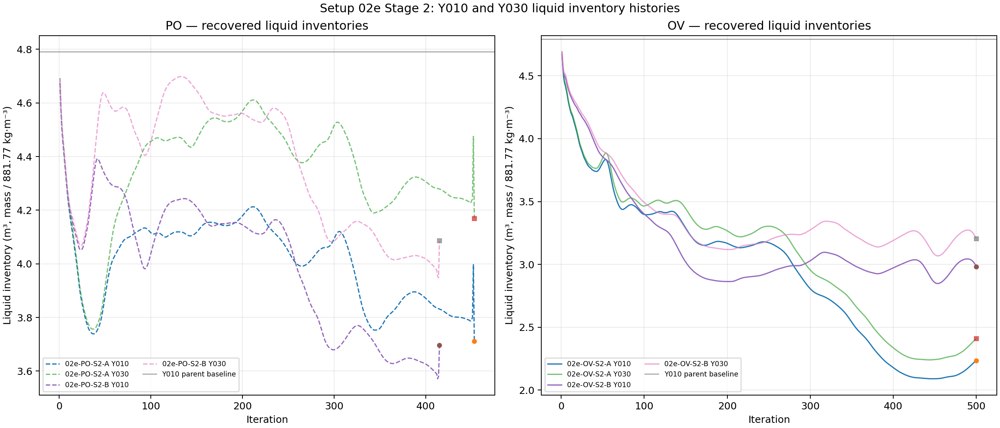
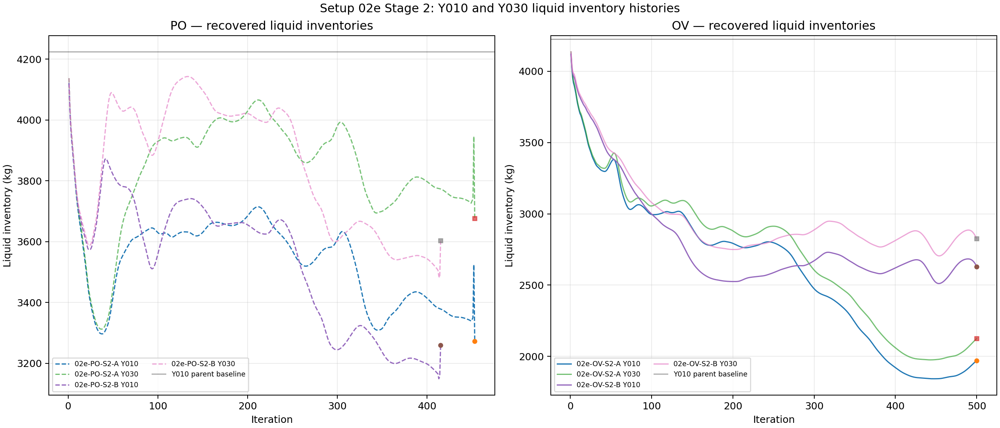
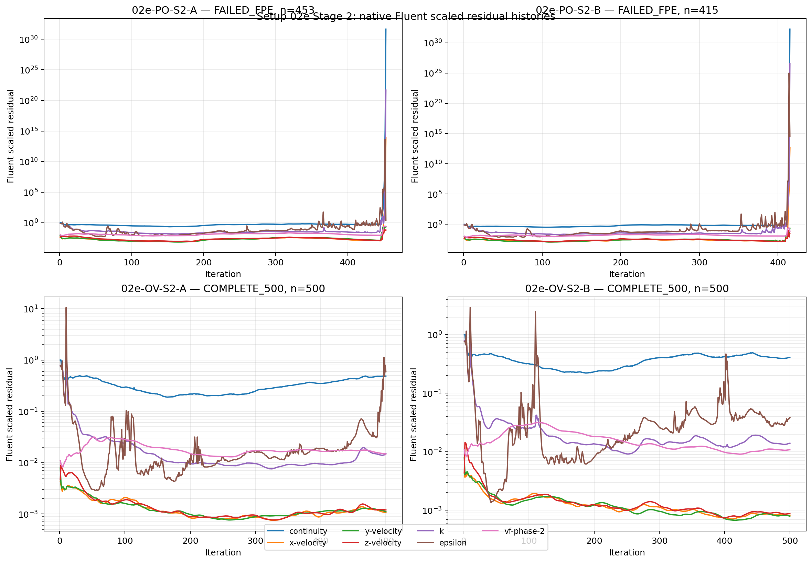

# Setup 02e Stage-2 results — 2026-08-16

Status: **Stage 2 complete as an execution campaign; 2/4 cases completed 500 iterations and 2/4 terminated with floating-point exceptions. No numerical winner or physical operating-point claim is established.**

Interpretation status: **execution and evidence-quality results are recorded; user interpretation remains required. The two Outlet Vent cases are the only complete Stage-2 endpoints, but their measured liquid balances still indicate strong liquid removal.**

This report covers the four targeted Stage-2 children selected from the original 231,376-cell Setup 02e campaign. Each child was created independently from the unchanged initialized Y010 parent. No child-to-child continuation was used.

---

## Executive Stage-2 outcome

Four targeted Stage-2 calculations were built and each was given one native Fluent attempt at the planned 500 steady iterations. The two Pressure Outlet cases terminated with floating-point exceptions after residual and flux blow-up. Both Outlet Vent cases reached iteration 500 and wrote paired case/data endpoints.

| Family | Cases | Execution result |
|---|---|---|
| Pressure Outlet (`PO`) | `1.175`, `1.190 MPa` gauge | both `FAILED_FPE`, at iterations `453` and `415` |
| Outlet Vent (`OV`) | `K=3`, `K=7` | both `COMPLETE_500` |

The completed OV endpoints do not demonstrate a satisfactory liquid-retention state. Their recovered final-100 means are:

- `OV K=3`: Y010 `2.123514 m³`, Y030 `2.280242 m³`, total-domain liquid volume `3.287270 m³`, and liquid balance `L = −545.702 kg/s`;
- `OV K=7`: Y010 `2.974293 m³`, Y030 `3.198925 m³`, total-domain liquid volume `4.629215 m³`, and liquid balance `L = −480.950 kg/s`.

Both complete cases retain the Stage-1 observation that measured liquid outflow is much larger than measured liquid inflow. The new total-domain monitor shows that the complete OV cases differ in total-domain liquid inventory, but neither result should be called converged or physically validated solely because it reached 500 iterations.

The PO cases are failure-boundary evidence, not endpoint comparisons. Their Y010 last valid values were `3.711084 m³` and `3.696881 m³`, but their phase-flux reports were already numerically corrupted when Fluent raised the floating-point exceptions.

---

## 1. Purpose and Stage-2 matrix

Stage 2 probes the two Stage-1 families that supplied a complete low-side anchor and a nearby failure boundary. All other physics, mesh, initialization, inlet conditions, steam outlet, and numerical settings remain frozen as specified by the governing setup.

| Family | Stage-1 evidence used for selection | Stage-2 controls | Purpose |
|---|---|---|---|
| Pressure Outlet (`PO`) | `PO-P1 = 1.160 MPa` completed; `PO-P2 = 1.200 MPa` failed at `335` | `1.175`, `1.190 MPa` gauge | probe the interval between the stable low-side anchor and the Stage-1 failure point |
| Outlet Vent (`OV`) | `OV-P1 = K=0` completed; `OV-P2 = K=10` failed at `448` | `K=3`, `K=7` | probe the interval below the Stage-1 failure point |

Each case was intended to receive 500 steady iterations with no automatic convergence stop. A hard Fluent error was recorded as a failed numerical experiment, with the last valid evidence preserved and the other cases continued independently.

---

## 2. Common initialized state

All four children were built from the same saved Y010 parent:

```text
02e-Y010-parent-initialized-20260816T063000Z.cas.h5
02e-Y010-parent-initialized-20260816T063000Z.dat.h5
```

| Quantity | Measured value |
|---|---:|
| Mesh cells | `231,376` |
| Y010 selected cells | `33,315` |
| Y010 geometric selected-cell volume | `4.829410214 m³` |
| Initial Y010 liquid volume, `V_l,Y010(0)` | `4.790652590 m³` |
| Initial Y010 liquid mass | `4224.253734 kg` |
| Frozen liquid density | `881.77 kg/m³` |
| Native iteration budget per case | `500` |

The Stage-2 monitor package retained the Stage-1 quantities:

```text
Y010 liquid mass
Y030 liquid mass
liquid inlet / brine outlet / steam outlet fluxes
vapour inlet / brine outlet / steam outlet fluxes
native Fluent scaled residuals
```

It additionally preserved the requested total-domain liquid-volume monitor:


\[
V_{l,total}=\int_V\alpha_l\,dV.
\]

The Y010 and Y030 inventories are still regional measures. They must be read alongside the total-domain liquid volume and phase fluxes; a regional decrease alone does not establish total-domain depletion.

---

## 3. Execution outcome

| Case | Control | Run status | Iterations reached | Endpoint case/data |
|---|---:|---|---:|---|
| `02e-PO-S2-A` | `1.175 MPa` gauge | `FAILED_FPE` | `453` | not written after the failed native solve |
| `02e-PO-S2-B` | `1.190 MPa` gauge | `FAILED_FPE` | `415` | not written after the failed native solve |
| `02e-OV-S2-A` | `K=3` | `COMPLETE_500` | `500` | paired endpoint written |
| `02e-OV-S2-B` | `K=7` | `COMPLETE_500` | `500` | paired endpoint written |

Overall: **2/4 completed 500 iterations; 2/4 terminated with floating-point exceptions.**

The `COMPLETE_500` label means that the native iteration command reached iteration 500 and the endpoint case/data pair was written. It does not by itself mean that residuals converged, that the flow is steady, or that the boundary condition is physically acceptable.

---

## 4. Liquid inventory results

Liquid volumes below are derived from recovered liquid mass using the frozen liquid density `881.77 kg/m³`. Complete-run statistics use iterations `401–500`. Failed cases show last-valid/pre-FPE evidence and are **not equivalent endpoints**. Total-domain liquid volume is read directly from the Stage-2 native volume-integral report.

| Case | Basis | Y010 last m³ | ΔY010 | Y030 last m³ | ΔY030 | Total liquid last m³ | Final-window observation |
|---|---|---:|---:|---:|---:|---:|---|
| `02e-PO-S2-A` | last 20, `434–453` | 3.711084 | −22.53% | 4.169246 | −12.97% | 10.904870 | Y010 increasing over the last-valid window; total-domain report increasing while fluxes blow up |
| `02e-PO-S2-B` | last 20, `396–415` | 3.696881 | −22.83% | 4.086733 | −14.69% | 13.674966 | Y010/Y030 approximately bounded over the last-valid window; total-domain report increasing before FPE |
| `02e-OV-S2-A` | `401–500` | 2.235792 | −53.33% | 2.410622 | −49.68% | 3.604176 | Y010/Y030 rising over the final window from a low inventory; total-domain final-100 mean 3.287270 m³ |
| `02e-OV-S2-B` | `401–500` | 2.982820 | −37.74% | 3.203972 | −33.12% | 4.769526 | Y010/Y030 approximately bounded over the final window; total-domain final-100 mean 4.629215 m³ |

The corresponding complete-run final-100 means are:

| Case | Y010 mean m³ | Y030 mean m³ | Total-domain liquid mean m³ | Y010 trend | Y030 trend | Total-domain trend |
|---|---:|---:|---:|---|---|---|
| `02e-OV-S2-A` | 2.123514 | 2.280242 | 3.287270 | `INCREASING` | `INCREASING` | `INCREASING` |
| `02e-OV-S2-B` | 2.974293 | 3.198925 | 4.629215 | `APPROXIMATELY_BOUNDED` | `APPROXIMATELY_BOUNDED` | `INCREASING` |

The increase in the final-window regional inventories for `OV K=3` should not be over-interpreted as convergence. The total-domain liquid volume is still changing, the measured phase balances remain strongly negative, and the residuals remain finite but non-negligible. The figures show the complete and failed histories with solid and dashed lines, respectively.





Native Fluent scaled residual histories are included below. The values are the scaled residuals as printed by Fluent; no additional normalization has been applied. The PO transcripts show residual blow-up immediately before their FPEs. Both OV transcripts reach 500, but their residual histories do not provide a convergence claim by themselves.



---

## 5. Phase-flux and liquid-balance results

For complete cases, values below are means over iterations `401–500`. For failed cases, the liquid inlet and vapour inlet remain finite in the last report record, but the outlet reports are numerically corrupted by the time of the FPE. Fluent-native outlet signs were converted to the outward-positive convention.

Define:

\[
L=\bar{\dot m}_{l,in}-\bar{\dot m}_{l,brine}-\bar{\dot m}_{l,steam}.
\]

| Case | Basis | Liquid in kg/s | Liquid → brine kg/s | Liquid → steam kg/s | `L` kg/s | Vapour → brine kg/s | Vapour → steam kg/s | Interpretation |
|---|---|---:|---:|---:|---:|---:|---:|---|
| `02e-PO-S2-A` | last valid, `453` | 116.921 | corrupted | corrupted | corrupted | corrupted | corrupted | residual/flux blow-up before FPE |
| `02e-PO-S2-B` | last valid, `415` | 116.921 | corrupted | corrupted | corrupted | corrupted | corrupted | residual/flux blow-up before FPE |
| `02e-OV-S2-A` | `401–500` | 116.921 | 661.976 | 0.648 | −545.702 | 4.295 | 72.847 | finite complete run; strong measured liquid depletion |
| `02e-OV-S2-B` | `401–500` | 116.921 | 596.647 | 1.224 | −480.950 | 2.377 | 75.155 | finite complete run; strong measured liquid depletion |

The complete OV cases reduce measured liquid-to-brine flow as `K` increases from `3` to `7` (`661.976 → 596.647 kg/s`), but both remain far above the measured liquid inlet (`116.921 kg/s`). The complete-case liquid-to-steam flow remains small (`0.648` and `1.224 kg/s`). These are directional evidence values from the native report histories, not a validated mass-conserving operating-point result.

The complete-case vapour routing is finite: vapour-to-brine is `4.295 kg/s` at `K=3` and `2.377 kg/s` at `K=7`, while vapour-to-steam is `72.847 kg/s` and `75.155 kg/s`, respectively. The corresponding vapour inlet is `80.690 kg/s`.

---

## 6. Failure diagnostics and evidence limitations

The PO failures are a material Stage-2 result. The preserved transcripts show repeated reversed flow on pressure-outlet 30, turbulent-viscosity limiting at a ratio of `1.0×10⁵`, residual growth through many orders of magnitude, AMG divergence messages for epsilon, and terminal floating-point exceptions.

The last printed residual rows before the errors were:

| Case | Last printed iteration | Continuity | x-velocity | y-velocity | z-velocity | k | epsilon | vf-phase-2 |
|---|---:|---:|---:|---:|---:|---:|---:|---:|
| `02e-PO-S2-A` | 453 | `4.4676e31` | `7.8939e13` | `2.2107e-01` | `6.6009e-02` | `4.9645e21` | `2.6700e00` | `2.3107e-01` |
| `02e-PO-S2-B` | 415 | `1.7455e32` | `4.2061e12` | `2.2176e-01` | `3.3301e-02` | `3.4594e26` | `3.0323e14` | `7.7298e-02` |

The complete OV cases also print reversed-flow and turbulent-viscosity-limiting warnings during their 500 iterations, but the native solve reaches the requested endpoint and preserves finite report histories. This is execution survivability, not proof of convergence.

Evidence limitations are:

- failed-case phase-flux values after the last finite regime are not physically interpretable and are reported as corrupted;
- failed-case inventories stop at different iterations and cannot be ranked as equivalent final states;
- no optional brine-pipe pressure, outlet normal velocity, reverse-flow area fraction, or mixture-density records were configured in this campaign, so those quantities are unavailable rather than inferred; and
- no automatic success threshold or automatic winner was defined by the setup.

---

## 7. Stage-2 decision status

Stage 2 answers the narrow execution question as follows:

| Question | Evidence result |
|---|---|
| Can the two PO probes reach 500 native iterations under the frozen settings? | No. Both fail before 500, at `453` and `415`. |
| Can the two OV probes reach 500 native iterations under the frozen settings? | Yes. Both reach 500 and write endpoints. |
| Does increasing OV resistance to `K=3` or `K=7` establish acceptable liquid retention? | Not established. Both complete runs retain strongly negative measured liquid balances. |
| Does the new total-domain monitor remove the Stage-1 inventory ambiguity? | It adds the missing evidence, but the changing total-domain histories and non-zero balances still require interpretation. |

Therefore the Stage-2 result is **not** an automatic selection of `OV K=3` or `OV K=7`. The complete OV cases are the surviving numerical candidates for further interpretation, while the PO failures identify a failure boundary inside the targeted interval. Further refinement should be user-directed and should keep the total-domain monitor.

---

## 8. User interpretation and next direction

The Stage-2 data support two cautious statements:

1. `OV K=3` and `OV K=7` are numerically more survivable than the two targeted PO probes under the unchanged model, mesh, initialization, and solver settings.
2. `OV K=7` reduces the measured liquid-to-brine flux relative to `OV K=3`, but its lower-region inventories are higher and its final-window regional histories are more bounded. This is a useful comparison signal, not a demonstrated optimum or validated operating point.

The controlling physical/numerical concern remains the measured liquid balance. Both complete OV cases have liquid-to-brine outflow roughly five times the liquid inlet and therefore continue the Stage-1 over-draining pattern. A decision to refine OV should explicitly state whether the next objective is:

- numerical survivability;
- reduced measured liquid drainage;
- retained total-domain liquid inventory; or
- a physically justified outlet-pressure/flow calibration.

Those objectives are not interchangeable, and the present evidence does not select among them automatically.

---

## 9. Evidence and lineage

- Governing setup: [`02e-mixture-y010-brine-outlet-boundary-characterization.md`](../../active/02e-mixture-y010-brine-outlet-boundary-characterization.md)
- Stage-1 comparison report: [`stage1-results-20260816.md`](stage1-results-20260816.md)
- Stage-2 build snapshot: [`02e_stage2_build_20260816.json`](../../../PyAnsys/output/02e_stage2_build_20260816.json)
- Native Stage-2 journals: [`PO-S2-A journal`](../../../PyAnsys/output/02e_stage2_native_po_s2_a_20260816T171000Z.jou), [`PO-S2-B journal`](../../../PyAnsys/output/02e_stage2_native_po_s2_b_20260816T172000Z.jou), [`OV-S2-A journal`](../../../PyAnsys/output/02e_stage2_native_ov_s2_a_20260816T173000Z.jou), [`OV-S2-B journal`](../../../PyAnsys/output/02e_stage2_native_ov_s2_b_20260816T174500Z.jou)
- Native run manifests: [`PO-S2-A manifest`](../../../PyAnsys/output/02e_stage2_native_po_s2_a_20260816T171000Z.json), [`PO-S2-B manifest`](../../../PyAnsys/output/02e_stage2_native_po_s2_b_20260816T172000Z.json), [`OV-S2-A manifest`](../../../PyAnsys/output/02e_stage2_native_ov_s2_a_20260816T173000Z.json), [`OV-S2-B manifest`](../../../PyAnsys/output/02e_stage2_native_ov_s2_b_20260816T174500Z.json)
- Recovered native histories, transcripts, and generated summary: [`02e_stage2_recovered_20260816`](../../../PyAnsys/output/02e_stage2_recovered_20260816/)
- Machine-readable summary: [`02e_stage2_inventory_flux_summary_20260816.json`](../../../PyAnsys/output/02e_stage2_recovered_20260816/02e_stage2_inventory_flux_summary_20260816.json)
- Compact summary CSV: [`02e_stage2_inventory_flux_summary_20260816.csv`](../../../PyAnsys/output/02e_stage2_recovered_20260816/02e_stage2_inventory_flux_summary_20260816.csv)
- Offline extraction script: [`analyze_02e_stage2_histories.py`](../../../PyAnsys/scripts/inspection/analyze_02e_stage2_histories.py)

The recovered `.out` histories and native transcripts are copied artifacts from the remote Fluent execution and were not regenerated by offline analysis. The failed PO endpoint case/data pairs were not written after their floating-point exceptions; the two completed OV endpoint pairs remain on the remote execution host and are identified in the corresponding manifests.

---

## 10. Current campaign direction

The targeted Stage-2 matrix is now executed and recorded:

```text
PO: 1.175 MPa, 1.190 MPa → both failed before 500
OV: K=3, K=7 → both completed 500
```

The next action is a user interpretation step. If further runs are authorised, retain the total-domain liquid monitor and define the intended objective before selecting additional boundary-condition values.
