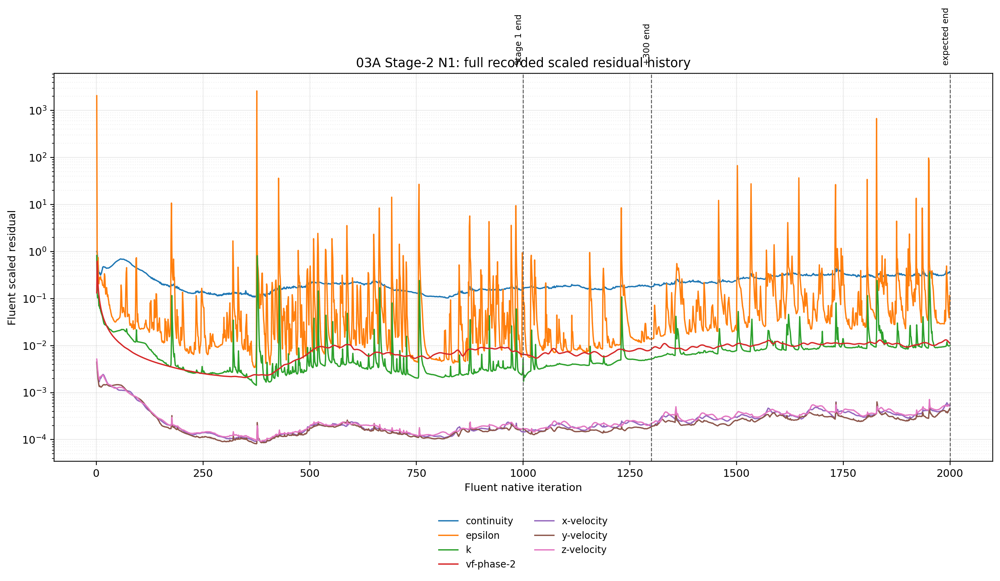

# 03A Stage 2 — N1 results

## Screening role

N1 tests whether the Stage-1 turbulence instability can be damped by reducing only the turbulence-equation under-relaxation factors:

```text
k URF       = 0.8 → 0.5
epsilon URF = 0.8 → 0.5
```

The remaining audited numerical stack was retained, including RNG `k-epsilon`, second-order momentum, second-order `k`, second-order `epsilon`, QUICK volume fraction, PRESTO! pressure, and the Stage-1 physical setup.

This branch was continued independently from the immutable Stage-1 iteration-1,000 case/data pair. It was not reinitialized and no liquid patch was applied.

## Execution and evidence

| Phase | Native continuation | Endpoint | Verification | Evidence |
|---|---:|---:|---|---|
| Initial screen | +300, ending at Fluent iteration 1300 | Case/data pair present | `RUN_COMPLETED_ENDPOINT_VERIFIED` | [initial journal](../../../../../PyAnsys/output/03a_stage2/20260817T125355Z/run/03A-S2-N1-from-i1000-plus300-20260817T125355Z.jou), [initial residual history](../../../../../PyAnsys/output/03a_stage2/20260817T125355Z/run/post_simulation_analysis/N1-initial-screen-residual-check.json) |
| Extension | +700, ending at Fluent iteration 2000 | Case/data pair present | `RUN_COMPLETED_ENDPOINT_VERIFIED` | [extension journal](../../../../../PyAnsys/output/03a_stage2/20260817T132736Z/extension-700/03A-S2-N1-from-initial-screen-plus700-20260817T132736Z.jou), [extension summary](../../../../../PyAnsys/output/03a_stage2/20260817T132736Z/report/N1/N1-summary.json) |

The extension endpoint is the paired remote case/data stem:

```text
03A-S2-N1-from-initial-screen-plus700-20260817T132736Z.cas.h5
03A-S2-N1-from-initial-screen-plus700-20260817T132736Z.dat.h5
```

No Fluent numerical exception or transport failure was recorded for the N1 extension.

## Scaled residual history



[Open the N1 full scaled-residual figure](plots/N1/N1-full-scaled-residuals.png)

The plot uses the direct Fluent scaled-residual monitor values. The histories were stitched using the recorded native iteration coordinates. Retained monitor points from earlier phases were not treated as new iterations, and no missing intervals were interpolated.

### Final 100-iteration statistics at the +700 endpoint

| Residual | Final value | Median | P95 | Minimum in continuation | Maximum in continuation |
|---|---:|---:|---:|---:|---:|
| Continuity | 3.7658e-1 | 3.2641e-1 | 3.8042e-1 | 1.8041e-1 | 4.7319e-1 |
| x-velocity | 5.2256e-4 | 4.0543e-4 | 5.6412e-4 | 1.9474e-4 | 6.3258e-4 |
| y-velocity | 4.6181e-4 | 3.1479e-4 | 4.1542e-4 | 1.9161e-4 | 6.3574e-4 |
| z-velocity | 5.7171e-4 | 4.3746e-4 | 5.3333e-4 | 2.2436e-4 | 7.1479e-4 |
| k | 1.0054e-2 | 9.6864e-3 | 4.0922e-2 | 5.2171e-3 | 3.4749e-1 |
| epsilon | 9.0165e-2 | 1.0647e-1 | 1.9110e+0 | 1.3876e-2 | 6.7422e+2 |
| vf-phase-2 | 1.1220e-2 | 1.0831e-2 | 1.2993e-2 | 7.9172e-3 | 1.3249e-2 |

The final continuation does not show a bounded improvement in the principal stability indicators. Continuity rises from approximately `0.1816` at the beginning of the +700 window to `0.3766` at its endpoint, while the final-window median is approximately twice the Stage-1 endpoint value of `0.1604`. The turbulence residuals remain intermittent, with a large `epsilon` excursion still present in the continuation history.

## Flux and conservation evidence

The following values use the same diagnostic all-discovered-pressure-outlet balance definition used by the Stage-1 workflow.

| State | Liquid to steam outlet (kg/s) | Vapour to steam outlet (kg/s) | Total liquid outlet (kg/s) | Total vapour outlet (kg/s) | Mass imbalance (kg/s) | Mass imbalance |
|---|---:|---:|---:|---:|---:|---:|
| Stage-1 endpoint | 0.1425 | 44.1293 | 82.7549 | 81.6556 | 34.0758 | 17.17% |
| N1 after +300 | 0.9789 | 44.9079 | 78.8248 | 81.7275 | 37.9339 | 19.11% |
| N1 after +700 | 4.1123 | 46.8978 | 167.0988 | 81.3223 | 49.9348 | 25.16% |

At the +700 endpoint, the reported carrier metrics are:

```text
liquid inlet       = 116.8468 kg/s
vapour inlet       =  81.6395 kg/s
liquid outlet      = 167.0988 kg/s
vapour outlet      =  81.3223 kg/s
mixture inlet      = 198.4863 kg/s
mixture outlet     = 248.4211 kg/s
eta_phase          =   0.9648
x_out              =   0.9194
```

The mass imbalance increases during the N1 continuation rather than moving below the Stage-1 reference. The phase-routing indicators also change materially: liquid flow to the steam outlet increases from `0.1425 kg/s` at Stage 1 to `4.1123 kg/s` at the N1 +700 endpoint, while the diagnostic outlet vapour quality decreases from `0.9968` to `0.9194`.

The endpoint flux evidence is in [N1 extension flux-check.json](../../../../../PyAnsys/output/03a_stage2/20260817T132736Z/extension-700/post_simulation_analysis/N1-extension-700-flux-check.json).

## Liquid inventory evidence

The N1 monitor-history artifact contains residual history, but the flux and inventory monitor sets have zero recorded points. Therefore this branch has no reliable temporal liquid-inventory history to plot. The N1 result is assessed using endpoint fluxes and conservation diagnostics only; no inventory trend is inferred.

## Screening assessment

| Dimension | N1 assessment |
|---|---|
| Numerical stability | **Worse during the +700 continuation.** The final continuity level rises above Stage 1, and the turbulence residual envelope remains spiky. |
| Conservation | **Worse.** The diagnostic mass imbalance increases from 17.17% at Stage 1 to 25.16% at the +700 endpoint. |
| Physical solution behaviour | **Materially changed.** Liquid routing to the steam outlet and the reported outlet phase quality change substantially; a temporal inventory check is unavailable. |
| Canonical-return qualification | **Not selected at this screening stage.** The reduced-URF branch does not currently provide sufficient evidence to justify restoring the canonical URFs. |

### Classification

`N1 — REJECT for the canonical-return screen; retain as a documented damping attempt.`

This classification is a Stage-2 screening result, not a claim that the N1 endpoint is numerically invalid in every sense. It means that, relative to the Stage-1 parent and the other planned stabilization routes, the N1 +700 continuation does not presently demonstrate the bounded residual and improved-conservation behaviour required to justify a canonical-return run.

## Source artifacts

- [N1 branch summary JSON](../../../../../PyAnsys/output/03a_stage2/20260817T132736Z/report/N1/N1-summary.json)
- [N1 full scaled-residual figure](plots/N1/N1-full-scaled-residuals.png)
- [N1 initial residual history](../../../../../PyAnsys/output/03a_stage2/20260817T125355Z/run/post_simulation_analysis/N1-initial-screen-residual-check.json)
- [N1 extension residual history](../../../../../PyAnsys/output/03a_stage2/20260817T132736Z/extension-700/post_simulation_analysis/N1-extension-700-residual-check.json)
- [N1 extension monitor history](../../../../../PyAnsys/output/03a_stage2/20260817T132736Z/extension-700/post_simulation_analysis/N1-extension-700-monitor-history.json)
- [N1 extension flux evidence](../../../../../PyAnsys/output/03a_stage2/20260817T132736Z/extension-700/post_simulation_analysis/N1-extension-700-flux-check.json)
- [Stage-1 reference residual history](../../../../../PyAnsys/output/post_simulation_analysis/03a_08b_parity_full_geometry_iter1000_20260817T110345Z-residual-check.json)
- [Stage-1 reference flux evidence](../../../../../PyAnsys/output/post_simulation_analysis/03a_08b_parity_full_geometry_iter1000_20260817T110345Z-flux-check.json)
