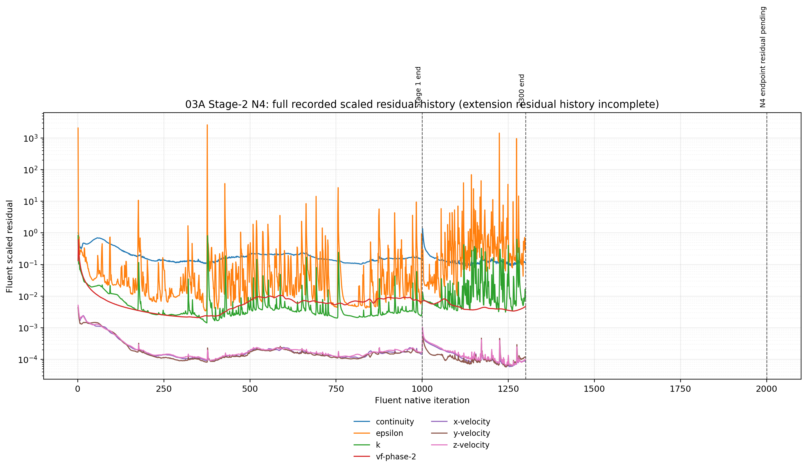

# 03A Stage 2 — N4 results

## Screening role

N4 tests whether a broader first-order startup creates a smoother developed field:

```text
Momentum: Second Order Upwind → First Order Upwind
k:        Second Order Upwind → First Order Upwind
epsilon:  Second Order Upwind → First Order Upwind
```

The Stage-1 under-relaxation factors, QUICK volume fraction, PRESTO! pressure, and RNG `k-epsilon` model were retained.

This branch was continued independently from the immutable Stage-1 iteration-1,000 case/data pair. It was not reinitialized and no liquid patch was applied.

## Execution and evidence

| Phase | Native continuation | Local endpoint evidence | Verification status | Evidence |
|---|---:|---|---|---|
| Initial screen | +300, ending at Fluent iteration 1300 | Paired case/data endpoint present | `RUN_COMPLETED_ENDPOINT_VERIFIED` | [initial journal](../../../../../../PyAnsys/output/03a_stage2/20260817T125355Z/run/03A-S2-N4-from-i1000-plus300-20260817T125355Z.jou), [initial residual history](../../../../../../PyAnsys/output/03a_stage2/20260817T125355Z/run/post_simulation_analysis/N4-initial-screen-residual-check.json) |
| Extension | Requested +700 from the N4 +300 endpoint | Paired `plus700` case/data was loaded for the local flux snapshot | `ENDPOINT_PRESENT_AFTER_NATIVE_EXCEPTION` | [extension journal](../../../../../../PyAnsys/output/03a_stage2/20260817T132736Z/extension-700/03A-S2-N4-from-initial-screen-plus700-20260817T132736Z.jou), [run record](../../../../../../PyAnsys/output/03a_stage2/20260817T132736Z/extension-700/N4-extension-700-run.json) |

The recorded extension failure was:

```text
RuntimeError: Stream removed (recvmsg:No route to host)
```

This is classified as a Fluent gRPC/host transport failure, not as a confirmed Fluent numerical failure. The matching endpoint case/data pair is visible in the local flux evidence, but final readback verification still requires a stable Fluent connection.

## Scaled residual history



[Open the N4 available scaled-residual figure](plots/N4/N4-full-scaled-residuals.png)

The local N4 residual artifact does **not** contain a complete +700 continuation history. Its recorded iteration coordinate ends at `1300`, even though the local endpoint flux artifact loads the `plus700` case/data stem. The figure therefore shows the complete Stage-1 history and the N4 initial +300 history only; it must not be interpreted as a verified N4 iteration-2000 residual history.

### Last available residual statistics

These values describe the last 100 points in the locally available history, which ends at iteration 1300.

| Residual | Last available value | Median | P95 | Interpretation |
|---|---:|---:|---:|---|
| Continuity | 1.1480e-1 | 1.1493e-1 | 1.3574e-1 | Lower than Stage-1 endpoint at the +300 checkpoint |
| x-velocity | 8.6724e-5 | 7.6049e-5 | 1.0360e-4 | Lower than Stage-1 endpoint at the +300 checkpoint |
| y-velocity | 1.1684e-4 | 8.2207e-5 | 1.5281e-4 | Lower than Stage-1 endpoint at the +300 checkpoint |
| z-velocity | 9.7103e-5 | 8.3341e-5 | 1.3519e-4 | Lower than Stage-1 endpoint at the +300 checkpoint |
| k | 8.5054e-3 | 8.8285e-3 | 1.9802e-1 | Lower median, but with large excursions |
| epsilon | 2.4201e-1 | 3.0276e-1 | 9.7231e+0 | Oscillatory and strongly spiky |
| vf-phase-2 | 4.7220e-3 | 3.8756e-3 | 4.3618e-3 | Lower than Stage-1 endpoint at the +300 checkpoint |

The initial N4 screen therefore looked numerically promising in several residuals, but the unavailable +700 residual history prevents a complete numerical-stability assessment at the requested extension endpoint.

## Flux and conservation evidence

The following values use the same diagnostic all-discovered-pressure-outlet balance definition used by the Stage-1 workflow.

| State | Liquid to steam outlet (kg/s) | Vapour to steam outlet (kg/s) | Total liquid outlet (kg/s) | Total vapour outlet (kg/s) | Mass imbalance (kg/s) | Mass imbalance |
|---|---:|---:|---:|---:|---:|---:|
| Stage-1 endpoint | 0.1425 | 44.1293 | 82.7549 | 81.6556 | 34.0758 | 17.17% |
| N4 after +300 | 3.7934 | 59.1100 | 55.4695 | 81.3705 | 61.6462 | 31.06% |
| N4 `plus700` endpoint snapshot | 37.8178 | 60.4499 | 304.0804 | 80.2164 | 185.8106 | 93.61% |

The local `plus700` endpoint flux snapshot reports:

```text
liquid inlet       = 116.8468 kg/s
vapour inlet       =  81.6395 kg/s
liquid outlet      = 304.0804 kg/s
vapour outlet      =  80.2164 kg/s
mixture inlet      = 198.4863 kg/s
mixture outlet     = 384.2969 kg/s
eta_phase          =   0.6763
x_out              =   0.6152
```

This is a severe physical-behaviour change relative to Stage 1. Liquid flow to the steam outlet increases from `0.1425 kg/s` to `37.8178 kg/s`, while the diagnostic outlet vapour quality falls from `0.9968` to `0.6152`.

The endpoint flux snapshot is in [N4 extension flux-check.json](../../../../../../PyAnsys/output/03a_stage2/20260817T132736Z/extension-700/post_simulation_analysis/N4-extension-700-flux-check.json). Its load record reports `paired-read_case_data` and matching case/data names, but the final gRPC readback status remains pending.

## Liquid inventory evidence

The N4 monitor-history artifact contains residual history only; the flux and inventory monitor sets have zero recorded points. No temporal liquid-inventory trend is therefore available. The extreme endpoint flux change is reported, but no inventory history is inferred.

## Screening assessment

| Dimension | N4 assessment |
|---|---|
| Numerical stability | **Promising at the +300 checkpoint but unresolved at +700.** The available residual history ends at iteration 1300, so the extension residual behaviour cannot yet be claimed. |
| Conservation | **Strongly worse in the available +700 endpoint snapshot.** The diagnostic imbalance rises to 93.61%, subject to final endpoint readback confirmation. |
| Physical solution behaviour | **Materially and severely changed.** Phase routing and outlet quality depart substantially from Stage 1. |
| Canonical-return qualification | **Not selected.** The endpoint snapshot is physically disqualifying unless later readback proves that this artifact was stale or mismatched. |
| Failure accounting | **Transport failure recorded.** `No route to host` is kept separate from a confirmed Fluent FPE or AMG failure. |

### Provisional classification

`N4 — REJECT PENDING FINAL READBACK; do not run the canonical-return test on the current evidence.`

The N4 initial +300 result remains useful as evidence that first-order momentum/turbulence startup initially reduces several residuals. However, the `plus700` endpoint snapshot shows a 93.61% diagnostic mass imbalance and severe phase-routing change. A stable gRPC reconnect is still required to close the verification record and confirm whether the residual-monitor gap is an artifact of the interrupted readback or a genuine endpoint limitation.

## Source artifacts

- [N4 branch summary JSON](../../../../../../PyAnsys/output/03a_stage2/20260817T132736Z/report/N4/N4-summary.json)
- [N4 available scaled-residual figure](plots/N4/N4-full-scaled-residuals.png)
- [N4 initial residual history](../../../../../../PyAnsys/output/03a_stage2/20260817T125355Z/run/post_simulation_analysis/N4-initial-screen-residual-check.json)
- [N4 extension residual artifact](../../../../../../PyAnsys/output/03a_stage2/20260817T132736Z/extension-700/post_simulation_analysis/N4-extension-700-residual-check.json)
- [N4 extension monitor history](../../../../../../PyAnsys/output/03a_stage2/20260817T132736Z/extension-700/post_simulation_analysis/N4-extension-700-monitor-history.json)
- [N4 extension flux evidence](../../../../../../PyAnsys/output/03a_stage2/20260817T132736Z/extension-700/post_simulation_analysis/N4-extension-700-flux-check.json)
- [N4 extension run record](../../../../../../PyAnsys/output/03a_stage2/20260817T132736Z/extension-700/N4-extension-700-run.json)
- [Stage-1 reference residual history](../../../../../../PyAnsys/output/post_simulation_analysis/03a_08b_parity_full_geometry_iter1000_20260817T110345Z-residual-check.json)
- [Stage-1 reference flux evidence](../../../../../../PyAnsys/output/post_simulation_analysis/03a_08b_parity_full_geometry_iter1000_20260817T110345Z-flux-check.json)
