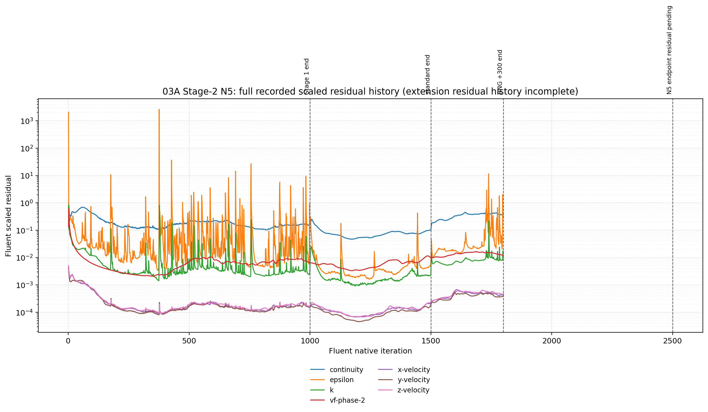

# 03A Stage 2 — N5 results

## Screening role

N5 tests whether a more forgiving standard `k-epsilon` turbulence bootstrap can create a field from which the authoritative RNG `k-epsilon` model remains stable:

```text
Stage-1 parent
→ standard k-epsilon, +500 iterations
→ restore canonical RNG k-epsilon, +300 iterations
→ requested RNG continuation, +700 iterations
```

The standard-model phase is only a bootstrap. A solution that is stable only while standard `k-epsilon` is active does not qualify as the canonical 03A result.

## Execution and evidence

| Phase | Native continuation | Endpoint | Verification | Evidence |
|---|---:|---|---|---|
| Standard bootstrap | +500, ending at Fluent iteration 1500 | Case/data pair present | `RUN_COMPLETED_ENDPOINT_VERIFIED` | [standard journal](../../../../../../PyAnsys/output/03a_stage2/20260817T125355Z/run/03A-S2-N5-standard-from-i1000-plus500-20260817T125355Z.jou), [standard residual history](../../../../../../PyAnsys/output/03a_stage2/20260817T125355Z/run/post_simulation_analysis/N5-standard-bootstrap-residual-check.json) |
| Restored RNG return | +300, ending at Fluent iteration 1800 | Case/data pair present | `RUN_COMPLETED_ENDPOINT_VERIFIED` | [RNG return journal](../../../../../../PyAnsys/output/03a_stage2/20260817T125355Z/run/03A-S2-N5-rng-return-plus300-20260817T125355Z.jou), [RNG return residual history](../../../../../../PyAnsys/output/03a_stage2/20260817T125355Z/run/post_simulation_analysis/N5-rng-return-residual-check.json) |
| RNG +700 continuation | Requested +700 from iteration 1800, expected endpoint 2500 | Local +700 post-processing record not present | `SUBMITTED_NATIVE_RUN` in the last persisted campaign record | [extension journal](../../../../../../PyAnsys/output/03a_stage2/20260817T132736Z/extension-700/03A-S2-N5-from-rng-return-plus700-20260817T132736Z.jou), [campaign record](../../../../../../PyAnsys/output/03a_stage2/20260817T132736Z/extension-700/campaign-live.json) |

The local reporting record does not yet contain an N5 `plus700` residual-check or flux-check JSON. The visible remote `.dat.h5` is therefore retained as a pending endpoint clue, not used as proof of a verified final result in this report.

## Scaled residual history



[Open the N5 available scaled-residual figure](plots/N5/N5-full-scaled-residuals.png)

The figure contains the Stage-1 history, the standard bootstrap, and the restored RNG return. The requested +700 RNG continuation is not plotted because its local residual history is not yet available. No missing +700 interval has been interpolated.

### Final 100-iteration statistics by available N5 phase

| Phase | Continuity median | Continuity P95 | (k) median | (k) P95 | (epsilon) median | (epsilon) P95 | VF median | VF P95 |
|---|---:|---:|---:|---:|---:|---:|---:|---:|
| Stage-1 endpoint history | 1.5773e-1 | 1.7438e-1 | 3.2887e-3 | 7.0105e-3 | 3.2177e-2 | 9.3945e-1 | 8.7141e-3 | 9.1572e-3 |
| Standard bootstrap, iteration 1500 | 7.8155e-2 | 1.0090e-1 | 2.2840e-3 | 3.4441e-3 | 5.0056e-3 | 1.3436e-2 | 7.2313e-3 | 1.1464e-2 |
| Restored RNG return, iteration 1800 | 4.0668e-1 | 4.2610e-1 | 8.7831e-3 | 1.7681e-2 | 6.5010e-2 | 1.3728e+0 | 1.5071e-2 | 1.5946e-2 |

The standard bootstrap materially reduces the residual envelope. That improvement does not survive restoration of RNG `k-epsilon`: during the +300 RNG-return phase, continuity rises from approximately `0.1423` to `0.3731`, with a final-window median of `0.4067`. The turbulence residuals also broaden again after the model return.

## Flux and conservation evidence

The following values use the same diagnostic all-discovered-pressure-outlet balance definition used by the Stage-1 workflow.

| State | Liquid to steam outlet (kg/s) | Vapour to steam outlet (kg/s) | Total liquid outlet (kg/s) | Total vapour outlet (kg/s) | Mass imbalance (kg/s) | Mass imbalance |
|---|---:|---:|---:|---:|---:|---:|
| Stage-1 endpoint | 0.1425 | 44.1293 | 82.7549 | 81.6556 | 34.0758 | 17.17% |
| Standard bootstrap, +500 | 1.7528 | 51.1033 | 106.3386 | 81.7452 | 10.4024 | 5.24% |
| Restored RNG return, +300 | 6.7231 | 50.8728 | 192.8417 | 80.2114 | 74.5668 | 37.57% |
| RNG +700 continuation | Not available | Not available | Not available | Not available | Not available | Pending |

The standard bootstrap improves the diagnostic mass imbalance from `17.17%` to `5.24%`. Once RNG `k-epsilon` is restored, the imbalance increases to `37.57%`, while liquid flow to the steam outlet increases from `1.7528 kg/s` during the standard bootstrap to `6.7231 kg/s` during the RNG return.

At the restored RNG endpoint, the reported carrier metrics are:

```text
liquid inlet       = 116.8468 kg/s
vapour inlet       =  81.6395 kg/s
liquid outlet      = 192.8417 kg/s
vapour outlet      =  80.2114 kg/s
mixture inlet      = 198.4863 kg/s
mixture outlet     = 273.0531 kg/s
eta_phase          =   0.9425
x_out              =   0.8833
```

The available phase-routing evidence therefore supports the same conclusion as the residual history: standard `k-epsilon` produces a more bounded intermediate field, but the return to RNG `k-epsilon` does not preserve that behaviour.

## Liquid inventory evidence

The standard-bootstrap and RNG-return monitor-history artifacts contain residual history, but their flux and inventory monitor sets have zero recorded points. No temporal liquid-inventory trend is therefore available for N5. No inventory behaviour is inferred from the endpoint values.

## Screening assessment

| Dimension | N5 assessment |
|---|---|
| Numerical stability | **Improved during standard bootstrap, then worse after the required RNG return.** The authoritative-model return does not preserve the bootstrap residual envelope. |
| Conservation | **Improved during standard bootstrap, then worse after RNG return.** The diagnostic imbalance moves 17.17% → 5.24% → 37.57%. |
| Physical solution behaviour | **Materially changed across the model transition.** Outlet phase routing changes substantially, and no temporal inventory history is available. |
| Canonical-return qualification | **Not qualified on the available evidence.** The RNG return is the authority test, and it currently fails to preserve the standard-bootstrap improvement. |
| +700 continuation | **Pending.** No local residual/flux endpoint evidence is available yet. |

### Provisional classification

`N5 — STANDARD BOOTSTRAP HELPS, BUT THE RNG RETURN IS NOT STABLE; +700 ENDPOINT PENDING.`

N5 currently demonstrates the value of the bootstrap as a diagnostic experiment, not as a canonical parent. The final +700 result may show whether the restored RNG field eventually recovers, but it must be verified from the paired endpoint and native monitor history before it changes this assessment.

## Source artifacts

- [N5 branch summary JSON](../../../../../../PyAnsys/output/03a_stage2/20260817T132736Z/report/N5/N5-summary.json)
- [N5 available scaled-residual figure](plots/N5/N5-full-scaled-residuals.png)
- [N5 standard-bootstrap residual history](../../../../../../PyAnsys/output/03a_stage2/20260817T125355Z/run/post_simulation_analysis/N5-standard-bootstrap-residual-check.json)
- [N5 restored-RNG residual history](../../../../../../PyAnsys/output/03a_stage2/20260817T125355Z/run/post_simulation_analysis/N5-rng-return-residual-check.json)
- [N5 standard-bootstrap flux evidence](../../../../../../PyAnsys/output/03a_stage2/20260817T125355Z/run/post_simulation_analysis/N5-standard-bootstrap-flux-check.json)
- [N5 restored-RNG flux evidence](../../../../../../PyAnsys/output/03a_stage2/20260817T125355Z/run/post_simulation_analysis/N5-rng-return-flux-check.json)
- [N5 extension journal](../../../../../../PyAnsys/output/03a_stage2/20260817T132736Z/extension-700/03A-S2-N5-from-rng-return-plus700-20260817T132736Z.jou)
- [N5 extension campaign record](../../../../../../PyAnsys/output/03a_stage2/20260817T132736Z/extension-700/campaign-live.json)
- [Stage-1 reference residual history](../../../../../../PyAnsys/output/post_simulation_analysis/03a_08b_parity_full_geometry_iter1000_20260817T110345Z-residual-check.json)
- [Stage-1 reference flux evidence](../../../../../../PyAnsys/output/post_simulation_analysis/03a_08b_parity_full_geometry_iter1000_20260817T110345Z-flux-check.json)
