# 03A Stage 3 — F03/F07/F09 Detailed Results

> **Scope:** F03, F07, and F09 only. These are the owned Stage-3 branches in this report package.
> **Structure:** one complete, consistent analysis package per branch, followed by a compact late-window cross-branch table.
> **Setup authority:** [`03a-stage3-fluent-recommended-convergence-sweep.md`](../../../../../full-geometry/mixture/steady-liquid-outlet/03a-stage3-fluent-recommended-convergence-sweep.md)
> **Analysis/plotting authority:** [`03a-stage3-results-analysis-and-plotting-plan.md`](./03a-stage3-results-analysis-and-plotting-plan.md)
> **Checkpoint source:** [`03a-stage3-owned-checkpoints.csv`](./evidence/03a-stage3-owned/03a-stage3-owned-checkpoints.csv)
> **Analysis builder:** [`build_03a_stage3_owned_branch_analysis.py`](../../../../../../PyAnsys/scripts/report/build_03a_stage3_owned_branch_analysis.py)
> **Evidence index:** [`03a-stage3-owned-analysis.json`](./evidence/03a-stage3-owned/03a-stage3-owned-analysis.json)
> **Interpretation status:** diagnostic evidence package; no Stage-3 pass/fail claim is made here.

The report is intentionally branch-first. Each branch package contains, in the same order:

1. all residual equations, including any numerical-failure tail;
2. total mass inlet/outlet, relative imbalance, and total liquid inventory;
3. phase routing;
4. Y010/Y030/total liquid distribution;
5. brine-entry pressure and brine flow;
6. inlet-loading/ramp response where applicable; and
7. branch-specific cross-diagnostics.

Only after all three packages is the compact cross-branch summary shown. There are no large multi-branch history overlays in this report.

## 1. Owned-branch scope and package index

| Branch | Configuration / completion | Native history | Paired case/data evidence | Package status |
|---|---|---|---|---|
| F03 | Full Mixture, momentum URF 0.5; 100% endpoint at iteration 5,000 | 30/30 Report Files, 5,000 points each | 100% paired endpoint | Complete native-history package |
| F07 | Momentum URF 0.7; 10%, 20%, and 40% completed; 80% numerical-failure tail; 100% not run | 30/30 Report Files, 9,174 points each | 10%, 20%, and 40% paired endpoints | Complete through 40%; failure tail retained |
| F09 | Full Mixture, momentum URF 0.5; 10%, 20%, 40%, 80%, and 100% completed at 3,000-iteration blocks | 30/30 Report Files, 15,000 points each | Five paired endpoints | Complete staged native-history package |

The machine-readable branch packages are:

| Branch | Analysis JSON | Checkpoint CSV | Native-history validation CSV | Native Report File bundle |
|---|---|---|---|---|
| F03 | [`f03/analysis.json`](./evidence/03a-stage3-owned/f03/analysis.json) | [`f03/checkpoints.csv`](./evidence/03a-stage3-owned/f03/checkpoints.csv) | [`f03/native-history-validation.csv`](./evidence/03a-stage3-owned/f03/native-history-validation.csv) | [`03a-stage3-f03-report-histories_20260821_121211.json`](../../../../../../PyAnsys/output/03a_stage3/owned-report-history/03a-stage3-f03-report-histories_20260821_121211.json) |
| F07 | [`f07/analysis.json`](./evidence/03a-stage3-owned/f07/analysis.json) | [`f07/checkpoints.csv`](./evidence/03a-stage3-owned/f07/checkpoints.csv) | [`f07/native-history-validation.csv`](./evidence/03a-stage3-owned/f07/native-history-validation.csv) | [`03a-stage3-f07-report-histories_20260821_121211.json`](../../../../../../PyAnsys/output/03a_stage3/owned-report-history/03a-stage3-f07-report-histories_20260821_121211.json) |
| F09 | [`f09/analysis.json`](./evidence/03a-stage3-owned/f09/analysis.json) | [`f09/checkpoints.csv`](./evidence/03a-stage3-owned/f09/checkpoints.csv) | [`f09/native-history-validation.csv`](./evidence/03a-stage3-owned/f09/native-history-validation.csv) | [`03a-stage3-f09-report-histories_20260821_121211.json`](../../../../../../PyAnsys/output/03a_stage3/owned-report-history/03a-stage3-f09-report-histories_20260821_121211.json) |

## 2. Artifact search and provenance

The connected computer was searched broadly for `.cas`, `.dat`, and `.out` artifacts. The exact case/data pairs used for this report were then checked with read-only existence probes. The complete pair list and the native Report File discovery metadata are preserved in [`remote-artifact-provenance.json`](./evidence/03a-stage3-owned/remote-artifact-provenance.json).

| Branch | Confirmed case/data pairs | Native Report File location and pattern | Recovery result |
|---|---|---|---|
| F03 | `C:\Temp\03A-stage3-F03\F03-100pct-final-5000-end-iter005000-supervised-20260820T054645Z.cas.h5` + matching `.dat.h5` | `C:\Users\syok443\P4P simulation\03a_stage3_*_rfile_1_1.out` | 30/30 files; 5,000 points each; iterations 1–5,000 |
| F07 | 10%, 20%, and 40% pairs under `C:\Temp\03A-stage3-F07\` | `C:\Temp\03A-stage3-F07\03a_stage3_*_rfile.out` | 30/30 files; 9,174 points each; iterations 1–9,174 |
| F09 | 10%, 20%, 40%, 80%, and 100% pairs under `C:\Temp\03A-stage3-F09\` | `C:\Users\syok443\P4P simulation\03a_stage3_*_rfile_2_1.out` | 30/30 files; 15,000 points each; iterations 1–15,000 |

The F07 records from iterations 9,151–9,174 are the retained 80% numerical-failure tail. They are not silently discarded from the native histories or residual package. They are excluded only from the continuous successful-state cross-plot scale and are identified in the ramp package.

No case/data load, solve command, report-definition change, or remote artifact write was performed for this extraction. The native histories were parsed offline from the recovered `.out` files.

## 3. Analysis conventions and validation

- Native Report File histories are the primary continuous evidence. Checkpoint markers are overlaid to validate the history-to-case/data lineage.
- Fluent's signed outlet reports are retained in the raw extraction. For physical comparison, phase-routing paths are converted to outward-positive magnitudes by taking their absolute values.
- `total_outlet_kg_s` in the physical plots is the sum of the four phase-routing path magnitudes. The native signed total-outlet report and native Report File relative-imbalance expression are retained separately.
- Path-magnitude relative imbalance is `100 × (path-magnitude outlet − inlet) / |inlet|`. The native relative-imbalance report is plotted separately as a dotted diagnostic.
- Pressure margin is reported in kPa as pressure minus 1,120,000 Pa. Static and total-pressure margins are kept distinct.
- A late window is the last 500 native Report File points of the last successfully completed loading stage. F07's 24-point failure tail is retained separately and is not used as the successful late-window summary.
- Checkpoint validation covers 17 physical/history quantities per checkpoint: F03 has 17/17 matches, F07 has 51/51 matches, and F09 has 85/85 matches, with zero mismatches and zero unavailable comparisons.
- Cross-plots are association diagnostics within one branch. They are not claims of physical-time causality.

## 4. Branch F03 — full Mixture, 100% endpoint

### 4.1 Evidence position

F03 reaches the full-Mixture 100% endpoint at iteration 5,000 with a paired case/data checkpoint and a complete 30-file native Report File bundle. It starts at the final loading level, so a staged ramp-response figure is not applicable.

### 4.2 All F03 residuals

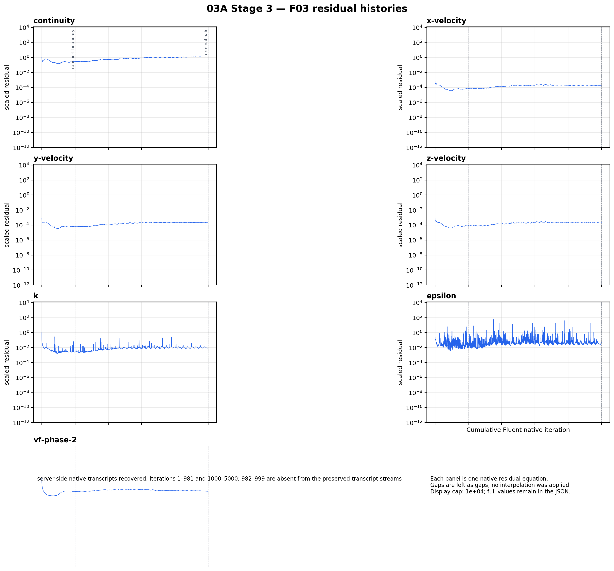

The residual figure contains the complete seven-equation history. The terminal 100% window is iterations 4,501–5,000, 500 native points:

| Equation | Median | P95 | Descriptive trend |
|---|---:|---:|---|
| continuity | 1.1838 | 1.2412 | approximately stationary |
| x-velocity | 1.9191e-4 | 2.1163e-4 | decreasing |
| y-velocity | 2.1496e-4 | 2.2906e-4 | decreasing |
| z-velocity | 2.0720e-4 | 2.4070e-4 | decreasing |
| `k` | 1.0799e-2 | 1.3335e-2 | decreasing |
| `epsilon` | 3.7805e-2 | 1.1500e-1 | decreasing |
| `vf-phase-2` | 1.2736e-2 | 1.3493e-2 | decreasing |

### 4.3 Mass inlet/outlet, imbalance, and total liquid inventory

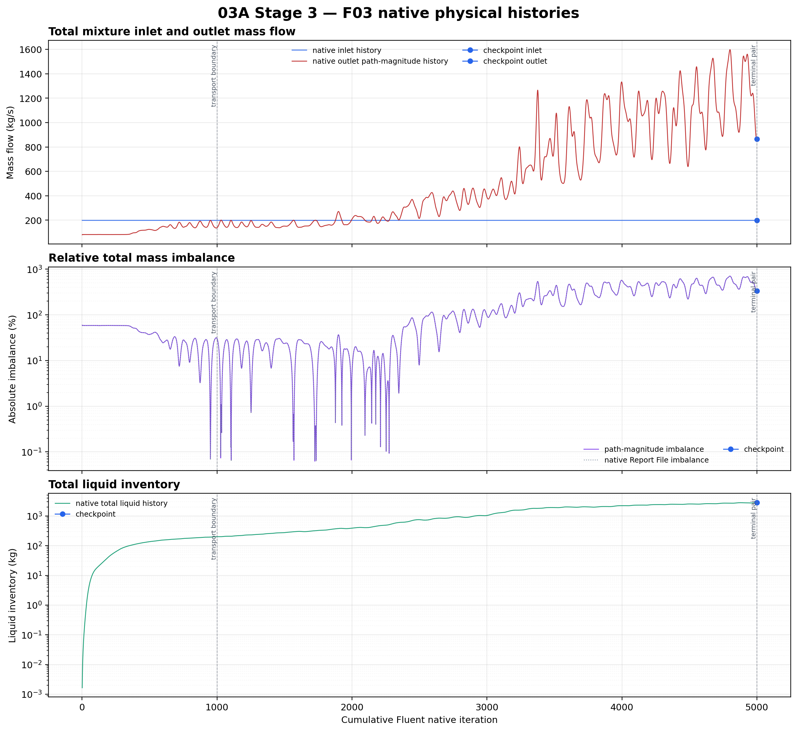

| Load | Iteration | Inlet (kg/s) | Outlet path sum (kg/s) | Path imbalance | Total liquid (kg) |
|---|---:|---:|---:|---:|---:|
| 100% | 5,000 | 198.486 | 866.164 | 336.385% | 2,821.069 |

The successful late native window has path-magnitude imbalance median/P95 495.493%/678.873%, liquid inventory median 2,697.167 kg with standard deviation 96.972 kg, and inventory slope +0.645 kg/iteration. These late-window values are not endpoint substitutions; their large difference from the endpoint readback indicates that the native history is not stationary over the retained window.

### 4.4 F03 phase routing

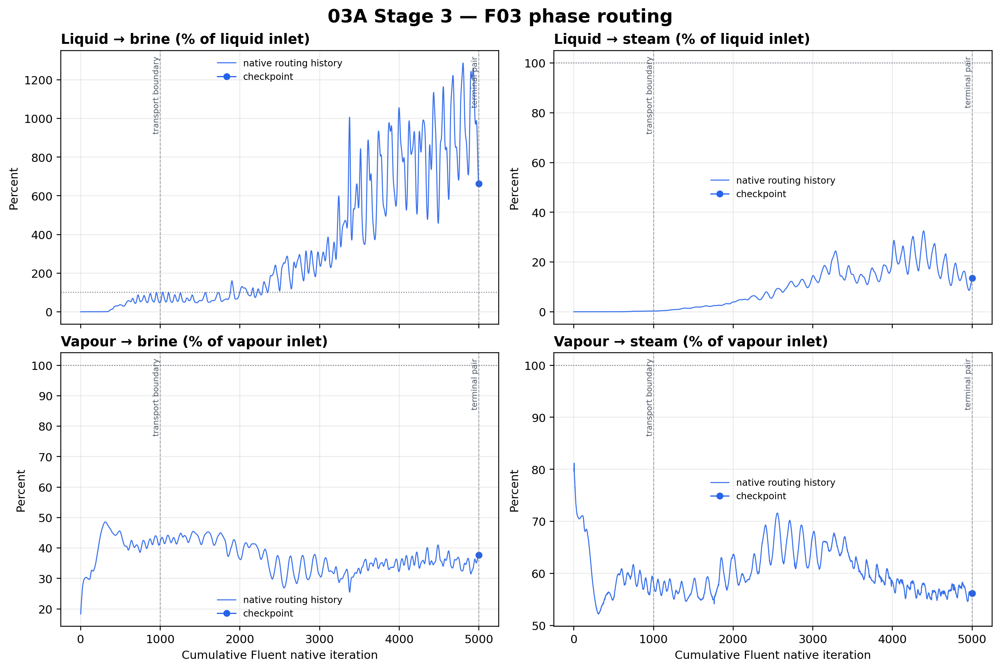

| Load | Liquid → brine | Liquid → steam | Vapour → brine | Vapour → steam |
|---|---:|---:|---:|---:|
| 100% | 773.631 | 15.817 | 30.810 | 45.906 |

All routing values are kg/s path magnitudes from the checkpoint readback. They are diagnostic route quantities, not prescribed outlet-quality targets.

### 4.5 F03 Y010/Y030/total liquid distribution

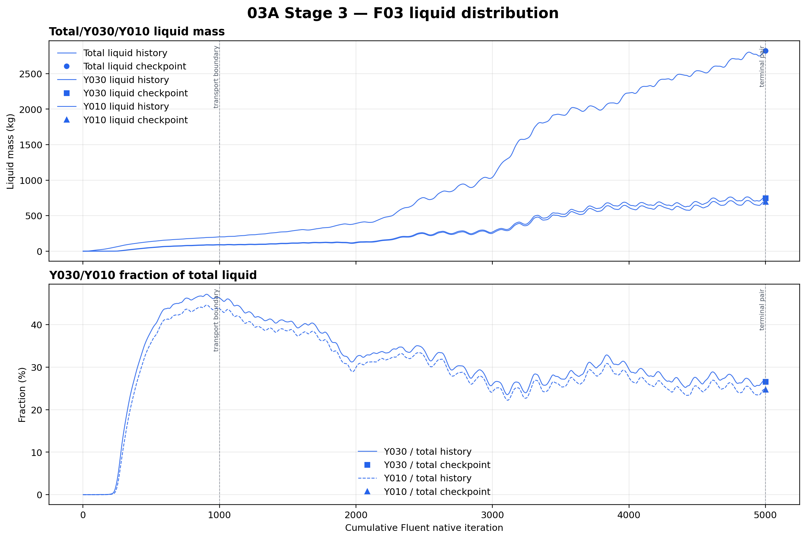

| Load | Total liquid (kg) | Y030 liquid (kg) | Y010 liquid (kg) | Y030 fraction | Y010 fraction |
|---|---:|---:|---:|---:|---:|
| 100% | 2,821.069 | 749.339 | 698.510 | 26.56% | 24.76% |

### 4.6 F03 brine-entry pressure and brine flow

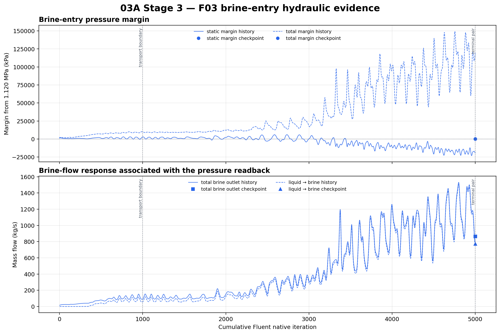

| Load | Static margin (kPa) | Total-pressure margin (kPa) | Total brine path (kg/s) | Liquid → brine (kg/s) |
|---|---:|---:|---:|---:|
| 100% | −19.415 | +119.732 | 804.441 | 773.631 |

The native late-window static margin median is −16,825.773 kPa, while the endpoint static margin is −19.415 kPa. This discrepancy is an important history-versus-endpoint diagnostic and should not be reduced to the endpoint alone.

### 4.7 F03 ramp response

Not applicable: F03 enters the evidenced run at full Mixture and 100% loading. No staged 10/20/40/80% response is asserted.

### 4.8 F03 branch-specific cross-diagnostics

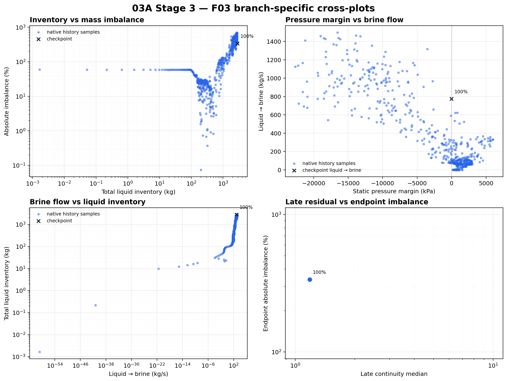

These plots use only F03's own native histories and its checkpoint. They show associations among inventory, path-magnitude imbalance, pressure margin, brine flow, and late residual readbacks; they are not cross-branch comparisons.

## 5. Branch F07 — staged loading through 40%, 80% failure tail

### 5.1 Evidence position

F07 completes 10%, 20%, and 40% stages at cumulative iterations 3,150, 6,150, and 9,150. The next 80% attempt produces a 24-point numerical-failure tail through iteration 9,174. No 100% stage was executed. The 40% checkpoint is therefore the last completed physical stage.

### 5.2 All F07 residuals

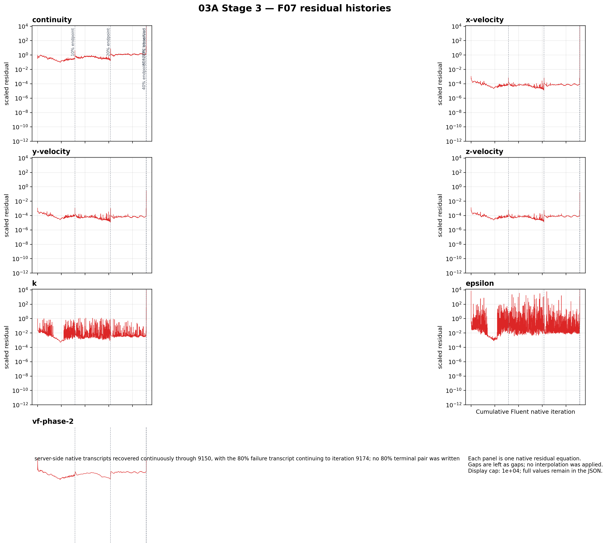

The figure contains all seven residual equations for the 10%, 20%, and 40% windows plus the 80% failure tail. The 40% successful window is iterations 8,651–9,150; the failure tail is iterations 9,151–9,174.

| Equation | 40% median | 40% P95 | 40% trend | 80% tail P95 | Tail interpretation |
|---|---:|---:|---|---:|---|
| continuity | 1.3535 | 1.5673 | decreasing | 5.92e23 | failure escalation |
| x-velocity | 7.8427e-5 | 1.0247e-4 | decreasing | 1.45e11 | failure escalation |
| y-velocity | 7.2061e-5 | 9.3503e-5 | decreasing | 2.274e-1 | increasing |
| z-velocity | 8.6002e-5 | 1.0977e-4 | decreasing | 8.704e-2 | increasing |
| `k` | 3.7745e-3 | 7.8367e-3 | decreasing | 2.91e21 | failure escalation |
| `epsilon` | 3.0757e-2 | 6.3400e-1 | decreasing | 1.52e29 | failure escalation |
| `vf-phase-2` | 6.9639e-3 | 8.5791e-3 | decreasing | 3.737e-1 | increasing |

The earlier 10% and 20% residual windows are preserved in the figure and branch analysis JSON. The failure tail is evidence of the 80% numerical breakdown, not a completed 80% solution.

### 5.3 Mass inlet/outlet, imbalance, and total liquid inventory

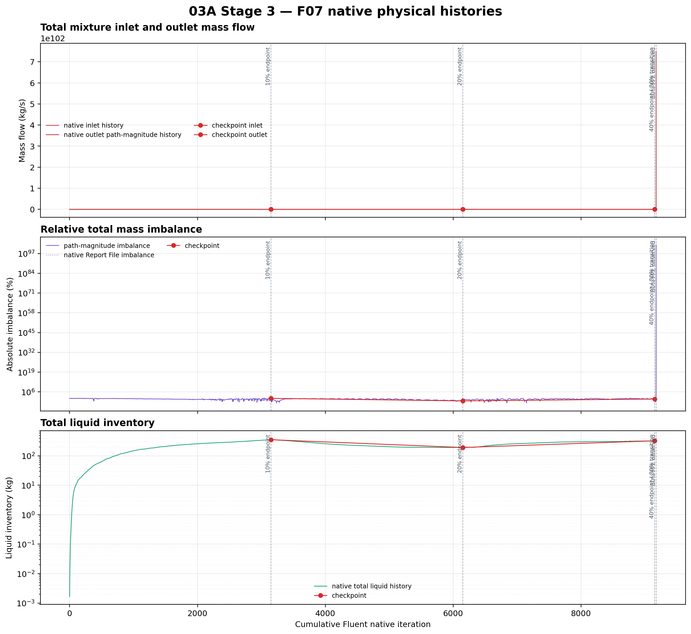

| Load | Iteration | Inlet (kg/s) | Outlet path sum (kg/s) | Path imbalance | Total liquid (kg) |
|---|---:|---:|---:|---:|---:|
| 10% | 3,150 | 19.849 | 31.639 | 59.399% | 353.443 |
| 20% | 6,150 | 39.697 | 40.178 | 1.212% | 192.386 |
| 40% | 9,150 | 79.395 | 96.110 | 21.054% | 324.162 |

The last successful native window at 40% has path-magnitude imbalance median/P95 36.280%/52.473%, liquid inventory median 318.344 kg with standard deviation 3.556 kg, and inventory slope +0.0224 kg/iteration. This is the most bounded successful late inventory among the three owned branches, but it precedes the failed 80% attempt.

### 5.4 F07 phase routing

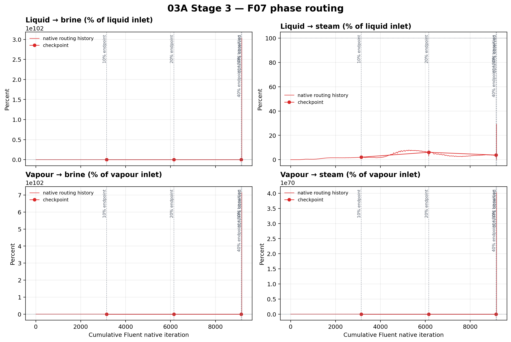

| Load | Liquid → brine | Liquid → steam | Vapour → brine | Vapour → steam |
|---|---:|---:|---:|---:|
| 10% | 23.366 | 0.241 | 1.167 | 6.865 |
| 20% | 22.476 | 1.420 | 6.144 | 10.139 |
| 40% | 61.792 | 1.770 | 13.884 | 18.664 |

### 5.5 F07 Y010/Y030/total liquid distribution

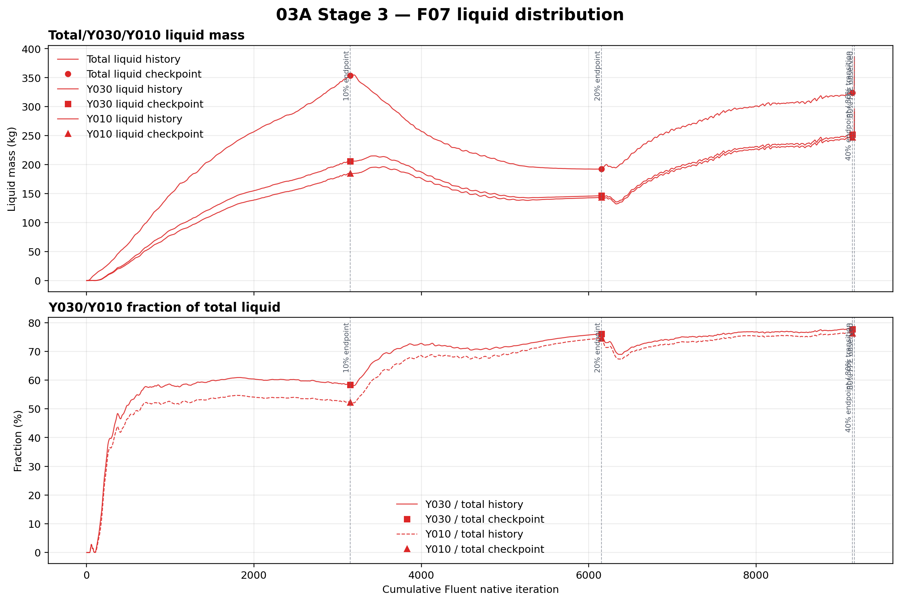

| Load | Total liquid (kg) | Y030 liquid (kg) | Y010 liquid (kg) | Y030 fraction | Y010 fraction |
|---|---:|---:|---:|---:|---:|
| 10% | 353.443 | 206.087 | 184.707 | 58.31% | 52.26% |
| 20% | 192.386 | 146.449 | 143.507 | 76.12% | 74.59% |
| 40% | 324.162 | 251.918 | 247.419 | 77.71% | 76.33% |

### 5.6 F07 brine-entry pressure and brine flow

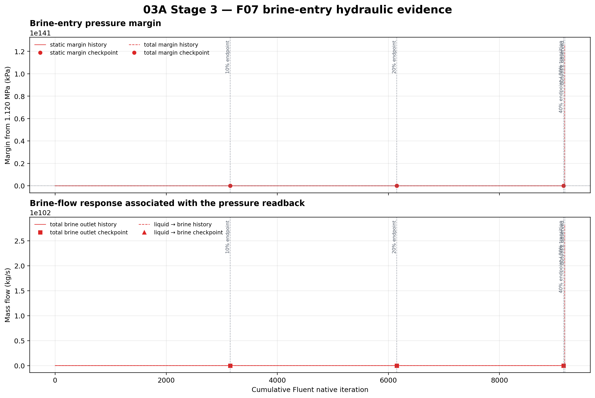

| Load | Static margin (kPa) | Total-pressure margin (kPa) | Total brine path (kg/s) | Liquid → brine (kg/s) |
|---|---:|---:|---:|---:|
| 10% | +0.029 | +0.077 | 24.533 | 23.366 |
| 20% | −0.054 | +0.469 | 28.620 | 22.476 |
| 40% | +0.085 | +2.836 | 75.676 | 61.792 |

### 5.7 F07 ramp response

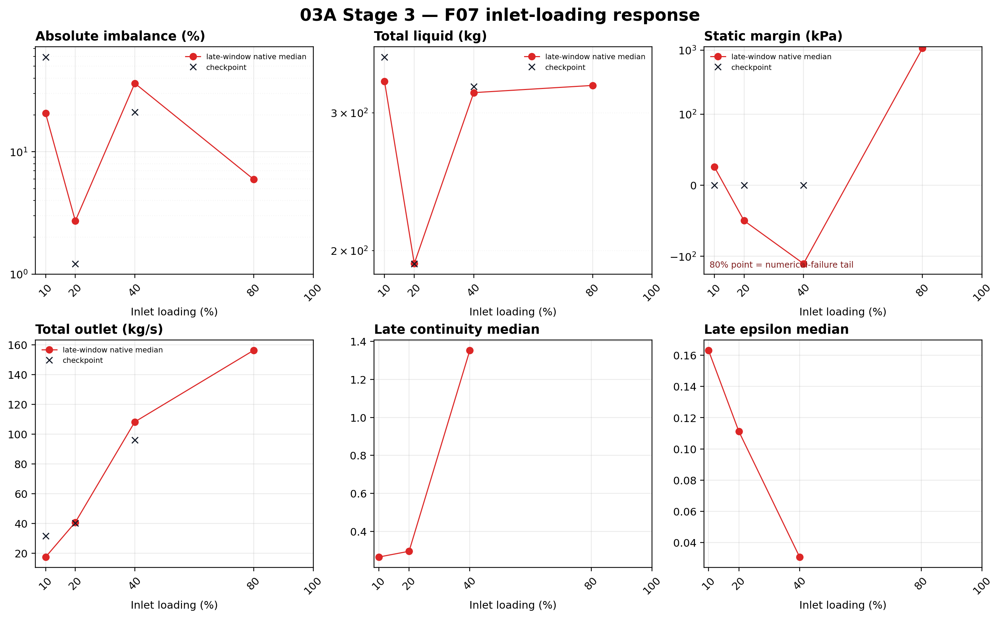

The ramp figure uses late native medians for each evidenced stage. The successful 10/20/40% path-imbalance medians are 20.608%, 2.720%, and 36.280%; the 80% failure-tail median is 5.943% over only 24 points and is not a successful-stage metric. The corresponding total-liquid medians are 328.966, 192.546, 318.344, and 325.175 kg. The 80% static-margin point is explicitly labelled as the numerical-failure tail.

### 5.8 F07 branch-specific cross-diagnostics

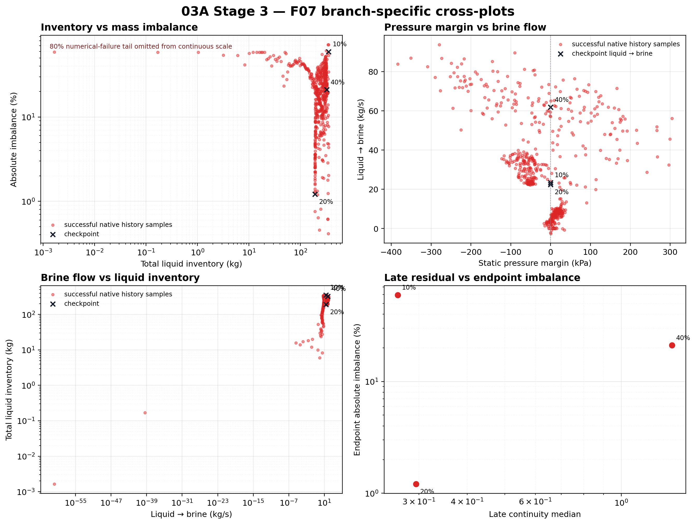

The continuous samples in these cross-plots stop at the successful 40% terminal iteration so the 24-point failure tail cannot dominate the axis scale. The failure tail remains in the residual, physical-history, and ramp packages.

## 6. Branch F09 — staged loading through 100%

### 6.1 Evidence position

F09 completes the 10%, 20%, 40%, 80%, and 100% full-Mixture stages at cumulative iterations 3,000, 6,000, 9,000, 12,000, and 15,000. It has paired case/data evidence and 30 native Report File histories through iteration 15,000.

### 6.2 All F09 residuals

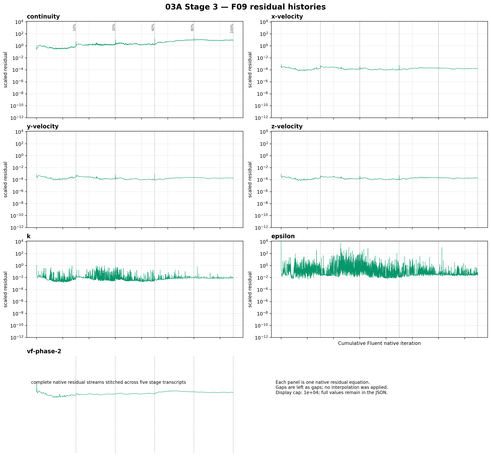

The residual figure contains all seven equations across all five loading stages. The terminal 100% window is iterations 14,501–15,000, 500 native points:

| Equation | Median | P95 | Descriptive trend |
|---|---:|---:|---|
| continuity | 9.1641 | 10.0041 | approximately stationary |
| x-velocity | 1.6861e-4 | 1.8179e-4 | approximately stationary |
| y-velocity | 1.9302e-4 | 2.0574e-4 | approximately stationary |
| z-velocity | 1.8942e-4 | 2.0922e-4 | increasing |
| `k` | 9.2588e-3 | 1.0763e-2 | approximately stationary |
| `epsilon` | 3.0598e-2 | 8.1320e-2 | increasing |
| `vf-phase-2` | 1.0946e-2 | 1.1669e-2 | increasing |

The earlier 10%, 20%, 40%, and 80% windows remain visible in the figure and are available in the branch analysis JSON.

### 6.3 Mass inlet/outlet, imbalance, and total liquid inventory

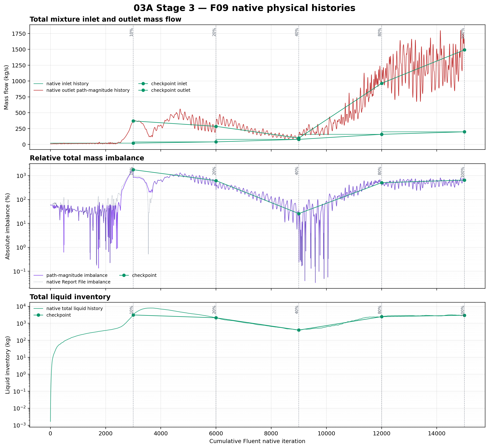

| Load | Iteration | Inlet (kg/s) | Outlet path sum (kg/s) | Path imbalance | Total liquid (kg) |
|---|---:|---:|---:|---:|---:|
| 10% | 3,000 | 19.849 | 370.158 | 1,764.907% | 3,095.118 |
| 20% | 6,000 | 39.697 | 284.565 | 616.838% | 2,108.039 |
| 40% | 9,000 | 79.395 | 99.922 | 25.856% | 398.452 |
| 80% | 12,000 | 158.789 | 963.381 | 506.705% | 2,449.258 |
| 100% | 15,000 | 198.486 | 1,490.223 | 650.794% | 2,959.919 |

The terminal native window has path-magnitude imbalance median/P95 559.569%/761.329%, liquid inventory median 3,011.785 kg with standard deviation 73.174 kg, and inventory slope −0.483 kg/iteration. The 40% endpoint is materially closer to closure than the 80% and 100% endpoints, but the improvement does not persist through the full ramp.

### 6.4 F09 phase routing

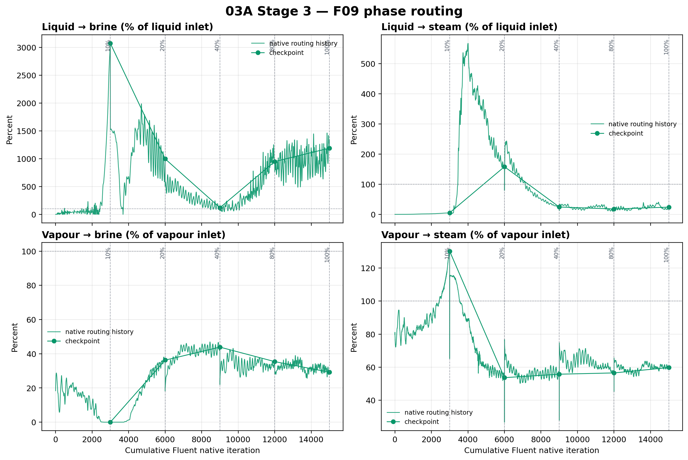

| Load | Liquid → brine | Liquid → steam | Vapour → brine | Vapour → steam |
|---|---:|---:|---:|---:|
| 10% | 358.916 | 0.611 | 0.000 | 10.631 |
| 20% | 232.942 | 36.939 | 5.922 | 8.762 |
| 40% | 55.947 | 11.439 | 14.331 | 18.205 |
| 80% | 886.663 | 16.673 | 23.130 | 36.915 |
| 100% | 1,389.555 | 28.043 | 23.849 | 48.776 |

The absolute path convention is used for these checkpoint-compatible route values. Native signed route histories remain available in the history bundle for backflow interpretation.

### 6.5 F09 Y010/Y030/total liquid distribution

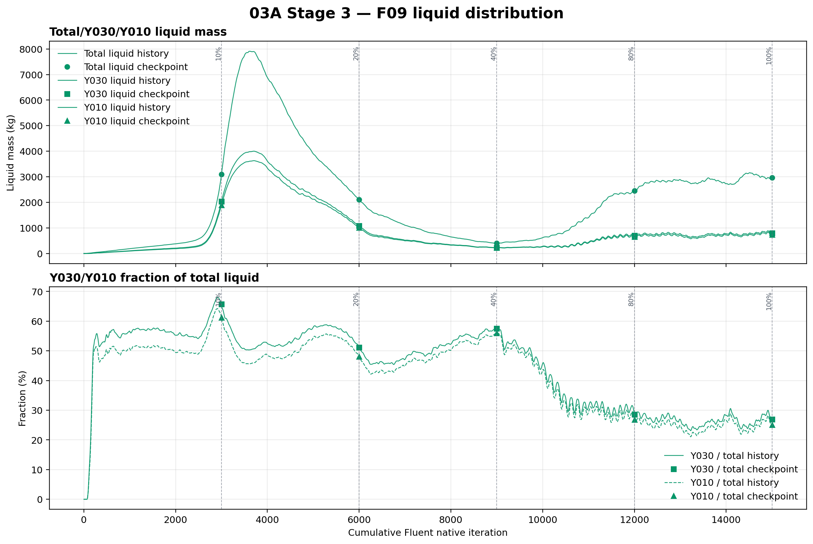

| Load | Total liquid (kg) | Y030 liquid (kg) | Y010 liquid (kg) | Y030 fraction | Y010 fraction |
|---|---:|---:|---:|---:|---:|
| 10% | 3,095.118 | 2,035.339 | 1,894.733 | 65.76% | 61.22% |
| 20% | 2,108.039 | 1,077.520 | 1,013.832 | 51.11% | 48.09% |
| 40% | 398.452 | 229.010 | 222.999 | 57.47% | 55.97% |
| 80% | 2,449.258 | 700.132 | 657.993 | 28.59% | 26.87% |
| 100% | 2,959.919 | 796.020 | 741.595 | 26.89% | 25.05% |

The distribution changes substantially between loading stages; the endpoint sequence does not establish a stationary full-load inventory.

### 6.6 F09 brine-entry pressure and brine flow

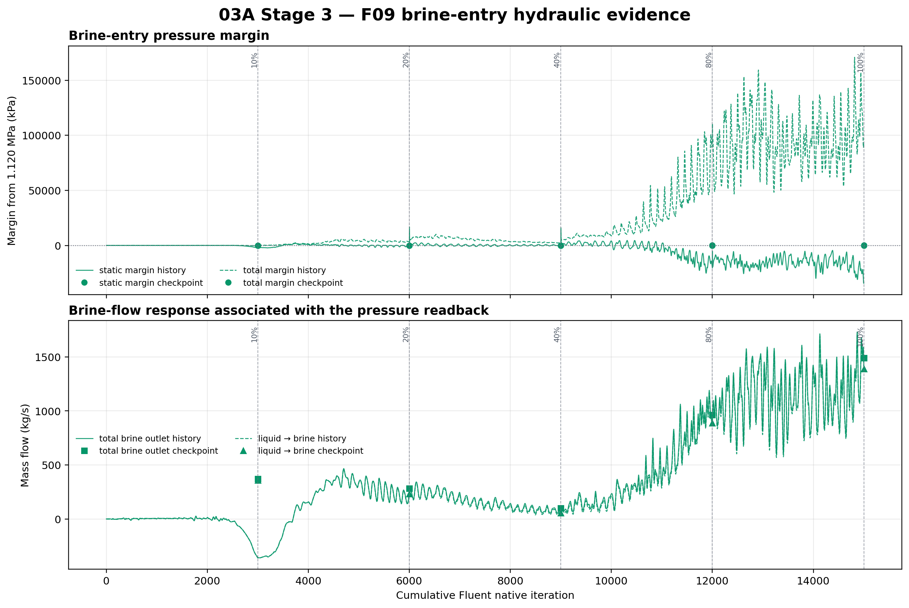

| Load | Static margin (kPa) | Total-pressure margin (kPa) | Total brine path (kg/s) | Liquid → brine (kg/s) |
|---|---:|---:|---:|---:|
| 10% | −2.250 | −0.172 | 358.916 | 358.916 |
| 20% | +0.137 | +3.220 | 238.864 | 232.942 |
| 40% | +0.543 | +2.648 | 70.278 | 55.947 |
| 80% | −20.200 | +93.520 | 909.793 | 886.663 |
| 100% | −34.045 | +93.697 | 1,413.404 | 1,389.555 |

The native late-window brine-outlet report median at 100% is 1,237.979 kg/s. This is a signed native Report File quantity; the table's total-brine column is the positive phase-path sum.

### 6.7 F09 ramp response

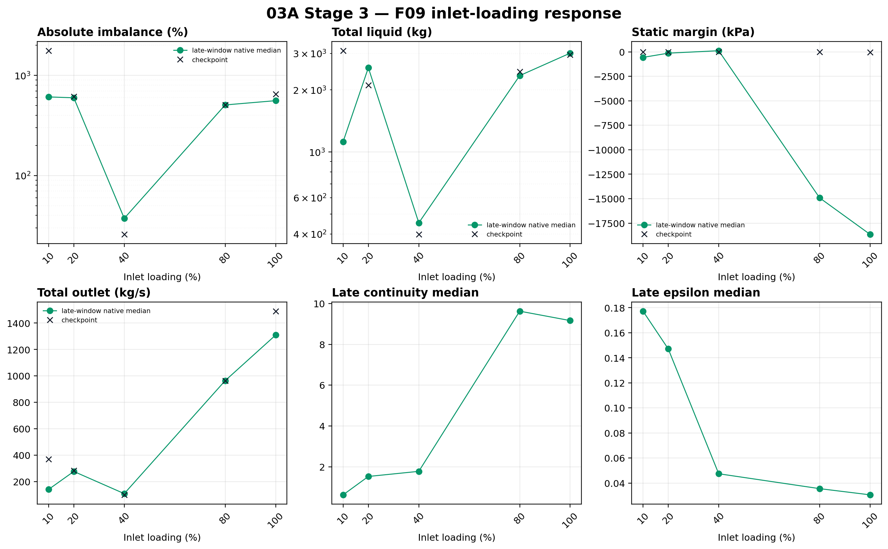

| Load | Native late window | Path-imbalance median | Total liquid median (kg) | Static margin median (kPa) |
|---|---:|---:|---:|---:|
| 10% | 2,501–3,000 | 609.870% | 1,121.036 | −564.397 |
| 20% | 5,501–6,000 | 597.770% | 2,559.632 | −132.666 |
| 40% | 8,501–9,000 | 37.391% | 453.305 | +118.545 |
| 80% | 11,501–12,000 | 507.269% | 2,344.164 | −14,917.729 |
| 100% | 14,501–15,000 | 559.569% | 3,011.785 | −18,649.157 |

The 40% improvement in path imbalance is not sustained at 80% or 100%. The static margin also moves strongly negative in the late 80% and 100% windows.

### 6.8 F09 branch-specific cross-diagnostics

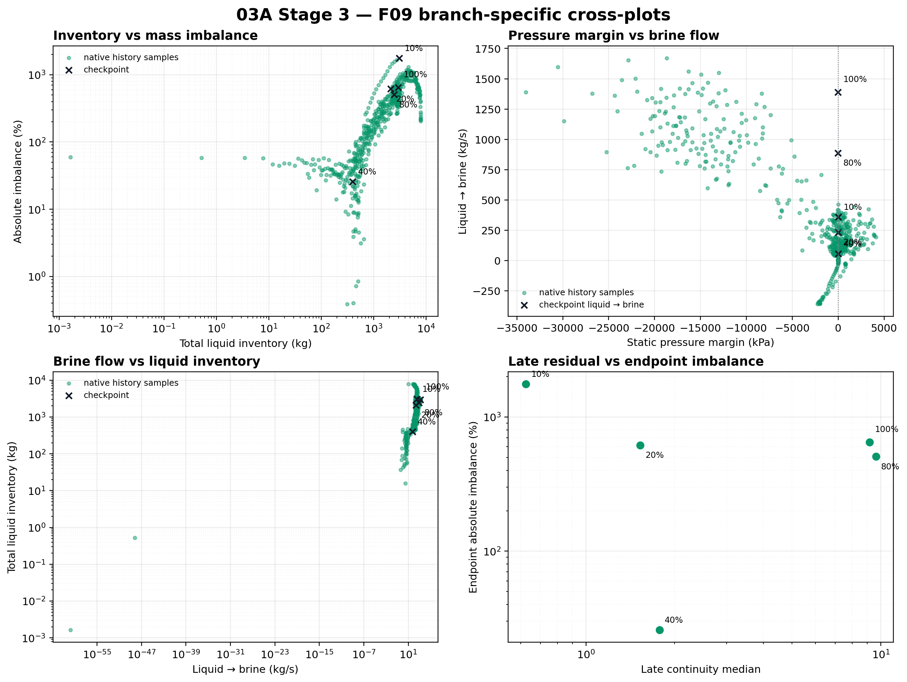

These cross-plots use only F09's own native histories and checkpoints. They are not comparisons against F03 or F07.

## 7. Compact cross-branch late-window summary

The branch packages above are the primary results. This table is deliberately compact and uses derived late-window metrics only. The machine-readable source is [`03a-stage3-owned-cross-branch-late-window-summary.csv`](./evidence/03a-stage3-owned/03a-stage3-owned-cross-branch-late-window-summary.csv).

| Branch | Last completed stage | Native late window | Continuity median / P95 | `k` median | `epsilon` median | Path imbalance median / P95 | Liquid inventory median ± σ; slope | Static margin median (kPa) | Native brine report median (kg/s) |
|---|---|---|---:|---:|---:|---:|---:|---:|---:|
| F03 | 100% / 5,000 | 4,501–5,000 / 500 | 1.184 / 1.241 | 1.080e-2 | 3.780e-2 | 495.493% / 678.873% | 2,697.167 ± 96.972; +0.645/iter | −16,825.773 | 1,116.303 |
| F07 | 40% / 9,150 | 8,651–9,150 / 500 | 1.353 / 1.567 | 3.775e-3 | 3.076e-2 | 36.280% / 52.473% | 318.344 ± 3.556; +0.022/iter | −130.081 | 87.526 |
| F09 | 100% / 15,000 | 14,501–15,000 / 500 | 9.164 / 10.004 | 9.259e-3 | 3.060e-2 | 559.569% / 761.329% | 3,011.785 ± 73.174; −0.483/iter | −18,649.157 | 1,237.979 |

The F07 row is a successful-40% late-window summary; its 80% failure tail is intentionally not mixed into this table. The F03 and F09 rows are full-load endpoints but show very large path-magnitude imbalance in their late windows. The table is descriptive and must not be read as a standalone convergence ranking.

## 8. Evidence-led conclusion and limitations

- F03 has a complete native history through 100%, but its late physical histories show large path-magnitude imbalance and a strongly nonstationary pressure/inventory relationship.
- F07 has the most bounded successful late inventory and the lowest successful late path-magnitude imbalance of the owned branches, but only through 40%; the subsequent 80% attempt enters a numerical-failure tail and no 100% endpoint exists.
- F09 reaches 100% with complete histories, but the improvement seen near 40% does not persist through 80% and 100%; the late full-load imbalance and static-margin diagnostics remain poor.
- No branch is declared converged or physically steady from these results alone. Residuals, mass balance, inventory, phase routing, pressure, and ramp response must be interpreted together.
