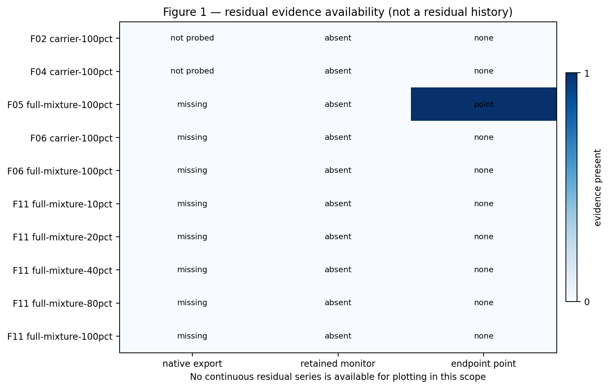
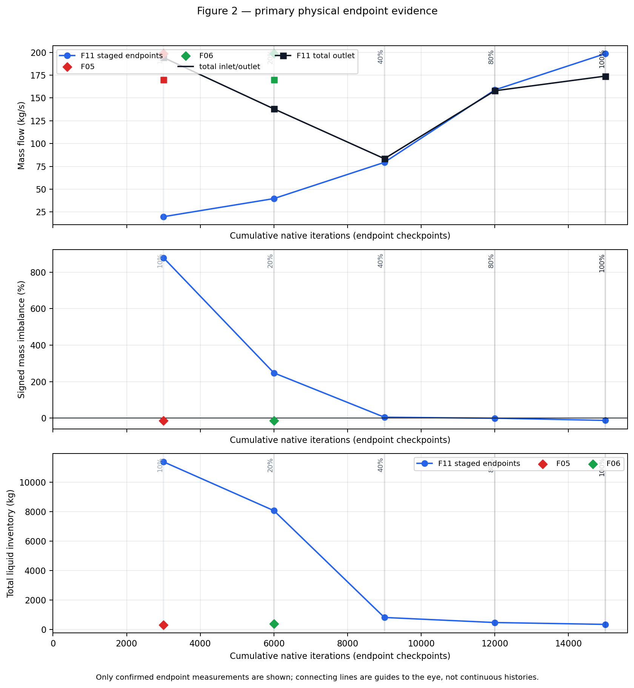
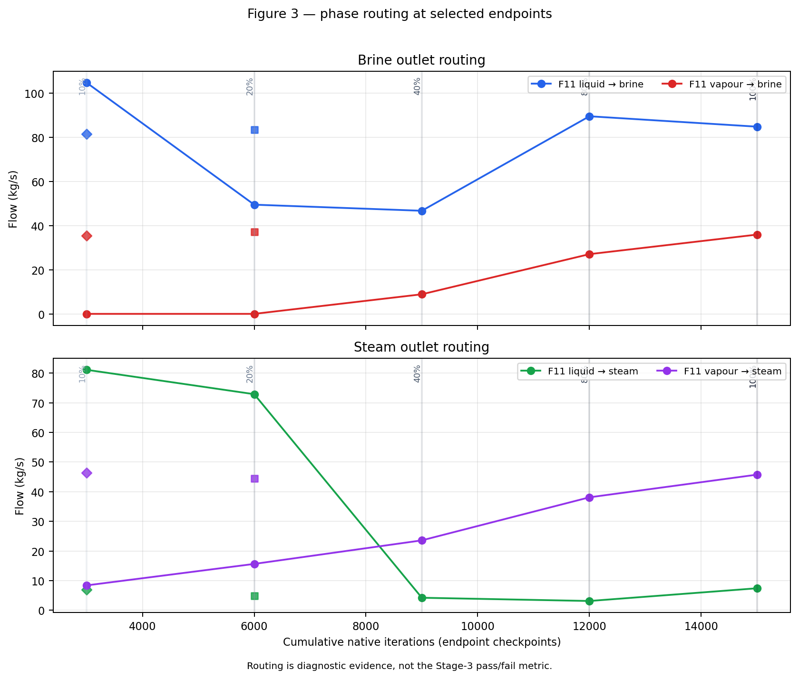
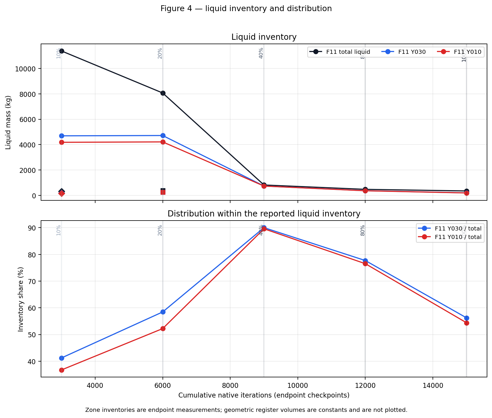
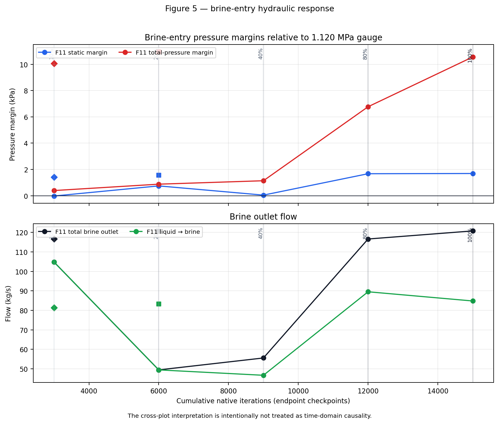
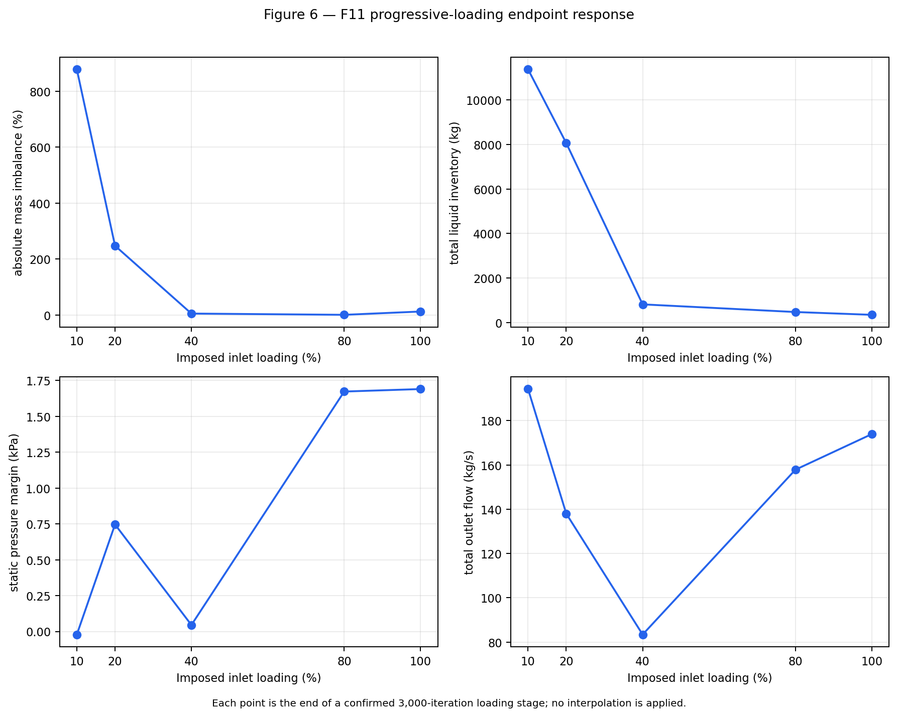
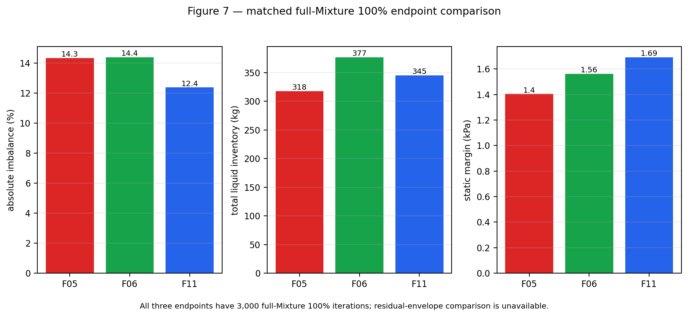

# 03A Stage 3 — Native Queue Final Results

> **Campaign:** 03A Stage 3 — Fluent-Recommended Convergence Sweep
> **Scope:** F02, F04, F05, F06, and F11 only
> **Run stamp:** `20260820T013223Z`
> **Setup authority:** [`03a-stage3-fluent-recommended-convergence-sweep.md`](../../../../../full-geometry/mixture/steady-liquid-outlet/03a-stage3-fluent-recommended-convergence-sweep.md)
> **Analysis plan:** [`03a-stage3-results-analysis-and-plotting-plan.md`](./03a-stage3-results-analysis-and-plotting-plan.md)
> **Interpretation status:** pending user direction

This is the evidence-led final analysis for the requested native-queue branch set. F01, F03, F07, F08, F09, F10, and F12 are outside this report and are not ranked here. The all-branch checkpoint packet remains the provenance authority for those records.

The available evidence supports endpoint comparison and controlled-loading response, but not a continuous-history convergence claim. Seven full-Mixture endpoint pairs were read back successfully. The expected residual exports and native Fluent Report File `.out` histories were not recoverable in the available bundle.

## 1. Objective and questions

Stage 3 tests numerical stabilisation of the unchanged 03A full-geometry steady Mixture case. The objective is to determine whether a startup/loading strategy can produce bounded numerical behaviour, near-equal total inlet and outlet mass flow, and approximately stationary total liquid inventory.

The scoped interventions are:

| Branch | Mixture startup | Inlet loading | Momentum URF |
|---|---|---|---:|
| F02 | carrier-first | 100% immediately | 0.7 |
| F04 | carrier-first | 100% immediately | 0.5 |
| F05 | full Mixture immediately | 100% immediately | 0.3 |
| F06 | carrier-first, then full Mixture | 100% immediately | 0.3 |
| F11 | full Mixture immediately | 10 → 20 → 40 → 80 → 100% | 0.3 |

There is no Stage-3 requirement for a prescribed outlet phase split. Phase routing is diagnostic evidence used to explain mass balance and inventory behaviour.

## 2. Evidence completeness

| Branch | Residual history | Report-file histories | Full Mixture 100% reached | Valid 100% window | Overall evidence |
|---|---|---|---|---|---|
| F02 | unavailable; carrier stage ended before endpoint | unavailable | no | N/A | partial |
| F04 | unavailable; carrier stage ended before endpoint | unavailable | no | N/A | partial |
| F05 | unavailable; one endpoint point only | unavailable | yes | endpoint only, 3,000 iterations | partial |
| F06 | unavailable; no endpoint point | unavailable | yes | endpoint only, 3,000 full-Mixture iterations | partial |
| F11 | unavailable; no endpoint points | unavailable | yes | endpoint-only ramp, 3,000 iterations at 100% | partial |

Evidence notes:

- F02 and F04 ended during their carrier-only native stage before their named endpoint pairs were written.
- F05, F06, and all five F11 loading stages have paired case/data endpoint readbacks.
- The supported retrieval probe records all eight targeted completed-stage residual exports as missing. Paired endpoint probes found report definitions but no retained residual monitor. F05 retains one instantaneous seven-equation point at iteration 3,000.
- No Stage-3 `.out` files are present locally. A read-only reachability check timed out before `extract_report_plot_histories.py` could inspect remote histories; no rerun is implied.
- An earlier fixed-block report says residual exports exist, while the later supported retrieval probe records them as missing. This conflict is preserved; the current status is `unavailable`, not zero history.
- The F11 10% row retains `RAW_READBACK_LEGACY_REPORT_CONFLICT`. The current checkpoint CSV and paired readback agree within source rounding; the conflict is with the older compact record.

## 3. Execution overview

| Branch | Highest valid state | Native iterations | Full-Mixture 100% iterations | Status |
|---|---|---:|---:|---|
| F02 | carrier state | 0 | 0 | partial — carrier stage ended before endpoint |
| F04 | carrier state | 0 | 0 | partial — carrier stage ended before endpoint |
| F05 | full Mixture, 100% | 3,000 | 3,000 | completed fixed block |
| F06 | full Mixture, 100% | 6,000 cumulative | 3,000 | completed carrier and full-Mixture blocks |
| F11 | full Mixture, 100% | 15,000 cumulative | 3,000 | completed five loading blocks |

None of F05, F06, or F11 has the separate authority target of 5,000 iterations at final 100% full-Mixture conditions in this queue run.

## 4. Residual behaviour

### Figure 1 — residual evidence availability

Figure 1 is a status matrix, not a reconstructed residual history. It shows no recovered native residual export for any selected stage, no retained residual monitor in the endpoint probes, and one instantaneous F05 endpoint point. The expected equations are continuity, x/y/z momentum, `k`, `epsilon`, and phase-2 volume fraction.

The F05 point at iteration 3,000 is:

| Continuity | X-mom | Y-mom | Z-mom | `k` | `epsilon` | VF phase 2 |
|---:|---:|---:|---:|---:|---:|---:|
| `7.88097e-02` | `1.61021e-05` | `1.76411e-05` | `1.76618e-05` | `5.96102e-04` | `3.27444e-03` | `1.39688e-03` |

These are endpoint values only. Comparable late-window medians, P95 values, slopes, boundedness, and intermittency metrics are not calculable for this scope.

## 5. Primary physical convergence evidence

The signed imbalance is `100 × (total outlet − total inlet) / total inlet`. Figure 2 uses positive flow magnitudes; raw Fluent boundary signs remain in the paired-readback JSON.

### Figure 2 — mass flow, imbalance, and liquid inventory

| Branch | Load | Iteration | Inlet kg/s | Outlet kg/s | Signed imbalance | Total liquid kg | Static margin kPa |
|---|---:|---:|---:|---:|---:|---:|---:|
| F05 | 100% | 3,000 | 198.486 | 170.030 | −14.336% | 317.752 | +1.404 |
| F06 | 100% | 6,000 | 198.486 | 169.940 | −14.382% | 376.627 | +1.561 |
| F11 | 10% | 3,000 | 19.849 | 194.251 | +878.664% | 11,383.447 | −0.022 |
| F11 | 20% | 6,000 | 39.697 | 138.001 | +247.634% | 8,067.212 | +0.746 |
| F11 | 40% | 9,000 | 79.395 | 83.419 | +5.069% | 815.363 | +0.045 |
| F11 | 80% | 12,000 | 158.789 | 157.841 | −0.597% | 471.578 | +1.673 |
| F11 | 100% | 15,000 | 198.486 | 173.919 | −12.377% | 345.365 | +1.690 |

F11 passes near zero at the 40% and 80% endpoint readbacks, then returns to −12.377% at 100%. Its liquid inventory falls from 11,383.447 kg to 345.365 kg across the ramp. These are distinct endpoint states, not evidence of a stationary trajectory. F05 and F06 finish with similar approximately 14.3% endpoint imbalance, but no history is available to determine whether either state is settled.

## 6. Phase routing

### Figure 3 — phase routing through both outlets

Routing fractions are normalized by the corresponding inlet phase flow and are not capped.

| Branch/load | Liquid → brine | Liquid → steam | Vapour → brine | Vapour → steam |
|---|---:|---:|---:|---:|
| F05 / 100% | 69.655% | 5.907% | 43.267% | 56.854% |
| F06 / 100% | 71.393% | 4.171% | 45.545% | 54.463% |
| F11 / 10% | 896.396% | 694.092% | 0.000073% | 102.990% |
| F11 / 20% | 211.712% | 311.849% | 0.0128% | 95.827% |
| F11 / 40% | 99.945% | 9.070% | 27.183% | 72.237% |
| F11 / 80% | 95.777% | 3.368% | 41.432% | 58.341% |
| F11 / 100% | 72.586% | 6.364% | 43.996% | 56.039% |

Values above 100% at F11 10% and 20% show that these instantaneous endpoints are not a settled one-pass phase split. Routing is diagnostic only; no Stage-3 pass/fail conclusion is drawn from it.

## 7. Liquid distribution

### Figure 4 — total, Y030, and Y010 liquid inventory

| Branch/load | Total liquid kg | Y030 kg | Y010 kg | Y030 / total | Y010 / total |
|---|---:|---:|---:|---:|---:|
| F05 / 100% | 317.752 | 172.354 | 166.299 | 54.25% | 52.34% |
| F06 / 100% | 376.627 | 251.880 | 245.693 | 66.88% | 65.27% |
| F11 / 10% | 11,383.447 | 4,690.476 | 4,179.590 | 41.21% | 36.72% |
| F11 / 20% | 8,067.212 | 4,714.407 | 4,211.900 | 58.44% | 52.21% |
| F11 / 40% | 815.363 | 733.815 | 730.352 | 89.99% | 89.58% |
| F11 / 80% | 471.578 | 366.379 | 360.823 | 77.69% | 76.52% |
| F11 / 100% | 345.365 | 194.154 | 187.793 | 56.22% | 54.38% |

The ramp changes both total liquid and the lower-region diagnostic fractions. Y010/Y030 are registers, not a validated free-surface or stationary-pool measure.

## 8. Brine-entry hydraulic response

### Figure 5 — pressure margin and brine flow

Margins use the fixed brine-outlet reference of `1.120 MPa` gauge.

| Branch/load | Static margin kPa | Total-pressure margin kPa | Total brine outlet kg/s | Liquid → brine kg/s |
|---|---:|---:|---:|---:|
| F05 / 100% | +1.404 | +10.056 | 116.713 | 81.390 |
| F06 / 100% | +1.561 | +10.960 | 120.603 | 83.421 |
| F11 / 10% | −0.022 | +0.393 | 104.741 | 104.741 |
| F11 / 20% | +0.746 | +0.878 | 49.478 | 49.476 |
| F11 / 40% | +0.045 | +1.139 | 55.590 | 46.713 |
| F11 / 80% | +1.673 | +6.769 | 116.590 | 89.530 |
| F11 / 100% | +1.690 | +10.555 | 120.733 | 84.814 |

These are associations among endpoint solver states, not physical-time causal trends. Similar brine flow at F11 80% and 100% accompanies different liquid inventories, so brine flow alone does not establish stationarity.

## 9. Progressive-loading response

### Figure 6 — response versus inlet loading

| F11 load | Cumulative iteration | Absolute imbalance | Total liquid kg | Outlet kg/s | Static margin kPa |
|---:|---:|---:|---:|---:|---:|
| 10% | 3,000 | 878.664% | 11,383.447 | 194.251 | −0.022 |
| 20% | 6,000 | 247.634% | 8,067.212 | 138.001 | +0.746 |
| 40% | 9,000 | 5.069% | 815.363 | 83.419 | +0.045 |
| 80% | 12,000 | 0.597% | 471.578 | 157.841 | +1.673 |
| 100% | 15,000 | 12.377% | 345.365 | 173.919 | +1.690 |

The intermediate-load endpoint improvement does not survive the final 100% condition. No continuous residual-envelope metric is available for this ramp.

## 10. Cross-variable diagnostics

No optional cross-plot is promoted to the main report. Endpoint-only associations between imbalance, inventory, pressure margin, and brine flow would not distinguish a stable trajectory from a transient solver path. The derived dataset retains these quantities for later analysis if native histories are recovered.

## 11. Matched full-Mixture 100% comparison

### Figure 7 — matched 100% endpoints

| Branch | Strategy | 100% iterations | Residual evidence | Endpoint abs. imbalance | Inventory kg | Failure? | Evidence strength |
|---|---|---:|---|---:|---:|---|---|
| F05 | full Mixture immediately, URF 0.3 | 3,000 | point only | 14.336% | 317.752 | no | partial |
| F06 | carrier-first then full Mixture, URF 0.3 | 3,000 | unavailable | 14.382% | 376.627 | no | partial |
| F11 | full Mixture ramp, URF 0.3 | 3,000 | unavailable | 12.377% | 345.365 | no | partial |

F02 and F04 cannot enter the matched set because neither reached full Mixture. The three valid endpoints are close enough that no branch ranking is justified without continuous residual and report histories. No winner is selected.

## 12. Checkpoint cross-validation

The seven full-Mixture rows in [`03a-stage3-native-queue-cross-validation.csv`](evidence/03a-stage3-native-queue/03a-stage3-native-queue-cross-validation.csv) compare the checkpoint CSV against explicit paired-readback JSON files. All seven are `within_rounding` at the declared maximum absolute difference tolerance of `0.001` source units.

| Row | Maximum absolute difference |
|---|---:|
| F05 / 100% | 0.000367 Pa |
| F06 / 100% | 0.000371 Pa |
| F11 / 10% | 0.000407 Pa |
| F11 / 20% | 0.000051 Pa |
| F11 / 40% | 0.000484 Pa |
| F11 / 80% | 0.000250 Pa |
| F11 / 100% | 0.000380 Pa |

This validates endpoint extraction and pairing, not convergence.

## 13. Evidence-led findings

- **Residuals:** no continuous residual claim is supported. F05 has one finite endpoint point; F06 and F11 have no comparable point or history.
- **Mass/inventory:** F11 moves from very large positive outlet excess at 10–20%, near-zero endpoint imbalance at 40–80%, then −12.377% at 100%, while inventory changes from 11,383.447 kg to 345.365 kg. This is not sustained mass closure or demonstrated stationarity.
- **Carrier-first intervention:** F02/F04 stopped before full Mixture. F06 completed the transition, but its endpoint imbalance remains approximately −14.4% and no residual history is available.
- **Progressive loading:** the intermediate-load endpoint improvement in F11 does not survive the final 100% state.
- **Momentum URF:** F05/F06/F11 all use URF 0.3 and have similar endpoint imbalance magnitudes. No URF effect can be isolated from the missing histories and differing startup paths.
- **Phase routing:** values above 100% occur in the low-load F11 endpoints; routing is therefore diagnostic state evidence, not a prescribed separation result.

## 14. Established and unresolved

Established:

- F05, F06, and F11 produced seven valid full-Mixture endpoint pairs; F02/F04 ended before their full-Mixture endpoint.
- The seven checkpoint rows agree with their paired readbacks within source rounding.
- F11 endpoint physical state changes materially across the controlled loading sequence.
- Endpoint phase routing, liquid distribution, and brine-entry pressure data are available.

Not established:

- bounded or stabilising residual histories;
- sustained total inlet≈outlet mass balance;
- stationary liquid inventory;
- a numerically or physically converged branch;
- prescribed outlet phase separation;
- mesh independence, validation, or a preferred operating point.

## 15. Interpretation handoff

**Interpretation status:** pending user direction.

The evidence supports, but does not decide, whether to recover histories first, continue F05/F06/F11 at final 100%, or choose a different numerical intervention. No branch is selected as a winner.

## 16. Evidence links

- [Analysis summary JSON](evidence/03a-stage3-native-queue/03a-stage3-native-queue-analysis.json)
- [Derived checkpoint CSV](evidence/03a-stage3-native-queue/03a-stage3-native-queue-checkpoints.csv)
- [Checkpoint cross-validation CSV](evidence/03a-stage3-native-queue/03a-stage3-native-queue-cross-validation.csv)
- [Residual evidence status](evidence/03a-stage3-native-queue/03a-stage3-native-queue-residual-evidence.json)
- [Report-history evidence status](evidence/03a-stage3-native-queue/03a-stage3-native-queue-report-history-evidence.json)
- [Native queue analysis/plotting script](../../../../../../PyAnsys/scripts/report/build_03a_stage3_native_queue_analysis.py)
- [Residual reconstruction reference](../../../../../../PyAnsys/scripts/report/build_03a_stage3_stitched_scaled_residuals.py)
- [Report-history extractor](../../../../../../PyAnsys/scripts/inspection/extract_report_plot_histories.py)
- [Fixed-block execution report](03a-stage3-fixed3000-results-20260820.md)
- [Checkpoint/provenance packet](03a-stage3-results-20260821.md)

## Completion status

- [x] Scope restricted to F02/F04/F05/F06/F11.
- [x] Preserve checkpoint lineage and run stamp.
- [x] Build semantic endpoint data and derived metrics.
- [x] Cross-check all seven full-Mixture endpoint rows.
- [x] Build the seven planned endpoint/routing/loading figures.
- [x] Preserve missing histories and evidence conflicts explicitly.
- [x] Compare the valid matched 100% endpoints without selecting a winner.
- [ ] Stitch continuous residual histories — unavailable from the current evidence bundle.
- [ ] Recover native Report File `.out` histories — unavailable locally and blocked by current remote timeout.
- [x] Leave interpretation and next-step selection to the user.
